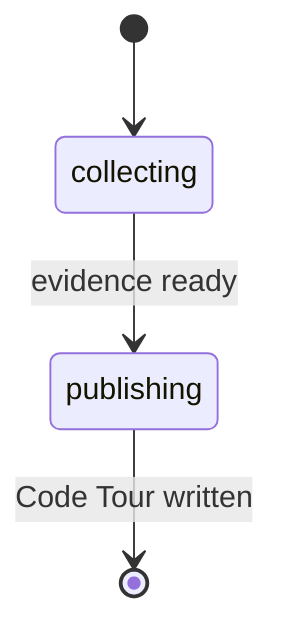

# pr-walkthrough

Generate a Code Tour walkthrough that helps reviewers understand what changed
in a pull request before they read the full diff.

`pr-walkthrough` is an orientation tool. It does not approve, reject, or comment
on a pull request. Use [`pr-review`](pr-review.md) when you need a verdict and
actionable findings.

---

## Synopsis

=== "Claude Code"

    ```bash
    /pr-walkthrough [target] [base-branch]
    ```

=== "OpenCode"

    ```bash
    /rp1-dev-pr-walkthrough [target] [base-branch]
    ```

=== "Codex"

    ```bash
    $rp1-dev-pr-walkthrough [target] [base-branch]
    ```

## When To Use It

| Use `pr-walkthrough` when... | Prefer another command when... |
|------------------------------|--------------------------------|
| The PR is large enough that reviewers need a map. | You need a merge-readiness verdict; use [`pr-review`](pr-review.md). |
| You want a narrative summary grounded in PR evidence. | You only need diagrams; use [`pr-visual`](pr-visual.md). |
| You want to share reviewer focus areas before human review starts. | Human comments already need fixes; use [`address-pr-feedback`](address-pr-feedback.md). |

## Parameters

| Parameter | Position | Required | Default | Description |
|-----------|----------|----------|---------|-------------|
| `TARGET` | `$1` | No | Current branch | PR number, PR URL, branch name, or empty for the current branch |
| `BASE_BRANCH` | `$2` | No | `main` | Diff base branch used when no remote PR is available |

## Input Resolution

| Input Type | Example | Resolution |
|------------|---------|------------|
| Empty | - | Uses the PR associated with the current branch, falling back to a local diff against `BASE_BRANCH` |
| PR number | `123` | Fetches PR metadata and diff with `gh` |
| PR URL | `https://github.com/owner/repo/pull/123` | Fetches PR metadata and diff with `gh` |
| Branch name | `feature/auth` | Uses the branch PR when available, otherwise uses a local diff against `BASE_BRANCH` |

If the target cannot identify exactly one PR or one local diff, the workflow
fails during evidence collection instead of producing an unrelated artifact.

## Workflow



| Step | What Happens |
|------|--------------|
| `collecting` | Resolves the target and gathers PR metadata, changed files, diff excerpts, and commits. |
| `publishing` | Writes the validated Code Tour JSON artifact and registers it with the run so it can be opened from Arcade. |

## Reading The Walkthrough

The walkthrough is designed to answer:

| Question | Where to look |
|----------|---------------|
| What is the PR trying to accomplish? | Tour title, source context, and first tour step |
| Which areas changed? | Domains and concept map |
| What should reviewers inspect first? | Ordered tour steps and epicenter concepts |
| Which files or fragments support each concept? | Source fragments attached to the focused concept |
| How are concepts related? | Relationship labels in the 3D reader |

Use the walkthrough before or alongside human review. It is especially useful
when a PR spans multiple folders, introduces a new flow, or needs a short
written explanation for reviewers who were not involved in the implementation.

## Output

The workflow writes a validated Code Tour JSON artifact under
`.rp1/work/pr-walkthroughs/` and registers it with the run. Open it from command
output, the file path, or [Arcade](../../arcade/index.md).

Expected contents:

- Title and source context
- Domain taxonomy for the changed areas
- Reviewable concepts grounded in source fragments
- Source fragments with file, line, language, and code context
- Concise concept and fragment relationships where useful
- Ordered tour steps for guided review when applicable

Arcade opens valid Code Tour artifacts in the 3D walkthrough reader and keeps
source viewing available for inspection or diagnostics.

## Examples

### Walk Through Current Branch

=== "Claude Code"

    ```bash
    /pr-walkthrough
    ```

=== "OpenCode"

    ```bash
    /rp1-dev-pr-walkthrough
    ```

=== "Codex"

    ```bash
    $rp1-dev-pr-walkthrough
    ```

### Walk Through Specific PR

=== "Claude Code"

    ```bash
    /pr-walkthrough 123
    ```

=== "OpenCode"

    ```bash
    /rp1-dev-pr-walkthrough 123
    ```

=== "Codex"

    ```bash
    $rp1-dev-pr-walkthrough 123
    ```

Example final output:

```text
PR Walkthrough Complete

Target: PR #123
Artifact: pr-walkthroughs/pr-123-walkthrough-001.json
Evidence: 8 files, 3 commits
```

## Related Commands

- [`pr-review`](pr-review.md) - Produce a review verdict and actionable findings
- [`pr-visual`](pr-visual.md) - Generate diagrams from PR diffs
- [`address-pr-feedback`](address-pr-feedback.md) - Collect and fix review comments

## See Also

- [PR Review Guide](../../guides/pr-review.md)
- [Artifact Viewer](../../arcade/artifact-viewer.md)
