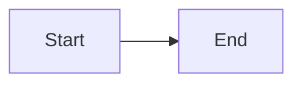

# Artifact Viewer

The Artifact Viewer displays design documents, requirements, and other artifacts generated during rp1 workflows. Access it from run details or the project artifacts list.

---

## Accessing Artifacts

### From Run Details

1. Navigate to a run in the V2 dashboard
2. Click any artifact in the Artifacts panel
3. The artifact opens in the viewer

### Direct URL

```
/v2/project/:projectId/artifact?path=:artifactPath
```

Where `:artifactPath` is the relative path to the artifact (e.g., `requirements.md`).

---

## Layout

The Artifact Viewer uses a multi-panel layout:

| Panel | Position | Description |
|-------|----------|-------------|
| **Navigation** | Left (collapsible) | File tree and artifact list |
| **Content** | Center | Rendered artifact content |
| **Outline** | Right (collapsible) | Table of contents / heading navigation |
| **Annotations** | Right (collapsible) | Annotation sidebar (when enabled) |

Toggle panels using the toolbar buttons or keyboard shortcuts.

---

## Supported Content Types

| Extension | Rendering |
|-----------|-----------|
| `.md` | Markdown with syntax highlighting, Mermaid diagrams |
| `.json` | Formatted JSON with collapsible sections |
| `.mmd` | Mermaid diagram rendering |
| `.diff` | Unified diff with syntax highlighting |
| Code files | Syntax-highlighted code with line numbers |

---

## Markdown Features

### Syntax Highlighting

Code blocks render with language-specific syntax highlighting. Supported languages include JavaScript, TypeScript, Python, Go, Rust, and more.

### Mermaid Diagrams

Mermaid code blocks render as interactive diagrams:



### Table of Contents

The outline panel shows document headings for quick navigation. Click a heading to scroll to that section.

---

## Annotations

The annotation system enables inline feedback on artifacts. See [Annotations](annotations.md) for complete documentation.

### Quick Reference

| Action | How |
|--------|-----|
| Add comment | Select text, click "Add Comment" |
| Suggest edit | Select text, click "Suggest Edit", enter replacement |
| View annotations | Toggle annotation sidebar with toolbar button |
| Reply to annotation | Click annotation, enter reply, Cmd/Ctrl + Enter |
| Resolve annotation | Click annotation, click Resolve button |

### Annotation Sidebar

The sidebar displays all annotations for the current artifact, grouped by status:

- **Open**: Active feedback requiring attention
- **Resolved**: Addressed annotations (collapsed)
- **Orphaned**: Annotations with missing anchors (warning badge)

Filter annotations by status, author, or date range using the dropdown controls.

### Inline Indicators

Annotations appear as indicators at their anchor positions:

- **Text selections**: Highlighted text with click-to-view popover
- **Line comments**: Icon in code block gutter
- **Hidden anchors**: Subtle marker at anchor position

---

## Keyboard Shortcuts

| Shortcut | Action |
|----------|--------|
| `Cmd/Ctrl + B` | Toggle navigation sidebar |
| `Cmd/Ctrl + Enter` | Submit annotation (when input focused) |
| `Escape` | Close popover |

---

## Related

- [Annotations](annotations.md) - Complete annotation documentation
- [V2 Dashboard](v2-dashboard.md) - Status monitoring dashboard
- [Feature Development Guide](../guides/feature-development.md) - Using `/build` workflow
