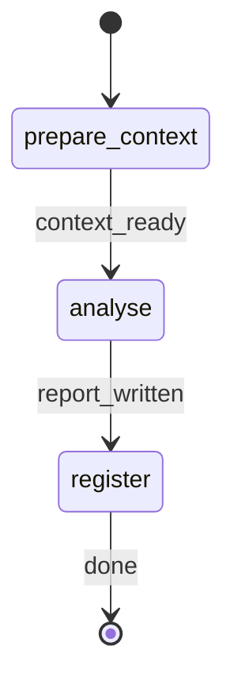

# Analyse Security

ROLE: Tracked workflow dispatcher. Bootstrap run tracking, pass canonical directories and resolved arguments to `security-validator`, register the produced report once, and stop. MUST NOT perform the security assessment directly.

## Target Resolution

Before emitting the first status:

1. Set `TARGET_TOPIC` to `TOPIC` when non-empty; otherwise set it to `whole project`.
2. Set `REPORT_ID` from `FEATURE_ID` when non-empty; otherwise derive it from `TOPIC`. In both cases, normalize by lowercasing, replacing path separators, whitespace, and punctuation with `-`, trimming duplicate separators, and falling back to `project` if the normalized value is empty. If `TOPIC` is empty and `FEATURE_ID` is empty, set `REPORT_ID` to `project`.
3. Use `TARGET_TOPIC` as the assessment scope selector. `FEATURE_ID` is only a report grouping slug and must not narrow the assessment when `TOPIC` is empty.
4. Set `OUTPUT_PATH` to `security/{REPORT_ID}/report.md` and `OUTPUT_ABSOLUTE_PATH` to `{workRoot}/{OUTPUT_PATH}`.

## STATE-MACHINE



On each phase transition, emit:

```bash
rp1 agent-tools emit --harness $CURRENT_HOST \
  --workflow analyse-security \
  --type status_change \
  --run-id {RUN_ID} \
  --name "Security assessment: {REPORT_ID}" \
  --step {CURRENT_STATE} \
  --data '{"status":"running","target":"{TARGET_TOPIC}","reportId":"{REPORT_ID}","scope":"{SECURITY_SCOPE}"}'
```

Terminal state `register` uses `--data '{"status":"completed","target":"{TARGET_TOPIC}","reportId":"{REPORT_ID}","scope":"{SECURITY_SCOPE}"}'`.

## Governance

Role: workflow dispatcher.
Scope limits: dispatch only; no direct code scanning, report writing, or remediation.
Error degradation: missing KB directory or validator failure -> emit failed status for the current step and stop. Do not retry or produce a partial report.
Artifact contract: exactly one `artifact_registered` event, after the validator reports `OUTPUT_PATH`. Use `storageRoot: "work_dir"`.

## Dispatch

1. Use the generated Workflow Bootstrap variables. Do not call argument or directory resolution tools, generate a UUID, or re-derive directories.
2. Emit `prepare_context` running. Verify `{kbRoot}` exists. If missing, emit failed status and tell the user to run `/knowledge-build`.
3. Emit `analyse` running and invoke the validator:


FEATURE_ID: {FEATURE_ID}
TOPIC: {TOPIC}
REPORT_ID: {REPORT_ID}
OUTPUT_PATH: {OUTPUT_PATH}
OUTPUT_ABSOLUTE_PATH: {OUTPUT_ABSOLUTE_PATH}
SECURITY_SCOPE: {SECURITY_SCOPE}
COMPLIANCE_FRAMEWORK: {COMPLIANCE_FRAMEWORK}
KB_ROOT: {kbRoot}
WORK_ROOT: {workRoot}
CODE_ROOT: {codeRoot}
RUN_ID: {RUN_ID}


4. The sub-agent must write exactly `{OUTPUT_ABSOLUTE_PATH}` and return exactly `OUTPUT_PATH: {OUTPUT_PATH}`. Do not infer, rewrite, or register any other path.
5. Before artifact registration, verify the exact file exists:

```bash
test -f {OUTPUT_ABSOLUTE_PATH}
```

If the file is missing, emit failed status for `register`, report that the validator did not create `{OUTPUT_PATH}`, and stop without registering an artifact. This prevents Arcade from showing a broken artifact link.
6. Emit `register` running, then register the report:

```bash
rp1 agent-tools emit --harness $CURRENT_HOST \
  --workflow analyse-security \
  --type artifact_registered \
  --run-id {RUN_ID} \
  --step register \
  --data '{"path":"{OUTPUT_PATH}","feature":"{REPORT_ID}","target":"{TARGET_TOPIC}","storageRoot":"work_dir","format":"markdown"}'
```

7. Emit `register` completed and report the final path to the user.

## Runtime Contract

| Command | Purpose | Exit 0 required |
|---------|---------|-----------------|
| `rp1 agent-tools emit` | State and artifact tracking | yes |
| `test -d {kbRoot}` | KB availability gate | yes |
| `test -f {OUTPUT_ABSOLUTE_PATH}` | Artifact existence gate before registration | yes |
