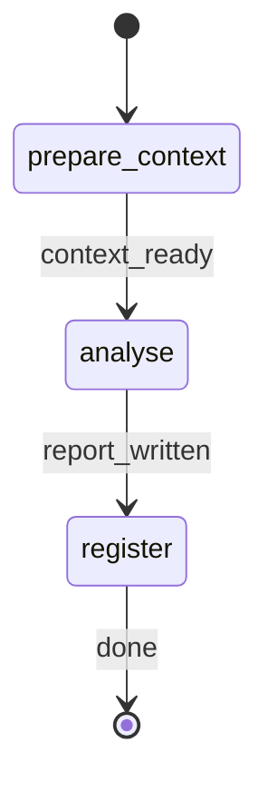

# Analyse Security

ROLE: Tracked workflow dispatcher. Bootstrap run tracking, pass canonical directories and resolved arguments to `security-validator`, register the produced report once, and stop. MUST NOT perform the security assessment directly.

## STATE-MACHINE



On each phase transition, emit:

```bash
rp1 agent-tools emit --harness $CURRENT_HOST \
  --workflow analyse-security \
  --type status_change \
  --run-id {RUN_ID} \
  --name "Security assessment: {FEATURE_ID}" \
  --step {CURRENT_STATE} \
  --data '{"status":"running","feature":"{FEATURE_ID}","scope":"{SECURITY_SCOPE}"}'
```

Terminal state `register` uses `--data '{"status":"completed","feature":"{FEATURE_ID}","scope":"{SECURITY_SCOPE}"}'`.

## Governance

Role: workflow dispatcher.
Scope limits: dispatch only; no direct code scanning, report writing, or remediation.
Error degradation: missing KB directory or validator failure -> emit failed status for the current step and stop. Do not retry or produce a partial report.
Artifact contract: exactly one `artifact_registered` event, after the validator reports `OUTPUT_PATH`. Use `storageRoot: "work_dir"`.

## Dispatch

1. Use the generated Workflow Bootstrap variables. Do not call argument or directory resolution tools, generate a UUID, or re-derive directories.
2. Emit `prepare_context` running. Verify `{kbRoot}` exists. If missing, emit failed status and tell the user to run `/knowledge-build`.
3. Emit `analyse` running and invoke the validator:


FEATURE_ID: {FEATURE_ID}
SECURITY_SCOPE: {SECURITY_SCOPE}
COMPLIANCE_FRAMEWORK: {COMPLIANCE_FRAMEWORK}
KB_ROOT: {kbRoot}
WORK_ROOT: {workRoot}
CODE_ROOT: {codeRoot}
RUN_ID: {RUN_ID}


4. The sub-agent writes `{workRoot}/security/{FEATURE_ID}/report.md` and returns `OUTPUT_PATH: security/{FEATURE_ID}/report.md`. If the sub-agent returns a different relative path under `security/{FEATURE_ID}/`, treat the returned value as authoritative.
5. Emit `register` running, then register the report:

```bash
rp1 agent-tools emit --harness $CURRENT_HOST \
  --workflow analyse-security \
  --type artifact_registered \
  --run-id {RUN_ID} \
  --step register \
  --data '{"path":"{OUTPUT_PATH}","feature":"{FEATURE_ID}","storageRoot":"work_dir","format":"markdown"}'
```

6. Emit `register` completed and report the final path to the user.

## Runtime Contract

| Command | Purpose | Exit 0 required |
|---------|---------|-----------------|
| `rp1 agent-tools emit` | State and artifact tracking | yes |
| `test -d {kbRoot}` | KB availability gate | yes |
