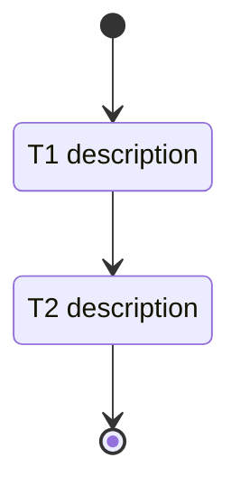

---
rp1_run_id: {RUN_ID}
---
# Development Tasks: [Feature Name]

**Feature ID**: {FEATURE_ID}
**Status**: Not Started
**Progress**: 0% (0 of {X} tasks)
**Estimated Effort**: {X} days
**Started**: {Date}

## Overview
[Brief from design]

## Implementation DAG
[Copy from design.md if DAG_STATE exists; omit section if null]

## Task Subflow

## Task Breakdown

### [Category per parallel group]

- [ ] **T{N}**: {Description} `[complexity:simple|medium|complex]`

    **Reference**: [design.md#section](design.md#section)

    **Effort**: {X hours}

    **Acceptance Criteria**:

    - [ ] {Criterion}

### User Docs

- [ ] **TD{N}**: {Action} {Target} - {Section} `[complexity:simple]`

    **Reference**: [design.md#documentation-impact](design.md#documentation-impact)

    **Type**: {add|edit|remove}

    **Target**: {path}

    **Section**: {name}

    **KB Source**: {kb_file:anchor|-}

    **Effort**: 30 minutes

    **Acceptance Criteria**:

    - [ ] {Criterion}

## Acceptance Criteria Checklist
[All from requirements.md w/ checkboxes]

## Definition of Done
- [ ] All tasks completed
- [ ] All AC verified
- [ ] Code reviewed
- [ ] Docs updated
