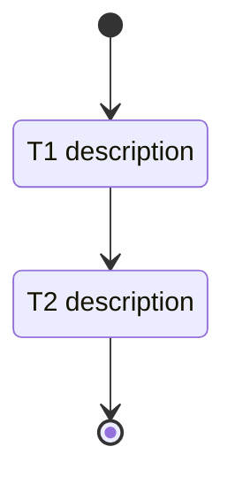

---
rp1_run_id: {RUN_ID}
---
# Development Tasks: [Feature Name]

**Feature ID**: {FEATURE_ID}
**Status**: Not Started
**Progress**: 0% (0 of {X} tasks)
**Estimated Effort**: {X} days
**Started**: {Date}
**Machine Plan**: [tasks.json](tasks.json)

## Overview
[Brief from design]

## Implementation DAG
[Copy from design.md if DAG_STATE exists; omit section if null]

## Task Index

| ID | Type | Status | Complexity | Acceptance Refs | Depends On | Target |
|----|------|--------|------------|-----------------|------------|--------|
| T1 | code | pending | medium | REQ-001 | - | `src/path.ts` |
| TD1 | docs | pending | simple | REQ-010 | T1 | `docs/path.md` |

## Task Subflow

## Task Breakdown

### [Category per parallel group]

- [ ] **T{N}**: {Description} `[complexity:simple|medium|complex]`

    **Reference**: [design.md#section](design.md#section)

    **Acceptance Refs**: REQ-{NNN}

    **Depends On**: T{N}

    **Effort**: {X hours}

    **Acceptance Criteria**:

    - [ ] {Criterion}

### User Docs

- [ ] **TD{N}**: {Action} {Target} - {Section} `[complexity:simple]`

    **Reference**: [design.md#documentation-impact](design.md#documentation-impact)

    **Type**: {add|edit|remove}

    **Target**: {path}

    **Section**: {name}

    **KB Source**: {kb_file:anchor|-}

    **Depends On**: T{N}|-

    **Effort**: 30 minutes

    **Acceptance Criteria**:

    - [ ] {Criterion}

## Acceptance Criteria Checklist
| Requirement | Acceptance Criterion | Covered By | Status |
|-------------|---------------------|------------|--------|
| REQ-001 | {criterion} | T1 | pending |

## Definition of Done
- [ ] All tasks completed
- [ ] All acceptance criteria verified or marked manual/not applicable
- [ ] Mechanical checks run or explicitly waived
- [ ] Required docs tasks completed or listed as release follow-up
