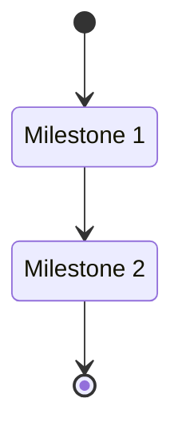
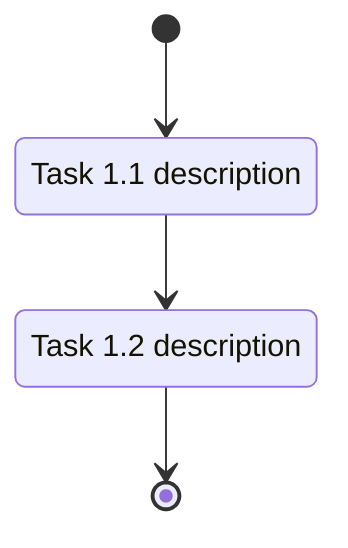

---
rp1_run_id: {RUN_ID}
---
# Feature Development Tracker: [Feature Name]

**Feature ID**: {FEATURE_ID}
**Total Milestones**: {N}
**Status**: Not Started
**Started**: {Date}
**Target Completion**: {Date}

## Overview
[Brief]

## Milestone Summary

| Milestone | Title | Status | Progress | Target |
|-----------|-------|--------|----------|--------|
| [M1](milestone-1.md) | {Title} | Not Started | 0% | {Date} |

## Task Subflow

## Acceptance Criteria Coverage
[All criteria w/ milestone mapping]

## Dependencies and Risks
[External deps, blockers]

---

## milestone-{N}.md (separate file)

# Milestone {N}: {Title}

**Status**: Not Started
**Progress**: 0% (0 of {X} tasks)
**Target Date**: {Date}

## Objectives
[What milestone accomplishes]

## Tasks

### [Category]

- [ ] **T{N}.{M}**: {Description} `[complexity:simple|medium|complex]`

    **Reference**: [design.md#section](design.md#section)

    **Effort**: {X hours}

    **Acceptance Criteria**:

    - [ ] {Criterion}

## Task Subflow

## Definition of Done
[Completion criteria]
