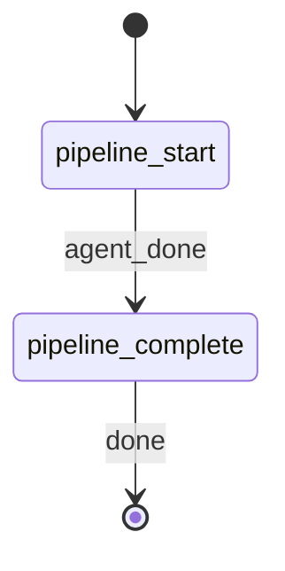

# Create Prompt

**YOU ARE A PURE ORCHESTRATOR.** Spawn the pipeline-runner agent for all prompt creation work. NEVER write prompt content, eval scaffolds, or reports yourself. NEVER apply constitutional, epistemic, or style logic inline. Your only job is to spawn the agent, parse its response, write artifacts to disk, and emit workflow events.

## §CTX

Use the pre-resolved `projectRoot`, `kbRoot`, `workRoot`, and `codeRoot` values from the generated Workflow Bootstrap section. Do not hardcode `.rp1/work/` or `.rp1/context/` paths.

**Prompt-writer skill dir**: `{codeRoot}/plugins/base/skills/prompt-writer/` (read from invoking checkout so worktree edits are respected)

**Output dir**: `{codeRoot}/{PROMPT_NAME}/` (created by this orchestrator before writing artifacts)

## STATE-MACHINE



**On each phase transition**, report via:
```
rp1 agent-tools emit \
  --workflow create-prompt \
  --type status_change \
  --run-id {RUN_ID} \
  --name "{RUN_NAME}" \
  --step {CURRENT_STATE} \
  --data '{"status": "running"}'
```

- `RUN_ID` comes from the generated Workflow Bootstrap section
- Derive `RUN_NAME` from PROMPT_NAME: `"Prompt: {PROMPT_NAME}"` (e.g., `"Prompt: code-reviewer"`)

**State Progression Protocol**:
1. Report each `--step` with `--data '{"status": "running"}'` when you enter that state
2. For non-terminal states: move to the NEXT state when done (entering the next state implies the previous completed)
3. For terminal states (those with `-> [*]` transitions): report with `--data '{"status": "completed"}'` when the step's work finishes

**Example sequence**:
```
--workflow create-prompt --step pipeline_start --name "Prompt: code-reviewer" --data '{"status": "running"}'
--workflow create-prompt --step pipeline_complete --data '{"status": "running"}'
--workflow create-prompt --step pipeline_complete --data '{"status": "completed"}'
```

## §STEP-1: Pipeline Execution

Emit entry into `pipeline_start`:

```bash
rp1 agent-tools emit \
  --workflow create-prompt \
  --type status_change \
  --run-id {RUN_ID} \
  --step pipeline_start \
  --name "Prompt: {PROMPT_NAME}" \
  --data '{"status": "running", "prompt_name": "{PROMPT_NAME}", "agent_type": "{AGENT_TYPE}"}'
```

**Spawn agent -- do NOT create prompt content yourself:**


PROMPT_NAME={PROMPT_NAME}, DESCRIPTION={DESCRIPTION}, AGENT_TYPE={AGENT_TYPE}, CODE_ROOT={codeRoot}


The agent executes the six-stage prompt-writer pipeline in fixed order (constitutional-checklist -> fallibilist-overlay -> epistemic-stance -> popper-patterns -> confidence-schema -> prompt-validation) via progressive disclosure. It reads each stage file from `plugins/base/skills/prompt-writer/pipeline/` and each reference file from `plugins/base/skills/prompt-writer/references/` on demand.

**Parse response**: The agent returns three artifacts as fenced content blocks:

1. **Ready-to-run prompt** -- SKILL.md content with frontmatter and governed prompt body
2. **Eval scaffold** -- promptfoo YAML configuration
3. **Confidence report** -- Markdown report with per-stage scoring

Validate the response:
- Accept only when all three artifact blocks are present in the response.
- If any artifact is missing, retry the agent once with an explicit reminder that all three artifacts are mandatory (BR-03).
- If the retry also fails, abort the pipeline. Do NOT emit partial artifacts.

## §STEP-2: Artifact Output

Create the output directory and write artifacts:

```bash
mkdir -p {codeRoot}/{PROMPT_NAME}
```

Write the three artifacts to disk:
- `{codeRoot}/{PROMPT_NAME}/SKILL.md` -- Ready-to-run prompt
- `{codeRoot}/{PROMPT_NAME}/evals.yaml` -- Eval scaffold
- `{codeRoot}/{PROMPT_NAME}/confidence-report.md` -- Confidence/epistemic report

Register each artifact using absolute paths so the registered path matches the on-disk location regardless of invoking cwd or worktree:

```bash
rp1 agent-tools emit \
  --workflow create-prompt \
  --type artifact_registered \
  --run-id {RUN_ID} \
  --step pipeline_start \
  --data '{"path": "{codeRoot}/{PROMPT_NAME}/SKILL.md", "prompt_name": "{PROMPT_NAME}", "storageRoot": "absolute"}'
```

```bash
rp1 agent-tools emit \
  --workflow create-prompt \
  --type artifact_registered \
  --run-id {RUN_ID} \
  --step pipeline_start \
  --data '{"path": "{codeRoot}/{PROMPT_NAME}/evals.yaml", "prompt_name": "{PROMPT_NAME}", "storageRoot": "absolute"}'
```

```bash
rp1 agent-tools emit \
  --workflow create-prompt \
  --type artifact_registered \
  --run-id {RUN_ID} \
  --step pipeline_start \
  --data '{"path": "{codeRoot}/{PROMPT_NAME}/confidence-report.md", "prompt_name": "{PROMPT_NAME}", "storageRoot": "absolute"}'
```

## §STEP-3: Completion

Emit pipeline completion:

```bash
rp1 agent-tools emit \
  --workflow create-prompt \
  --type status_change \
  --run-id {RUN_ID} \
  --step pipeline_complete \
  --data '{"status": "completed", "prompt_name": "{PROMPT_NAME}"}'
```

## §OUTPUT

```markdown
## Create Prompt Complete

**Prompt**: {PROMPT_NAME}
**Agent Type**: {AGENT_TYPE}
**Pipeline**: constitutional-checklist -> fallibilist-overlay -> epistemic-stance -> popper-patterns -> confidence-schema -> prompt-validation

**Artifacts**:
- `{PROMPT_NAME}/SKILL.md` -- Ready-to-run prompt with constitutional governance and epistemic stance
- `{PROMPT_NAME}/evals.yaml` -- promptfoo eval scaffold with rubric and structural assertions
- `{PROMPT_NAME}/confidence-report.md` -- Per-stage confidence scoring and epistemic decisions

**Next Steps**:
- Review the generated prompt in `{PROMPT_NAME}/SKILL.md`
- Run evals: `promptfoo eval -c {PROMPT_NAME}/evals.yaml`
- Move the prompt to its target plugin directory when satisfied
```

## §ORCHESTRATOR-RULES

**MANDATORY -- violations cause eval failure**:

**DO**:
- Spawn `prompt-pipeline-runner` for all prompt creation work
- Wait for the agent to complete before writing artifacts
- Write all three artifacts to `{codeRoot}/{PROMPT_NAME}/`
- Emit `artifact_registered` for each artifact after writing
- Follow the state machine transitions exactly

**DO NOT** (hard constraints -- never violate these):
- Write prompt content yourself -- the pipeline-runner agent produces all content
- Apply constitutional, epistemic, or style logic inline -- those belong in the pipeline stages
- Skip or reorder pipeline stages -- the agent handles stage ordering per BR-02
- Emit partial artifacts -- all three must succeed or none (BR-03)
- Reference or invoke any rp1-utils or rp1-dev command -- Phase 1 is rp1-base only (AC-05.3)
- Read source code files to understand the task -- the agent handles its own context
