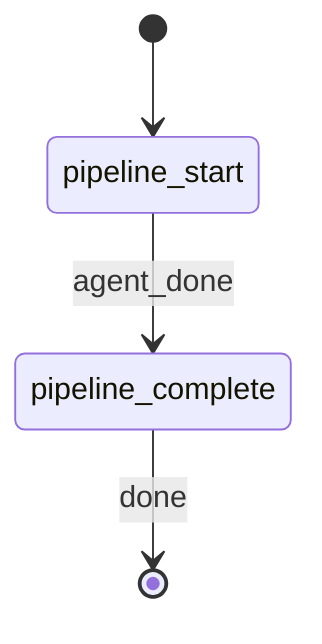

# Create Prompt

**YOU ARE A PURE ORCHESTRATOR.** Spawn the pipeline-runner agent for all prompt creation work. NEVER write prompt content, eval scaffolds, or reports yourself. NEVER apply constitutional, epistemic, or style logic inline. Your only job is to spawn the agent, parse its response, write artifacts to disk, and emit workflow events.

## §CTX

Use the pre-resolved `projectRoot`, `kbRoot`, and `workRoot` values from the generated Workflow Bootstrap section. Do not hardcode `.rp1/work/` or `.rp1/context/` paths.

**Prompt-writer access**: the `prompt-pipeline-runner` agent invokes `rp1-base:prompt-writer` via the Skill tool to reach its reference and pipeline files. This orchestrator does not need to know prompt-writer's installed path -- the host resolves it by skill name.

**Output dir** depends on `PLUGIN`:

| `PLUGIN` | Output dir | When to use |
|----------|-----------|-------------|
| `staging` (default) | `{projectRoot}/{PROMPT_NAME}/` | You want a staging location for review before moving into a plugin tree. |
| `rp1-base` | `{projectRoot}/plugins/base/skills/{PROMPT_NAME}/` | Emit directly into rp1-base so the build pipeline ingests it. |
| `rp1-utils` | `{projectRoot}/plugins/utils/skills/{PROMPT_NAME}/` | Direct into rp1-utils. |
| `rp1-dev` | `{projectRoot}/plugins/dev/skills/{PROMPT_NAME}/` | Direct into rp1-dev. |

All paths anchor at `{projectRoot}` so the write path matches the registration path regardless of shell `cwd`. The orchestrator creates the directory before writing artifacts.

## STATE-MACHINE



**On each phase transition**, report via:
```
rp1 agent-tools emit \
  --workflow create-prompt \
  --type status_change \
  --run-id {RUN_ID} \
  --name "{RUN_NAME}" \
  --step {CURRENT_STATE} \
  --data '{"status": "running"}'
```

- `RUN_ID` comes from the generated Workflow Bootstrap section
- Derive `RUN_NAME` from PROMPT_NAME: `"Prompt: {PROMPT_NAME}"` (e.g., `"Prompt: code-reviewer"`)

**State Progression Protocol**:
1. Report each `--step` with `--data '{"status": "running"}'` when you enter that state
2. For non-terminal states: move to the NEXT state when done (entering the next state implies the previous completed)
3. For terminal states (those with `-> [*]` transitions): report with `--data '{"status": "completed"}'` when the step's work finishes

**Example sequence**:
```
--workflow create-prompt --step pipeline_start --name "Prompt: code-reviewer" --data '{"status": "running"}'
--workflow create-prompt --step pipeline_complete --data '{"status": "running"}'
--workflow create-prompt --step pipeline_complete --data '{"status": "completed"}'
```

## §STEP-1: Pipeline Execution

Emit entry into `pipeline_start`:

```bash
rp1 agent-tools emit \
  --workflow create-prompt \
  --type status_change \
  --run-id {RUN_ID} \
  --step pipeline_start \
  --name "Prompt: {PROMPT_NAME}" \
  --data '{"status": "running", "prompt_name": "{PROMPT_NAME}", "agent_type": "{AGENT_TYPE}"}'
```

**Spawn agent -- do NOT create prompt content yourself:**


PROMPT_NAME={PROMPT_NAME}, DESCRIPTION={DESCRIPTION}, AGENT_TYPE={AGENT_TYPE}, COMPLEXITY={COMPLEXITY}


The agent executes the six-stage prompt-writer pipeline in fixed order (constitutional-checklist -> fallibilist-overlay -> epistemic-stance -> popper-patterns -> confidence-schema -> prompt-validation) via progressive disclosure. It invokes `rp1-base:prompt-writer` via the Skill tool at Stage 0 and reads each stage/reference file via the paths in prompt-writer's manifest (`pipeline/*.md`, `references/*.md`).

**Parse response**: The agent returns three artifacts as fenced content blocks:

1. **Ready-to-run skill** -- SKILL.md content with skill-shaped frontmatter and governed prompt body (the pipeline emits SKILL.md only; agent-file output is out of scope for Phase 1)
2. **Eval scaffold** -- promptfoo YAML configuration
3. **Confidence report** -- Markdown report with per-stage scoring

Validate the response:
- Accept only when all three artifact blocks are present in the response.
- If any artifact is missing, retry the agent once with an explicit reminder that all three artifacts are mandatory (BR-03).
- If the retry also fails, abort the pipeline. Do NOT emit partial artifacts.

## §STEP-2: Artifact Output

Resolve the output directory from `PLUGIN`:

- `PLUGIN=staging` (default) -> `OUT_DIR = {projectRoot}/{PROMPT_NAME}`
- `PLUGIN=rp1-base` -> `OUT_DIR = {projectRoot}/plugins/base/skills/{PROMPT_NAME}`
- `PLUGIN=rp1-utils` -> `OUT_DIR = {projectRoot}/plugins/utils/skills/{PROMPT_NAME}`
- `PLUGIN=rp1-dev` -> `OUT_DIR = {projectRoot}/plugins/dev/skills/{PROMPT_NAME}`

Resolve `REL_DIR` as `OUT_DIR` with the `{projectRoot}/` prefix stripped -- this is the value used in the `path` field of `artifact_registered` events (with `storageRoot: project`).

Create the output directory:

```bash
mkdir -p {OUT_DIR}
```

Write the three artifacts to disk at `{OUT_DIR}`:
- `{OUT_DIR}/SKILL.md` -- Ready-to-run prompt
- `{OUT_DIR}/evals.yaml` -- Eval scaffold
- `{OUT_DIR}/confidence-report.md` -- Confidence/epistemic report

Register each artifact:

```bash
rp1 agent-tools emit \
  --workflow create-prompt \
  --type artifact_registered \
  --run-id {RUN_ID} \
  --step pipeline_start \
  --data '{"path": "{REL_DIR}/SKILL.md", "prompt_name": "{PROMPT_NAME}", "storageRoot": "project"}'
```

```bash
rp1 agent-tools emit \
  --workflow create-prompt \
  --type artifact_registered \
  --run-id {RUN_ID} \
  --step pipeline_start \
  --data '{"path": "{REL_DIR}/evals.yaml", "prompt_name": "{PROMPT_NAME}", "storageRoot": "project"}'
```

```bash
rp1 agent-tools emit \
  --workflow create-prompt \
  --type artifact_registered \
  --run-id {RUN_ID} \
  --step pipeline_start \
  --data '{"path": "{REL_DIR}/confidence-report.md", "prompt_name": "{PROMPT_NAME}", "storageRoot": "project"}'
```

## §STEP-3: Completion

Emit pipeline completion:

```bash
rp1 agent-tools emit \
  --workflow create-prompt \
  --type status_change \
  --run-id {RUN_ID} \
  --step pipeline_complete \
  --data '{"status": "completed", "prompt_name": "{PROMPT_NAME}"}'
```

## §OUTPUT

```markdown
## Create Prompt Complete

**Prompt**: {PROMPT_NAME}
**Agent Type**: {AGENT_TYPE}
**Complexity**: {effective_complexity from the confidence report's Complexity Classification section} ({"explicit" if COMPLEXITY was simple/standard/complex; "auto-detected" if COMPLEXITY was auto})
**Target**: {PLUGIN} (written to `{REL_DIR}/`)
**Pipeline**: constitutional-checklist -> fallibilist-overlay -> epistemic-stance -> popper-patterns (skipped) -> confidence-schema -> prompt-validation

**Artifacts**:
- `{REL_DIR}/SKILL.md` -- Ready-to-run prompt with constitutional governance and epistemic stance
- `{REL_DIR}/evals.yaml` -- promptfoo eval scaffold with rubric and structural assertions
- `{REL_DIR}/confidence-report.md` -- Per-stage confidence scoring and epistemic decisions

**Next Steps**:
- Review the generated prompt in `{REL_DIR}/SKILL.md`
- Run evals: `promptfoo eval -c {REL_DIR}/evals.yaml`
- This is a staging location. Move the skill into a `plugins/*/skills/` directory (or rerun with `PLUGIN=rp1-base|rp1-utils|rp1-dev` next time) before the build pipeline can ingest it.- The skill is already under `plugins/{PLUGIN}/skills/` and will be picked up on the next build.
```

## §ORCHESTRATOR-RULES

**MANDATORY -- violations cause eval failure**:

**DO**:
- Spawn `prompt-pipeline-runner` for all prompt creation work
- Wait for the agent to complete before writing artifacts
- Write all three artifacts to `{OUT_DIR}` as resolved from `PLUGIN` in §STEP-2 (anchored at the project root, not the shell `cwd`)
- Emit `artifact_registered` for each artifact after writing, using the `{REL_DIR}` path so `storageRoot: project` registration matches the write path
- Follow the state machine transitions exactly

**DO NOT** (hard constraints -- never violate these):
- Write prompt content yourself -- the pipeline-runner agent produces all content
- Apply constitutional, epistemic, or style logic inline -- those belong in the pipeline stages
- Skip or reorder pipeline stages -- the agent handles stage ordering per BR-02
- Emit partial artifacts -- all three must succeed or none (BR-03)
- Reference or invoke any rp1-utils or rp1-dev command -- Phase 1 is rp1-base only (AC-05.3)
- Read source code files to understand the task -- the agent handles its own context
