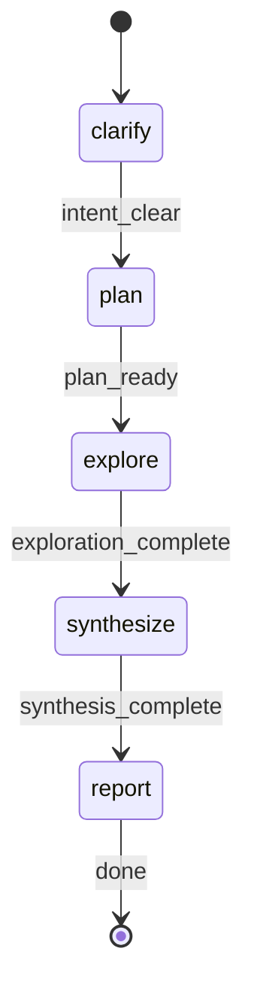

# Deep Research - Orchestration Command

You are executing the Deep Research workflow. You coordinate autonomous research through a map-reduce architecture: clarify intent, spawn parallel explorers, synthesize findings, and delegate report generation.

**CRITICAL**: Commands CAN spawn agents. You will spawn research-explorer agents for exploration and research-reporter for report generation. Do NOT delegate orchestration to another agent.

## STATE-MACHINE



**On each phase transition**, report via:
```
rp1 agent-tools emit \
  --workflow deep-research \
  --type status_change \
  --run-id {RUN_ID} \
  --name "Research: {brief summary of research topic}" \
  --step {CURRENT_STATE} \
  --data '{"status": "running"}'
```

- `RUN_ID` comes from the generated Workflow Bootstrap section

**State Progression Protocol**:
1. Report each `--step` with `--data '{"status": "running"}'` when you enter that state
2. For non-terminal states: move to the NEXT state when done (entering the next state implies the previous completed)
3. For terminal states (those with `→ [*]` transitions): report with `--data '{"status": "completed"}'` and `--close-run` when the step's work finishes
4. On error, transition to the appropriate failure state in the graph

**Example sequence**:
```
--step clarify --data '{"status": "running"}'       # entering clarify phase
--step plan --data '{"status": "running"}'          # intent clear, entering plan phase
--step explore --data '{"status": "running"}'       # plan ready, entering explore phase
--step synthesize --data '{"status": "running"}'    # exploration done, entering synthesize phase
--step report --data '{"status": "running"}'        # synthesis done, entering report phase
--step report --data '{"status": "completed"}' --close-run      # report work finished, workflow done
```

Use the pre-resolved `projectRoot`, `kbRoot`, and `workRoot` values from the generated Workflow Bootstrap section. Do not re-resolve directories manually, do not call `resolve-args`, and do not generate a UUID manually.

## 1. Intent Clarification (~15% effort)

**Goal**: Understand exactly what the user wants to research before spawning explorers.

### Step 1: Parse Research Topic

Analyze the RESEARCH_TOPIC to identify:
- **Primary question(s)**: What specific questions need answering?
- **Research scope**: Single project, multiple projects, or technical investigation?
- **Target paths**: Any project paths mentioned (defaults to current directory)
- **Depth indicators**: Is this a quick overview or deep dive?

### Step 2: Determine if Clarification Needed

Prompt the user if RESEARCH_TOPIC is ambiguous about:
- Which codebase(s) to analyze
- Specific aspects to focus on (architecture, patterns, implementation, etc.)
- Expected output format or depth

**Clear requests** (skip clarification):
- "Understand the authentication flow in this project"
- "Compare error handling between ./project-a and ./project-b"
- "Research best practices for Redis caching"

**Ambiguous requests** (ask clarification):
- "Research this code" (which code? what aspects?)
- "Compare projects" (which projects?)
- "Help me understand" (understand what specifically?)

### Step 3: Build Research Intent

After clarification (or immediately if clear), construct:

```
RESEARCH_INTENT:
- mode: single-project | multi-project | technical-investigation
- primary_questions: [list of specific questions to answer]
- target_projects: [list of project paths, or ["."] for current]
- focus_areas: [architecture | patterns | implementation | integration | performance]
- depth: overview | standard | deep
```

## 2. Exploration Planning (~5% effort)

**Goal**: Define explorer assignments for parallel execution.

### Step 1: Determine Explorer Strategy

Based on RESEARCH_INTENT:

**Single-project mode**:
- Spawn 2-3 explorers per project with different focus areas
- Explorer 1: Architecture and structure (EXPLORATION_TYPE: codebase)
- Explorer 2: Implementation patterns (EXPLORATION_TYPE: codebase)
- Explorer 3: External context if needed (EXPLORATION_TYPE: web)

**Multi-project mode**:
- Spawn 1 explorer per project (each handles all aspects)
- Optional: Add 1 web explorer for cross-project context

**Technical investigation mode**:
- Spawn 1-2 codebase explorers for current project context
- Spawn 1-2 web explorers for external research

### Step 2: Prepare Explorer Prompts

For each explorer, prepare:
- EXPLORATION_TARGET: Path or topic
- QUESTIONS: Subset of primary_questions relevant to this explorer
- EXPLORATION_TYPE: codebase | web | hybrid
- KB_PATH: Path to the KB root, typically `.rp1/context/` (for codebase explorers)

## 3. Spawn Explorers (~5% effort)

Spawn all explorers in parallel, within a single message — they are independent, so serial dispatch wastes the whole fan-out.

For each explorer:


Explore and return JSON findings.
EXPLORATION_TARGET: {target}
QUESTIONS: {stringify(questions)}
EXPLORATION_TYPE: {type}
KB_PATH: {kb_path}

Return structured JSON per output contract.


**Naming convention**: explorer-{n} where n is 1, 2, 3...

Wait for every explorer to complete before starting section 4. Synthesis is a reduce step over the full result set, so beginning it while an explorer is still running silently drops that explorer's findings. Harnesses differ in whether a dispatch call blocks, so treat this as an explicit barrier rather than assuming the dispatch mechanism enforces it.

## 4. Collect and Synthesize Findings (~50% effort)

### Step 1: Collect Explorer Results

Parse JSON output from each explorer:
- Validate JSON structure matches explorer output contract
- Extract findings arrays
- Extract questions_answered arrays
- Track explorer metadata (files explored, web searches, KB status)

Handle failures:
- If explorer returns invalid JSON: Log warning, skip that explorer
- If >50% explorers fail: Abort with error message to user
- Continue with partial results if <50% fail

### Step 2: Merge Findings

Combine findings from all explorers:
- Deduplicate by finding content (similar titles/descriptions)
- Preserve all unique evidence
- Track which explorer(s) contributed each finding
- Assign merged finding IDs: F-001, F-002, etc.

### Step 3: Synthesize Insights

Analyze the merged findings to:

1. **Answer research questions**: For each primary question, synthesize answer from supporting findings
2. **Identify patterns**: What patterns emerge across explorers/projects?
3. **Note contradictions**: Any conflicting findings between explorers?
4. **Assess confidence**: Overall confidence in findings (based on explorer confidence levels)

### Step 4: Generate Recommendations

Based on synthesis, create actionable recommendations:
- Priority: high | medium | low
- Each recommendation ties to specific findings
- Include implementation notes where applicable

### Step 5: Plan Diagrams

Identify diagrams that would aid understanding:
- Architecture diagrams for system structure findings
- Sequence diagrams for flow-related findings
- Comparison tables for multi-project analysis

For each diagram, specify:
- Type: flowchart | sequence | er | class
- Title: Brief descriptive title
- Description: What to visualize
- Elements: Key elements to include

### Step 6: Build Synthesis Data Package

Construct the synthesis data JSON for the reporter:

```json
{
  "topic": "<research topic>",
  "scope": "single-project | multi-project | technical-investigation",
  "projects_analyzed": ["<path1>", "<path2>"],
  "research_questions": ["<q1>", "<q2>"],
  "executive_summary": "<1-2 paragraph summary>",
  "findings": [
    {
      "id": "F-001",
      "category": "<category>",
      "title": "<title>",
      "description": "<description>",
      "confidence": "high | medium | low",
      "evidence": [...]
    }
  ],
  "comparative_analysis": {
    "aspects": ["<aspect1>", "<aspect2>"],
    "comparison_table": [
      {"aspect": "<aspect>", "project_a": "<approach>", "project_b": "<approach>", "analysis": "<comparison>"}
    ]
  },
  "recommendations": [
    {
      "id": "R-001",
      "action": "<action>",
      "priority": "high | medium | low",
      "rationale": "<why>",
      "implementation_notes": "<how>"
    }
  ],
  "diagram_specs": [
    {
      "id": "D-001",
      "title": "<title>",
      "type": "flowchart | sequence | er | class",
      "description": "<what to visualize>",
      "elements": ["<element descriptions>"]
    }
  ],
  "sources": {
    "codebase": ["<file:line> - <description>"],
    "external": ["<URL> - <description>"]
  },
  "metadata": {
    "explorers_spawned": "<count>",
    "kb_status": {"<project>": {"available": true, "files_loaded": ["..."]}},
    "files_explored": "<total_count>",
    "web_searches": "<total_count>"
  }
}
```

## 5. Spawn Reporter (~10% effort)

### Step 1: Spawn Reporter Agent

The reporter handles output file naming (slugification, directory creation, deduplication).


Generate research report.
SYNTHESIS_DATA: {stringify(synthesis_data)}
REPORT_TYPE: {standard | comparative}
WORK_ROOT: {workRoot}

Return JSON with report status and path.


### Step 2: Collect Reporter Result

Parse JSON output:
- Extract report_path
- Note diagrams_generated and diagrams_failed
- Track sections_written

Handle failure:
- If reporter fails: Log error, provide synthesis summary directly to user

### Step 3: Register Artifact

After extracting report_path, register it in the artifact database:

```bash
rp1 agent-tools emit \
  --workflow deep-research \
  --type artifact_registered \
  --run-id {RUN_ID} \
  --step report \
  --data '{"path": "{report_path}", "feature": "research", "storageRoot": "project"}'
```

## 6. Final Summary (~15% effort)

Output a concise summary to the user:

```
## Research Complete

**Topic**: {research_topic}
**Scope**: {scope}
**Projects Analyzed**: {project_list}

### Key Findings

{2-3 sentence summary of most important findings}

### Recommendations

- {Top recommendation 1}
- {Top recommendation 2}

### Report

Full report saved to: `{report_path}`

**Methodology**:
- Explorers spawned: {count}
- KB files loaded: {list or "none available"}
- Files explored: {count}
- Web searches: {count}
- Diagrams generated: {count}
```



**File-specific constraints**:
- Do NOT re-run explorers
- Spawn explorers in PARALLEL (single message, multiple parallel calls)
- Synthesis is a single pass

**If blocked**:
- Missing clarification: Ask ONE focused question, then proceed
- Explorer failures: Continue with available results if >50% succeed
- Reporter failure: Output synthesis summary directly
- Do NOT loop or retry failed components

## Output Discipline

Four things reach the user: a brief acknowledgment of the topic, a clarification question if one is needed, a short note when explorers are spawned, and the final summary with the report location. Raw JSON is for subagents, not the user.

## Error Handling

| Error | Action |
|-------|--------|
| Ambiguous topic | Ask ONE clarifying question |
| No target projects | Default to current directory |
| Explorer JSON invalid | Skip explorer, continue if >50% succeed |
| >50% explorers fail | Abort with clear error message |
| Reporter fails | Output synthesis summary directly to user |
| No findings | Report "no significant findings" with methodology |
