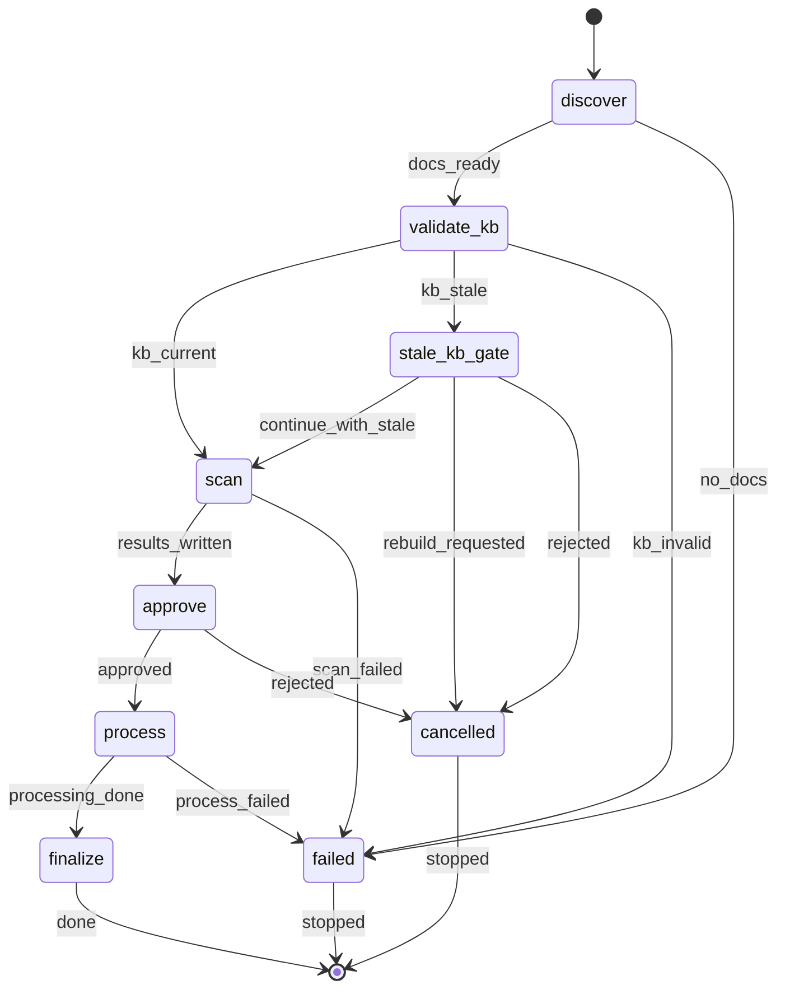

# Generate User Docs

§ROLE: User-doc sync orchestrator. Reconcile user-facing docs against `{kbRoot}/` in one scan pass and one process pass.

§OBJ
- Sync docs to current KB facts
- Keep orchestration state under `{workRoot}/`
- Delegate file-level scan/process only
- Ask approval exactly once after scan
- If the KB is stale but structurally valid, require one explicit pre-scan decision gate

§DO
- Execute discovery + scan immediately
- Use `rp1-base:scribe` only for file batches
- Spawn scan/process batches in parallel with background dispatch
- When the KB is stale, warn with a three-way gate: continue, rebuild first, or cancel
- Keep user-visible output terse:
  1. KB validation status
  2. Scan summary + approval gate
  3. Final report
- Preserve `scan_results.json`; do NOT delete it automatically

§DONT
- Do NOT ask approval before scan
- Do NOT edit docs directly in the parent
- Do NOT iterate on scan or process more than once
- Do NOT silently continue with a stale KB
- Do NOT treat diffs inside the docs being reconciled as KB-staleness signals for this run

§PATHS
- Use the `RUN_ID` from the generated Workflow Bootstrap section
- Derive `RUN_NAME` as `"Docs: sync user docs"` (max 60 chars)
- Set `DATESTAMP` to the current date in `YYYY-MM-DD`
- Set `SESSION_DIR=docs-sync/{DATESTAMP}-{RUN_ID}`
- Set `SCAN_RESULTS_REL={SESSION_DIR}/scan_results.json`
- Set `SCAN_RESULTS_PATH={workRoot}/{SCAN_RESULTS_REL}`

## STATE-MACHINE



**First emit**:
```bash
rp1 agent-tools emit \
  --workflow generate-user-docs \
  --type status_change \
  --run-id {RUN_ID} \
  --name "{RUN_NAME}" \
  --step discover \
  --data '{"status": "running"}'
```

**State progression**:
- Enter `discover`, `validate_kb`, `stale_kb_gate`, `scan`, `approve`, `process`, and `finalize` with `{"status": "running"}`
- Enter `failed` with `{"status": "failed"}`
- Enter `cancelled` with `{"status": "skipped"}`
- Finish `finalize` with `{"status": "completed"}`



## §PROC

### 1. Discover Docs + Style

Discover candidate user docs via Glob:
- `README.md`
- `docs/**/*.md`
- `docs/**/*.mdx`
- `**/*.md`
- `**/*.mdx`

Dedupe by path. Keep project-relative paths only.

Exclude common generated, dependency, build, and internal metadata paths:
- `.rp1/**`, `node_modules/**`, `.git/**`, `vendor/**`, `.venv/**`, `venv/**`
- `dist/**`, `**/dist/**`, `build/**`, `out/**`, `coverage/**`, `**/target/**`, `**/__pycache__/**`
- `.cache/**`, `.next/**`, `.nuxt/**`, `.svelte-kit/**`, `.idea/**`, `.vscode/**`, `.github/**`

Exclude non-user-doc basenames:
- `AGENTS.md`
- `DEVELOPMENT.md`
- `CHANGELOG.md`
- `LICENSE`
- `LICENSE.md`
- `CODE_OF_CONDUCT.md`
- `SECURITY.md`

`CONTRIBUTING.md`:
- Exclude only if it is a tiny stock template or placeholder
- Keep it if it is clearly project-specific user documentation

Set `DOC_FILES` to the remaining paths.

If `DOC_FILES` is empty:
- Output:
  ```
  ERROR: No user-facing documentation files discovered.

  Searched:
  - README.md
  - docs/**/*.md
  - docs/**/*.mdx
  - **/*.md
  - **/*.mdx
  ```
- Transition to `failed`
- STOP

Log:
```
Discovered {DOC_FILES.length} documentation files
```

Pick up to 3 sample files for style inference:
- Prefer `README.md` if present
- Prefer one `docs/` file
- Prefer one other remaining file

Read each sample and infer:
- `heading_style`: `atx | setext`
- `list_marker`: `dash | asterisk | plus | numbered`
- `code_fence`: `backtick | tilde | indent`
- `link_style`: `inline | reference`
- `max_line_length`: p90 line length rounded to nearest 10 and clamped to `80..120`

Build `STYLE_CONFIG`:
```json
{
  "heading_style": "atx",
  "list_marker": "dash",
  "list_style": "dash",
  "code_fence": "backtick",
  "link_style": "inline",
  "max_line_length": 100
}
```

Rules:
- `list_marker` is canonical
- `list_style` is a compatibility alias; keep it equal to `list_marker`
- If style inference is mixed or weak, choose the dominant style or the default shown above

Log the inferred style in one short block.

### 2. Validate KB

Use Glob to confirm `{kbRoot}/state.json` exists.
If missing:
- Output:
  ```
  ERROR: Knowledge base not found.

  Run /rp1-base:knowledge-build, then retry.
  ```
- Transition to `failed`
- STOP

Read `{kbRoot}/state.json`.
Extract:
- `generated_at`
- `git_commit`

If `git_commit` missing or empty:
- Output:
  ```
  ERROR: Invalid KB state.

  state.json is missing git_commit.
  Run /rp1-base:knowledge-build, then retry.
  ```
- Transition to `failed`
- STOP

Verify the commit exists:
```bash
git cat-file -e {KB_GIT_COMMIT}^{commit} 2>/dev/null || echo "INVALID"
```

If output is `INVALID`:
- Output:
  ```
  ERROR: KB references unknown git commit.

  Run /rp1-base:knowledge-build, then retry.
  ```
- Transition to `failed`
- STOP

Compute:
```bash
git rev-parse HEAD
git rev-list --count {KB_GIT_COMMIT}..HEAD
```

Store:
- `HEAD_COMMIT`
- `COMMITS_SINCE_KB`

Compute repo changes since KB build:
```bash
git diff --name-only {KB_GIT_COMMIT} HEAD
```

Derive `STALE_CHANGES`:
- Start with the diff list above
- Drop generated or ignored paths from §1
- Drop `.rp1/work/**`
- Drop any path present in `DOC_FILES`
- Treat all remaining paths as KB-affecting changes for this workflow

Build:
```json
{
  "state": "current",
  "generated_at": "ISO-8601 timestamp",
  "git_commit": "commit sha",
  "head_commit": "commit sha",
  "commits_behind": 0,
  "stale_paths": []
}
```

Rules:
- `state = "current"` when `STALE_CHANGES` is empty
- `state = "stale"` when `STALE_CHANGES` is non-empty
- `commits_behind = COMMITS_SINCE_KB`
- `stale_paths = STALE_CHANGES`

This filter is intentionally strict about non-doc-output changes and intentionally permissive about changes inside `DOC_FILES`; those docs are the workflow outputs being reconciled.

If `STALE_CHANGES` is empty:
- Output:
  ```
  KB sync verified
    Commit: {KB_GIT_COMMIT}
    Built:  {generated_at}
  ```
- Continue to scan

If `STALE_CHANGES` is non-empty:
- Output:
  ```
  WARNING: Knowledge base is out of sync for this workflow.

  KB Generated: {generated_at}
  KB Commit:    {KB_GIT_COMMIT}
  Current HEAD: {HEAD_COMMIT}
  Behind by:    {COMMITS_SINCE_KB} commits

  KB-affecting changes since KB build (showing up to 30):
  {first 30 stale paths}
  ```
- Emit the stale-KB gate:
  ```bash
  rp1 agent-tools emit \
    --workflow generate-user-docs \
    --type waiting_for_user \
    --run-id {RUN_ID} \
    --step stale_kb_gate \
    --data '{"prompt": "Knowledge base is stale. Continue with the stale KB, rebuild the KB first, or cancel?", "context": "KB is {COMMITS_SINCE_KB} commits behind HEAD with {STALE_CHANGES.length} KB-affecting changed paths"}'
  ```
- Present the gate using the standard Liquid prompt syntax:
  `KB_DECISION = `
- If `KB_DECISION == "Continue with stale KB"`:
  - Output:
    ```
    Proceeding with a stale KB by user choice.

    KB is {COMMITS_SINCE_KB} commits behind HEAD.
    ```
  - Continue to scan
- If `KB_DECISION == "Rebuild KB first"`:
  - Output:
    ```
    Documentation update stopped before scan.

    Rebuild the KB with /rp1-base:knowledge-build, then re-run this command.
    ```
  - Transition to `cancelled`
  - STOP
- If `KB_DECISION == "Cancel"`:
  - Output:
    ```
    Documentation update cancelled before scan.

    KB is stale by {COMMITS_SINCE_KB} commits.
    ```
  - Transition to `cancelled`
  - STOP

### 3. Scan

Create the session directory:
```bash
mkdir -p {workRoot}/{SESSION_DIR}
```

Batch `DOC_FILES` into groups of 5.

Spawn one background `rp1-base:scribe` per batch:


MODE: scan
FILES: {actual JSON array of project-relative paths for this batch}
KB_INDEX_PATH: {kbRoot}/index.md

Task: return JSON only with:
- `mode`
- `classifications`
- `summary`
- optional `errors`


Wait for all scan agents to finish.

For each response:
- Parse JSON
- Valid only if:
  - `mode == "scan"`
  - `classifications` is an array
  - `summary` is present
- Capture top-level `errors` when present
- Append per-file scan errors from successful responses into `AGGREGATED.errors`
- Track `TOTAL_BATCHES` and `FAILED_BATCHES`

Failure policy:
- If no scan batch succeeded: transition to `failed`
- If `failed_batches / total_batches >= 0.5`: transition to `failed`
- Otherwise continue with successful batches only

Carry `KB_STATUS` into `AGGREGATED.kb` unchanged.

Aggregate successful results into `AGGREGATED`:
```json
{
  "generated_at": "ISO-8601 timestamp",
  "kb": {
    "state": "current",
    "generated_at": "ISO-8601 timestamp",
    "git_commit": "commit sha",
    "head_commit": "commit sha",
    "commits_behind": 0,
    "stale_paths": []
  },
  "style": {
    "heading_style": "atx",
    "list_marker": "dash",
    "list_style": "dash",
    "code_fence": "backtick",
    "link_style": "inline",
    "max_line_length": 100
  },
  "files": {
    "README.md": {
      "sections": [
        {
          "heading": "Quick Start",
          "line": 10,
          "level": 2,
          "scenario": "fix",
          "kb_match": "modules.md:20"
        }
      ]
    }
  },
  "summary": {
    "total_files": 1,
    "verify": 0,
    "add": 0,
    "fix": 1
  },
  "errors": [
    {
      "file": "README.md",
      "error": "Could not read one heading body cleanly"
    }
  ],
  "scan_failures": [
    {
      "batch": 2,
      "error": "Invalid JSON"
    }
  ]
}
```

Write `SCAN_RESULTS_PATH`.

Compute:
```
TOTAL_SECTIONS = AGGREGATED.summary.verify + AGGREGATED.summary.add + AGGREGATED.summary.fix
```

Show the scan summary:
```
Documentation Scan Complete

{AGGREGATED.summary.total_files} files, {TOTAL_SECTIONS} sections: {AGGREGATED.summary.verify} verify, {AGGREGATED.summary.add} add, {AGGREGATED.summary.fix} fix
```

If `AGGREGATED.kb.state == "stale"`:
- Add one short warning line:
  `Using stale KB by user choice: {AGGREGATED.kb.commits_behind} commits behind`

If `scan_failures` is non-empty:
- Add one short warning line with the failure count
- Do NOT dump raw agent output unless the scan is already failing

If `errors` is non-empty:
- Add one short warning line with the per-file error count
- Preserve the errors in `scan_results.json` for process/reporting

### 4. Approval

Emit the approval gate:
```bash
rp1 agent-tools emit \
  --workflow generate-user-docs \
  --type waiting_for_user \
  --run-id {RUN_ID} \
  --step approve \
  --data '{"prompt": "Proceed with documentation updates?", "context": "Docs sync approval after scan phase"}'
```

`APPROVAL = `

If `APPROVAL == "No"`:
- Output:
  ```
  Documentation update cancelled.

  Scan results preserved at: {workRoot}/{SCAN_RESULTS_REL}
  ```
- Transition to `cancelled`
- STOP

If `APPROVAL == "Yes"`, continue.

### 5. Process

Set `PROCESS_FILES = Object.keys(AGGREGATED.files)`.
Batch into groups of 5.

Spawn one background `rp1-base:scribe` per batch:


MODE: process
FILES: {actual JSON array of project-relative paths for this batch}
SCAN_RESULTS_PATH: {workRoot}/{SCAN_RESULTS_REL}
STYLE: {actual JSON.stringify(STYLE_CONFIG)}

Task: return JSON only with:
- `mode`
- `results`
- `summary`
- optional `errors`


Wait for all process agents to finish.

For each response:
- Parse JSON
- Valid only if:
  - `mode == "process"`
  - `results` is an array

If no process batch response is valid:
- Output `ERROR: Process phase failed before any valid result was returned.`
- Transition to `failed`
- STOP

Aggregate file outcomes:
- `SUCCESSFUL_FILES`: `status == "success"`
- `PARTIAL_FILES`: `status == "partial"`
- `FAILED_FILES`: `status == "failed"`

Rules:
- `success` and `partial` both count as processed
- `partial` means useful edits landed, but some edits failed or review markers were inserted
- `failed` means the file was not usefully updated

Build:
```json
{
  "files_processed": 0,
  "files_succeeded": 0,
  "files_partial": 0,
  "files_failed": 0,
  "total_sections_verified": 0,
  "total_sections_added": 0,
  "total_sections_fixed": 0,
  "total_edits_applied": 0,
  "failed_files": []
}
```

Count section and edit totals from both `SUCCESSFUL_FILES` and `PARTIAL_FILES`.

Final report:
```
Documentation Sync Complete

KB used: {AGGREGATED.kb.state}
- Commits behind at scan start: {AGGREGATED.kb.commits_behind}

Files processed: {files_processed}
- Succeeded: {files_succeeded}
- Partial: {files_partial}
- Failed: {files_failed}

Changes applied:
- Sections verified: {total_sections_verified}
- Sections added: {total_sections_added}
- Sections fixed: {total_sections_fixed}
- Total edits: {total_edits_applied}

Scan results: {workRoot}/{SCAN_RESULTS_REL}

Git-ready: docs: sync {files_succeeded + files_partial} files with KB ({total_edits_applied} edits)
```

If `failed_files` is non-empty:
- List up to 10 lines as `{path}: {first error or fallback message}`

If `files_succeeded + files_partial == 0`:
- Transition to `failed`
- STOP after the report

Do NOT delete `SCAN_RESULTS_PATH`.
Transition to `finalize`.
