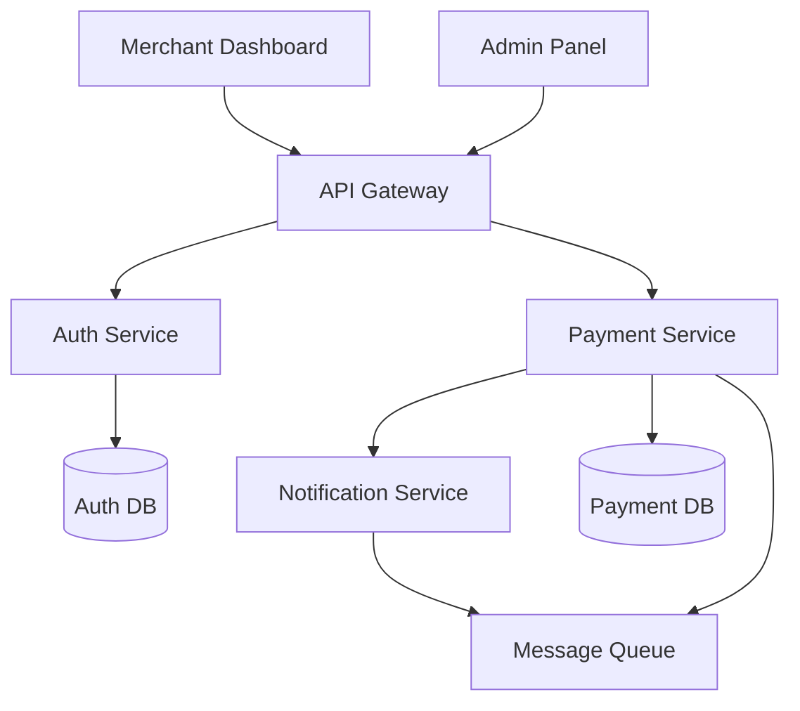
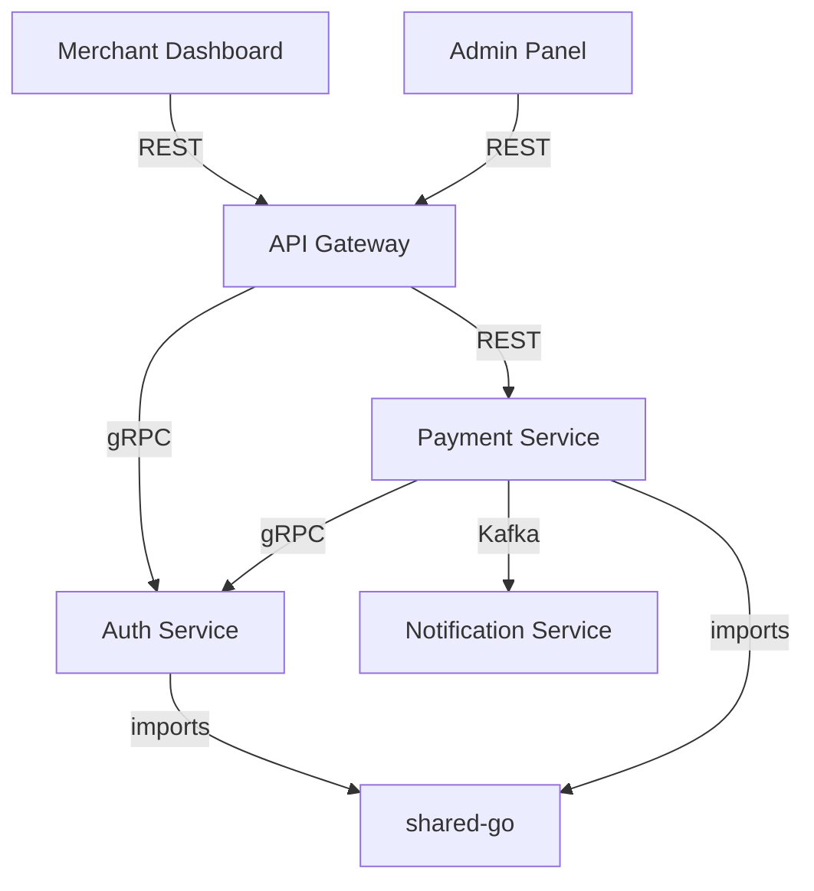
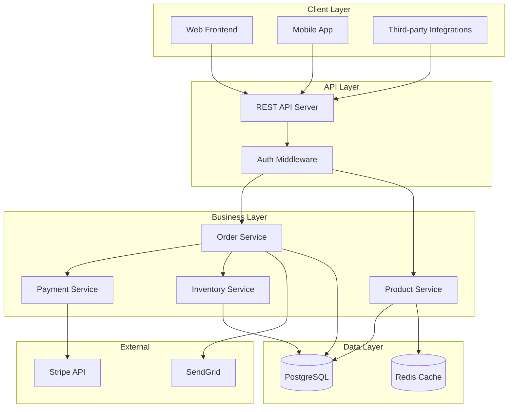
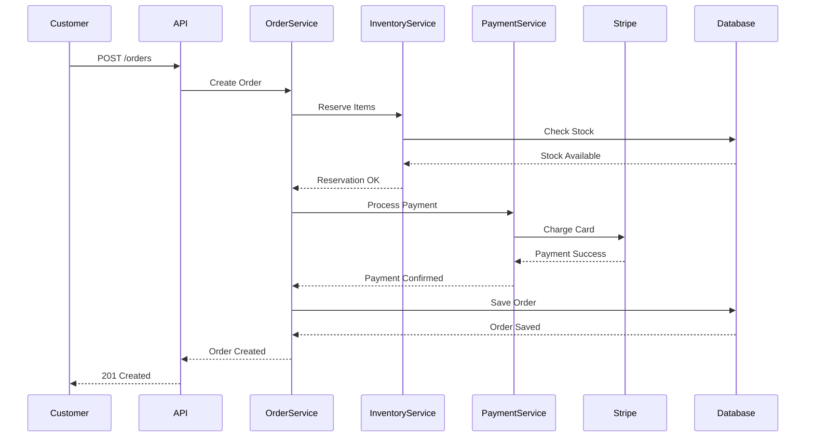

# Knowledge Base Examples

This document provides examples of completed knowledge bases using the templates. These examples show how to fill in templates with real project information.

## Example 1: Single Project - E-commerce API

### Filled index.md

```markdown
# ShopAPI - Codebase Knowledge Base

**Repository Type**: Single Project
**Primary Languages**: Python (95%), JavaScript (5%)
**Last Updated**: 2025-01-15
**Analysis Scope**: 234 files analyzed

## Quick Start

### Development Setup
```bash
# Clone and setup commands
git clone https://github.com/example/shopapi.git
cd shopapi
python -m venv venv
source venv/bin/activate
pip install -r requirements.txt
cp .env.example .env
python manage.py migrate
```

### Project Structure
```
shopapi/
├── api/              # REST API endpoints
├── core/             # Business logic and models
├── services/         # External service integrations
├── utils/            # Shared utilities
└── tests/            # Test suite
```

### Entry Points
- **Main Application**: `manage.py` - Django application entry
- **API Server**: `api/urls.py` - API route definitions
- **Background Tasks**: `tasks/celery.py` - Async task processor
- **Configuration**: `config/settings.py` - Application settings

### Key Commands
```bash
# Development
make dev              # Start development server
make test             # Run test suite
make lint             # Run code quality checks

# Deployment
make deploy:staging   # Deploy to staging
make deploy:prod      # Deploy to production
```

## Architecture Quick Reference
- **Pattern**: Layered architecture (API → Services → Models)
- **Data Flow**: Request → API Handler → Service Layer → Database
- **Key Technologies**: Django REST Framework, PostgreSQL, Redis, Celery

## Development Workflow
1. Create feature branch from `main`
2. Implement changes with tests (minimum 80% coverage)
3. Run linting and tests locally
4. Create PR with description
5. Code review required from 2+ team members
6. Merge after approval and CI passes
```

### Filled concept_map.md

```markdown
# Domain Concepts & Terminology

**Project**: ShopAPI
**Domain**: E-commerce

## Core Business Concepts

### Order
**Definition**: A customer's purchase transaction containing one or more products
**Implementation**: `core/models/order.py`
**Key Properties**:
- `order_id`: Unique identifier (UUID)
- `customer`: Foreign key to Customer model
- `status`: Enum (pending, processing, shipped, delivered, cancelled)
- `total_amount`: Decimal field with currency
- `created_at`: Timestamp of order creation

**Business Rules**:
- Orders cannot be modified after `shipped` status
- Total amount must match sum of order items
- Payment must be confirmed before status changes to `processing`

### Product Catalog
**Definition**: Collection of available products with inventory tracking
**Relationships**:
- Contains Products: Each product has price, description, inventory
- Organized by Categories: Hierarchical category structure
- Links to Orders: Through OrderItem join table

## Technical Concepts

### Inventory Management System
**Purpose**: Track product availability in real-time
**Implementation**: `services/inventory.py`
**Usage Examples**:
```python
# Check product availability
inventory = InventoryService.check_availability(product_id)
if inventory.available_quantity >= requested_quantity:
    reservation = inventory.reserve(requested_quantity)
```

### Payment Processing Pipeline
**Description**: Handles payment authorization and capture
**Input/Output**: Payment request → Authorization token → Capture confirmation
**Performance**: Average processing time 1.2s, 99.9% success rate

## Terminology Glossary

### Business Terms
- **SKU**: Stock Keeping Unit - unique product identifier
- **Cart Abandonment**: When customer adds items but doesn't complete purchase
- **Fulfillment**: Process of preparing and shipping orders

### Technical Terms
- **Idempotency Key**: Ensures duplicate requests don't create multiple orders
- **Optimistic Locking**: Prevents race conditions in inventory updates
- **Circuit Breaker**: Pattern for handling payment gateway failures

## Cross-References
- **Order Processing Flow**: See architecture.md#order-flow
- **Data Models**: See modules.md#core-models
- **API Endpoints**: See api/README.md
```

## Example 2: Monorepo - Microservices Platform

### Filled monorepo index.md

```markdown
# PaymentPlatform - Monorepo Knowledge Base

**Repository Type**: Monorepo
**Primary Languages**: Go (70%), TypeScript (25%), Python (5%)
**Last Updated**: 2025-01-15
**Projects**: 5
**Total Files Analyzed**: 1,247

## Quick Start

### Development Setup
```bash
# Clone and setup workspace
git clone https://github.com/example/payment-platform.git
cd payment-platform
make bootstrap        # Install all dependencies
make dev:all         # Start all services locally
```

### Repository Structure
```
payment-platform/
├── services/
│   ├── auth-service/       # User authentication (Go)
│   ├── payment-service/    # Payment processing (Go)
│   └── notification-service/ # Email/SMS notifications (Python)
├── apps/
│   ├── merchant-dashboard/ # Merchant web app (TypeScript/React)
│   └── admin-panel/       # Admin interface (TypeScript/React)
├── libs/
│   └── shared-go/         # Common Go utilities
└── infrastructure/
    └── terraform/         # Infrastructure as code
```

## Projects Overview

| Project | Purpose | Language | Entry Point | Status |
|---------|---------|----------|-------------|--------|
| auth-service | User authentication & authorization | Go | cmd/auth/main.go | Active |
| payment-service | Payment processing & webhooks | Go | cmd/payments/main.go | Active |
| notification-service | Email/SMS notifications | Python | src/main.py | Active |
| merchant-dashboard | Merchant web interface | TypeScript | src/index.tsx | Active |
| admin-panel | Internal admin tools | TypeScript | src/index.tsx | Active |

### Project Details

#### auth-service - Authentication & Authorization
- **Location**: `services/auth-service/`
- **Technology**: Go 1.20 + gRPC + PostgreSQL
- **Dependencies**: shared-go library
- **Documentation**: See `projects/auth-service/overview.md`
- **API**: gRPC service on port 9001

#### payment-service - Payment Processing
- **Location**: `services/payment-service/`
- **Technology**: Go 1.20 + REST API + PostgreSQL
- **Dependencies**: auth-service (authentication), shared-go library
- **Documentation**: See `projects/payment-service/overview.md`
- **API**: REST API on port 8080

## Shared Infrastructure

### Common Libraries
- **shared-go**: Common utilities, models, and middleware for Go services
- **@platform/types**: Shared TypeScript type definitions

### Workspace Configuration
- **Build Tool**: Turborepo for build orchestration
- **Package Manager**: pnpm with workspace support
- **Dependency Management**: Go modules for Go, pnpm for TypeScript

## Architecture Overview



See [architecture.md](architecture.md) for detailed system architecture.

## Development Workflow

### Working with Multiple Projects
1. Start dependent services first: `make dev:auth`
2. Start main service: `make dev:payment`
3. Access logs: `make logs:payment`

### Key Commands
```bash
# Development
make dev:all          # Start all services
make dev:auth         # Start auth service only
make test:all         # Run all tests
make build:all        # Build all projects

# Deployment
make deploy:staging   # Deploy all to staging
make deploy:prod      # Deploy all to production
```

## Inter-Project Dependencies

See [dependencies.md](dependencies.md) for detailed dependency graph and impact analysis.

## Technology Stack

See [technology-matrix.md](technology-matrix.md) for complete technology breakdown.
```

### Filled dependencies.md (Monorepo)

```markdown
# Inter-Project Dependencies

**Repository**: PaymentPlatform
**Last Updated**: 2025-01-15
**Projects Analyzed**: 5

## Dependency Graph



## Project Matrix

| Project | Type | Language | Depends On | Used By |
|---------|------|----------|------------|---------|
| shared-go | Library | Go | - | auth-service, payment-service |
| auth-service | Service | Go | shared-go | payment-service, api-gateway |
| payment-service | Service | Go | shared-go, auth-service | api-gateway |
| notification-service | Service | Python | - | payment-service (via queue) |
| merchant-dashboard | Application | TypeScript | - | - |

## Shared Code Impact

### shared-go (`libs/shared-go/`)
**Purpose**: Common utilities, middleware, and domain models
**Consumers**: 2 projects (auth-service, payment-service)
**Breaking Change Risk**: High - affects core services

**Key Exports**:
- `Logger` - structured logging used by all Go services
- `AuthMiddleware` - JWT validation middleware
- `DatabaseClient` - PostgreSQL connection pooling
- `ErrorTypes` - Standard error definitions

**Versioning Strategy**: Semantic versioning with go.mod

**Recent Changes**:
- v1.2.0: Added distributed tracing support (no breaking changes)
- v1.1.0: Updated logger interface (required migration in consumers)

## Build Dependencies

### Build Order
1. shared-go (foundation)
2. auth-service, notification-service (parallel - no dependencies on each other)
3. payment-service (depends on auth-service contracts)
4. merchant-dashboard, admin-panel (depend on API contracts)

### Critical Path
The critical path for full build is:
```
shared-go → auth-service → payment-service → merchant-dashboard
```
Total build time: ~4 minutes

### Deployment Dependencies
- **Database migrations**: auth-service migrations must run before payment-service
- **Service startup order**: auth-service → payment-service → notification-service → frontend apps
- **Configuration dependencies**: All services require auth-service to be healthy

## Change Impact Matrix

When making changes to a project, consider these downstream impacts:

| Changing... | Impacts... | Severity | Notes |
|-------------|-----------|----------|-------|
| shared-go | auth-service, payment-service | Critical | Test both services thoroughly |
| auth-service | payment-service, api-gateway | High | API changes require coordination |
| payment-service | merchant-dashboard, admin-panel | Medium | UI updates may be needed |
```

## Example 3: Filled architecture.md with Real Diagrams

```markdown
# System Architecture

**Project**: ShopAPI
**Architecture Pattern**: Layered Architecture
**Last Updated**: 2025-01-15

## High-Level Architecture



## Data Flow: Order Processing



## Security Architecture

### Authentication
- **Method**: JWT tokens with RS256 signing
- **Flow**: Login → JWT issued → Include in Authorization header

### Authorization
- **Model**: Role-Based Access Control (RBAC)
- **Implementation**: Middleware checks roles from JWT claims

### Data Protection
- **Encryption**: TLS 1.3 for data in transit, AES-256 for sensitive DB fields
- **Sensitive Data**: PII encrypted at rest, PCI compliance for payment data
```

## Key Takeaways from Examples

1. **Be Specific**: Use actual project names, technologies, and details
2. **Include Diagrams**: Mermaid diagrams make architecture clear
3. **Show Relationships**: Demonstrate how components interact
4. **Document Decisions**: Explain why choices were made
5. **Provide Context**: Numbers, dates, and metrics add value
6. **Cross-Reference**: Link related documents together
7. **Keep Current**: Update dates and version numbers

## Using These Examples

When creating your own knowledge base:
1. Start with templates from this skill
2. Reference these examples for style and depth
3. Adapt content to your project's specifics
4. Validate Mermaid diagrams with mermaid skill
5. Review for completeness and accuracy
