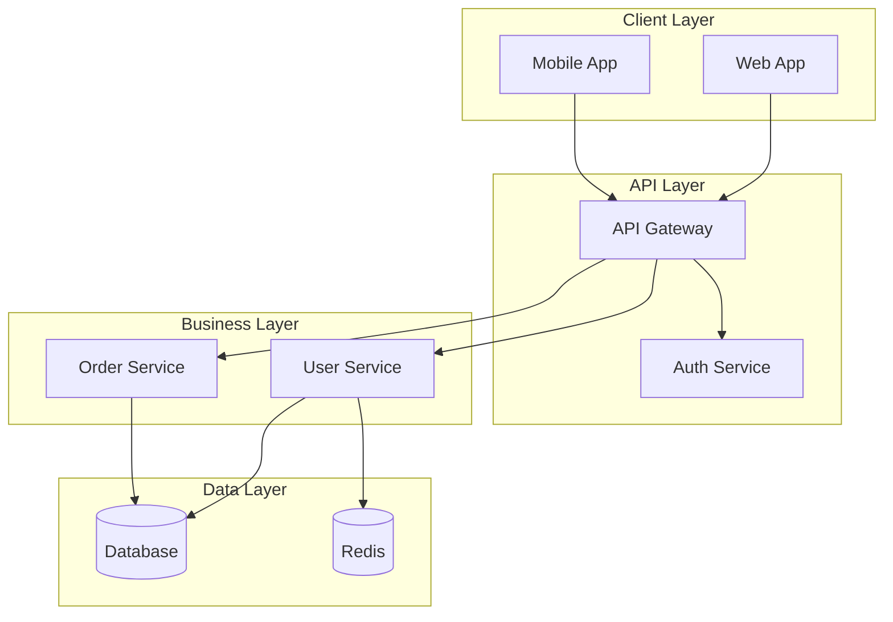
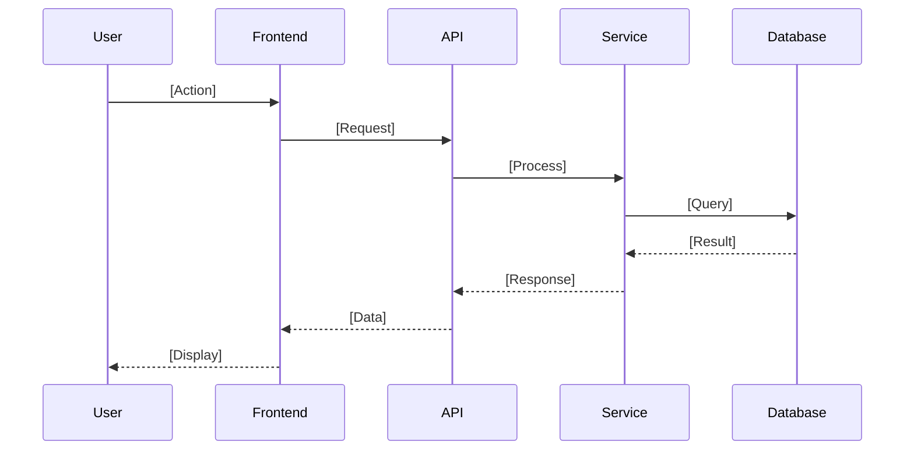

# System Architecture

**Project**: [Project Name]
**Architecture Pattern**: [Layered | Microservices | Event-Driven | etc.]
**Last Updated**: [Date]

## High-Level Architecture



## Component Architecture

### [Major Component 1]
**Purpose**: [What this component does]
**Location**: [`src/components/component1/`]
**Responsibilities**:
- [Primary responsibility]
- [Secondary responsibility]

**Dependencies**:
- [Internal]: [Other components it uses]
- [External]: [Third-party libraries]

**Interface**:
```[language]
// Public interface definition
[interface/API definition]
```

### [Major Component 2]
**Purpose**: [Component purpose]
**Key Patterns**: [Design patterns used]
**Configuration**: [How it's configured]

## Data Flow

### [Primary User Flow]


### [Secondary Flow]
[Description of another important data flow]

## Integration Points

### External Services
- **[Service Name]**: [Purpose and integration method]
- **[API/Database]**: [How data flows in/out]

### Internal Communication
- **Service-to-Service**: [How components communicate]
- **Event Handling**: [Event-driven architecture details]

## Security Architecture

### Authentication
- **Method**: [OAuth, JWT, etc.]
- **Flow**: [How authentication works]

### Authorization
- **Model**: [RBAC, ABAC, etc.]
- **Implementation**: [Where access control happens]

### Data Protection
- **Encryption**: [At rest and in transit]
- **Sensitive Data**: [How PII is handled]

## Performance Considerations

### Bottlenecks
- [Known performance limitations]
- [Resource-intensive operations]

### Scalability
- [Horizontal/vertical scaling approach]
- [Caching strategy]

### Monitoring
- [What metrics are tracked]
- [Alerting and observability]

## Deployment Architecture

### Environments
- **Development**: [How dev environment works]
- **Staging**: [Staging setup]
- **Production**: [Production deployment]

### Infrastructure
- **Hosting**: [Cloud provider, containers, etc.]
- **Database**: [Database setup and replication]
- **Networking**: [Load balancers, CDN, etc.]
