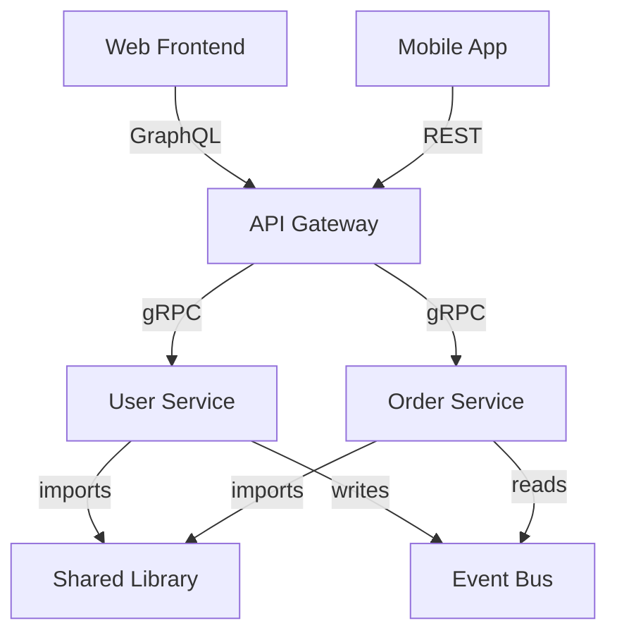

# Inter-Project Dependencies

**Repository**: [Repository Name]
**Last Updated**: [Date]
**Projects Analyzed**: [Count]

## Dependency Graph



## Project Matrix

| Project | Type | Language | Depends On | Used By |
|---------|------|----------|------------|---------|
| shared-lib | Library | Go | - | user-service, order-service |
| user-service | Service | Go | shared-lib | api-gateway |
| order-service | Service | Go | shared-lib, user-service | api-gateway |
| api-gateway | Service | Go | user-service, order-service | frontend, mobile |
| frontend | Application | TypeScript | - | - |

## Shared Code Impact

### shared-lib (`libs/shared/`)
**Purpose**: Common utilities and domain models
**Consumers**: [Count] projects
**Breaking Change Risk**: [High | Medium | Low] - affects multiple services

**Key Exports**:
- `[Export1]` - used by [projects]
- `[Export2]` - used by [projects]
- `[Export3]` - used by [projects]

**Versioning Strategy**: [Semantic versioning, lock-step, etc.]

**Recent Changes**:
- [Change 1]: [Impact on consumers]
- [Change 2]: [Migration required]

### [Another Shared Library] (`libs/types/`)
**Purpose**: [Description]
**Consumers**: [Count] projects
**Breaking Change Risk**: [High | Medium | Low]

**Key Exports**:
- [List of main exports and their consumers]

## Build Dependencies

### Build Order
1. [shared-lib] (foundation)
2. [service-a, service-b] (parallel - depend on shared-lib)
3. [api-gateway] (depends on services)
4. [frontend] (depends on gateway contracts)

### Critical Path
The critical path for full build is:
```
shared-lib → service-a → api-gateway → frontend
```
Total build time: [Estimate]

### Deployment Dependencies
- **Database migrations**: Must run before service deployments
- **Service startup order**: [service-a] → [service-b] → [gateway] → [frontend]
- **Configuration dependencies**: [What must be configured first]

## Dependency Analysis

### Most Depended Upon
1. **[shared-lib]**: Used by [N] projects
2. **[common-types]**: Used by [N] projects
3. **[util-library]**: Used by [N] projects

### Highest Impact Changes
Projects where changes affect the most consumers:
1. **[shared-lib]**: Changes impact [N] downstream projects
2. **[core-service]**: Changes impact [N] downstream projects

### Circular Dependencies
[None found | List any circular dependencies and how they're managed]

## Change Impact Matrix

When making changes to a project, consider these downstream impacts:

| Changing... | Impacts... | Severity | Notes |
|-------------|-----------|----------|-------|
| shared-lib | user-service, order-service, api-gateway | High | Breaking changes require coordination |
| user-service | api-gateway, frontend | Medium | API contract changes need versioning |
| api-gateway | frontend, mobile | High | All clients affected |

## Versioning Strategy

### Shared Libraries
- [How versions are managed]
- [When to bump major/minor/patch]
- [How consumers specify versions]

### Services
- [How API versions are managed]
- [Backward compatibility strategy]
- [Deprecation policy]

## Testing Strategy

### Unit Tests
- Each project has independent unit tests
- Shared libraries have comprehensive test coverage

### Integration Tests
- Test interactions between [project-a] and [project-b]
- End-to-end tests cover full dependency chain

### Dependency Update Testing
- [How to test before updating shared dependency]
- [CI/CD checks for breaking changes]
