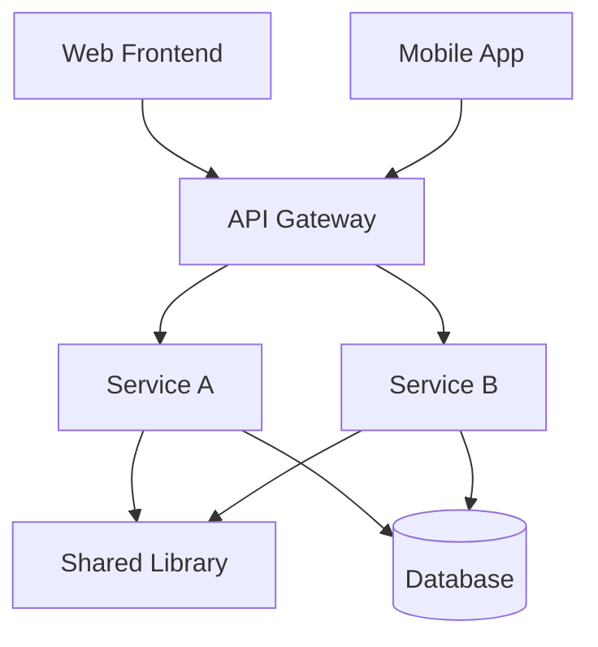

# [Repository Name] - Monorepo Knowledge Base

**Repository Type**: Monorepo
**Primary Languages**: [Languages by usage across all projects]
**Last Updated**: [Date]
**Projects**: [Count]
**Total Files Analyzed**: [Count]

## Quick Start

### Development Setup
```bash
# Clone and setup commands
git clone [repo-url]
cd [repo-name]
[workspace setup commands]
```

### Repository Structure
```
[key directories and their purposes]
packages/
├── service-a/      # User authentication service
├── service-b/      # Order processing service
├── frontend/       # Web application
└── shared-lib/     # Common utilities and types
```

## Projects Overview

| Project | Purpose | Language | Entry Point | Status |
|---------|---------|----------|-------------|--------|
| [service-a] | [User authentication] | [Go] | [cmd/auth/main.go] | [Active] |
| [service-b] | [Order processing] | [Go] | [cmd/orders/main.go] | [Active] |
| [frontend] | [Web interface] | [TypeScript] | [src/main.tsx] | [Active] |
| [shared-lib] | [Common utilities] | [Go] | [pkg/] | [Active] |

### Project Details

#### [Service A] - [Purpose]
- **Location**: `packages/service-a/`
- **Technology**: [Language + Framework]
- **Dependencies**: [What it depends on]
- **Documentation**: See `projects/service-a/overview.md`

#### [Service B] - [Purpose]
- **Location**: `packages/service-b/`
- **Technology**: [Language + Framework]
- **Dependencies**: [What it depends on]
- **Documentation**: See `projects/service-b/overview.md`

## Shared Infrastructure

### Common Libraries
- **[shared-lib]**: [Purpose and usage across projects]
- **[common-types]**: [Shared type definitions]

### Workspace Configuration
- **Build Tool**: [Turborepo, Nx, Lerna, etc.]
- **Package Manager**: [pnpm, yarn, npm workspaces]
- **Dependency Management**: [How shared dependencies work]

## Architecture Overview



See [architecture.md](architecture.md) for detailed system architecture.

## Development Workflow

### Working with Multiple Projects
1. [How to run multiple services locally]
2. [How to make changes across projects]
3. [Testing strategy for cross-project changes]

### Key Commands
```bash
# Development
npm run dev           # Start all services
npm run dev:service-a # Start specific service
npm run test          # Run all tests
npm run build         # Build all projects

# Deployment
npm run deploy        # Deploy all services
npm run deploy:prod   # Production deployment
```

## Inter-Project Dependencies

See [dependencies.md](dependencies.md) for detailed dependency graph and impact analysis.

## Technology Stack

See [technology-matrix.md](technology-matrix.md) for complete technology breakdown by project.

## Navigation

- **Architecture**: See [architecture.md](architecture.md)
- **Concepts**: See [concept_map.md](concept_map.md)
- **Modules**: See [modules.md](modules.md)
- **Dependencies**: See [dependencies.md](dependencies.md)
- **Project Details**: See `projects/[project-name]/overview.md`
