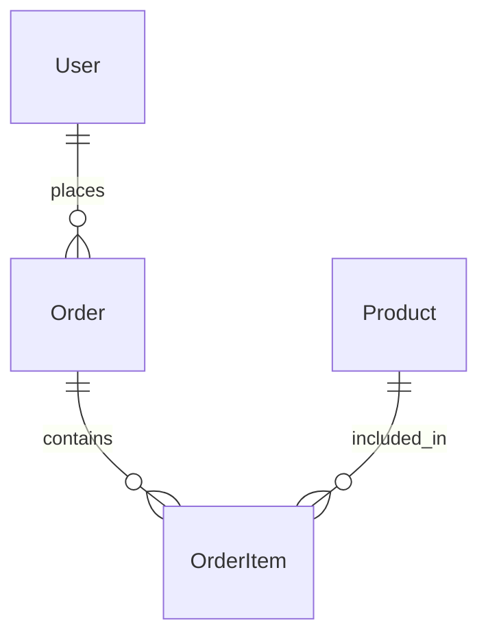
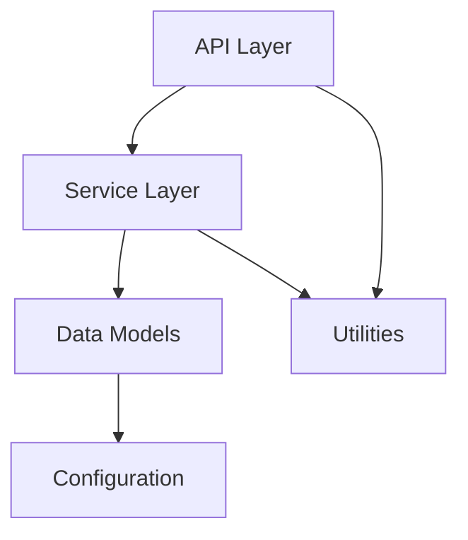

# Module & Component Breakdown

**Project**: [Project Name]
**Analysis Date**: [Date]
**Modules Analyzed**: [Count]

## Core Modules

### [Module Name] (`src/core/module/`)
**Purpose**: [What this module does]
**Complexity**: [High | Medium | Low]
**Dependencies**: [Other modules it imports]

**Key Components**:
- **[Component1]** (`component1.py`): [Responsibility]
- **[Component2]** (`component2.py`): [Responsibility]

**Public Interface**:
```[language]
// Main exports/public functions
[key functions or classes]
```

**Usage Examples**:
```[language]
// How other modules use this one
[example usage]
```

**Testing**: [`tests/core/module/`] - [Test coverage notes]

### [Another Module] (`src/services/`)
**Purpose**: [External service integrations]
**Pattern**: [Service layer, Repository, etc.]

**Services**:
- **[ServiceA]**: [What it handles]
- **[ServiceB]**: [Integration details]

**Configuration**: [How services are configured]
**Error Handling**: [How failures are managed]

## Support Modules

### Utilities (`src/utils/`)
**Shared Functions**:
- **[Utility1]**: [Common operation]
- **[Utility2]**: [Helper function]

### Configuration (`src/config/`)
**Environment Management**:
- [How configuration is loaded]
- [Environment-specific settings]

### Database (`src/models/` or `src/db/`)
**Data Models**:
- **[Model1]**: [Entity representation]
- **[Model2]**: [Business object]

**Relationships**:


## Module Dependencies

### Dependency Graph


### Import Analysis
- **Most Imported**: [Module with highest incoming dependencies]
- **Most Dependencies**: [Module importing the most others]
- **Circular Dependencies**: [Any problematic cycles found]

## Module Metrics

| Module | Files | Lines | Complexity | Test Coverage |
|--------|-------|-------|------------|---------------|
| [core] | [12] | [2,400] | [Medium] | [85%] |
| [api] | [8] | [1,200] | [Low] | [92%] |
| [services] | [15] | [3,100] | [High] | [78%] |

## Code Quality Insights

### Well-Structured Modules
- **[Module]**: [Why it's well organized]
- **[Module]**: [Good separation of concerns]

### Areas for Improvement
- **[Module]**: [Refactoring opportunities]
- **[Module]**: [Technical debt or complexity issues]

### Architectural Patterns
- **[Pattern Used]**: [Where and how it's implemented]
- **[Design Principle]**: [How it's applied across modules]
