# Mermaid Error Pattern Catalog

This document catalogs common mermaid diagram errors organized by category. Each category includes:
- Pattern description and detection criteria
- Real examples showing broken vs fixed syntax
- Example mermaid-cli error messages

Use this reference when debugging diagram validation failures or implementing automatic repair logic.

---

## Error Categories Overview

| Category | Description | Common Cause |
|----------|-------------|--------------|
| ARROW_SYNTAX | Invalid arrow or connection syntax | Using wrong arrow type for diagram |
| QUOTE_ERROR | String/label quoting issues | Special characters in unquoted labels |
| CARDINALITY | ER diagram relationship errors | Incorrect relationship notation |
| LINE_BREAK | Missing or improper line breaks | Statements not separated correctly |
| DIAGRAM_TYPE | Invalid diagram declaration | Typo or unsupported diagram type |
| NODE_SYNTAX | Malformed node definitions | Unbalanced brackets or braces |

---

## 1. ARROW_SYNTAX

**Description**: Invalid arrow or connection syntax for the diagram type being used.

**Detection Patterns**:
- Error contains "got 'MINUS'" or "got 'GT'"
- Error mentions "expecting.*LINK" or "expecting.*START_LINK"
- Error contains "invalid.*arrow" or "arrow.*syntax"

### Example 1.1: Wrong Arrow in State Diagram

**Broken**:
```mermaid
stateDiagram-v2
    [*] -> State1
    State1 -> State2
    State2 -> [*]
```

**Error Message**:
```
Parse error on line 2:
...stateDiagram-v2    [*] -> State1
-----------------------^
Expecting 'NEWLINE', 'SPACE', got 'MINUS'
```

**Fixed**:
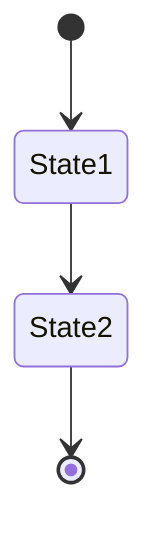

**Fix Strategy**: Replace `->` with `-->` in state diagrams.

---

### Example 1.2: Invalid Arrow in Flowchart

**Broken**:
```mermaid
flowchart TD
    A ==> B
    B -> C
    C --> D
```

**Error Message**:
```
Parse error on line 3:
    B -> C
------^
Expecting 'LINK', got 'MINUS'
```

**Fixed**:
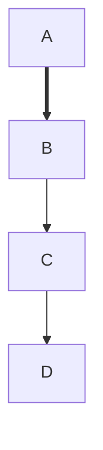

**Fix Strategy**: Use valid flowchart arrows: `-->`, `---`, `==>`, `-.->`, `--o`, `--x`.

---

### Example 1.3: Missing Arrow Style in Sequence Diagram

**Broken**:
```mermaid
sequenceDiagram
    Alice - Bob: Hello
    Bob - Alice: Hi
```

**Error Message**:
```
Parse error on line 2:
    Alice - Bob: Hello
----------^
Expecting 'SOLID_ARROW', 'DOTTED_ARROW', 'SOLID_OPEN_ARROW', got 'MINUS'
```

**Fixed**:
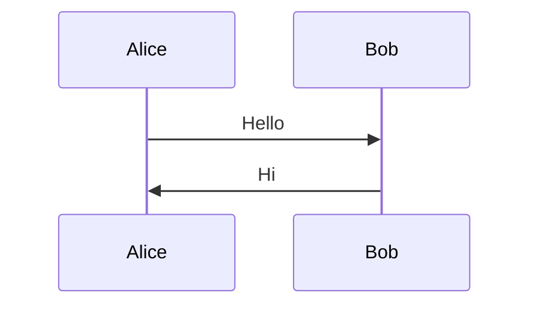

**Fix Strategy**: Use sequence diagram arrows: `->>`, `-->>`, `-x`, `--x`, `-)`, `--)`.

---

## 2. QUOTE_ERROR

**Description**: Labels or text containing special characters that require quoting.

**Detection Patterns**:
- Error contains "unterminated string" or "lexical error.*string"
- Error mentions "quote" or "unquoted"
- Error contains "unexpected (string|character)"
- Error contains "got 'STR'"

### Example 2.1: Unquoted Label with Parentheses

**Broken**:
```mermaid
flowchart TD
    A[Start Process (init)]
    B[End Process (cleanup)]
    A --> B
```

**Error Message**:
```
Parse error on line 2:
    A[Start Process (init)]
--------------------^
Lexical error on line 2. Unrecognized text.
```

**Fixed**:
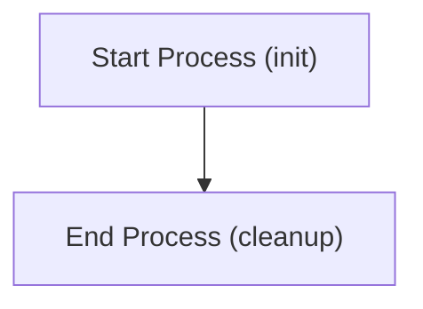

**Fix Strategy**: Wrap labels containing parentheses, brackets, or special characters in double quotes.

---

### Example 2.2: Colon in Node Label

**Broken**:
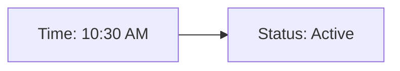

**Error Message**:
```
Parse error on line 2:
    A[Time: 10:30 AM]
-----------^
Expecting 'SQE', 'STR', got ':'
```

**Fixed**:


**Fix Strategy**: Quote labels containing colons to prevent parser confusion.

---

### Example 2.3: Unterminated String in Class Diagram

**Broken**:
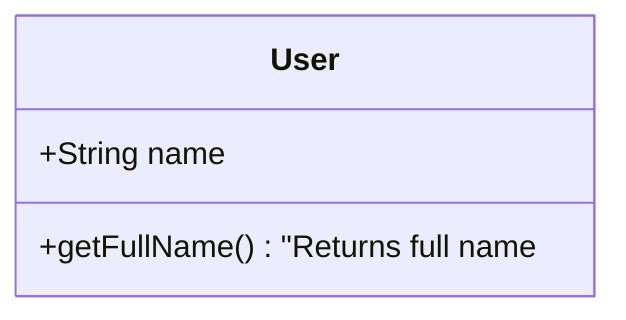

**Error Message**:
```
Parse error on line 4:
        +getFullName() "Returns full name
-----------------------^
Lexical error: Unterminated string constant
```

**Fixed**:
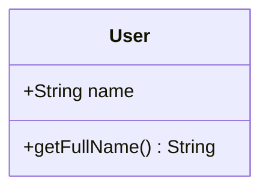

**Fix Strategy**: Close all string quotes or remove partial strings from method signatures.

---

## 3. CARDINALITY

**Description**: Invalid relationship cardinality notation in ER diagrams.

**Detection Patterns**:
- Error mentions "cardinality" or "relationship"
- Error contains "entity.*relationship"
- Error occurs in erDiagram blocks
- Error mentions relationship symbols like `||`, `o{`, `}|`

### Example 3.1: Wrong Cardinality Symbols

**Broken**:
```mermaid
erDiagram
    CUSTOMER |--| ORDER : places
    ORDER |--| PRODUCT : contains
```

**Error Message**:
```
Parse error on line 2:
    CUSTOMER |--| ORDER : places
-------------^
Expecting 'ZERO_OR_ONE', 'ZERO_OR_MORE', 'ONE_OR_MORE', 'ONLY_ONE'
```

**Fixed**:
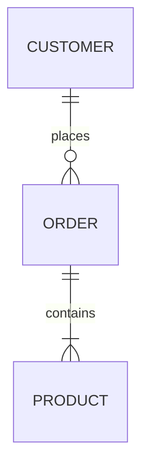

**Fix Strategy**: Use valid ER cardinality: `||` (one), `o|` (zero or one), `}|` (one or more), `}o` (zero or more).

---

### Example 3.2: Missing Cardinality Markers

**Broken**:
```mermaid
erDiagram
    CUSTOMER -- ORDER : places
    ORDER -- ITEM : contains
```

**Error Message**:
```
Parse error on line 2:
    CUSTOMER -- ORDER : places
-------------^
Expecting relationship cardinality markers
```

**Fixed**:
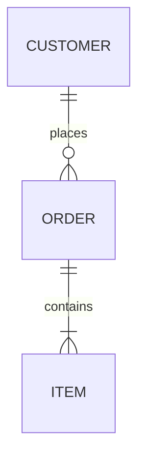

**Fix Strategy**: Add cardinality markers on both sides of the relationship line.

---

### Example 3.3: Invalid Relationship Direction

**Broken**:
```mermaid
erDiagram
    USER {|--o| PROFILE : has
    PROFILE o|--|{ SETTING : contains
```

**Error Message**:
```
Parse error on line 2:
    USER {|--o| PROFILE : has
---------^
Unexpected token '{'
```

**Fixed**:
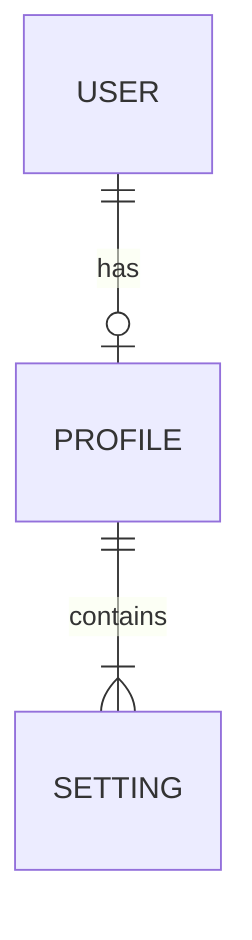

**Fix Strategy**: Cardinality symbols must follow left-to-right pattern: `left_card--right_card`.

---

## 4. LINE_BREAK

**Description**: Missing newlines between statements or improper line structure.

**Detection Patterns**:
- Error contains "expecting.*(NEWLINE|NL|EOF)"
- Error mentions "newline" or "line break"
- Error contains "unexpected.*end" or "multiple statements"

### Example 4.1: Missing Newlines in Sequence Diagram

**Broken**:
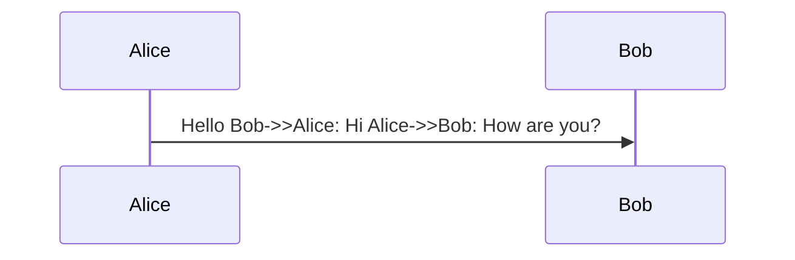

**Error Message**:
```
Parse error on line 2:
    Alice->>Bob: Hello Bob->>Alice: Hi
----------------------^
Expecting 'NEWLINE', got 'ACTOR'
```

**Fixed**:
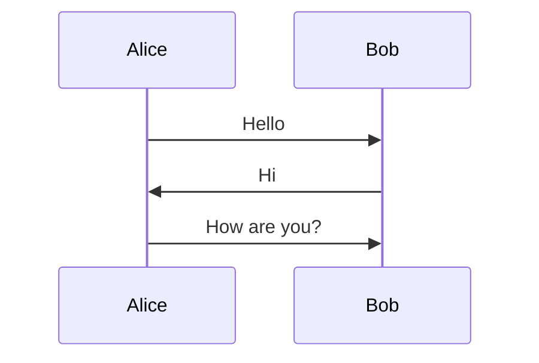

**Fix Strategy**: Each message in a sequence diagram must be on its own line.

---

### Example 4.2: Inline State Definitions

**Broken**:
```mermaid
stateDiagram-v2
    [*] --> Idle Idle --> Processing Processing --> Done Done --> [*]
```

**Error Message**:
```
Parse error on line 2:
    [*] --> Idle Idle --> Processing
-----------------^
Expecting 'NEWLINE', 'EOF', got 'STATE_ID'
```

**Fixed**:
```mermaid
stateDiagram-v2
    [*] --> Idle
    Idle --> Processing
    Processing --> Done
    Done --> [*]
```

**Fix Strategy**: Place each state transition on a separate line.

---

### Example 4.3: Gantt Tasks on Same Line

**Broken**:
```mermaid
gantt
    title Project Plan
    section Phase1
    Task A :a1, 2024-01-01, 7d Task B :a2, after a1, 5d
```

**Error Message**:
```
Parse error on line 4:
    Task A :a1, 2024-01-01, 7d Task B
-------------------------------^
Expecting 'NEWLINE', got 'TASK_TEXT'
```

**Fixed**:
```mermaid
gantt
    title Project Plan
    section Phase1
    Task A :a1, 2024-01-01, 7d
    Task B :a2, after a1, 5d
```

**Fix Strategy**: Each Gantt task must be on its own line.

---

## 5. DIAGRAM_TYPE

**Description**: Invalid or unrecognized diagram type declaration.

**Detection Patterns**:
- Error contains "unknown diagram type" or "unrecognized diagram"
- Error contains "UnknownDiagramError"
- Error mentions "expecting.*(flowchart|graph|sequenceDiagram|...)"
- Error contains "no diagram type"

### Example 5.1: Misspelled Diagram Type

**Broken**:
```mermaid
flowchard TD
    A --> B
    B --> C
```

**Error Message**:
```
UnknownDiagramError: No diagram type detected matching given configuration for text: flowchard TD
```

**Fixed**:
```mermaid
flowchart TD
    A --> B
    B --> C
```

**Fix Strategy**: Correct the diagram type spelling. Valid types: `flowchart`, `graph`, `sequenceDiagram`, `classDiagram`, `stateDiagram`, `erDiagram`, `gantt`, `pie`, `journey`, `gitGraph`, `mindmap`, `timeline`.

---

### Example 5.2: Using Deprecated Type

**Broken**:
```mermaid
graph TD
    A[Start] -> B[End]
```

**Error Message**:
```
Parse error on line 2:
    A[Start] -> B[End]
-------------^
Expecting 'LINK', got 'MINUS'
```

**Fixed**:
```mermaid
flowchart TD
    A[Start] --> B[End]
```

**Fix Strategy**: While `graph` is valid, `flowchart` is preferred and has more features. Also fix arrow syntax.

---

### Example 5.3: Missing Diagram Type

**Broken**:
```mermaid
    A --> B
    B --> C
    C --> D
```

**Error Message**:
```
UnknownDiagramError: No diagram type detected matching given configuration for text:     A --> B
```

**Fixed**:
```mermaid
flowchart TD
    A --> B
    B --> C
    C --> D
```

**Fix Strategy**: Add a diagram type declaration as the first non-empty line.

---

## 6. NODE_SYNTAX

**Description**: Malformed node definitions with unbalanced brackets, braces, or parentheses.

**Detection Patterns**:
- Error mentions "node.*syntax" or "malformed node"
- Error contains "unclosed (bracket|brace|paren)"
- Error mentions "bracket.*mismatch" or "unbalanced"
- Error contains "got 'PS'" (parenthesis start) or "got 'SQS'" (square bracket start)

### Example 6.1: Unclosed Square Bracket

**Broken**:
```mermaid
flowchart TD
    A[Start Process
    B[Middle Step]
    C[End Process]
    A --> B --> C
```

**Error Message**:
```
Parse error on line 3:
    B[Middle Step]
----^
Expecting 'SQE', got 'ALPHA'
```

**Fixed**:
```mermaid
flowchart TD
    A[Start Process]
    B[Middle Step]
    C[End Process]
    A --> B --> C
```

**Fix Strategy**: Ensure all opening brackets `[` have matching closing brackets `]`.

---

### Example 6.2: Mixed Bracket Types

**Broken**:
```mermaid
flowchart LR
    A[Input)
    B(Process]
    C{Decision}
    A --> B --> C
```

**Error Message**:
```
Parse error on line 2:
    A[Input)
----------^
Expecting 'SQE', got 'PE'
```

**Fixed**:
```mermaid
flowchart LR
    A[Input]
    B(Process)
    C{Decision}
    A --> B --> C
```

**Fix Strategy**: Match bracket types: `[]` for rectangles, `()` for rounded, `{}` for diamonds/rhombus.

---

### Example 6.3: Nested Brackets Error

**Broken**:
```mermaid
flowchart TD
    A[User Input [required]]
    B[Process Data]
    A --> B
```

**Error Message**:
```
Parse error on line 2:
    A[User Input [required]]
-----------------^
Unexpected token '['
```

**Fixed**:
```mermaid
flowchart TD
    A["User Input [required]"]
    B[Process Data]
    A --> B
```

**Fix Strategy**: When labels contain brackets, wrap the entire label in double quotes.

---

## Quick Reference: Fix Strategies by Category

| Category | Primary Fix | Secondary Fix |
|----------|-------------|---------------|
| ARROW_SYNTAX | Replace arrow with valid type for diagram | Check diagram type requirements |
| QUOTE_ERROR | Wrap label in double quotes | Remove/escape special characters |
| CARDINALITY | Add proper cardinality markers | Use format: `\|\|--o{` |
| LINE_BREAK | Split statements onto separate lines | Add newline after each statement |
| DIAGRAM_TYPE | Correct spelling or add type declaration | Use `flowchart` over `graph` |
| NODE_SYNTAX | Balance brackets/braces | Quote labels with special chars |

---

## Validation Command

Test diagrams using the rp1 CLI tool:

```bash
# Validate markdown file (all embedded diagrams)
rp1 agent-tools mmd-validate path/to/document.md

# Validate standalone mermaid file
rp1 agent-tools mmd-validate path/to/diagram.mmd

# Validate from stdin
echo 'flowchart TD; A-->B' | rp1 agent-tools mmd-validate
```

JSON output uses ToolResult envelope format:
```json
{
  "success": false,
  "tool": "mmd-validate",
  "data": {
    "diagrams": [
      {
        "index": 0,
        "valid": false,
        "diagramType": "stateDiagram-v2",
        "startLine": 10,
        "errors": [{
          "diagramIndex": 0,
          "message": "Parse error on line 2: Expecting '-->', got 'MINUS'",
          "line": 2,
          "context": "[*] -> State1"
        }]
      }
    ],
    "summary": { "total": 1, "valid": 0, "invalid": 1 }
  },
  "errors": [{
    "message": "Parse error on line 2: Expecting '-->', got 'MINUS'",
    "line": 2,
    "context": "[*] -> State1"
  }]
}
```

**Note**: Requires rp1 v0.3.0 or later. Chromium is auto-downloaded on first use.

---

## Related Documentation

- **[SKILL.md](./SKILL.md)**: Main mermaid skill with validation workflow
- **[reference.md](./reference.md)**: Complete syntax reference for all diagram types
