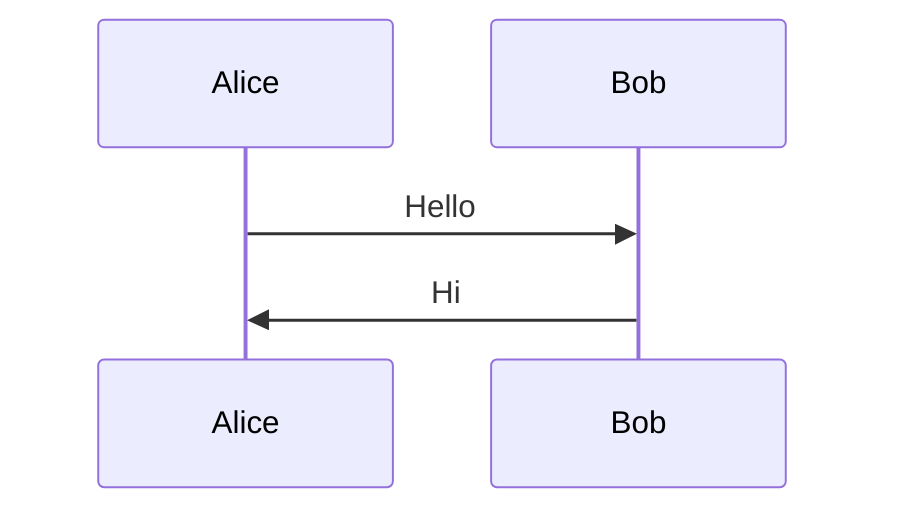
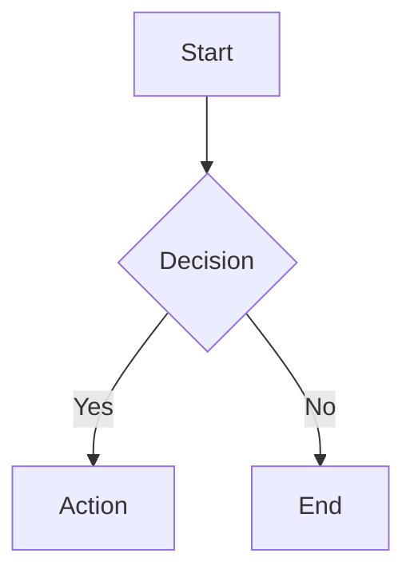
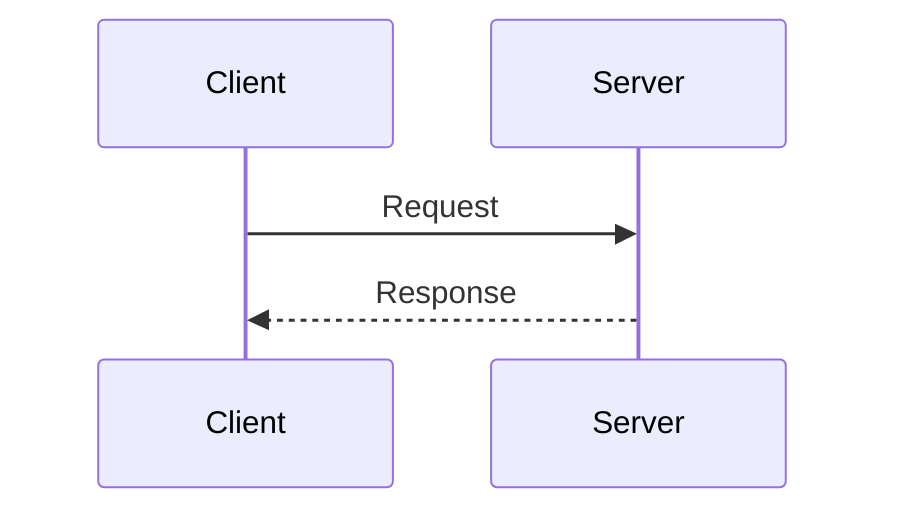
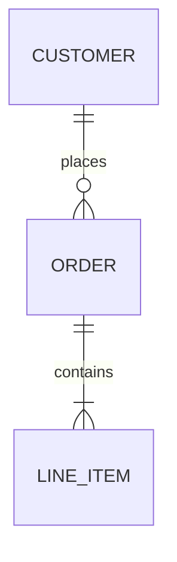

# Mermaid Diagrams Skill

Create valid, well-formed Mermaid.js diagrams with automatic validation and error repair guidance.

## What This Skill Does

- **Creates diagrams**: Flowcharts, sequence diagrams, class diagrams, ER diagrams, state diagrams, Gantt charts, and more
- **Validates syntax**: Uses mermaid-cli to verify diagrams before presenting to users
- **Troubleshoots errors**: Categorizes validation errors and guides repairs
- **Integrates with fixer agent**: Supports bulk validation and automatic repair workflows

## When to Use

Activate this skill when:
- User requests any diagram, chart, or visualization
- Creating flowcharts, sequence diagrams, class diagrams, ER diagrams, state diagrams, Gantt charts
- Validating existing mermaid code blocks
- Debugging diagram syntax errors
- Working with markdown files containing mermaid blocks

**Trigger phrases**: "create a diagram", "draw a flowchart", "visualize this process", "sequence diagram for", "ER diagram", "class diagram", "fix this mermaid", "validate diagram"

## Validation Workflow

**CRITICAL**: Every diagram MUST be validated before being considered complete.

### Step 1: Create the Diagram

1. Consult [reference.md](reference.md) for syntax
2. Choose the appropriate diagram type
3. Follow proper syntax conventions:
   - Start with diagram type declaration
   - Use consistent indentation
   - Quote labels with special characters
   - Use correct arrow types for the diagram

### Step 2: Validate Using Script

```bash
# Validate from stdin (recommended for inline diagrams)
echo 'flowchart TD
    A --> B' | plugins/base/skills/mermaid/scripts/validate_mermaid.sh

# Using heredoc for multi-line
plugins/base/skills/mermaid/scripts/validate_mermaid.sh <<'EOF'
flowchart TD
    A --> B
    B --> C
EOF

# Validate single .mmd file
plugins/base/skills/mermaid/scripts/validate_mermaid.sh /path/to/diagram.mmd

# Validate all diagrams in markdown file
plugins/base/skills/mermaid/scripts/validate_mermaid.sh /path/to/document.md

# Get structured JSON output for programmatic use
echo 'flowchart TD; A-->B' | plugins/base/skills/mermaid/scripts/validate_mermaid.sh --json
```

### Step 3: Handle Validation Results

**Success**:
```
PASS stdin: Valid
```

**Failure** (text mode):
```
FAIL stdin: Invalid
  Category: ARROW_SYNTAX
  Error Line: 2
  Error: Parse error on line 2...
```

**Failure** (JSON mode):
```json
{
  "valid": false,
  "diagram_index": 1,
  "markdown_line": 0,
  "error": {
    "raw": "Parse error on line 2...",
    "line": 2,
    "category": "ARROW_SYNTAX",
    "context": "A -> B"
  }
}
```

### Step 4: Iterative Repair

1. Parse the error category and message
2. Apply targeted fix (see Error Categories below)
3. Re-validate
4. Repeat until valid (max 3 attempts)
5. If unfixable after 3 attempts, report to user

## Error Categories

The validation script automatically categorizes errors for guided repair. See [EXAMPLES.md](EXAMPLES.md) for detailed examples of each category.

| Category | Description | Quick Fix |
|----------|-------------|-----------|
| `ARROW_SYNTAX` | Invalid arrow for diagram type | Replace `->` with `-->` in state/flowchart |
| `QUOTE_ERROR` | Special characters in unquoted labels | Wrap label in double quotes |
| `CARDINALITY` | ER diagram relationship errors | Use valid notation: `\|\|--o{` |
| `LINE_BREAK` | Missing newlines between statements | Each statement on its own line |
| `DIAGRAM_TYPE` | Misspelled or missing diagram type | Correct spelling, add declaration |
| `NODE_SYNTAX` | Unbalanced brackets/braces | Match all opening and closing brackets |

### Fix Strategies Summary

**ARROW_SYNTAX**: Check diagram type and use correct arrows:
- Flowchart: `-->`, `---`, `==>`, `-.->`, `--o`, `--x`
- State diagram: `-->` only (not `->`)
- Sequence diagram: `->>`, `-->>`, `-x`, `--x`, `-)`, `--)`

**QUOTE_ERROR**: Quote labels containing:
- Parentheses: `["Start Process (init)"]`
- Colons: `["Time: 10:30 AM"]`
- Brackets: `["Value [optional]"]`

**CARDINALITY**: Use proper ER notation:
- One-to-many: `||--o{`
- One-to-one: `||--||`
- Zero-or-one: `|o--o|`

**LINE_BREAK**: Separate statements:


**DIAGRAM_TYPE**: Valid types:
`flowchart`, `graph`, `sequenceDiagram`, `classDiagram`, `stateDiagram`, `stateDiagram-v2`, `erDiagram`, `gantt`, `pie`, `journey`, `gitGraph`, `mindmap`, `timeline`, `quadrantChart`, `xychart-beta`, `block-beta`, `sankey-beta`, `kanban`, `radar-beta`

**NODE_SYNTAX**: Balance all brackets:
- Rectangle: `[text]`
- Rounded: `(text)`
- Diamond: `{text}`
- Stadium: `([text])`
- Hexagon: `{{text}}`

## Integration with Fixer Agent

For bulk diagram repair across markdown files, use the mermaid-fixer agent via the `/fix-mermaid` command:

```bash
# Fix all diagrams in a markdown file
/fix-mermaid path/to/document.md

# Fix a single diagram from stdin
/fix-mermaid -
```

The fixer agent:
1. Scans markdown for all mermaid blocks
2. Validates each diagram
3. Attempts automatic repair (up to 3 iterations)
4. Inserts placeholders for unfixable diagrams
5. Reports summary of actions taken

**Placeholder format for unfixable diagrams**:
```html
<!-- MERMAID FIX NEEDED: {diagram_type}
Error: {error_message}
Line: {line_number}
Attempts: 3

Original diagram could not be auto-repaired.
Please fix manually and remove this comment block.
-->
```

## Best Practices

### Creating Diagrams

1. **Reference documentation first**: Check [reference.md](reference.md) for syntax
2. **Start with diagram type**: Every diagram must start with type declaration
3. **Quote special characters**: Always quote labels with spaces, colons, parentheses
4. **Use consistent arrow styles**: Don't mix arrow types within a diagram
5. **Build incrementally**: For complex diagrams, validate after each addition

### Validation

1. **Always validate before presenting**: Never show unvalidated diagrams to users
2. **Use the script, not inline npx**: The script handles edge cases properly
3. **Use JSON mode for programmatic repair**: `--json` flag for structured output
4. **Check error category first**: Guides targeted fixes

### Troubleshooting

1. **Start minimal**: If complex diagram fails, reduce to minimal example
2. **Validate incrementally**: Add complexity one step at a time
3. **Reference EXAMPLES.md**: Find similar error patterns
4. **Check diagram type requirements**: Different types have different syntax

## Output Format

When presenting diagrams to users:

```markdown
## Diagram Title

Brief description of what the diagram represents.

\`\`\`mermaid
flowchart TD
    A[Start] --> B[Process]
    B --> C[End]
\`\`\`

**Validation Status**: Validated successfully
```

## Supported Diagram Types

| Type | Use Case | Declaration |
|------|----------|-------------|
| Flowchart | Process flows, decision trees | `flowchart TD/LR/RL/BT` |
| Sequence | API interactions, message flows | `sequenceDiagram` |
| Class | Object relationships, architecture | `classDiagram` |
| ER | Database schemas, data models | `erDiagram` |
| State | State machines, workflow states | `stateDiagram-v2` |
| Gantt | Project timelines, schedules | `gantt` |
| Git Graph | Branch strategies, commit history | `gitGraph` |
| Pie | Proportional data | `pie` |
| Journey | User experience flows | `journey` |
| Mindmap | Hierarchical concepts | `mindmap` |
| Timeline | Chronological events | `timeline` |
| Quadrant | 2D categorization | `quadrantChart` |
| XY Chart | Bar/line charts | `xychart-beta` |
| Block | Grid layouts | `block-beta` |
| Sankey | Flow quantities | `sankey-beta` |
| Kanban | Task boards | `kanban` |
| Radar | Multi-axis comparison | `radar-beta` |

## Quick Reference

### Validation Commands

```bash
# Text output (default)
echo 'diagram' | plugins/base/skills/mermaid/scripts/validate_mermaid.sh

# JSON output
echo 'diagram' | plugins/base/skills/mermaid/scripts/validate_mermaid.sh --json

# Markdown file
plugins/base/skills/mermaid/scripts/validate_mermaid.sh document.md
```

### Common Patterns

**Simple flowchart**:


**Sequence diagram**:


**ER diagram**:


## Resources

- **Syntax Reference**: [reference.md](reference.md) - Complete syntax for all diagram types
- **Error Examples**: [EXAMPLES.md](EXAMPLES.md) - Error patterns with fixes
- **Script Documentation**: [scripts/README.md](scripts/README.md) - Validation script details
- **Official Docs**: https://mermaid.js.org/
- **Live Editor**: https://mermaid.live/

## Success Criteria

A diagram is complete when:
1. Syntax is correct for the diagram type
2. Validation passes with validate_mermaid.sh script
3. Diagram accurately represents the requested information
4. Labels are clear and properly quoted
5. Comments document complex sections (if needed)
