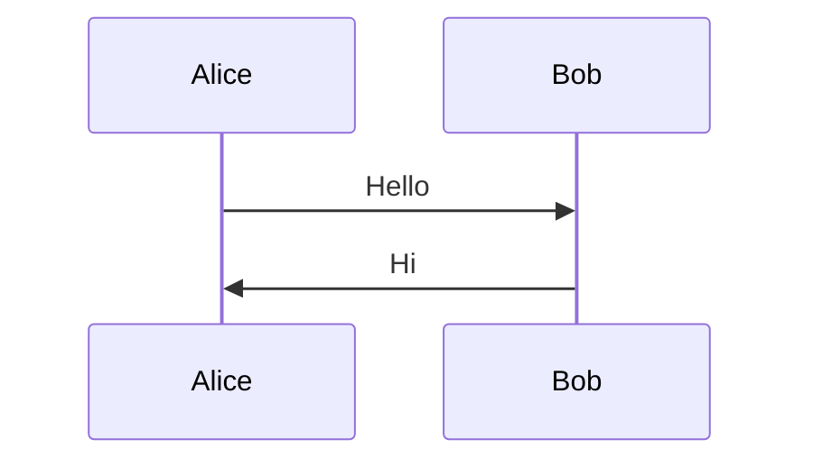
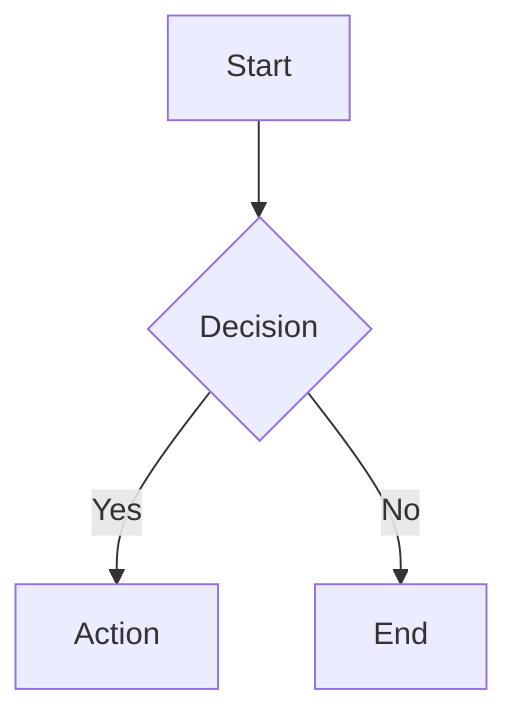
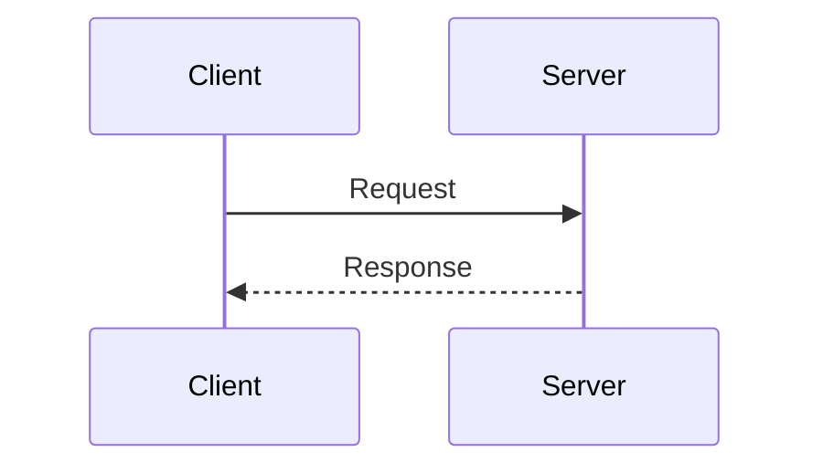
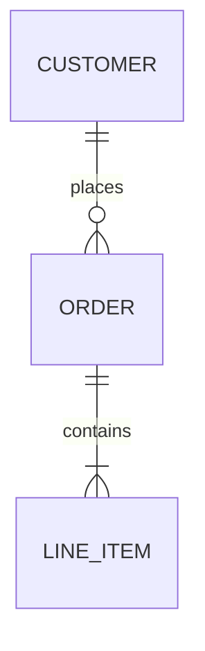

# Mermaid Diagrams Skill

Create valid, well-formed Mermaid.js diagrams with automatic validation and error repair guidance.

> **Requirement**: rp1 CLI v0.3.0 or later (includes `agent-tools mmd-validate` command)

## What This Skill Does

- **Creates diagrams**: Flowcharts, sequence diagrams, class diagrams, ER diagrams, state diagrams, Gantt charts, and more
- **Validates syntax**: Uses `rp1 agent-tools mmd-validate` CLI tool for verification
- **Troubleshoots errors**: Categorizes validation errors and guides repairs
- **Integrates with fixer agent**: Supports bulk validation and automatic repair workflows

## When to Use

Activate this skill when:
- User requests any diagram, chart, or visualization
- Creating flowcharts, sequence diagrams, class diagrams, ER diagrams, state diagrams, Gantt charts
- Validating existing mermaid code blocks
- Debugging diagram syntax errors
- Working with markdown files containing mermaid blocks

**Trigger phrases**: "create a diagram", "draw a flowchart", "visualize this process", "sequence diagram for", "ER diagram", "class diagram", "fix this mermaid", "validate diagram"

## Validation Workflow

**CRITICAL**: Every diagram MUST be validated before being considered complete.

### Step 1: Create the Diagram

1. Consult [reference.md](reference.md) for syntax
2. Choose the appropriate diagram type
3. Follow proper syntax conventions:
   - Start with diagram type declaration
   - Use consistent indentation
   - Quote labels with special characters
   - Use correct arrow types for the diagram

### Step 2: Validate Using CLI Tool

```bash
# Validate markdown file (all embedded diagrams)
rp1 agent-tools mmd-validate path/to/document.md

# Validate standalone mermaid file
rp1 agent-tools mmd-validate path/to/diagram.mmd

# Validate from stdin (for inline diagrams)
echo 'flowchart TD
    A --> B' | rp1 agent-tools mmd-validate
```

### Step 3: Handle Validation Results

The CLI tool outputs structured JSON in a `ToolResult` envelope:

**Success** (all diagrams valid):
```json
{
  "success": true,
  "tool": "mmd-validate",
  "data": {
    "diagrams": [
      { "index": 0, "valid": true, "diagramType": "flowchart", "startLine": 5 }
    ],
    "summary": { "total": 1, "valid": 1, "invalid": 0 }
  }
}
```

**Failure** (contains invalid diagrams):
```json
{
  "success": false,
  "tool": "mmd-validate",
  "data": {
    "diagrams": [
      {
        "index": 0,
        "valid": false,
        "diagramType": "stateDiagram-v2",
        "startLine": 10,
        "errors": [{
          "diagramIndex": 0,
          "message": "Parse error on line 2: Expecting '-->', got 'MINUS'",
          "line": 2,
          "context": "[*] -> State1"
        }]
      }
    ],
    "summary": { "total": 1, "valid": 0, "invalid": 1 }
  },
  "errors": [{
    "message": "Parse error on line 2: Expecting '-->', got 'MINUS'",
    "line": 2,
    "context": "[*] -> State1"
  }]
}
```

**Parsing the Response**:
- `success: true` AND `data.summary.invalid == 0` -> All diagrams valid
- `success: false` -> Extract errors from `data.diagrams[].errors[]`
- For each error:
  - `diagramIndex`: Which diagram has the error (0-based)
  - `message`: Full error message for category detection
  - `line`: Line within the diagram (for targeted fix)
  - `context`: Problematic code snippet

### Step 4: Iterative Repair

1. Parse the error message to detect category (see Error Categories below)
2. Apply targeted fix based on category
3. Re-validate using the CLI tool
4. Repeat until valid (max 3 attempts)
5. If unfixable after 3 attempts, report to user

## Error Categories

Detect error categories by pattern matching the `message` field in validation errors. See [EXAMPLES.md](EXAMPLES.md) for detailed examples of each category.

| Category | Detection Patterns | Quick Fix |
|----------|-------------------|-----------|
| `ARROW_SYNTAX` | `got 'MINUS'`, `got 'GT'`, `expecting.*LINK` | Replace `->` with `-->` in state/flowchart |
| `QUOTE_ERROR` | `unterminated string`, `got 'STR'`, `lexical error.*string` | Wrap label in double quotes |
| `CARDINALITY` | `cardinality`, `relationship`, `erDiagram` | Use valid notation: `\|\|--o{` |
| `LINE_BREAK` | `expecting.*(NEWLINE\|NL\|EOF)` | Each statement on its own line |
| `DIAGRAM_TYPE` | `unknown diagram type`, `UnknownDiagramError` | Correct spelling, add declaration |
| `NODE_SYNTAX` | `got 'PS'`, `got 'PE'`, `got 'SQS'`, `got 'SQE'`, `unclosed` | Match all opening and closing brackets |

### Error Category Detection

Parse the `message` field from validation errors to detect category:

```
ARROW_SYNTAX:  message contains "got 'MINUS'" or "got 'GT'" or "expecting.*LINK"
QUOTE_ERROR:   message contains "unterminated string" or "got 'STR'" or "lexical error.*string"
CARDINALITY:   message contains "cardinality" or "relationship"
LINE_BREAK:    message contains "expecting.*NEWLINE" or "expecting.*NL" or "expecting.*EOF"
DIAGRAM_TYPE:  message contains "unknown diagram type" or "UnknownDiagramError"
NODE_SYNTAX:   message contains "got 'PS'" or "got 'SQS'" or "unclosed"
UNKNOWN:       default (no pattern matched)
```

### Fix Strategies Summary

**ARROW_SYNTAX**: Check diagram type and use correct arrows:
- Flowchart: `-->`, `---`, `==>`, `-.->`, `--o`, `--x`
- State diagram: `-->` only (not `->`)
- Sequence diagram: `->>`, `-->>`, `-x`, `--x`, `-)`, `--)`

**QUOTE_ERROR**: Quote labels containing:
- Parentheses: `["Start Process (init)"]`
- Colons: `["Time: 10:30 AM"]`
- Brackets: `["Value [optional]"]`

**CARDINALITY**: Use proper ER notation:
- One-to-many: `||--o{`
- One-to-one: `||--||`
- Zero-or-one: `|o--o|`

**LINE_BREAK**: Separate statements:


**DIAGRAM_TYPE**: Valid types:
`flowchart`, `graph`, `sequenceDiagram`, `classDiagram`, `stateDiagram`, `stateDiagram-v2`, `erDiagram`, `gantt`, `pie`, `journey`, `gitGraph`, `mindmap`, `timeline`, `quadrantChart`, `xychart-beta`, `block-beta`, `sankey-beta`, `kanban`, `radar-beta`

**NODE_SYNTAX**: Balance all brackets:
- Rectangle: `[text]`
- Rounded: `(text)`
- Diamond: `{text}`
- Stadium: `([text])`
- Hexagon: `{{text}}`

## Integration with Fixer Agent

For bulk diagram repair across markdown files, use the mermaid-fixer agent via the `/fix-mermaid` command:

```bash
# Fix all diagrams in a markdown file
/fix-mermaid path/to/document.md

# Fix a single diagram from stdin
/fix-mermaid -
```

The fixer agent:
1. Runs `rp1 agent-tools mmd-validate` on the file
2. Parses JSON response to build task list of invalid diagrams
3. For each invalid diagram:
   - Extracts error from `data.diagrams[].errors[]`
   - Detects category from error message
   - Applies targeted fix
4. Re-validates after fixes (up to 3 iterations)
5. Inserts placeholders for unfixable diagrams
6. Reports summary of actions taken

**JSON Response Parsing for Fixer**:
```
1. Run: rp1 agent-tools mmd-validate /path/to/file.md
2. Parse JSON output
3. If success == true AND data.summary.invalid == 0:
   -> All diagrams valid, done
4. If success == false:
   -> For each diagram in data.diagrams where valid == false:
      -> Extract errors[].message, errors[].line, errors[].context
      -> Detect error category from message patterns
      -> Apply category-specific fix
5. Re-validate and repeat (max 3 iterations)
```

**Placeholder format for unfixable diagrams**:
```html
<!-- MERMAID FIX NEEDED: {diagram_type}
Error: {error_message}
Line: {line_number}
Attempts: 3

Original diagram could not be auto-repaired.
Please fix manually and remove this comment block.
-->
```

## Best Practices

### Creating Diagrams

1. **Reference documentation first**: Check [reference.md](reference.md) for syntax
2. **Start with diagram type**: Every diagram must start with type declaration
3. **Quote special characters**: Always quote labels with spaces, colons, parentheses
4. **Use consistent arrow styles**: Don't mix arrow types within a diagram
5. **Build incrementally**: For complex diagrams, validate after each addition

### Validation

1. **Always validate before presenting**: Never show unvalidated diagrams to users
2. **Use the CLI tool**: `rp1 agent-tools mmd-validate` provides structured JSON output
3. **Parse JSON for programmatic repair**: Extract errors from `data.diagrams[].errors[]`
4. **Check error category first**: Guides targeted fixes

### Troubleshooting

1. **Start minimal**: If complex diagram fails, reduce to minimal example
2. **Validate incrementally**: Add complexity one step at a time
3. **Reference EXAMPLES.md**: Find similar error patterns
4. **Check diagram type requirements**: Different types have different syntax

**Tool Not Available?**

If `rp1 agent-tools mmd-validate` returns "command not found":

```
Mermaid validation requires rp1 v0.3.0 or later.

Please update rp1 using your package manager:
  macOS:   brew upgrade rp1
  Windows: scoop update rp1

Or visit https://rp1.run for installation instructions.
```

## Output Format

When presenting diagrams to users:

```markdown
## Diagram Title

Brief description of what the diagram represents.

\`\`\`mermaid
flowchart TD
    A[Start] --> B[Process]
    B --> C[End]
\`\`\`

**Validation Status**: Validated successfully
```

## Supported Diagram Types

| Type | Use Case | Declaration |
|------|----------|-------------|
| Flowchart | Process flows, decision trees | `flowchart TD/LR/RL/BT` |
| Sequence | API interactions, message flows | `sequenceDiagram` |
| Class | Object relationships, architecture | `classDiagram` |
| ER | Database schemas, data models | `erDiagram` |
| State | State machines, workflow states | `stateDiagram-v2` |
| Gantt | Project timelines, schedules | `gantt` |
| Git Graph | Branch strategies, commit history | `gitGraph` |
| Pie | Proportional data | `pie` |
| Journey | User experience flows | `journey` |
| Mindmap | Hierarchical concepts | `mindmap` |
| Timeline | Chronological events | `timeline` |
| Quadrant | 2D categorization | `quadrantChart` |
| XY Chart | Bar/line charts | `xychart-beta` |
| Block | Grid layouts | `block-beta` |
| Sankey | Flow quantities | `sankey-beta` |
| Kanban | Task boards | `kanban` |
| Radar | Multi-axis comparison | `radar-beta` |

## Quick Reference

### Validation Commands

```bash
# Validate markdown file (all embedded diagrams)
rp1 agent-tools mmd-validate document.md

# Validate standalone mermaid file
rp1 agent-tools mmd-validate diagram.mmd

# Validate from stdin
echo 'flowchart TD; A-->B' | rp1 agent-tools mmd-validate
```

### Common Patterns

**Simple flowchart**:


**Sequence diagram**:


**ER diagram**:


## Resources

- **Syntax Reference**: [reference.md](reference.md) - Complete syntax for all diagram types
- **Error Examples**: [EXAMPLES.md](EXAMPLES.md) - Error patterns with fixes
- **Official Docs**: https://mermaid.js.org/
- **Live Editor**: https://mermaid.live/

## Success Criteria

A diagram is complete when:
1. Syntax is correct for the diagram type
2. Validation passes with `rp1 agent-tools mmd-validate`
3. Diagram accurately represents the requested information
4. Labels are clear and properly quoted
5. Comments document complex sections (if needed)
