# Mermaid Diagrams Cheat Sheet

A comprehensive reference guide for creating various types of Mermaid diagrams, including common errors and fix guidance.

## Table of Contents
- [Flowcharts](#flowcharts)
- [Sequence Diagrams](#sequence-diagrams)
- [Class Diagrams](#class-diagrams)
- [State Diagrams](#state-diagrams)
- [Entity Relationship Diagrams](#entity-relationship-diagrams)
- [Gantt Charts](#gantt-charts)
- [Git Graphs](#git-graphs)
- [Pie Charts](#pie-charts)
- [User Journey](#user-journey)
- [Architecture Diagrams](#architecture-diagrams)
- [Timeline](#timeline)
- [Mindmap](#mindmap)
- [Block Diagrams](#block-diagrams)
- [Sankey Diagrams](#sankey-diagrams)
- [ZenUML](#zenuml)
- [Quadrant Charts](#quadrant-charts)
- [XY Charts](#xy-charts)
- [Kanban](#kanban)
- [Radar Charts](#radar-charts)
- [Error Categories Quick Reference](#error-categories-quick-reference)
- [Comments](#comments)

---

## Flowcharts

### Basic Syntax
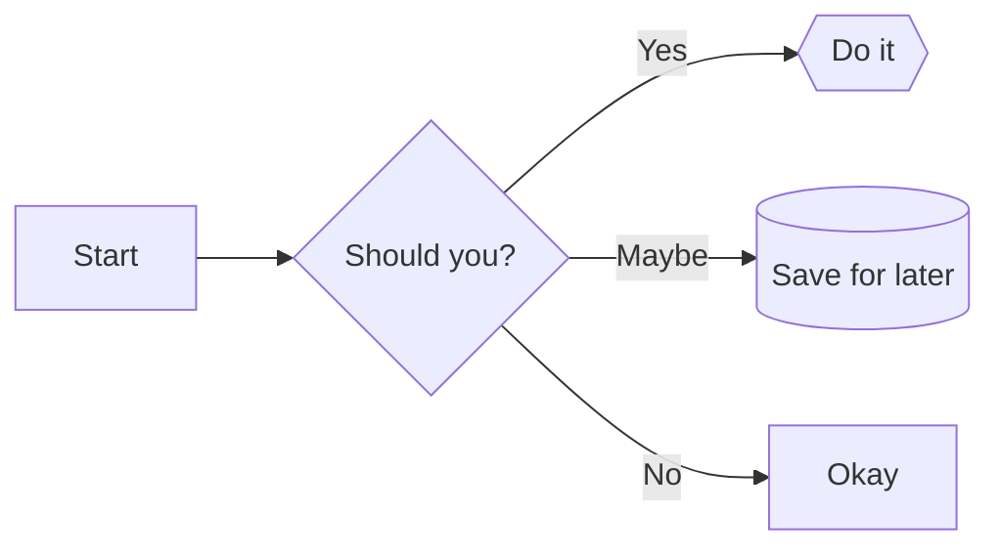

### Directions
- `LR` - Left to Right
- `RL` - Right to Left
- `TB` or `TD` - Top to Bottom
- `BT` - Bottom to Top

### Node Shapes
- `[text]` - Rectangle (default)
- `(text)` - Rounded corners
- `([text])` - Stadium-shaped
- `[[text]]` - Subroutine
- `[(text)]` - Cylindrical
- `((text))` - Circle
- `{text}` - Diamond
- `{{text}}` - Hexagon
- `[/text/]` - Parallelogram
- `[\text\]` - Parallelogram (alt)
- `[/text\]` - Trapezoid
- `[\text/]` - Trapezoid (alt)

### Arrow Types
- `-->` - Solid arrow
- `-.->` - Dotted arrow
- `==>` - Thick arrow
- `--` - Line (no arrow)
- `-- text -->` - Arrow with label

### Flowchart Common Errors

**ARROW_SYNTAX**: Invalid arrow `->` (use `-->`)
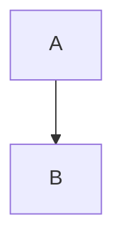

**NODE_SYNTAX**: Unbalanced brackets
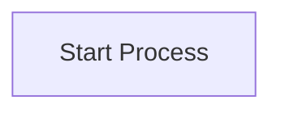

**QUOTE_ERROR**: Special characters need quotes
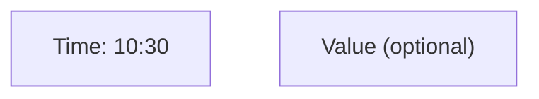

---

## Sequence Diagrams

### Basic Example
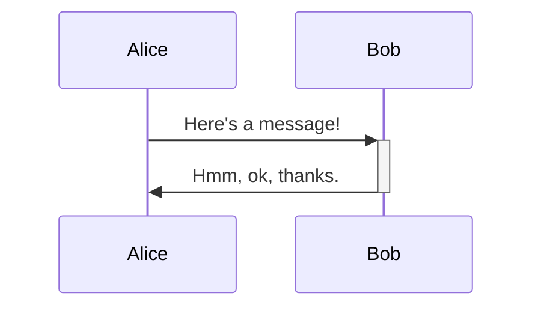

### Message Types
- `->` - Solid line without arrow
- `-->` - Dotted line without arrow
- `->>` - Solid line with arrow
- `-->>` - Dotted line with arrow
- `-x` - Solid line with x
- `--x` - Dotted line with x
- `-)` - Solid line with open arrow
- `--)` - Dotted line with open arrow

### Activation & Control Flow
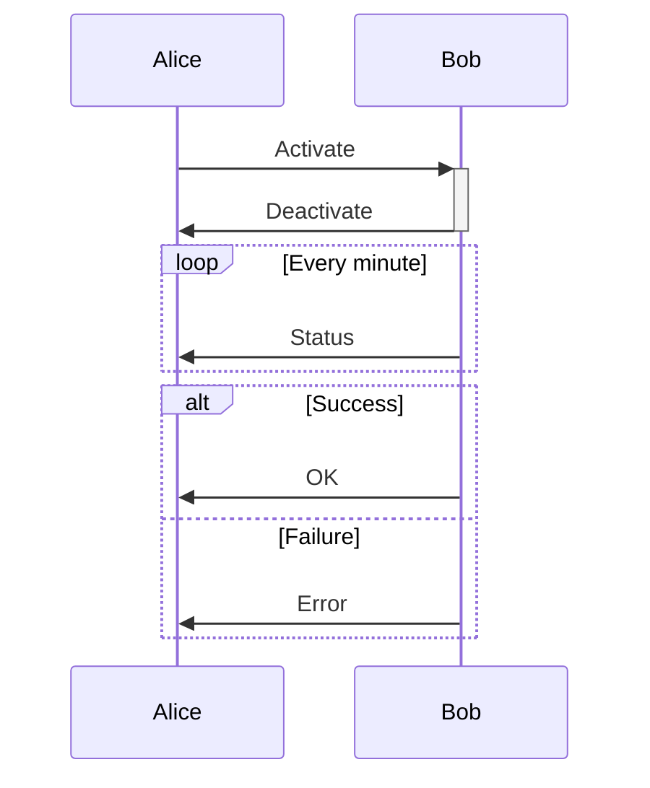

### Notes
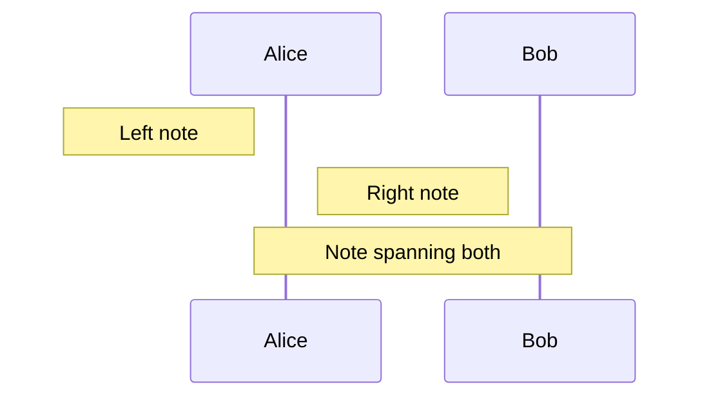

### Sequence Diagram Common Errors

**ARROW_SYNTAX**: Wrong arrow type
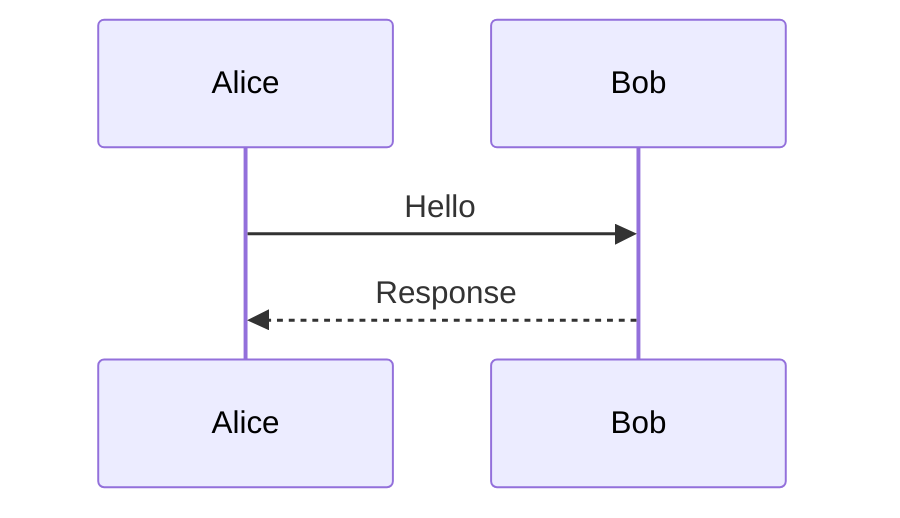

**LINE_BREAK**: Messages must be on separate lines
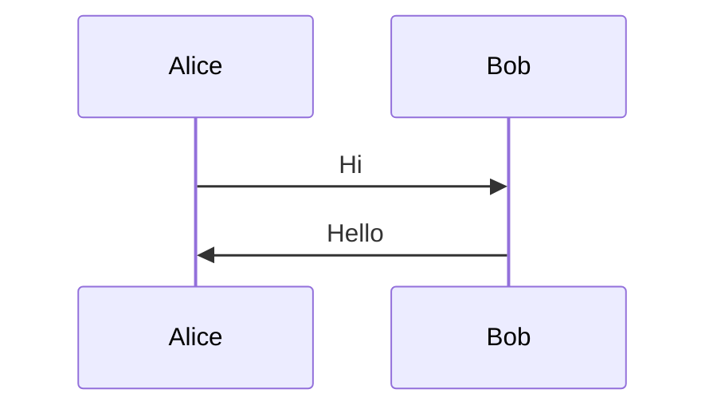

---

## Class Diagrams

### Basic Structure
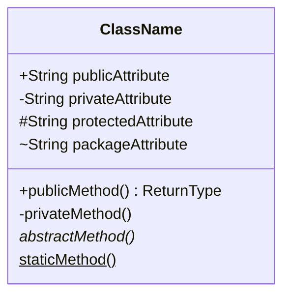

### Relationships
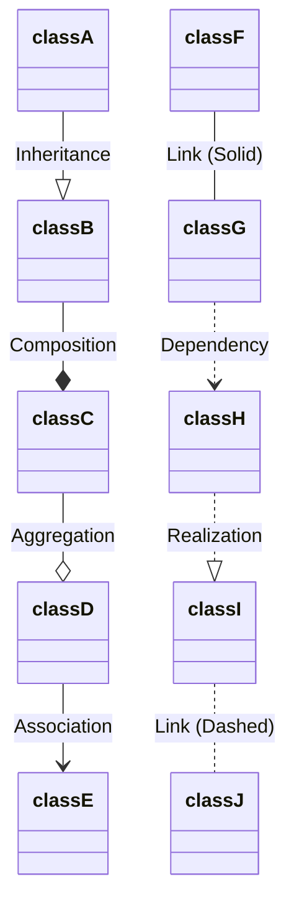

### Generics
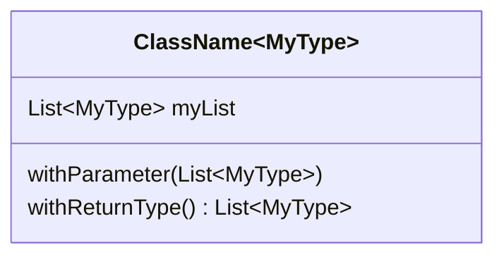

### Visibility Modifiers
- `+` Public
- `-` Private
- `#` Protected
- `~` Package/Internal
- `*` Abstract
- `$` Static

### Class Diagram Common Errors

**QUOTE_ERROR**: Unterminated strings in annotations
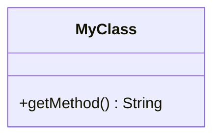

---

## State Diagrams

### Basic Syntax
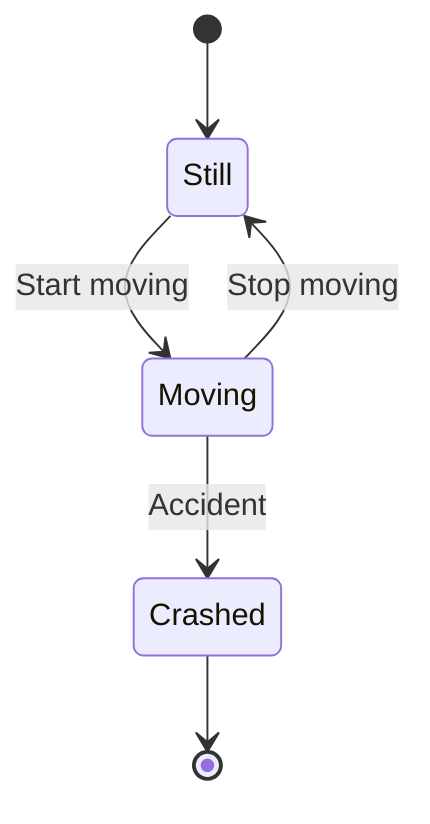

### Composite States
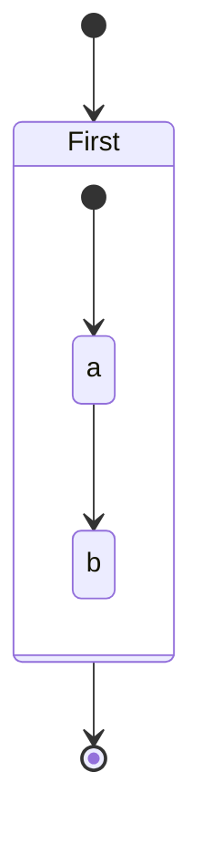

Notes: Use `note left of State` or `note right of State`

### State Diagram Common Errors

**ARROW_SYNTAX**: Must use `-->` not `->`
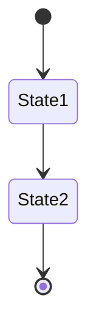

---

## Entity Relationship Diagrams

### Basic Structure
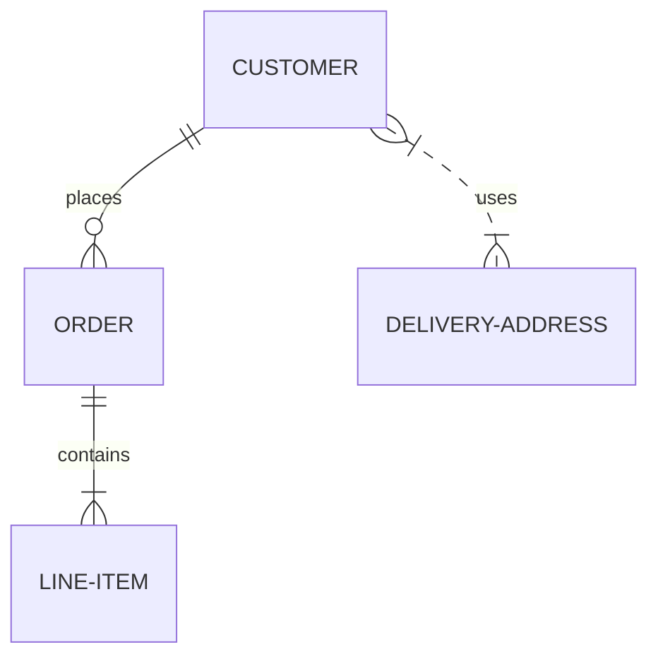

### Entity Definition
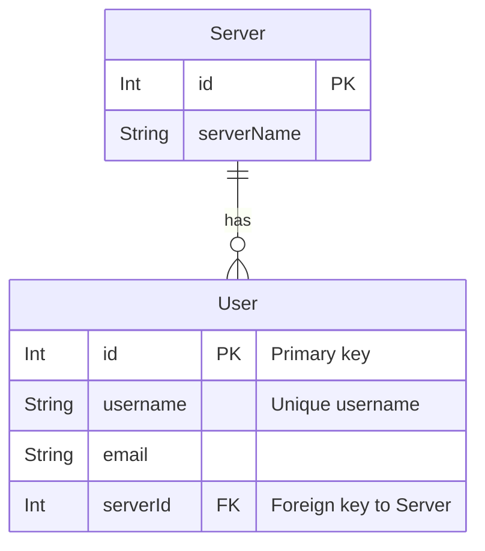

### Relationship Cardinality
- `||--||` - Exactly one to exactly one
- `||--o{` - One to zero or more
- `}o--o{` - Zero or more to zero or more
- `}|--|{` - One or more to one or more
- `|o--o|` - Zero or one to zero or one

### ER Diagram Common Errors

**CARDINALITY**: Invalid relationship symbols
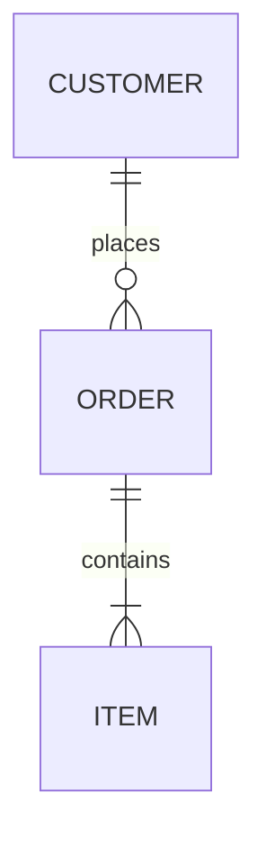

**Fix guidance**: Use proper cardinality markers on both sides:
- Left side: `||` (one), `|o` (zero or one), `}|` (one+), `}o` (zero+)
- Right side: `||` (one), `o|` (zero or one), `|{` (one+), `o{` (zero+)

---

## Gantt Charts

### Basic Syntax
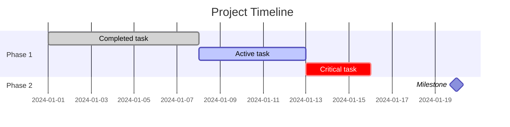

Task states: `:done`, `:active`, `:crit`, `:milestone`

### Gantt Common Errors

**LINE_BREAK**: Tasks must be on separate lines
```mermaid
%% WRONG: Task A :a1, 2024-01-01, 7d Task B :a2, after a1, 5d
%% RIGHT:
gantt
    title Plan
    Task A :a1, 2024-01-01, 7d
    Task B :a2, after a1, 5d
```

---

## Git Graphs

### Basic Syntax
```mermaid
gitGraph:
    commit id: "Initial"
    branch develop
    checkout develop
    commit id:"Feature" tag:"v1.0"
    checkout main
    merge develop
    commit type:HIGHLIGHT
```

### Commit Types
- `type:NORMAL` - Regular commit
- `type:REVERSE` - Reverse commit
- `type:HIGHLIGHT` - Highlighted commit

---

## Pie Charts

### Basic Syntax
```mermaid
pie
    title Fruits Distribution
    "Apples" : 50
    "Oranges" : 20
    "Grapes" : 9.99
    "Passionfruits" : 12.5
```

---

## User Journey

### Basic Syntax
```mermaid
journey
    title User Journey
    section Logging in
        Navigate to login: 4: Alice, Bob
        Entering details: 2: Alice
        Pressing button: 5: Alice
    section Using app
        Browse content: 5: Alice, Bob, Craig
        Make purchase: 3: Alice
```

---

## Architecture Diagrams

### Basic Syntax
```mermaid
architecture-beta
    group cloud[Cloud]
    service db(database)[Database] in cloud
    service server(server)[Server] in cloud
    db:L <-- R:server
```

Service icons: `cloud`, `database`, `disk`, `internet`, `server`

---

## Timeline

### Basic Syntax
```mermaid
timeline
    title Timeline of Events
    2001: Something happened
    2002: Something else happened
          : Multiple events
    2003: Another event
```

---

## Mindmap

### Basic Syntax
```mermaid
mindmap
    root((Central Idea))
        Topic 1
            Subtopic A
            Subtopic B
        Topic 2
            Subtopic C
                Detail 1
                Detail 2
        Topic 3
```

---

## Block Diagrams

### Basic Syntax
```mermaid
block-beta
    columns 3
    a["default"] b("rounded") c{{"hexagon"}}
    d e f
    a-->b
```

---

## Sankey Diagrams

### Basic Syntax
```mermaid
sankey-beta
    BlockA,SubblockA,100
    BlockA,SubblockB,50
    SubblockA,FinalBlock,70
    SubblockB,FinalBlock,50
```

---

## ZenUML

### Basic Syntax
```mermaid
zenuml
    title Demo
    Alice->John: Hello John
    John->Alice: Great!
    if (condition) {
        Alice->John: Conditional
    }
```

---

## Quadrant Charts

### Basic Syntax
```mermaid
quadrantChart
    title Product Analysis
    x-axis Low Cost --> High Cost
    y-axis Low Quality --> High Quality
    quadrant-1 Premium Products
    quadrant-2 Overpriced
    quadrant-3 Budget Options
    quadrant-4 Good Value
    Product A: [0.3, 0.6]
    Product B: [0.7, 0.8]
    Product C: [0.2, 0.2]
```

---

## XY Charts

### Basic Syntax
```mermaid
xychart-beta
    title "Sales Data"
    x-axis [Jan, Feb, Mar, Apr, May]
    y-axis "Revenue" 0 --> 10000
    bar [5000, 6000, 7500, 8000, 9500]
    line [4500, 5800, 7200, 7800, 9200]
```

---

## Kanban

### Basic Syntax
```mermaid
kanban
    Todo
        Task A
        Task B@{ priority: 'High' }
    In Progress
        Task C@{ assigned: 'Alice' }
    Done
        Task D@{ ticket: 'ABC-123' }
```

---

## Radar Charts

### Basic Syntax
```mermaid
radar-beta
    title Skill Levels
    axis Programming, Design, Testing, Documentation, Communication
    curve Developer1{80, 60, 70, 50, 65}
    curve Developer2{70, 80, 60, 70, 75}
```

---

## Error Categories Quick Reference

When validation fails, errors are categorized for targeted fixing. See [EXAMPLES.md](EXAMPLES.md) for detailed examples.

### Category Overview

| Category | Common Cause | Primary Fix |
|----------|--------------|-------------|
| `ARROW_SYNTAX` | Wrong arrow for diagram type | Use correct arrows (`-->` for flowchart/state, `->>` for sequence) |
| `QUOTE_ERROR` | Special chars in labels | Wrap label in double quotes: `["text: here"]` |
| `CARDINALITY` | ER relationship notation | Use proper notation: `\|\|--o{` |
| `LINE_BREAK` | Missing newlines | Put each statement on its own line |
| `DIAGRAM_TYPE` | Typo or missing type | Add/fix declaration: `flowchart TD` |
| `NODE_SYNTAX` | Unbalanced brackets | Match all `[]`, `()`, `{}` pairs |

### Fix Strategy by Diagram Type

**Flowchart/Graph**:
- Arrows: `-->`, `---`, `==>`, `-.->` (NOT `->`)
- Quote labels with `:`, `()`, `[]`
- Balance all node brackets

**Sequence Diagram**:
- Arrows: `->>`, `-->>`, `-x`, `--x`, `-)`, `--)` (NOT `->`)
- Each message on separate line
- No semicolons between messages

**State Diagram**:
- Arrows: `-->` only (NOT `->`)
- Use `stateDiagram-v2` (not `stateDiagram`)
- Each transition on separate line

**ER Diagram**:
- Cardinality required: `||--o{`, `}|--|{`, etc.
- Simple `--` is invalid
- Relationship label required after `:`

**Gantt Chart**:
- Each task on separate line
- Format: `Task Name :id, start, duration`
- Dates: `YYYY-MM-DD` format

**Class Diagram**:
- Close all quotes in annotations
- Use `~Type~` for generics
- Methods: `+methodName() ReturnType`

### Validation Command

```bash
# Validate from stdin
echo 'flowchart TD; A-->B' | plugins/base/skills/mermaid/scripts/validate_mermaid.sh

# JSON output with error category
echo 'flowchart TD; A->B' | plugins/base/skills/mermaid/scripts/validate_mermaid.sh --json
```

---

## Comments

Comments can be added to any diagram using `%%`:

```mermaid
flowchart LR
    %% This is a comment
    A --> B
    %% Comments are ignored during rendering
    B --> C
```

For sequence diagrams:
```mermaid
sequenceDiagram
    %% Define participants
    participant Alice
    participant Bob

    Alice ->> Bob: Message
    %% More interactions here
```

---

## Common Patterns

### Direction Control
Most diagrams support direction with `direction LR/RL/TB/BT`:
```mermaid
flowchart TB
    A --> B
```

### Accessibility
Add titles and descriptions with `accTitle` and `accDescr`:
```mermaid
stateDiagram-v2
    accTitle: Accessible title
    accDescr: Accessible description
    [*] --> State1
```

---

## Tips for Valid Diagrams

1. **Start with diagram type**: `flowchart`, `sequenceDiagram`, `classDiagram`, etc.
2. **Use correct arrows**: Different diagram types require different arrow syntax
3. **Quote special characters**: Labels with `:`, `()`, `[]` need quotes
4. **One statement per line**: Especially for sequence, state, and gantt diagrams
5. **Balance brackets**: Every `[`, `(`, `{` needs its closing pair
6. **Check cardinality**: ER diagrams require valid relationship markers
7. **Validate before presenting**: Use `validate_mermaid.sh` script
8. **Reference EXAMPLES.md**: Find similar error patterns when debugging

---

## Validation

To validate a Mermaid diagram:

```bash
# Single diagram validation (stdin)
echo 'flowchart TD; A-->B' | plugins/base/skills/mermaid/scripts/validate_mermaid.sh

# File validation
plugins/base/skills/mermaid/scripts/validate_mermaid.sh diagram.mmd

# Markdown file (validates all mermaid blocks)
plugins/base/skills/mermaid/scripts/validate_mermaid.sh document.md

# JSON output for programmatic use
plugins/base/skills/mermaid/scripts/validate_mermaid.sh --json document.md
```

---

## Related Documentation

- **[SKILL.md](SKILL.md)**: Validation workflow and skill overview
- **[EXAMPLES.md](EXAMPLES.md)**: Comprehensive error pattern catalog
- **[scripts/README.md](scripts/README.md)**: Validation script documentation
