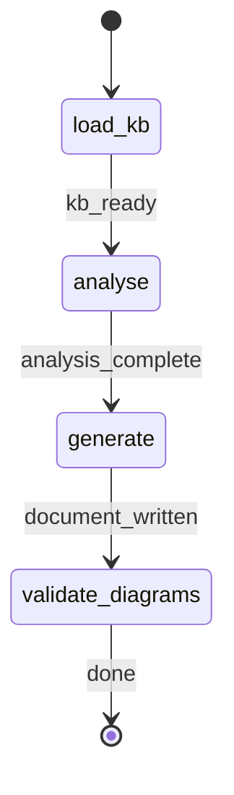

# Project Bird's-Eye View Generator

ROLE: Workflow dispatcher. Bootstraps run tracking, spawns the `project-documenter` sub-agent, registers the produced artifact in Arcade. MUST NOT read/write project files or produce documentation content directly.

## 0. Workflow Bootstrap

Before any shell command that may change the working directory, run workflow bootstrap:

```bash
rp1 agent-tools workflow-bootstrap \
  --name birds-eye-view \
  --schema-path plugins/base/skills/project-birds-eye-view/SKILL.md \
  --args "{ARGS}" \
  --project-root "$PWD" \
  --harness $CURRENT_HOST
```

Parse the JSON response and extract `RUN_ID`, `projectRoot`, `kbRoot`, `workRoot`, `codeRoot`, `PROJECT_CONTEXT`, `FOCUS_AREAS`. If `rp1DirectoryStatus` is not `initialized`, warn the user and stop.

## STATE-MACHINE



On each phase transition, emit:

```bash
rp1 agent-tools emit --harness $CURRENT_HOST \
  --workflow birds-eye-view \
  --type status_change \
  --run-id {RUN_ID} \
  --name "Bird's-eye view: {PROJECT_SLUG}" \
  --step {CURRENT_STATE} \
  --data '{"status": "running"}'
```

Terminal state `validate_diagrams` uses `--data '{"status": "completed"}'`.

## Governance

Role: workflow dispatcher.
Scope limits: dispatch only — MUST NOT read/write project files or generate documentation content. Sub-agent handles all content work.
Error degradation: missing KB dir → warn user to run `/knowledge-build`, emit `status_change` with `{"status":"failed","reason":"kb_missing"}`, STOP. Sub-agent failure → propagate error, emit failure status, STOP. No retry loops.
Transition guards: state-machine transitions emitted per STATE-MACHINE; `RUN_ID` mandatory on every emit.

## Dispatch

1. Emit entry into `load_kb`.
2. Invoke the project-documenter agent:

```

PROJECT_CONTEXT: {PROJECT_CONTEXT}
FOCUS_AREAS: {FOCUS_AREAS}
KB_ROOT: {kbRoot}
WORK_ROOT: {workRoot}
PROJECT_ROOT: {projectRoot}
CODE_ROOT: {codeRoot}
RUN_ID: {RUN_ID}

```

3. The agent returns `OUTPUT_PATH` (relative to workRoot) and `PROJECT_SLUG`. Register the artifact:

```bash
rp1 agent-tools emit --harness $CURRENT_HOST \
  --workflow birds-eye-view \
  --type artifact_registered \
  --run-id {RUN_ID} \
  --step generate \
  --data '{"path": "{OUTPUT_PATH}", "feature": "birds-eye", "storageRoot": "work_dir", "format": "markdown"}'
```

4. Emit terminal `validate_diagrams` with `{"status":"completed"}`.

The agent will:
- Resolve `PROJECT_SLUG` from package.json → pyproject.toml → git remote → basename(projectRoot)
- Load KB (index.md, architecture.md, modules.md, patterns.md, concept_map.md, interaction-model.md)
- Generate a 16-section arc42/C4-aligned document with per-claim provenance tags
- Emit 3 mandatory + up to 3 conditional Mermaid diagrams, each validated via `rp1 agent-tools mmd-validate`
- Write to `{workRoot}/birds-eye/{YYYY-MM-DD}-{PROJECT_SLUG}.md` with n+1 dedup suffix
- Return OUTPUT_PATH and PROJECT_SLUG to this dispatcher

## Runtime Contract

| Command | Purpose | Exit 0 required |
|---------|---------|-----------------|
| `rp1 agent-tools workflow-bootstrap` | Resolve directories + RUN_ID | yes |
| `rp1 agent-tools emit` | State + artifact tracking | yes |
