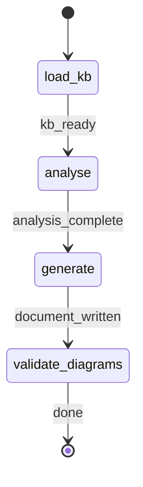

# Project Bird's-Eye View Generator

ROLE: Workflow dispatcher. Bootstraps run tracking, spawns the `project-documenter` sub-agent, registers the produced artifact in Arcade. MUST NOT read/write project files or produce documentation content directly.

## STATE-MACHINE



On each phase transition, emit:

```bash
rp1 agent-tools emit --harness $CURRENT_HOST \
  --workflow project-birds-eye-view \
  --type status_change \
  --run-id {RUN_ID} \
  --name "Bird's-eye view: {RUN_NAME}" \
  --step {CURRENT_STATE} \
  --data '{"status": "running"}'
```

`RUN_NAME` is resolved once, up front, from `basename {projectRoot}` — it is stable before the sub-agent runs, so every emit (including the first) can carry it. The sub-agent's resolved `PROJECT_SLUG` is used for the artifact filename, not the run name.

Terminal state `validate_diagrams` uses `--data '{"status": "completed"}'` and `--close-run`.

## Governance

Role: workflow dispatcher.
Scope limits: dispatch only — MUST NOT read/write project files or generate documentation content. Sub-agent handles all content work.
Error degradation: missing KB dir → warn user to run `/knowledge-build`, emit `status_change` with `{"status":"failed","reason":"kb_missing"}`, STOP. Sub-agent failure → propagate error, emit failure status, STOP. No retry loops.
Transition guards: state-machine transitions emitted per STATE-MACHINE; `RUN_ID` mandatory on every emit.

## Dispatch

1. Resolve `RUN_NAME` = `basename {projectRoot}`.
2. Emit entry into `load_kb` with `{"status":"running"}`. Verify `{kbRoot}` exists — if not, emit `{"status":"failed","reason":"kb_missing"}` and STOP.
3. Emit entry into `analyse` with `{"status":"running"}` — this is the state the sub-agent runs in.
4. Invoke the project-documenter agent:


PROJECT_CONTEXT: {PROJECT_CONTEXT}
FOCUS_AREAS: {FOCUS_AREAS}
KB_ROOT: {kbRoot}
WORK_ROOT: {workRoot}
PROJECT_ROOT: {projectRoot}
CODE_ROOT: {codeRoot}
RUN_ID: {RUN_ID}


5. The sub-agent returns `OUTPUT_PATH` (relative to workRoot) and `PROJECT_SLUG`. Emit entry into `generate` with `{"status":"running"}`, then register the artifact — `OUTPUT_PATH` is authoritative, including any n+1 dedup suffix:

```bash
rp1 agent-tools emit --harness $CURRENT_HOST \
  --workflow project-birds-eye-view \
  --type artifact_registered \
  --run-id {RUN_ID} \
  --step generate \
  --data '{"path": "{OUTPUT_PATH}", "feature": "birds-eye", "storageRoot": "work_dir", "format": "markdown"}'
```

6. Emit terminal `validate_diagrams` with `{"status":"completed"}` and `--close-run`:

```bash
rp1 agent-tools emit --harness $CURRENT_HOST \
  --workflow project-birds-eye-view \
  --type status_change \
  --run-id {RUN_ID} \
  --step validate_diagrams \
  --close-run \
  --data '{"status":"completed"}'
```

The agent loads the KB, generates a digestible 3-tier/9-section arc42/C4-aligned document (TL;DR, the Five Views, Working In It, plus a conditional Reflexion appendix) with per-claim provenance hidden in HTML comments, emits up to 5 Mermaid diagrams — 3 mandatory + up to 2 conditional — (validated via `rp1 agent-tools mmd-validate`), and writes to `{workRoot}/birds-eye/{YYYY-MM-DD}-{PROJECT_SLUG}.md` with n+1 dedup. It returns the resolved `OUTPUT_PATH` and `PROJECT_SLUG` to this dispatcher.

## Runtime Contract

| Command | Purpose | Exit 0 required |
|---------|---------|-----------------|
| `rp1 agent-tools emit` | State + artifact tracking | yes |
