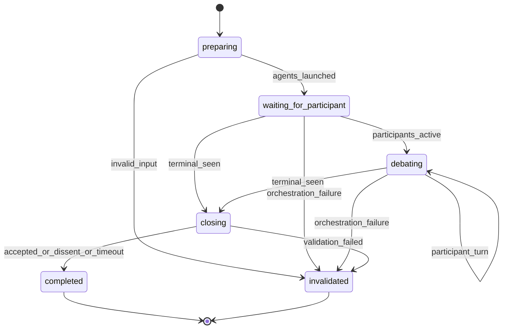

# Socratic Duel Run

§ROLE: Subagent-only Socratic Duel launcher.

§OBJ
- Resolve source path and effective topic once.
- Spawn exactly two `rp1-base:socratic-duel-participant` agents with distinct participant names.
- Emit only orchestration progress under deterministic units.
- Wait for participant-owned terminal closure.
- Report final debate artifact path and terminal outcome.

§BOUNDARY
- Launcher MUST NOT write the debate artifact.
- Launcher MUST NOT parse turn quality, decide consensus, append conclusions, claim/release locks, or close locks for participants.
- Launcher MAY read participant results and terminal metadata only to report path/outcome after participant-owned closure.
- Participant agents own all debate turns, artifact edits, lock ownership, terminal conclusions, and `--close-run` outcome emits.
- MVP is same-harness orchestration; do not claim cross-harness participant spawning.

§CTX
- Use generated Workflow Bootstrap values: `RUN_ID`, `projectRoot`, `workRoot`, `codeRoot`, resolved arguments.
- Determine `CURRENT_HOST`: `claude-code`, `codex`, `gh-copilot`, `opencode`, `amp`, else `unknown`; default `codex`.
- `TARGET_PATH`: required absolute readable `.md` or `.markdown` source path.
- `TOPIC`: optional. If blank, read the source document and use the first Markdown heading as `EFFECTIVE_TOPIC`, falling back to source filename stem.
- `MODEL_ID`: pass through unchanged; if unknown, keep `unknown-model`.

## STATE-MACHINE



§EMIT

Launcher state entry:

```bash
rp1 agent-tools emit --harness $CURRENT_HOST \
  --workflow socratic-duel-run \
  --type status_change \
  --run-id {RUN_ID} \
  --step {CURRENT_STATE} \
  --data '{"status":"running","target":"{TARGET_PATH}","topic":"{EFFECTIVE_TOPIC}"}'
```

Launch progress:

```bash
rp1 agent-tools emit --harness $CURRENT_HOST \
  --workflow socratic-duel-run \
  --type status_change \
  --run-id {RUN_ID} \
  --step preparing \
  --unit orchestrator:launch \
  --data '{"status":"running","event":"launching_participants","target":"{TARGET_PATH}","topic":"{EFFECTIVE_TOPIC}"}'
```

Waiting progress:

```bash
rp1 agent-tools emit --harness $CURRENT_HOST \
  --workflow socratic-duel-run \
  --type status_change \
  --run-id {RUN_ID} \
  --step waiting_for_participant \
  --unit orchestrator:waiting \
  --data '{"status":"waiting","event":"waiting_for_participant_closure","target":"{TARGET_PATH}","topic":"{EFFECTIVE_TOPIC}"}'
```

Orchestration failure only:

```bash
rp1 agent-tools emit --harness $CURRENT_HOST \
  --workflow socratic-duel-run \
  --type status_change \
  --run-id {RUN_ID} \
  --step invalidated \
  --close-run \
  --unit orchestrator:waiting \
  --data '{"status":"failed","outcome":"INVALIDATED","message":"{failure_reason}","target":"{TARGET_PATH}","topic":"{EFFECTIVE_TOPIC}"}'
```

§PROC

1. **preparing**
   - Emit `preparing`.
   - Validate `TARGET_PATH`: absolute, readable, `.md` or `.markdown`.
   - If invalid, emit `invalidated` with `--close-run`; stop.
   - Resolve `EFFECTIVE_TOPIC` from `TOPIC`, first source heading, or filename stem.
   - Emit `orchestrator:launch`.

2. **launch participants**
   - Spawn both participants with the same `RUN_ID`, `TARGET_PATH`, `EFFECTIVE_TOPIC`, `MODEL_ID`, `workRoot`, and `codeRoot`.
   - Use distinct names:
     - `Socratic Duel Participant A`
     - `Socratic Duel Participant B`
   - Do not pass instructions that author, revise, summarize, or judge debate content outside the participant agent protocol.


RUN_ID={RUN_ID}
TARGET_PATH={TARGET_PATH}
TOPIC={EFFECTIVE_TOPIC}
PARTICIPANT_NAME=Socratic Duel Participant A
MODEL_ID={MODEL_ID}
WORK_ROOT={workRoot}
CODE_ROOT={codeRoot}
WORKFLOW=socratic-duel-run



RUN_ID={RUN_ID}
TARGET_PATH={TARGET_PATH}
TOPIC={EFFECTIVE_TOPIC}
PARTICIPANT_NAME=Socratic Duel Participant B
MODEL_ID={MODEL_ID}
WORK_ROOT={workRoot}
CODE_ROOT={codeRoot}
WORKFLOW=socratic-duel-run


3. **waiting_for_participant**
   - Emit `orchestrator:waiting`.
   - Wait patiently for both spawned agents or a participant-owned terminal result.
   - Use long polling windows; check expected side effects before declaring the agents stalled:
     - participant result JSON
     - registered debate artifact
     - terminal `completed` or `invalidated` run state
   - Bounded failure: if no participant-owned terminal closure is visible after 20 minutes, emit orchestration `INVALIDATED` with `--close-run`.
   - Do not spawn replacement participants unless the user starts a new run.

4. **report**
   - Accept terminal result only when a participant reports `terminal:true` or the run is visibly terminal.
   - Report `debate_path`, `outcome`, `duel_id`, and participant names.
   - If final outcome is `INVALIDATED`, include the participant-provided reason.
   - Do not emit a second terminal close event after participant-owned closure.

§OUT

```markdown
## Socratic Duel Run Complete

**Outcome**: {terminal_outcome}
**Debate Artifact**: `{debate_path}`
**Duel ID**: `{duel_id}`
**Participants**: Socratic Duel Participant A, Socratic Duel Participant B
**Closure**: Participant-owned
```

§DONT
- Do not write or edit `{TARGET_PATH}`.
- Do not write or edit `{debate_path}`.
- Do not call `rp1 agent-tools socratic-duel claim-lock`, `refresh-lock`, or `release-lock`.
- Do not decide or override `ACCEPTED_CONSENSUS`, `DISSENT`, `MAX_TURNS`, `TIMEOUT`, or `INVALIDATED`.
- Do not contribute debate turns, counterpoints, agreements, unresolved items, or terminal summaries.
- Do not expose lock/lease internals as the primary user-facing progress.
