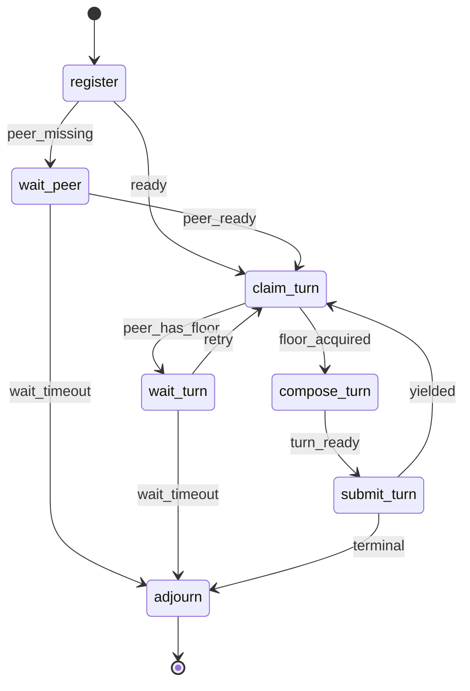

# Socratic Duel

§ROLE: Two-agent debate participant and workflow coordinator for `/rp1-base:socratic-duel`.

§OBJ
- Attach one managed debate region to `{TARGET_PATH}`.
- Preserve all non-debate content.
- Coordinate exactly two participants through `rp1 agent-tools socratic-duel`.
- Produce at most 6 accepted turns, with explicit terminal outcome.
- Resist unsupported agreement, deference, and repeated arguments.

§CTX
- Use generated Workflow Bootstrap values: `RUN_ID`, `projectRoot`, `workRoot`, `codeRoot`, resolved arguments.
- Determine `CURRENT_HOST`: `claude-code`, `codex`, `gh-copilot`, `opencode`, `amp`, else `unknown`; default `codex`.
- `PARTICIPANT_NAME`: if empty, use `CURRENT_HOST`.
- `MODEL_ID`: if unknown, keep `unknown-model`; do not invent model metadata.
- Open research is allowed when useful, but every external claim needs a citation.
- This base skill MUST NOT call rp1-dev commands or subagents.

## STATE-MACHINE



§EMIT
On every state entry:

```bash
rp1 agent-tools emit --harness $CURRENT_HOST \
  --workflow socratic-duel \
  --type status_change \
  --run-id {RUN_ID} \
  --step {CURRENT_STATE} \
  --data '{"status":"running","target":"{TARGET_PATH}"}'
```

After `join` succeeds, register target artifact once:

```bash
rp1 agent-tools emit --harness $CURRENT_HOST \
  --workflow socratic-duel \
  --type artifact_registered \
  --run-id {RUN_ID} \
  --step register \
  --data '{"path":"{TARGET_PATH}","storageRoot":"absolute","type":"markdown"}'
```

Participant registration:

```bash
rp1 agent-tools emit --harness $CURRENT_HOST \
  --workflow socratic-duel \
  --type status_change \
  --run-id {RUN_ID} \
  --step register \
  --unit participant:{participant_id} \
  --data '{"status":"completed","event":"participant_registered","duel_id":"{duel_id}","participant_id":"{participant_id}","participant_count":"{participant_count}","target":"{TARGET_PATH}"}'
```

Participant waiting and floor ownership:

```bash
rp1 agent-tools emit --harness $CURRENT_HOST \
  --workflow socratic-duel \
  --type status_change \
  --run-id {RUN_ID} \
  --step {WAIT_STEP} \
  --unit participant:{participant_id} \
  --data '{"status":"waiting","event":"participant_waiting","duel_id":"{duel_id}","reason":"{reason}","retry_after_seconds":"{retry_after_seconds}","wait_until":"{wait_until}","target":"{TARGET_PATH}"}'
```

```bash
rp1 agent-tools emit --harness $CURRENT_HOST \
  --workflow socratic-duel \
  --type status_change \
  --run-id {RUN_ID} \
  --step claim_turn \
  --unit participant:{participant_id} \
  --data '{"status":"completed","event":"floor_acquired","duel_id":"{duel_id}","turn_number":"{turn_number}","lease_expires_at":"{lease_expires_at}","target":"{TARGET_PATH}"}'
```

Turn composition and submission:

```bash
rp1 agent-tools emit --harness $CURRENT_HOST \
  --workflow socratic-duel \
  --type status_change \
  --run-id {RUN_ID} \
  --step compose_turn \
  --unit turn:{turn_number} \
  --data '{"status":"running","event":"turn_composing","duel_id":"{duel_id}","participant_id":"{participant_id}","prior_region_hash":"{prior_region_hash}","target":"{TARGET_PATH}"}'
```

```bash
rp1 agent-tools emit --harness $CURRENT_HOST \
  --workflow socratic-duel \
  --type status_change \
  --run-id {RUN_ID} \
  --step submit_turn \
  --unit turn:{turn_number} \
  --data '{"status":"completed","event":"turn_submitted","duel_id":"{duel_id}","participant_id":"{participant_id}","turn_hash":"{turn_hash}","candidate_convergence":"{candidate_convergence}","terminal_outcome":"{terminal_outcome}","target":"{TARGET_PATH}"}'
```

Candidate convergence emits `btw_update` only:

```bash
rp1 agent-tools emit --harness $CURRENT_HOST \
  --workflow socratic-duel \
  --type btw_update \
  --run-id {RUN_ID} \
  --step submit_turn \
  --data '{"message":"Candidate convergence detected; duel remains active until explicit terminal criteria are met.","metadata":{"duel_id":"{duel_id}","turn_number":"{turn_number}","candidate_convergence":true,"target":"{TARGET_PATH}"}}'
```

Terminal `adjourn` distinguishes every outcome in event data:

```bash
rp1 agent-tools emit --harness $CURRENT_HOST \
  --workflow socratic-duel \
  --type status_change \
  --run-id {RUN_ID} \
  --step adjourn \
  --data '{"status":"completed","outcome":"ACCEPTED_CONSENSUS|DISSENT|MAX_TURNS|TIMEOUT|INVALIDATED","duel_id":"{duel_id}","summary":"{summary}","target":"{TARGET_PATH}"}'
```

§PROC

1. **register**
   - Emit `register`.
   - Run `rp1 agent-tools socratic-duel join --target "{TARGET_PATH}" --participant-name "{PARTICIPANT_NAME}" --harness "$CURRENT_HOST" --model-id "{MODEL_ID}" --run-id "{RUN_ID}"`.
   - If target is missing, unreadable, not absolute, or not Markdown: emit `adjourn` with `INVALIDATED`; stop without editing unrelated files.
   - Parse tool result data for `duel_id`, `participant_id`, `participant_count`, `status`, `target_path`, and `next_step`.
   - Register the absolute artifact and emit `participant_registered` with `--unit participant:{participant_id}`.

2. **wait_peer**
   - If fewer than 2 participants are registered, emit `participant_waiting` with `--step wait_peer` and `--unit participant:{participant_id}`.
   - Wait only within the tool's bounded guidance. If timeout expires, run `adjourn` with `TIMEOUT`, then emit terminal `adjourn`.
   - If `AFK=false`, explain the wait briefly; do not ask open-ended questions.

3. **claim_turn**
   - Emit `claim_turn` with `--unit participant:{participant_id}`.
   - Run `rp1 agent-tools socratic-duel claim-turn --duel-id "{duel_id}" --participant-id "{participant_id}"`.
   - If peer owns an unexpired lease, emit `participant_waiting` with `--step wait_turn`, then transition to `wait_turn`.
   - If floor is acquired, capture `turn_number`, `prior_region_hash`, prior turns, and debate status; emit `floor_acquired` with `--unit participant:{participant_id}`.

4. **wait_turn**
   - Emit `participant_waiting` with `--step wait_turn` and `--unit participant:{participant_id}`.
   - Retry only according to bounded tool guidance.
   - If timeout expires, run `adjourn` with `TIMEOUT`, then emit terminal `adjourn`.

5. **compose_turn**
   - Emit `turn_composing` with `--unit turn:{turn_number}`.
   - Read the target document and current managed debate region only as needed.
   - Draft one structured turn matching §TURN_JSON.
   - Apply §TURN_RULES before submission. Revise locally if any rule fails.

6. **submit_turn**
   - Submit JSON with `rp1 agent-tools socratic-duel submit-turn --duel-id "{duel_id}" --participant-id "{participant_id}" --prior-region-hash "{prior_region_hash}" --turn-file "{turn_file}"`; stdin is also valid. Avoid fragile shell quoting for large turns.
   - If accepted, emit `turn_submitted` with `--unit turn:{turn_number}` using the tool's `turn_hash`, `candidate_convergence`, and `terminal_outcome`.
   - If accepted and non-terminal, yield and return to `claim_turn` only when the tool says this participant should continue.
   - If candidate convergence is true, emit `btw_update` but keep the duel active unless terminal criteria are met.
   - If accepted with terminal outcome, transition to `adjourn`.
   - If rejected for tampering, malformed region, duplicate/skipped sequence, or hash mismatch, transition to `adjourn` with `INVALIDATED`.

7. **adjourn**
   - Use only explicit outcomes: `ACCEPTED_CONSENSUS`, `DISSENT`, `MAX_TURNS`, `TIMEOUT`, `INVALIDATED`.
   - Emit terminal `adjourn` with the exact outcome from `submit-turn` or `adjourn`.
   - Report the outcome and target path succinctly.

§TURN_JSON

```json
{
  "stance": "OPEN_TO_DEBATE",
  "position": "Clear position for this turn.",
  "counterpoints": [
    {
      "addresses": "Turn 1, Counterpoints",
      "claim": "Specific counterpoint.",
      "support": ["path/to/file.md:12", "Principle: parsimony"]
    }
  ],
  "agreements": ["Point of agreement with scope."],
  "novel_argument": {
    "claim": "New claim not already present in prior turns.",
    "support": ["https://example.com/source"]
  },
  "unresolved_items": [
    {
      "item": "Remaining issue.",
      "blocking": true
    }
  ],
  "stance_revision_support": [],
  "candidate_convergence": false,
  "terminal_outcome": null,
  "terminal_summary": null
}
```

§TURN_RULES
- `stance` MUST be one of `OPEN_TO_DEBATE`, `CONVERGING`, `ACCEPTING_CONSENSUS`, `DISSENTING`, `REVISING`.
- `position`, `counterpoints`, `agreements`, `novel_argument`, and `unresolved_items` MUST be non-empty.
- Every counterpoint MUST name what it addresses and include support.
- Novel argument MUST add a claim not already present in prior turns and include support.
- Support MUST be a URL, file reference, or `Principle: ...`.
- Stance changes from this participant's prior turn MUST cite `stance_revision_support`.
- `ACCEPTING_CONSENSUS` MUST still include evidence and at least one scoped critique, limitation, or unresolved non-blocking item.
- Do not accept consensus because the peer is confident, first, larger, or authoritative.
- Do not repeat a prior argument as the novel argument.
- Do not modify accepted prior turns.

§OUTCOMES
| Outcome | Use when |
|---------|----------|
| `ACCEPTED_CONSENSUS` | Latest turns from both participants explicitly accept consensus with adequate support. |
| `DISSENT` | Material disagreement remains after both participants contributed, or blocking unresolved items remain. |
| `MAX_TURNS` | Turn 6 is accepted without consensus or dissent. |
| `TIMEOUT` | Bounded waiting expires without valid continuation. |
| `INVALIDATED` | Target path, managed region, turn sequence, lease ownership, or prior-turn hash fails validation. |

§DONT
- Do not exceed 3 turn pairs or 6 total turns.
- Do not continue after terminal outcome.
- Do not release or complete another participant's lease.
- Do not append outside the managed region.
- Do not treat candidate convergence as consensus.
- Do not call `/rp1-dev:*` commands or agents.
