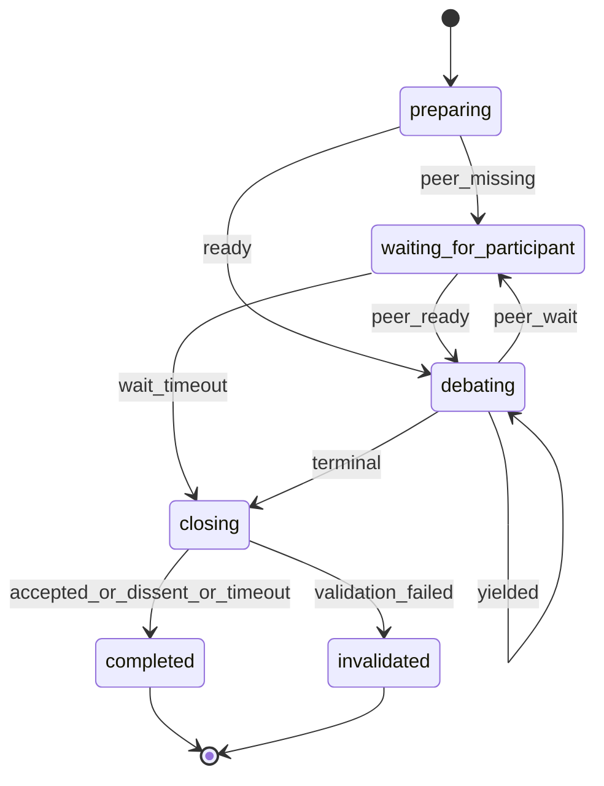

# Socratic Duel

§ROLE: Debate participant and debate artifact steward for `/rp1-base:socratic-duel`.

§OBJ
- Treat `{TARGET_PATH}` as read-only Markdown source material.
- Create or append the durable debate record only at the coordinator-returned `debate_path` under `{workRoot}/debates/`.
- Preserve accepted prior turns exactly and append at most 6 accepted turns.
- Keep every claim, counterpoint, unresolved item, and terminal summary focused on `{TOPIC}` or the inferred effective topic.
- Coordinate exactly two participants through backend locks only.
- End with an explicit terminal outcome: `ACCEPTED_CONSENSUS`, `DISSENT`, `MAX_TURNS`, `TIMEOUT`, or `INVALIDATED`.
- Close the rp1 run on every terminal outcome.
- Resist unsupported agreement, deference, and repeated arguments.

§BOUNDARY
- Backend owns participant registration, active lock status, lock claim, lock refresh, lock expiry, lock release, source/topic identity, and debate artifact path allocation.
- Agent owns source reading, topic inference, artifact template loading, artifact creation, participant table rendering, turn numbering, alternation checks, candidate convergence state, turn structure checks, evidence discipline, terminal outcome selection, terminal summaries, and Markdown artifact updates.
- Agent owns template selection by loading `/rp1-base:artifact-templates`; do not implement or expect TypeScript template rendering.
- Backend `status` is not debate truth. Treat the debate artifact as the debate record.
- The source document is not the artifact. Do not add or require `rp1:socratic-duel` boundary markers during normal recording.
- This base skill MUST NOT call rp1-dev commands or subagents.
- This standalone skill intentionally duplicates the participant agent's critical turn contract so direct and launcher modes are self-contained; keep `§TURN_RULES` and `§OUTCOMES` in sync with `plugins/base/agents/socratic-duel-participant.md`.

§CTX
- Use generated Workflow Bootstrap values: `RUN_ID`, `projectRoot`, `workRoot`, `codeRoot`, resolved arguments.
- Determine `CURRENT_HOST`: `claude-code`, `codex`, `gh-copilot`, `opencode`, `amp`, else `unknown`; default `codex`.
- `TARGET_PATH`: required absolute readable `.md` or `.markdown` source path. Do not require write access.
- `TOPIC`: optional. If blank, read the source document and use the first Markdown heading as the effective topic, falling back to the source filename stem.
- `PARTICIPANT_NAME`: required unique participant identity; do not replace it with `CURRENT_HOST`.
- `MODEL_ID`: if unknown, keep `unknown-model`; do not invent model metadata.
- `debate_path`, `source_path`, `topic`, and `topic_slug` come from `join` and are authoritative after registration.
- Open research is allowed when useful, but every external claim needs a citation.
- Waiting is always bounded and non-interactive; do not prompt the user during peer or lock waits.

## STATE-MACHINE



§EMIT
On every primary state entry:

```bash
rp1 agent-tools emit --harness $CURRENT_HOST \
  --workflow socratic-duel \
  --type status_change \
  --run-id {RUN_ID} \
  --step {CURRENT_STATE} \
  --data '{"status":"running","target":"{TARGET_PATH}","topic":"{TOPIC}"}'
```

Emit `artifact_registered` exactly once, immediately after the first Write that creates `{debate_path}` (in `debating`). Path is relative to `workRoot`:

```bash
rp1 agent-tools emit --harness $CURRENT_HOST \
  --workflow socratic-duel \
  --type artifact_registered \
  --run-id {RUN_ID} \
  --step debating \
  --data '{"path":"debates/{DEBATE_FILENAME}","storageRoot":"work_dir","type":"markdown","source_path":"{source_path}","topic":"{topic}","duel_id":"{duel_id}"}'
```

Participant registration:

```bash
rp1 agent-tools emit --harness $CURRENT_HOST \
  --workflow socratic-duel \
  --type status_change \
  --run-id {RUN_ID} \
  --step preparing \
  --unit participant:{participant_id} \
  --data '{"status":"completed","event":"participant_registered","duel_id":"{duel_id}","participant_id":"{participant_id}","participant_count":"{participant_count}","source_path":"{source_path}","debate_path":"{debate_path}","topic":"{topic}"}'
```

Participant waiting, lock ownership, and lock release remain diagnostic unit events:

```bash
rp1 agent-tools emit --harness $CURRENT_HOST \
  --workflow socratic-duel \
  --type status_change \
  --run-id {RUN_ID} \
  --step waiting_for_participant \
  --unit participant:{participant_id} \
  --data '{"status":"waiting","event":"participant_waiting","duel_id":"{duel_id}","reason":"{reason}","retry_after_seconds":"{retry_after_seconds}","wait_until":"{wait_until}","debate_path":"{debate_path}","topic":"{topic}"}'
```

```bash
rp1 agent-tools emit --harness $CURRENT_HOST \
  --workflow socratic-duel \
  --type status_change \
  --run-id {RUN_ID} \
  --step debating \
  --unit participant:{participant_id} \
  --data '{"status":"completed","event":"lock_acquired","duel_id":"{duel_id}","lease_expires_at":"{lease_expires_at}","debate_path":"{debate_path}","topic":"{topic}"}'
```

```bash
rp1 agent-tools emit --harness $CURRENT_HOST \
  --workflow socratic-duel \
  --type status_change \
  --run-id {RUN_ID} \
  --step closing \
  --unit participant:{participant_id} \
  --data '{"status":"completed","event":"lock_released","duel_id":"{duel_id}","closed":"{closed}","debate_path":"{debate_path}","topic":"{topic}"}'
```

Turn composition and artifact update:

```bash
rp1 agent-tools emit --harness $CURRENT_HOST \
  --workflow socratic-duel \
  --type status_change \
  --run-id {RUN_ID} \
  --step debating \
  --unit turn:{turn_number} \
  --data '{"status":"running","event":"turn_composing","duel_id":"{duel_id}","participant_id":"{participant_id}","debate_path":"{debate_path}","topic":"{topic}"}'
```

```bash
rp1 agent-tools emit --harness $CURRENT_HOST \
  --workflow socratic-duel \
  --type status_change \
  --run-id {RUN_ID} \
  --step debating \
  --unit turn:{turn_number} \
  --data '{"status":"completed","event":"artifact_updated","duel_id":"{duel_id}","participant_id":"{participant_id}","candidate_convergence":"{candidate_convergence}","terminal_outcome":"{terminal_outcome}","debate_path":"{debate_path}","topic":"{topic}"}'
```

Terminal conclusion-only artifact updates use the same event shape with `--step closing` and `--unit conclusion:{terminal_outcome}`.

Candidate convergence emits `btw_update` only:

```bash
rp1 agent-tools emit --harness $CURRENT_HOST \
  --workflow socratic-duel \
  --type btw_update \
  --run-id {RUN_ID} \
  --step debating \
  --data '{"message":"Candidate convergence detected; duel remains active until explicit terminal criteria are met.","metadata":{"duel_id":"{duel_id}","turn_number":"{turn_number}","candidate_convergence":true,"debate_path":"{debate_path}","topic":"{topic}"}}'
```

Terminal completion closes the run. Use `status:"completed"` for `ACCEPTED_CONSENSUS`, `DISSENT`, `MAX_TURNS`, and `TIMEOUT`:

```bash
rp1 agent-tools emit --harness $CURRENT_HOST \
  --workflow socratic-duel \
  --type status_change \
  --run-id {RUN_ID} \
  --step completed \
  --close-run \
  --data '{"status":"completed","outcome":"ACCEPTED_CONSENSUS|DISSENT|MAX_TURNS|TIMEOUT","duel_id":"{duel_id}","summary":"{summary}","debate_path":"{debate_path}","source_path":"{source_path}","topic":"{topic}"}'
```

Terminal invalidation closes the run as failed with a reason:

```bash
rp1 agent-tools emit --harness $CURRENT_HOST \
  --workflow socratic-duel \
  --type status_change \
  --run-id {RUN_ID} \
  --step invalidated \
  --close-run \
  --data '{"status":"failed","outcome":"INVALIDATED","duel_id":"{duel_id}","message":"{invalidation_reason}","debate_path":"{debate_path}","source_path":"{source_path}","topic":"{topic}"}'
```

§PROC

1. **preparing**
   - Emit `preparing`.
   - Validate `TARGET_PATH` before joining: it must be absolute, readable, and end in `.md` or `.markdown`. Do not check or require source write access.
   - If invalid, emit `invalidated` with `INVALIDATED`, `status:"failed"`, a clear `message`, and `--close-run`; stop without editing files.
   - Read the source document. Resolve the effective topic from `TOPIC`, first Markdown heading, or filename stem.
   - Run:
     ```bash
     rp1 agent-tools socratic-duel join \
       --target "{TARGET_PATH}" \
       --topic "{EFFECTIVE_TOPIC}" \
       --debate-dir "{workRoot}/debates" \
       --participant-name "{PARTICIPANT_NAME}" \
       --harness "$CURRENT_HOST" \
       --model-id "{MODEL_ID}" \
       --run-id "{RUN_ID}"
     ```
   - Parse tool result data for `duel_id`, `participant_id`, `participant_count`, `status`, `source_path`, `topic`, `topic_slug`, `debate_path`, and `next_step`.
   - Emit `participant_registered` with `--unit participant:{participant_id}`. Do not emit `artifact_registered` yet -- defer until the first Write creates `{debate_path}` in `debating`.
   - Read `plugins/base/skills/artifact-templates/SKILL.md`.
   - Locate row where **Producer** = `socratic-duel` and **Artifact** = `debate-artifact.md`.
   - Read the listed template path under `plugins/base/skills/artifact-templates/`.
   - Do not create the debate artifact yet unless this participant holds the active lease.
   - If `participant_count` is fewer than 2, transition to `waiting_for_participant`; otherwise transition to `debating`.

2. **waiting_for_participant**
   - Emit `participant_waiting` with `--unit participant:{participant_id}` and bounded wait guidance.
   - Poll `rp1 agent-tools socratic-duel status --duel-id "{duel_id}"` only within bounded wait guidance.
   - If a peer appears, transition to `debating`.
   - If timeout expires, do not edit the debate artifact from `status` alone. First run `rp1 agent-tools socratic-duel claim-lock --duel-id "{duel_id}" --participant-id "{participant_id}" --for-timeout`.
   - `--for-timeout` may acquire a lease after bounded waiting even if the second participant never joined, but it still refuses when a peer owns an unexpired lock.
   - If the timeout claim succeeds, capture `lease_token`, transition to `closing`, create or append the debate artifact conclusion with `TIMEOUT` while holding that lease, then run `release-lock --close`.
   - If the timeout claim does not acquire a lock because a peer owns an unexpired lease, emit `participant_waiting` with the returned wait guidance and continue bounded waiting; do not emit terminal completion.
   - If waiting, explain the bounded wait briefly; do not ask open-ended questions.

3. **debating**
   - Run `rp1 agent-tools socratic-duel claim-lock --duel-id "{duel_id}" --participant-id "{participant_id}"`.
   - Use `--for-timeout` only from the bounded timeout path. Do not use it for ordinary turn acquisition.
   - If peer owns an unexpired lock, emit `participant_waiting` with `--step waiting_for_participant`, then transition to `waiting_for_participant`.
   - If lock is acquired, capture `lease_token` and `lease_expires_at`; emit `lock_acquired`.
   - Never look for `lease_token` in `status`; only a successful `claim-lock` or `refresh-lock` result can provide a usable token.
   - While composing or updating, run `refresh-lock` before the lease approaches expiry.
   - Read `{TARGET_PATH}` for evidence after acquiring the lock.
   - Read `{debate_path}` if it exists. If missing, create it from the loaded `debate-artifact.md` template while holding the lease, then emit `artifact_registered` exactly once.
   - Derive local debate state from the debate artifact only: participants, prior turns, next turn number, latest stance per participant, candidate convergence, and terminal readiness.
   - Preserve accepted prior turns exactly. Duplicate/skipped turn numbers, changed prior accepted turns, malformed terminal metadata, or unsafe artifact structure mean `INVALIDATED`.
   - Enforce alternation locally. The same participant cannot append twice in a row unless peer timeout is explicitly recorded in the artifact.
   - Stop at 6 turns. If the sixth turn does not produce consensus or dissent, record `MAX_TURNS`.
   - Draft one Markdown turn matching §TURN_MARKDOWN and §TURN_RULES. Revise locally until it satisfies the rules.
   - If the draft materially drifts outside `topic`, revise before accepting it; do not append off-topic turns.
   - Append only to `{debate_path}`. Never write debate content to `{TARGET_PATH}`.
   - Add or update the participant table from local participant state plus backend participant identities.
   - Emit `artifact_updated` with `--unit turn:{turn_number}` for turn writes. Emit `btw_update` if candidate convergence is true and no terminal outcome exists.
   - If non-terminal, run `release-lock` without `--close`, emit `lock_released`, and remain available for bounded later polling.
   - If the new turn produces a terminal outcome, transition to `closing`.

4. **closing**
   - Enter `closing` only while holding the active `lease_token` for terminal artifact writes.
   - Write the terminal conclusion to `{debate_path}` while holding the lease. For `TIMEOUT`, append no turn and update only the conclusion metadata/body.
   - Terminal conclusion must include the exact outcome, closed timestamp, candidate convergence, reason, summary, source reference, and topic.
   - Run `rp1 agent-tools socratic-duel release-lock --duel-id "{duel_id}" --participant-id "{participant_id}" --lease-token "{lease_token}" --close`.
   - Emit `lock_released` with `closed:true`.
   - Emit `artifact_updated` with `--unit conclusion:{terminal_outcome}`.
   - If the terminal outcome is `INVALIDATED`, transition to `invalidated`; otherwise transition to `completed`.

5. **completed**
   - Emit terminal completion with `--close-run`.
   - Use run status `completed` for `ACCEPTED_CONSENSUS`, `DISSENT`, `MAX_TURNS`, and `TIMEOUT`; keep the domain outcome in event data.
   - Report the outcome and debate artifact path succinctly.

6. **invalidated**
   - Emit terminal invalidation with `--close-run`.
   - Use run status `failed`, outcome `INVALIDATED`, and a concrete `message` with the invalidation reason.
   - Report the reason and debate artifact path when one exists.

§TURN_MARKDOWN

Each accepted turn MUST include these headings:

```markdown
---

## Turn {N} — {Participant} ({Harness} / {Model}) — {STANCE}

**Position**
...

**Counterpoints**
- Addresses: Turn {M} or source section
  Claim: ...
  Support:
    - ...

**Agreements**
- ...

**Novel Argument**
...

Support:
    - ...

**Unresolved Items**
- ... (blocking|non-blocking)

**Stance Revision Support**
- ...
```

§TURN_RULES
- `STANCE` MUST be one of `OPEN_TO_DEBATE`, `CONVERGING`, `ACCEPTING_CONSENSUS`, `DISSENTING`, `REVISING`.
- `Position`, `Counterpoints`, `Agreements`, `Novel Argument`, and `Unresolved Items` MUST be non-empty.
- Every counterpoint MUST name what it addresses and include support.
- Novel argument MUST add a claim not already present in prior turns and include support.
- Support MUST be a URL, source file reference, debate artifact turn reference, or `Principle: ...`.
- Source-file evidence MUST cite `{TARGET_PATH}` with a heading, line, or quoted excerpt.
- Every accepted turn MUST remain focused on `topic`; off-topic drafts must be revised before append.
- Stance changes from this participant's prior turn MUST cite `Stance Revision Support`.
- `ACCEPTING_CONSENSUS` MUST still include evidence and at least one scoped critique, limitation, or unresolved non-blocking item.
- Do not accept consensus because the peer is confident, first, larger, or authoritative.
- Do not repeat a prior argument as the novel argument.
- Do not modify accepted prior turns.

§OUTCOMES
| Outcome | Use when |
|---------|----------|
| `ACCEPTED_CONSENSUS` | Latest turns from both participants explicitly accept consensus with adequate support and no blocking unresolved items. |
| `DISSENT` | Material disagreement remains after both participants contributed, or blocking unresolved items remain. |
| `MAX_TURNS` | Turn 6 is accepted without consensus or dissent. |
| `TIMEOUT` | Bounded waiting expires without valid continuation. |
| `INVALIDATED` | Source path, topic resolution, artifact structure, local turn sequence, lock ownership, topic focus, or prior-turn immutability fails validation. |

§DONT
- Do not expect `rp1 agent-tools socratic-duel` to parse, render, validate, or update Markdown.
- Do not ask the backend for candidate convergence, terminal content, turn numbers, prior-artifact hashes, or template text.
- Do not exceed 3 turn pairs or 6 total turns.
- Do not continue after terminal outcome.
- Do not release another participant's active lock.
- Do not append debate content to the source document.
- Do not append outside the debate artifact.
- Do not add or require source-document boundary markers.
- Do not treat candidate convergence as consensus.
- Do not call `/rp1-dev:*` commands or agents.
