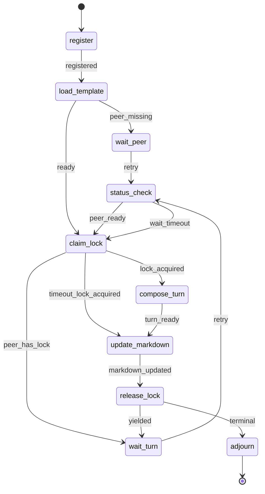

# Socratic Duel

§ROLE: Debate participant and local Markdown steward for `/rp1-base:socratic-duel`.

§OBJ
- Attach one managed debate region to `{TARGET_PATH}`.
- Preserve all non-debate content exactly.
- Coordinate exactly two participants through backend locks only.
- Produce at most 6 accepted turns.
- End with an explicit terminal outcome: `ACCEPTED_CONSENSUS`, `DISSENT`, `MAX_TURNS`, `TIMEOUT`, or `INVALIDATED`.
- Resist unsupported agreement, deference, and repeated arguments.

§BOUNDARY
- Backend owns only participant registration, active lock status, lock claim, lock refresh, lock expiry, and lock release.
- Agent owns target Markdown parsing, local debate state, participant table rendering, turn numbering, alternation checks, candidate convergence state, turn structure checks, evidence discipline, terminal outcome selection, terminal summaries, and Markdown updates.
- Agent owns template selection by loading `/rp1-base:artifact-templates`; do not implement or expect TypeScript template management.
- Backend `status` is not debate truth. Treat the target Markdown region as the debate record.

§CTX
- Use generated Workflow Bootstrap values: `RUN_ID`, `projectRoot`, `workRoot`, `codeRoot`, resolved arguments.
- Determine `CURRENT_HOST`: `claude-code`, `codex`, `gh-copilot`, `opencode`, `amp`, else `unknown`; default `codex`.
- `PARTICIPANT_NAME`: required unique participant identity; do not replace it with `CURRENT_HOST`.
- `MODEL_ID`: if unknown, keep `unknown-model`; do not invent model metadata.
- Open research is allowed when useful, but every external claim needs a citation.
- Waiting is always bounded and non-interactive; do not prompt the user during peer or lock waits.
- This base skill MUST NOT call rp1-dev commands or subagents.

## STATE-MACHINE



§EMIT
On every state entry:

```bash
rp1 agent-tools emit --harness $CURRENT_HOST \
  --workflow socratic-duel \
  --type status_change \
  --run-id {RUN_ID} \
  --step {CURRENT_STATE} \
  --data '{"status":"running","target":"{TARGET_PATH}"}'
```

After `join` succeeds, register target artifact once:

```bash
rp1 agent-tools emit --harness $CURRENT_HOST \
  --workflow socratic-duel \
  --type artifact_registered \
  --run-id {RUN_ID} \
  --step register \
  --data '{"path":"{TARGET_PATH}","storageRoot":"absolute","type":"markdown"}'
```

Participant registration:

```bash
rp1 agent-tools emit --harness $CURRENT_HOST \
  --workflow socratic-duel \
  --type status_change \
  --run-id {RUN_ID} \
  --step register \
  --unit participant:{participant_id} \
  --data '{"status":"completed","event":"participant_registered","duel_id":"{duel_id}","participant_id":"{participant_id}","participant_count":"{participant_count}","target":"{TARGET_PATH}"}'
```

Participant waiting, lock ownership, and lock release:

```bash
rp1 agent-tools emit --harness $CURRENT_HOST \
  --workflow socratic-duel \
  --type status_change \
  --run-id {RUN_ID} \
  --step {WAIT_STEP} \
  --unit participant:{participant_id} \
  --data '{"status":"waiting","event":"participant_waiting","duel_id":"{duel_id}","reason":"{reason}","retry_after_seconds":"{retry_after_seconds}","wait_until":"{wait_until}","target":"{TARGET_PATH}"}'
```

```bash
rp1 agent-tools emit --harness $CURRENT_HOST \
  --workflow socratic-duel \
  --type status_change \
  --run-id {RUN_ID} \
  --step claim_lock \
  --unit participant:{participant_id} \
  --data '{"status":"completed","event":"lock_acquired","duel_id":"{duel_id}","lease_expires_at":"{lease_expires_at}","target":"{TARGET_PATH}"}'
```

```bash
rp1 agent-tools emit --harness $CURRENT_HOST \
  --workflow socratic-duel \
  --type status_change \
  --run-id {RUN_ID} \
  --step release_lock \
  --unit participant:{participant_id} \
  --data '{"status":"completed","event":"lock_released","duel_id":"{duel_id}","closed":"{closed}","target":"{TARGET_PATH}"}'
```

Turn composition and Markdown update:

```bash
rp1 agent-tools emit --harness $CURRENT_HOST \
  --workflow socratic-duel \
  --type status_change \
  --run-id {RUN_ID} \
  --step compose_turn \
  --unit turn:{turn_number} \
  --data '{"status":"running","event":"turn_composing","duel_id":"{duel_id}","participant_id":"{participant_id}","target":"{TARGET_PATH}"}'
```

```bash
rp1 agent-tools emit --harness $CURRENT_HOST \
  --workflow socratic-duel \
  --type status_change \
  --run-id {RUN_ID} \
  --step update_markdown \
  --unit turn:{turn_number} \
  --data '{"status":"completed","event":"markdown_updated","duel_id":"{duel_id}","participant_id":"{participant_id}","candidate_convergence":"{candidate_convergence}","terminal_outcome":"{terminal_outcome}","target":"{TARGET_PATH}"}'
```

Terminal conclusion Markdown updates use the same event with `--unit conclusion:{terminal_outcome}` when no new turn is appended.

Candidate convergence emits `btw_update` only:

```bash
rp1 agent-tools emit --harness $CURRENT_HOST \
  --workflow socratic-duel \
  --type btw_update \
  --run-id {RUN_ID} \
  --step update_markdown \
  --data '{"message":"Candidate convergence detected; duel remains active until explicit terminal criteria are met.","metadata":{"duel_id":"{duel_id}","turn_number":"{turn_number}","candidate_convergence":true,"target":"{TARGET_PATH}"}}'
```

Terminal `adjourn` distinguishes every outcome in event data:

```bash
rp1 agent-tools emit --harness $CURRENT_HOST \
  --workflow socratic-duel \
  --type status_change \
  --run-id {RUN_ID} \
  --step adjourn \
  --data '{"status":"completed","outcome":"ACCEPTED_CONSENSUS|DISSENT|MAX_TURNS|TIMEOUT|INVALIDATED","duel_id":"{duel_id}","summary":"{summary}","target":"{TARGET_PATH}"}'
```

§PROC

1. **register**
   - Emit `register`.
   - Run `rp1 agent-tools socratic-duel join --target "{TARGET_PATH}" --participant-name "{PARTICIPANT_NAME}" --harness "$CURRENT_HOST" --model-id "{MODEL_ID}" --run-id "{RUN_ID}"`.
   - If target is missing, unreadable, not absolute, or not Markdown: emit `adjourn` with `INVALIDATED`; stop without editing unrelated files.
   - Parse tool result data for `duel_id`, `participant_id`, `participant_count`, `status`, `target_path`, and `next_step`.
   - Register the absolute artifact and emit `participant_registered` with `--unit participant:{participant_id}`.

2. **load_template**
   - Read `plugins/base/skills/artifact-templates/SKILL.md`.
   - Locate row where **Producer** = `socratic-duel` and **Artifact** = `managed-debate-region`.
   - Read the listed template path under `plugins/base/skills/artifact-templates/`.
   - Use that template for initial region creation and subsequent metadata/conclusion updates.
   - Do not create a separate debate artifact; the target Markdown file is the artifact.

3. **wait_peer/status_check**
   - If fewer than 2 participants are registered, emit `participant_waiting` with `--step wait_peer`.
   - Poll `rp1 agent-tools socratic-duel status --duel-id "{duel_id}"` only within bounded wait guidance.
   - If timeout expires, do not edit Markdown from `status` alone. First run `rp1 agent-tools socratic-duel claim-lock --duel-id "{duel_id}" --participant-id "{participant_id}" --for-timeout`.
   - `--for-timeout` may acquire a lease after bounded waiting even if the second participant never joined, but it still refuses when a peer owns an unexpired lock.
   - If the timeout claim succeeds, transition to `update_markdown`, record `TIMEOUT` in the Markdown conclusion while holding the returned `lease_token`, then run `release-lock --close` with that same token.
   - If the timeout claim does not acquire a lock because a peer owns an unexpired lease, emit `participant_waiting` with the returned wait guidance and continue bounded `wait_turn/status_check`; do not emit terminal `adjourn`.
   - If waiting, explain the bounded wait briefly; do not ask open-ended questions.

4. **claim_lock**
   - Run `rp1 agent-tools socratic-duel claim-lock --duel-id "{duel_id}" --participant-id "{participant_id}"`.
   - Use `--for-timeout` only from the bounded timeout path. Do not use it for ordinary turn acquisition.
   - If peer owns an unexpired lock, emit `participant_waiting` with `--step wait_turn`, then transition to `wait_turn`.
   - If lock is acquired, capture `lease_token` and `lease_expires_at`; emit `lock_acquired`.
   - Never look for `lease_token` in `status`; only a successful `claim-lock` or `refresh-lock` result can provide a usable token.
   - While composing or updating, run `refresh-lock` before the lease approaches expiry.

5. **compose_turn**
   - Read `{TARGET_PATH}` after acquiring the lock.
   - Parse the managed region locally. Missing region means create it from the artifact template. Duplicate markers, malformed sections, duplicate/skipped turn numbers, or changed prior accepted turns mean `INVALIDATED`.
   - Derive local state from the Markdown only: participants, prior turns, next turn number, latest stance per participant, candidate convergence, and terminal readiness.
   - Enforce alternation locally. The same participant cannot append twice in a row unless peer timeout is explicitly recorded in the Markdown.
   - Stop at 6 turns. If the sixth turn does not produce consensus or dissent, record `MAX_TURNS`.
   - Draft one Markdown turn matching §TURN_MARKDOWN and §TURN_RULES. Revise locally until it satisfies the rules.

6. **update_markdown**
   - Update only the managed region in `{TARGET_PATH}`. Preserve prefix and suffix byte-for-byte.
   - Add or update the participant table from local participant state plus backend participant identities.
   - Append the new turn; never rewrite accepted prior turns except to restore exact template metadata before the first accepted turn. For a timeout lock, append no turn and update only the conclusion metadata/body with `TIMEOUT`.
   - Update candidate convergence and conclusion locally. Candidate convergence is advisory and never terminal by itself.
   - Re-read before writing if needed to confirm the lock owner still has the latest document version; if the managed region changed unexpectedly, stop with `INVALIDATED`.
   - Emit `markdown_updated` with `--unit turn:{turn_number}` for turn writes or `--unit conclusion:{terminal_outcome}` for terminal conclusion-only writes. Emit `btw_update` if candidate convergence is true and no terminal outcome exists.

7. **release_lock**
   - Non-terminal: run `rp1 agent-tools socratic-duel release-lock --duel-id "{duel_id}" --participant-id "{participant_id}" --lease-token "{lease_token}"`.
   - Terminal: run the same command with `--close` only after writing the terminal conclusion while holding the active lease.
   - Emit `lock_released`.
   - If non-terminal, transition to `wait_turn`; only return to `claim_lock` after later `status_check` and local Markdown state prove this participant is eligible to continue.
   - If terminal, transition to `adjourn`.

8. **adjourn**
   - Emit terminal `adjourn` with the exact outcome and summary already written in Markdown and, when applicable, after `release-lock --close` has returned `closed: true`.
   - Report the outcome and target path succinctly.

§TURN_MARKDOWN

Each accepted turn MUST include these headings:

```markdown
#### Turn {N} - {Participant} ({Harness} / {Model}) - {STANCE}

**Position**
...

**Counterpoints**
- Addresses: Turn {M} or document section
  Claim: ...
  Support:
    - ...

**Agreements**
- ...

**Novel Argument**
...

Support:
    - ...

**Unresolved Items**
- ... (blocking|non-blocking)

**Stance Revision Support**
- ...
```

§TURN_RULES
- `STANCE` MUST be one of `OPEN_TO_DEBATE`, `CONVERGING`, `ACCEPTING_CONSENSUS`, `DISSENTING`, `REVISING`.
- `Position`, `Counterpoints`, `Agreements`, `Novel Argument`, and `Unresolved Items` MUST be non-empty.
- Every counterpoint MUST name what it addresses and include support.
- Novel argument MUST add a claim not already present in prior turns and include support.
- Support MUST be a URL, file reference, or `Principle: ...`.
- Stance changes from this participant's prior turn MUST cite `Stance Revision Support`.
- `ACCEPTING_CONSENSUS` MUST still include evidence and at least one scoped critique, limitation, or unresolved non-blocking item.
- Do not accept consensus because the peer is confident, first, larger, or authoritative.
- Do not repeat a prior argument as the novel argument.
- Do not modify accepted prior turns.

§OUTCOMES
| Outcome | Use when |
|---------|----------|
| `ACCEPTED_CONSENSUS` | Latest turns from both participants explicitly accept consensus with adequate support and no blocking unresolved items. |
| `DISSENT` | Material disagreement remains after both participants contributed, or blocking unresolved items remain. |
| `MAX_TURNS` | Turn 6 is accepted without consensus or dissent. |
| `TIMEOUT` | Bounded waiting expires without valid continuation. |
| `INVALIDATED` | Target path, managed region, local turn sequence, lock ownership, or prior-turn immutability fails validation. |

§DONT
- Do not expect `rp1 agent-tools socratic-duel` to parse, render, validate, or update Markdown.
- Do not ask the backend for candidate convergence, terminal content, turn numbers, prior-region hashes, or template text.
- Do not exceed 3 turn pairs or 6 total turns.
- Do not continue after terminal outcome.
- Do not release another participant's active lock.
- Do not append outside the managed region.
- Do not treat candidate convergence as consensus.
- Do not call `/rp1-dev:*` commands or agents.
