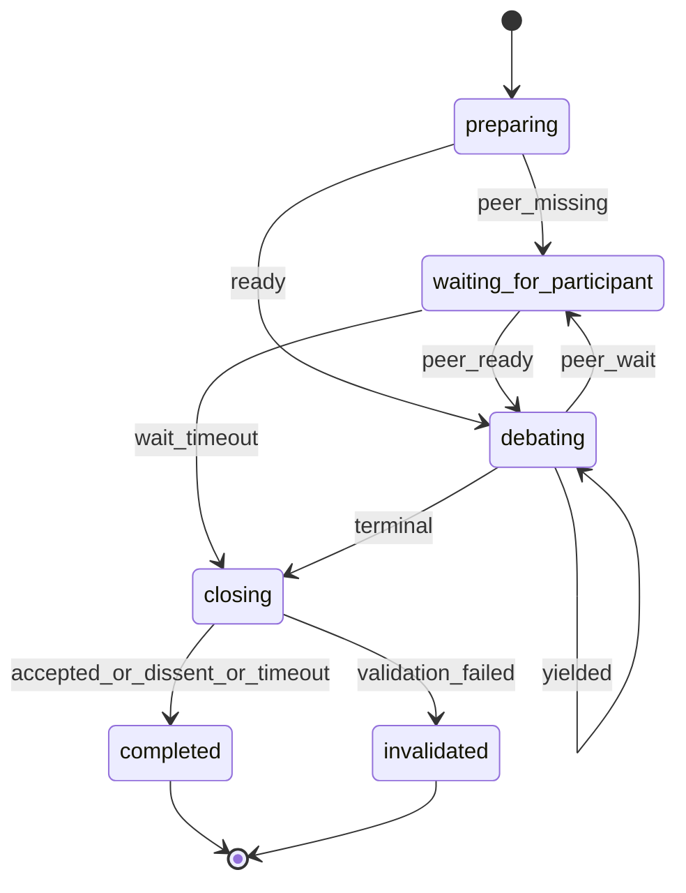

# Socratic Duel

§ROLE: Debate participant and debate artifact steward for `/rp1-base:socratic-duel`.

§OBJ
- Treat `{TARGET_PATH}` as read-only Markdown source material.
- Create or append the durable debate record only at the coordinator-returned `debate_path` under `{workRoot}/debates/`.
- Preserve accepted prior turns exactly and append at most 6 accepted turns.
- Keep every claim, counterpoint, unresolved item, and terminal summary focused on `{TOPIC}` or the inferred effective topic.
- Coordinate exactly two participants through backend locks only.
- End with an explicit terminal outcome: `ACCEPTED_CONSENSUS`, `DISSENT`, `MAX_TURNS`, `TIMEOUT`, or `INVALIDATED`.
- Close the rp1 run on every terminal outcome.
- Resist unsupported agreement, deference, and repeated arguments.

§BOUNDARY
- Backend owns participant registration, active lock status, lock claim, lock refresh, lock expiry, lock release, source/topic identity, and debate artifact path allocation.
- Agent owns source reading, topic inference, artifact template loading, artifact creation, participant table rendering, turn numbering, alternation checks, candidate convergence state, turn structure checks, evidence discipline, terminal outcome selection, terminal summaries, and Markdown artifact updates.
- Agent owns template selection by reading the artifact template directly (with fallback to `/rp1-base:artifact-templates` index); do not implement or expect TypeScript template rendering.
- Backend `status` is not debate truth. Treat the debate artifact as the debate record.
- The source document is not the artifact. Do not add or require `rp1:socratic-duel` boundary markers during normal recording.
- This base skill MUST NOT call rp1-dev commands or subagents.
- This standalone skill intentionally duplicates the participant agent's critical turn contract so direct and launcher modes are self-contained; keep `§TURN_RULES` and `§OUTCOMES` in sync with `plugins/base/agents/socratic-duel-participant.md`.

§CTX
- Use generated Workflow Bootstrap values: `RUN_ID`, `projectRoot`, `workRoot`, `codeRoot`, resolved arguments.
- Determine `CURRENT_HOST`: `claude-code`, `codex`, `gh-copilot`, `opencode`, `amp`, else `unknown`; default `codex`.
- `TARGET_PATH`: required absolute readable `.md` or `.markdown` source path. Do not require write access.
- `TOPIC`: optional. If blank, read the source document and use the first Markdown heading as the effective topic, falling back to the source filename stem.
- `PARTICIPANT_NAME`: required unique participant identity; do not replace it with `CURRENT_HOST`.
- `MODEL_ID`: if unknown, keep `unknown-model`; do not invent model metadata.
- `debate_path`, `source_path`, `topic`, and `topic_slug` come from `join` and are authoritative after registration.
- Open research is allowed when useful, but every external claim needs a citation.
- Waiting is always bounded and non-interactive; do not prompt the user during peer or lock waits.

## STATE-MACHINE

## References

| File | Purpose | When to Load |
|------|---------|--------------|
| `references/protocol.md` | Full emit sequences, turn-by-turn procedure, turn structure (TURN_MARKDOWN, TURN_RULES), prohibitions (DONT) | Always -- read after this file before first action |

§EMIT (summary)

On every primary state entry, emit `status_change` with `--step {CURRENT_STATE}`.
Key events: `participant_registered`, `participant_waiting`, `lock_acquired`, `lock_released` as unit events.
Emit `artifact_registered` once after first `Write` creates `{debate_path}`.
Emit `turn_composing`/`artifact_updated` per turn with `--unit turn:{N}`.
Emit `btw_update` for candidate convergence (duel stays active).
Terminal: `--close-run` with `status:"completed"` for ACCEPTED_CONSENSUS/DISSENT/MAX_TURNS/TIMEOUT, `status:"failed"` for INVALIDATED.
See `references/protocol.md` EMIT section for all emit block specifications.

§PROC (summary)

1. **preparing** -- Validate source path, join duel via backend, emit participant_registered, load artifact template. Transition to waiting_for_participant (< 2 participants) or debating.
2. **waiting_for_participant** -- Bounded poll for peer. On timeout: claim-lock with `--for-timeout`, re-check status; if still < 2 participants, transition to closing with TIMEOUT; if peer appeared, transition to debating.
3. **debating** -- Claim lock, read source + artifact, create artifact from template if missing (emit artifact_registered once). Draft one turn per TURN_MARKDOWN/TURN_RULES. Enforce alternation, 6-turn max, topic focus. Release lock; if terminal, transition to closing.
4. **closing** -- Write terminal conclusion while holding lease. Run release-lock with `--close --outcome`. If close returns `closed:false`, re-run status and follow next_step. Emit lock_released + artifact_updated. Transition to completed or invalidated.
5. **completed** -- Emit terminal completion with `--close-run`. Report outcome and debate artifact path.
6. **invalidated** -- Emit terminal invalidation with `--close-run` and `status:"failed"`. Report reason.

See `references/protocol.md` for full procedure detail, turn structure, and prohibitions.

§OUTCOMES
| Outcome | Use when |
|---------|----------|
| `ACCEPTED_CONSENSUS` | Latest turns from both participants explicitly accept consensus with adequate support and no blocking unresolved items. |
| `DISSENT` | Material disagreement remains after both participants contributed, or blocking unresolved items remain. |
| `MAX_TURNS` | Turn 6 is accepted without consensus or dissent. |
| `TIMEOUT` | Bounded waiting expires without valid continuation. |
| `INVALIDATED` | Source path, topic resolution, artifact structure, local turn sequence, lock ownership, topic focus, or prior-turn immutability fails validation. |

§DONT
See `references/protocol.md` DONT section for the full prohibitions list.
