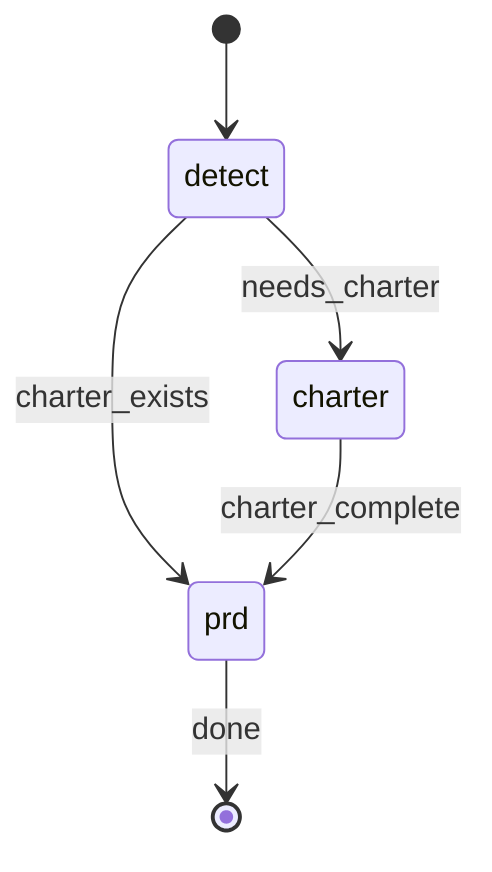

# Project Blueprint

## Parameters

Extract these parameters from the user's input:

| Parameter | Required | Default | Description |
|-----------|----------|---------|-------------|
| `PRD_NAME` | No | - | PRD name to create (omit for default charter + main PRD flow) |
| `EXTRA_CONTEXT` | No | `""` | Additional context provided by the user |

**Environment values** (resolve via shell):
- `RP1_ROOT`: !`rp1 agent-tools rp1-root-dir` (extract `data.root` from JSON response)

## STATE-MACHINE



**On each phase transition**, report via:
```
rp1 agent-tools emit \
  --workflow blueprint \
  --type status_change \
  --run-id {RUN_ID} \
  --step {CURRENT_STATE} \
  --data '{"status": "running"}'
```

- Generate `RUN_ID` as a UUID at workflow start

**State Progression Protocol**:
1. Report each `--step` with `--data '{"status": "running"}'` when you enter that state
2. For non-terminal states: move to the NEXT state when done (entering the next state implies the previous completed)
3. For terminal states (those with `→ [*]` transitions): report with `--data '{"status": "completed"}'` when the step's work finishes
4. On error, transition to the appropriate failure state in the graph

**Example sequence** (with charter):
```
--workflow blueprint --step detect --data '{"status": "running"}'     # entering detect phase
--workflow blueprint --step charter --data '{"status": "running"}'    # needs charter, entering charter phase
--workflow blueprint --step prd --data '{"status": "running"}'        # charter done, entering prd phase
--workflow blueprint --step prd --data '{"status": "completed"}'      # prd done, workflow complete
```

## §CTX

**Doc Hierarchy**:
1. **Charter** (`{{$RP1_ROOT}}/context/charter.md`) - Project-level: problem/context, users, business rationale, scope guardrails, success criteria
2. **PRDs** (`{{$RP1_ROOT}}/work/prds/<name>.md`) - Surface-specific: overview, in/out scope, requirements, dependencies, timeline. Inherit from charter, link back, no duplication.

## §PROC

### Step 1: Mode Detection

Read `{{$RP1_ROOT}}/context/charter.md`:

| Condition | Mode | Message |
|-----------|------|---------|
| Not exist | CREATE | "Starting new charter creation. I'll guide you through defining your project vision." |
| Exists + has `## Scratch Pad` | RESUME | "Resuming interrupted charter session. I'll continue from where you left off." |
| Exists + no scratch pad | UPDATE | "Updating existing charter. I'll ask focused questions about changes you want to make." |

### Step 2: Initialize Scratch Pad

**CREATE** - Write charter.md:
```markdown
# Project Charter: [To Be Determined]

**Version**: 1.0.0
**Status**: Draft
**Created**: {YYYY-MM-DD}

## Scratch Pad

<!-- Interview state - will be removed upon completion -->
<!-- Mode: CREATE -->
<!-- Started: {ISO timestamp} -->

<!-- End scratch pad -->
```

**UPDATE** - Edit: append scratch pad after last line:
```markdown
## Scratch Pad

<!-- Interview state - will be removed upon completion -->
<!-- Mode: UPDATE -->
<!-- Started: {ISO timestamp} -->

<!-- End scratch pad -->
```

**RESUME** - No init (scratch pad exists).

### Step 3: Charter Interview Loop

question_number = 0
loop:
  1. 
     CHARTER_PATH={{$RP1_ROOT}}/context/charter.md, MODE={mode}, RP1_ROOT={{$RP1_ROOT}}
     

  2. Parse JSON response

  3. Handle by type:

     next_question:
        question_number = metadata.question_number
        topic = map_gap_to_topic(metadata.gaps_remaining[0])
        answer = 
        Edit charter.md (insert before `<!-- End scratch pad -->`):
           `### Q{N}: {topic}`
           `**Asked**: {question}`
           `**Answer**: {answer}`
        continue

     success:
        Write charter sections from response.charter_content
        Remove "## Scratch Pad" section entirely
        Update status to "Complete"
        Register artifact:
        ```bash
        rp1 agent-tools emit \
          --workflow blueprint \
          --type artifact_registered \
          --run-id {RUN_ID} \
          --step charter \
          --data '{"path": "{{$RP1_ROOT}}/context/charter.md"}'
        ```
        Output: "Charter complete! Proceeding to PRD creation..."
        break -> Step 4

     skip:
        question_number = metadata.question_number
        topic = from message
        Edit charter.md:
           `### Q{N}: {topic}`
           `**Skipped**: {message}`
        continue

     error:
        Output: "Charter interview encountered an error. Scratch pad state preserved for retry."
        Preserve scratch pad, EXIT (no PRD)

**Topic Map**:
| Gap | Topic |
|-----|-------|
| problem | Problem & Context |
| users | Target Users |
| value_prop | Value Proposition |
| scope | Scope |
| success | Success Criteria |
| (Q1 CREATE) | Brain Dump |

**Scratch Pad Edits**:
- Insert Q&A: `old_string: <!-- End scratch pad -->` -> prepend entry
- Remove: match `## Scratch Pad` through `<!-- End scratch pad -->`, replace w/ empty

### Step 4: PRD Creation

#### 4.1 PRD Name
`PRD_NAME = PRD_NAME || "main"`

#### 4.2 Init PRD
Create `{{$RP1_ROOT}}/work/prds/{PRD_NAME}.md`:
```markdown
# PRD: {PRD_NAME}

**Charter**: [Project Charter]({{$RP1_ROOT}}/context/charter.md)
**Version**: 1.0.0
**Status**: Draft
**Created**: {YYYY-MM-DD}

## Scratch Pad

<!-- Mode: CREATE -->
<!-- Section: 1 -->
<!-- Started: {timestamp} -->

### Q&A History

<!-- End scratch pad -->
```

#### 4.3 PRD Loop

PRD_PATH = `{{$RP1_ROOT}}/work/prds/{PRD_NAME}.md`
question_count = 0

loop:
  
  PRD_NAME={PRD_NAME}, EXTRA_CONTEXT={EXTRA_CONTEXT}, RP1_ROOT={{$RP1_ROOT}}
  

  Parse JSON response

  next_question | validate:
      answer = 
      question_count++
      Edit PRD (insert before `<!-- End scratch pad -->`):
         `#### S{section}: {topic}`
         `**Asked**: {question}`
         `**Answer**: {answer}`
      continue

  section_complete:
      Update section marker: `<!-- Section: {N} -->` -> `<!-- Section: {N+1} -->`
      Write section content to PRD above scratch pad
      continue

  uncertainty:
      guess = 
      Add: `**Assumption**: {guess}`
      continue

  success:
      Write PRD w/ response.prd_content (removes scratch pad)
      Register artifact:
      ```bash
      rp1 agent-tools emit \
        --workflow blueprint \
        --type artifact_registered \
        --run-id {RUN_ID} \
        --step prd \
        --data '{"path": "{PRD_PATH}"}'
      ```
      Output: "PRD created at {PRD_PATH}"
      break

  error:
      Output: "PRD creation error: {message}"
      If metadata.missing == "charter":
         Output: "Please run /blueprint without arguments to create the charter first."
      break

#### 4.4 Success Output
```
PRD created!

Created:
- {{$RP1_ROOT}}/work/prds/{PRD_NAME}.md

Next Steps:
- Create features: /rp1-dev:build <feature-id>
- Add more surfaces: /rp1-dev:blueprint mobile-app
```

## §USAGE

**Default** (charter + main PRD): `/rp1-dev:blueprint`

**Named PRD** (requires charter): `/rp1-dev:blueprint mobile-app`

## §NEXT

- `/rp1-dev:build <feature-id>` - Build specific features
- Features can associate w/ parent PRD for context inheritance
