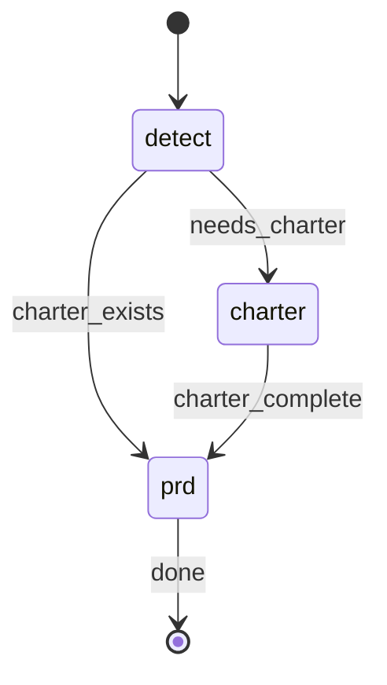

# Project Blueprint

## STATE-MACHINE



**On each phase transition**, report via:
```
rp1 agent-tools emit \
  --workflow blueprint \
  --type status_change \
  --run-id {RUN_ID} \
  --name "{RUN_NAME}" \
  --step {CURRENT_STATE} \
  --data '{"status": "running"}'
```

- `RUN_ID` comes from the generated Workflow Bootstrap section
- Derive `RUN_NAME`: use `"Blueprint: {PRD_NAME}"` when PRD_NAME is provided, otherwise use `"Blueprint: main"`

**State Progression Protocol**:
1. Report each `--step` with `--data '{"status": "running"}'` when you enter that state
2. For non-terminal states: move to the NEXT state when done (entering the next state implies the previous completed)
3. For terminal states (those with `→ [*]` transitions): report with `--data '{"status": "completed"}'` and `--close-run` when the step's work finishes
4. On error, transition to the appropriate failure state in the graph

**Example sequence** (with charter):
```
--workflow blueprint --step detect --name "Blueprint: mobile-app" --data '{"status": "running"}'   # first emit includes --name
--workflow blueprint --step charter --data '{"status": "running"}'    # needs charter, entering charter phase
--workflow blueprint --step prd --data '{"status": "running"}'        # charter done, entering prd phase
--workflow blueprint --step prd --data '{"status": "completed"}' --close-run      # prd done, workflow complete
```

## §CTX

Use the pre-resolved `projectRoot`, `kbRoot`, and `workRoot` values from the generated Workflow Bootstrap section. Do not hardcode `.rp1/work/` or `.rp1/context/` paths.

**Doc Hierarchy**:
1. **Charter** (`{kbRoot}/charter.md`) - Project-level: problem/context, users, business rationale, scope guardrails, success criteria
2. **PRDs** (`{workRoot}/prds/<name>.md`) - Surface-specific: overview, in/out scope, requirements, dependencies, timeline. Inherit from charter, link back, no duplication.

## §PROC

### Step 1: Detect Mode

Emit detect state:
```
rp1 agent-tools emit --workflow blueprint --type status_change --run-id {RUN_ID} --name "{RUN_NAME}" --step detect --data '{"status": "running"}'
```

Read `{kbRoot}/charter.md`:

| Condition | Charter Action | Next |
|-----------|----------------|------|
| Not exist | CREATE: create from template, dispatch charter-interviewer | Step 2 |
| Exists + has `_TBD_` sections | UPDATE: dispatch charter-interviewer to fill gaps | Step 2 |
| Exists + no `_TBD_` sections | Charter complete, skip charter phase | Step 3 |

### Step 2: Charter Phase

Emit charter state:
```
rp1 agent-tools emit --workflow blueprint --type status_change --run-id {RUN_ID} --step charter --data '{"status": "running"}'
```

**If CREATE** (charter does not exist):

Read the charter template at `plugins/base/skills/artifact-templates/templates/charter-interviewer/charter.md`. Create `{kbRoot}/charter.md` from it, filling `{Project Name}` with "To Be Determined", `{Date}` with today's date, and `{Draft | Complete}` with "Draft".

**Dispatch** (both CREATE and UPDATE):


CHARTER_PATH={kbRoot}/charter.md, MODE={CREATE or UPDATE}


Register charter artifact:
```bash
rp1 agent-tools emit \
  --workflow blueprint \
  --type artifact_registered \
  --run-id {RUN_ID} \
  --step charter \
  --data '{"path": "{kbRoot}/charter.md", "feature": "blueprint", "storageRoot": "project"}'
```

#### 2.1 Charter Completion Check

Read `{kbRoot}/charter.md` and check for remaining `_TBD_` markers.

**If NO `_TBD_` markers remain** (charter complete):

Proceed to Step 3.

**If `_TBD_` markers remain** (charter incomplete):

```
Charter partially complete -- some sections still need input.

Partial progress saved:
- {kbRoot}/charter.md

To resume: re-run `/rp1-dev:blueprint` -- the charter-interviewer will detect remaining _TBD_ sections and resume via gap analysis.
```

Emit waiting status (do NOT use `--close-run`):
```
rp1 agent-tools emit --workflow blueprint --type status_change --run-id {RUN_ID} --step charter --data '{"status": "waiting", "reason": "Charter has remaining _TBD_ sections"}'
```

Do NOT proceed to Step 3.

### Step 3: PRD Creation

Emit prd state:
```
rp1 agent-tools emit --workflow blueprint --type status_change --run-id {RUN_ID} --step prd --data '{"status": "running"}'
```

#### 3.1 PRD Name

`PRD_NAME = PRD_NAME || "main"`

#### 3.2 Init PRD

If `{workRoot}/prds/{PRD_NAME}.md` does not exist:

Read the PRD template at `plugins/base/skills/artifact-templates/templates/blueprint-wizard/prd.md`. Create `{workRoot}/prds/{PRD_NAME}.md` from it, filling `{Surface Name}` with `{PRD_NAME}` and `{Date}` with today's date.

If the PRD exists and contains no `_TBD_` sections, skip to 3.4 (PRD already complete).

#### 3.3 PRD Interview


PRD_NAME={PRD_NAME}, PRD_PATH={workRoot}/prds/{PRD_NAME}.md, EXTRA_CONTEXT={EXTRA_CONTEXT}, KB_ROOT={kbRoot}, WORK_ROOT={workRoot}


Register PRD artifact:
```bash
rp1 agent-tools emit \
  --workflow blueprint \
  --type artifact_registered \
  --run-id {RUN_ID} \
  --step prd \
  --data '{"path": "prds/{PRD_NAME}.md", "feature": "{PRD_NAME}", "storageRoot": "work_dir"}'
```

#### 3.4 Completion Check

Read `{workRoot}/prds/{PRD_NAME}.md` and check for remaining `_TBD_` markers.

**If NO `_TBD_` markers remain** (PRD complete):

```
PRD created!

Created:
- {workRoot}/prds/{PRD_NAME}.md

Next Steps:
- For a single feature: /rp1-dev:build <feature-id>
- For initiative-sized work: /rp1-dev:phase-plan prds/{PRD_NAME}.md
- Add more surfaces: /rp1-dev:blueprint mobile-app
```

Emit completion:
```
rp1 agent-tools emit --workflow blueprint --type status_change --run-id {RUN_ID} --step prd --data '{"status": "completed"}' --close-run
```

**If `_TBD_` markers remain** (PRD incomplete):

```
PRD partially complete -- some sections still need input.

Partial progress saved:
- {workRoot}/prds/{PRD_NAME}.md

To resume: re-run `/rp1-dev:blueprint {PRD_NAME}` -- the wizard will detect remaining _TBD_ sections and resume via gap analysis.
```

Emit incomplete status and close the current run before re-run:
```
rp1 agent-tools emit --workflow blueprint --type status_change --run-id {RUN_ID} --step prd --data '{"status": "incomplete", "reason": "PRD has remaining _TBD_ sections"}' --close-run
```

## §USAGE

**Default** (charter + main PRD): `/rp1-dev:blueprint`

**Named PRD** (requires charter): `/rp1-dev:blueprint mobile-app`

## §NEXT

- `/rp1-dev:phase-plan prds/{PRD_NAME}.md` - Decompose a large PRD into delivery phases before feature execution
- `/rp1-dev:build <feature-id>` - Build a single feature directly when the PRD already maps to one delivery slice
- Features can associate w/ parent PRD for context inheritance
