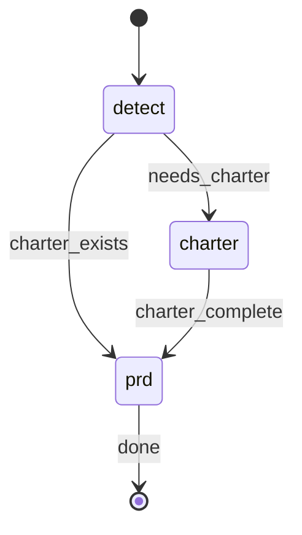

# Project Blueprint

## STATE-MACHINE



**On each phase transition**, report via:
```
rp1 agent-tools emit \
  --workflow blueprint \
  --type status_change \
  --run-id {RUN_ID} \
  --name "{RUN_NAME}" \
  --step {CURRENT_STATE} \
  --data '{"status": "running"}'
```

- `RUN_ID` comes from the generated Workflow Bootstrap section
- Derive `RUN_NAME`: use `"Blueprint: {PRD_NAME}"` when PRD_NAME is provided, otherwise use `"Blueprint: main"`

**State Progression Protocol**:
1. Report each `--step` with `--data '{"status": "running"}'` when you enter that state
2. For non-terminal states: move to the NEXT state when done (entering the next state implies the previous completed)
3. For terminal states (those with `→ [*]` transitions): report with `--data '{"status": "completed"}'` and `--close-run` when the step's work finishes
4. On error, transition to the appropriate failure state in the graph

**Example sequence** (with charter):
```
--workflow blueprint --step detect --name "Blueprint: mobile-app" --data '{"status": "running"}'   # first emit includes --name
--workflow blueprint --step charter --data '{"status": "running"}'    # needs charter, entering charter phase
--workflow blueprint --step prd --data '{"status": "running"}'        # charter done, entering prd phase
--workflow blueprint --step prd --data '{"status": "completed"}' --close-run      # prd done, workflow complete
```

## §CTX

Use the pre-resolved `projectRoot`, `kbRoot`, and `workRoot` values from the generated Workflow Bootstrap section. Do not hardcode `.rp1/work/` or `.rp1/context/` paths.

**Doc Hierarchy**:
1. **Charter** (`{kbRoot}/charter.md`) - Project-level: problem/context, users, business rationale, scope guardrails, success criteria
2. **PRDs** (`{workRoot}/prds/<name>.md`) - Surface-specific: overview, in/out scope, requirements, dependencies, timeline. Inherit from charter, link back, no duplication.

### Extra-Context Sidecar

EXTRA_CONTEXT is preserved across partial completions in a coordinator-owned sidecar keyed by the effective PRD name (`CONTEXT_KEY = PRD_NAME || "main"`). All sidecar CRUD goes through the `rp1 agent-tools blueprint-context` helper — never a raw `mkdir`/`echo`/`rm`. The helper validates the key, resolves the canonical path below `workRoot`, and writes atomically (random owner-only temp + rename), so arbitrary multiline/quoted/command-like context is stored verbatim and no reader ever sees a partial or shell-interpreted value.

`CONTEXT_KEY` shares one domain with `PRD_NAME` (see §NAME-GATE): a safe slug the helper accepts. The helper is the enforcement backstop — it rejects any unsafe key — so the sidecar and the PRD artifact path can never diverge.

Commands (payload travels over stdin via a quoted heredoc, never as a shell argument):

```bash
# write (only when EXTRA_CONTEXT is non-empty); pick a heredoc delimiter that
# does not occur in EXTRA_CONTEXT (append random digits if it might):
rp1 agent-tools blueprint-context write --key {CONTEXT_KEY} --work-root "{workRoot}" <<'RP1_CTX_EOF'
{EXTRA_CONTEXT}
RP1_CTX_EOF

# read (parse ToolResult: data.found / data.valid / data.content):
rp1 agent-tools blueprint-context read --key {CONTEXT_KEY} --work-root "{workRoot}"

# delete (idempotent):
rp1 agent-tools blueprint-context delete --key {CONTEXT_KEY} --work-root "{workRoot}"
```

**Lifecycle**:
- **Resolve early**: Resolved in Step 1.5, BEFORE the charter phase, so context survives a charter that exits partial. It is never managed inside the charter phase.
- **Write/overwrite**: When EXTRA_CONTEXT is explicitly supplied non-empty, write the sidecar before dispatching any agent.
- **Restore**: When EXTRA_CONTEXT is empty or absent, `read` the sidecar; if `data.found` and `data.valid`, use `data.content` as EXTRA_CONTEXT. Ignore a `found:false` or `valid:false` result (no authoritative context).
- **Retain**: Every partial exit (partial charter AND partial PRD) retains the sidecar.
- **Delete**: Only after the target PRD fully completes (no remaining `_TBD_` markers).

## §NAME-GATE

The effective PRD name (`PRD_NAME || "main"`) drives the sidecar key, the PRD artifact path (`{workRoot}/prds/{PRD_NAME}.md`), the dispatched wizard arguments, and the rerun guidance. Validate it ONCE, up front in Step 1, before any sidecar or artifact work:

- It MUST be a safe slug: letters, numbers, hyphen, and underscore only, starting with a letter or number — the exact domain enforced by `rp1 agent-tools blueprint-context`.
- If it does not match, ABORT immediately with an actionable error (do not create files, dispatch agents, or continue with a raw value):

```
Invalid PRD name '{PRD_NAME}'. Use letters, numbers, hyphens, and underscores only (e.g. mobile-app). Re-run with a valid name.
```

Never continue past this gate with a value that failed validation.

## §STATUS

The parent's `_TBD_` scan is the single source of truth for each document's `**Status**:` field. Whenever you scan `charter.md` or a PRD for `_TBD_` markers — before a dispatch-skip or a bounded exit — set that document's `**Status**:` line authoritatively:

- Zero `_TBD_` markers remain -> set `**Status**: Complete`.
- Any `_TBD_` markers remain -> set `**Status**: Draft` (downgrade a stale `Complete` from an earlier run or interruption).

Apply this on every scan path: charter-complete skip, charter partial exit, PRD-already-complete skip, PRD complete, and PRD partial exit.

## §PROC

### Step 1: Detect Mode

Emit detect state:
```
rp1 agent-tools emit --workflow blueprint --type status_change --run-id {RUN_ID} --name "{RUN_NAME}" --step detect --data '{"status": "running"}'
```

**First**, run the §NAME-GATE on the effective PRD name (`PRD_NAME || "main"`). Abort now if it is invalid — before reading, creating, or dispatching anything.

Read `{kbRoot}/charter.md`:

| Condition | Charter Action | Next |
|-----------|----------------|------|
| Not exist | CREATE: create from template, dispatch charter-interviewer | Step 2 |
| Exists + has `_TBD_` sections | UPDATE: dispatch charter-interviewer to fill gaps | Step 2 |
| Exists + no `_TBD_` sections | Charter complete, apply §STATUS (set Complete), skip charter phase | Step 3 |

### Step 1.5: Resolve Extra-Context (early)

`CONTEXT_KEY = PRD_NAME || "main"` was already validated by the §NAME-GATE in Step 1. Resolve the sidecar now, before the charter phase, so a charter that exits partial does not lose the user's context (§CTX Extra-Context Sidecar for the exact commands):

- If EXTRA_CONTEXT is non-empty: `blueprint-context write` it (overwrites any prior value).
- If EXTRA_CONTEXT is empty or absent: `blueprint-context read`; if `data.found` and `data.valid`, use `data.content` as EXTRA_CONTEXT. Otherwise proceed with no extra context.

This runs whether or not the charter is created.

### Step 2: Charter Phase

Emit charter state:
```
rp1 agent-tools emit --workflow blueprint --type status_change --run-id {RUN_ID} --step charter --data '{"status": "running"}'
```

**If CREATE** (charter does not exist):

Read the charter template at `plugins/base/skills/artifact-templates/templates/charter-interviewer/charter.md`. Create `{kbRoot}/charter.md` from it, filling `{Project Name}` with "To Be Determined", `{Date}` with today's date, and `{Draft | Complete}` with "Draft".

**Dispatch** (both CREATE and UPDATE):


CHARTER_PATH={kbRoot}/charter.md, MODE={CREATE or UPDATE}


Register charter artifact:
```bash
rp1 agent-tools emit \
  --workflow blueprint \
  --type artifact_registered \
  --run-id {RUN_ID} \
  --step charter \
  --data '{"path": "{kbRoot}/charter.md", "feature": "blueprint", "storageRoot": "project"}'
```

#### 2.1 Charter Completion Check

Read `{kbRoot}/charter.md` and check for remaining `_TBD_` markers.

**If NO `_TBD_` markers remain** (charter complete):

Apply §STATUS to `{kbRoot}/charter.md` (set `**Status**: Complete`), then proceed to Step 3.

**If `_TBD_` markers remain** (charter incomplete):

Apply §STATUS to `{kbRoot}/charter.md` (set `**Status**: Draft`), then print a rerun command that preserves the user's original arguments:

```
Charter partially complete -- some sections still need input.

Partial progress saved:
- {kbRoot}/charter.md

To resume, re-run:
```

- If PRD_NAME was provided: print `/rp1-dev:blueprint {PRD_NAME}`
- If no PRD_NAME was provided: print `/rp1-dev:blueprint`

```
The charter-interviewer will detect remaining _TBD_ sections and resume via gap analysis.
```

Emit completed status and close the run:
```
rp1 agent-tools emit --workflow blueprint --type status_change --run-id {RUN_ID} --step charter --data '{"status": "completed", "reason": "Charter has remaining _TBD_ sections"}' --close-run
```

Do NOT proceed to Step 3.

### Step 3: PRD Creation

Emit prd state:
```
rp1 agent-tools emit --workflow blueprint --type status_change --run-id {RUN_ID} --step prd --data '{"status": "running"}'
```

#### 3.1 PRD Name

`PRD_NAME = PRD_NAME || "main"`

#### 3.2 Init PRD

If `{workRoot}/prds/{PRD_NAME}.md` does not exist:

Read the PRD template at `plugins/base/skills/artifact-templates/templates/blueprint-wizard/prd.md`. Create `{workRoot}/prds/{PRD_NAME}.md` from it, filling `{Surface Name}` with `{PRD_NAME}` and `{Date}` with today's date.

If the PRD exists and contains no `_TBD_` sections, apply §STATUS to the PRD (set `**Status**: Complete`) and skip to 3.4 (PRD already complete).

#### 3.3 PRD Interview

EXTRA_CONTEXT was already resolved from the sidecar in Step 1.5 (early, quoted, validated key). Dispatch the wizard with that value:


PRD_NAME={PRD_NAME}, PRD_PATH={workRoot}/prds/{PRD_NAME}.md, EXTRA_CONTEXT={EXTRA_CONTEXT}, KB_ROOT={kbRoot}, WORK_ROOT={workRoot}


Register PRD artifact:
```bash
rp1 agent-tools emit \
  --workflow blueprint \
  --type artifact_registered \
  --run-id {RUN_ID} \
  --step prd \
  --data '{"path": "prds/{PRD_NAME}.md", "feature": "{PRD_NAME}", "storageRoot": "work_dir"}'
```

#### 3.4 Completion Check

Read `{workRoot}/prds/{PRD_NAME}.md` and check for remaining `_TBD_` markers.

**If NO `_TBD_` markers remain** (PRD complete):

Apply §STATUS to the PRD (set `**Status**: Complete`), then delete the PRD sidecar for `CONTEXT_KEY` (idempotent — succeeds even if none exists):
```bash
rp1 agent-tools blueprint-context delete --key {CONTEXT_KEY} --work-root "{workRoot}"
```

```
PRD created!

Created:
- {workRoot}/prds/{PRD_NAME}.md

Next Steps:
- For a single feature: /rp1-dev:build <feature-id>
- For initiative-sized work: /rp1-dev:phase-plan prds/{PRD_NAME}.md
- Add more surfaces: /rp1-dev:blueprint mobile-app
```

Emit completion:
```
rp1 agent-tools emit --workflow blueprint --type status_change --run-id {RUN_ID} --step prd --data '{"status": "completed"}' --close-run
```

**If `_TBD_` markers remain** (PRD incomplete):

Apply §STATUS to the PRD (set `**Status**: Draft`), then:

```
PRD partially complete -- some sections still need input.

Partial progress saved:
- {workRoot}/prds/{PRD_NAME}.md

To resume, re-run:
```

- Print `/rp1-dev:blueprint {PRD_NAME}`

Stored context is restored from the blueprint context sidecar on re-run.

```
The wizard will detect remaining _TBD_ sections and resume via gap analysis.
```

Emit completed status and close the run:
```
rp1 agent-tools emit --workflow blueprint --type status_change --run-id {RUN_ID} --step prd --data '{"status": "completed", "reason": "PRD has remaining _TBD_ sections"}' --close-run
```

## §USAGE

**Default** (charter + main PRD): `/rp1-dev:blueprint`

**Named PRD** (requires charter): `/rp1-dev:blueprint mobile-app`

## §NEXT

- `/rp1-dev:phase-plan prds/{PRD_NAME}.md` - Decompose a large PRD into delivery phases before feature execution
- `/rp1-dev:build <feature-id>` - Build a single feature directly when the PRD already maps to one delivery slice
- Features can associate w/ parent PRD for context inheritance
