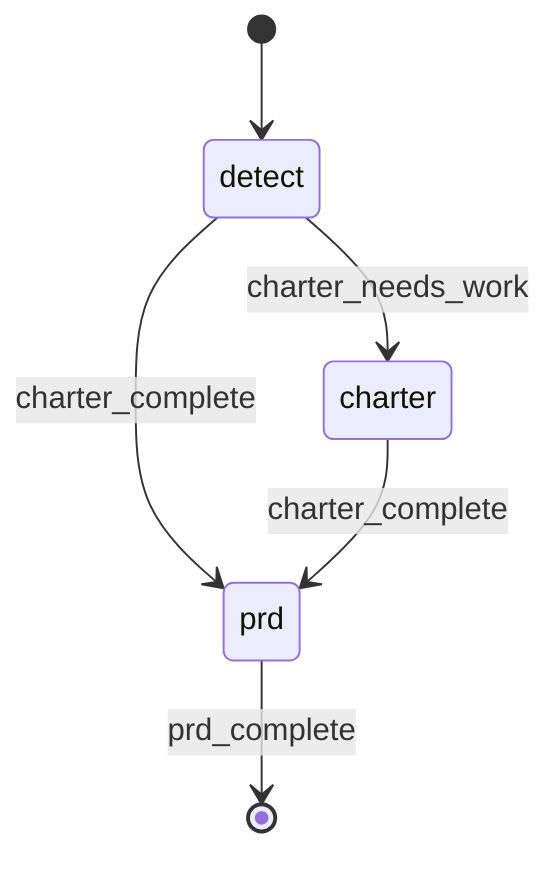

# Project Blueprint

The top-level skill owns every user-facing question. The two retained agents are optional, bounded, non-interactive finalizers that run only after the parent's accepted answers are durable.



## STATE-MACHINE



On each phase transition, report with `rp1 agent-tools emit` using workflow `blueprint`, the generated `{RUN_ID}`, and the current state as `--step`. Derive `RUN_NAME` as `Blueprint: {EFFECTIVE_PRD_NAME}`. The first emit includes `--name "{RUN_NAME}"`. Enter a non-terminal state with `{"status":"running"}`; finish `prd` with `{"status":"completed"}` and `--close-run`. On a fatal phase error, emit `{"status":"failed"}` for the current state before stopping.

## Context

Use the pre-resolved `projectRoot`, `kbRoot`, and `workRoot` values from Workflow Bootstrap. They are authoritative and may point to different storage locations.

- Charter: `{kbRoot}/charter.md`
- PRD: `PRD_PATH`, derived after name validation as `{workRoot}/prds/{EFFECTIVE_PRD_NAME}.md`
- Charter template: `plugins/base/skills/artifact-templates/templates/charter-interviewer/charter.md`
- PRD template: `plugins/base/skills/artifact-templates/templates/blueprint-wizard/prd.md`

## Procedure

### 1. Validate The PRD Name Before Effects

Set `EFFECTIVE_PRD_NAME = PRD_NAME || "main"`.

Validate `EFFECTIVE_PRD_NAME` against `^[A-Za-z0-9][A-Za-z0-9_-]*$`. Use the value exactly as validated; do not trim, sanitize, or rewrite it. If it does not match, explain that the name must begin with an ASCII letter or number and contain only ASCII letters, numbers, `_`, or `-`, then stop. This validation MUST happen before any artifact read, artifact write, user question, or agent dispatch.

After successful validation:

1. Set `PRD_PATH = {workRoot}/prds/{EFFECTIVE_PRD_NAME}.md`. This is the sole writable PRD artifact path.
2. Emit `detect` running.
3. Read `{kbRoot}/charter.md` to begin artifact-only detection.

Only after validation, when a creation step below needs a canonical template, read it from its direct path and fall back to the `rp1-base:artifact-templates` Template Index when the direct path is unavailable. If `rp1-base` is unavailable, tell the user to install it and stop before creating an artifact.

### 2. Create Or Resume The Charter

If the charter is missing, has required gaps, or has a status that disagrees with its content, emit `charter` running before the first charter write. If its required content and status are already complete, skip directly to the PRD phase.

If the charter does not exist:

1. Read the canonical charter template.
2. Fill `{Project Name}` from the current project directory name and `{Date}` with the current date.
3. Write the complete template to `{kbRoot}/charter.md` with status `Draft`.
4. Re-read the charter and verify that the written content is durable before continuing.
5. Register the verified write using the charter registration command below.

If it exists, preserve its completed content and use it as-is. Do not derive interview progress from workflow events or any auxiliary state.

The required charter regions are:

- `Vision`
- `Problem & Context`
- `Target Users`
- `Business Rationale`
- `Scope Guardrails / Will` (hierarchy-bearing list)
- `Scope Guardrails / Won't` (hierarchy-bearing list)
- `Success Criteria`

Missing, empty, or placeholder-only required regions are gaps. Vision must be substantive before completion. A list containing only `- _TBD_` is a gap. Inspect only these declared regions; preserve every other region exactly.

After every read, derive the expected status from these regions: `Complete` only when all are substantive, otherwise `Draft`. If the stored status disagrees, reconstruct the complete charter with only the status corrected, write it once, re-read and verify it, and register the verified write before taking another action.

When gaps exist, execute the shared parent-owned loop with a maximum of 10 questions for this phase:

1. Ask one focused charter question directly from this parent skill. Ask in the current top-level conversation and wait for the user's answer; no leaf agent participates in the question.
2. Interpret the accepted answer and apply it to every required region it resolves. Keep Will and Won't separate and preserve all nested list indentation.
3. Set status to `Complete` only when every required region is substantive; otherwise set it to `Draft`.
4. Write the complete reconstructed charter to `{kbRoot}/charter.md` once. Preserve completed and unrelated content.
5. Re-read the charter after the successful write, verify the accepted content, register the verified write, and recompute gaps from the fresh file before asking another question or dispatching a finalizer.

On a write, re-read, or verification failure, stop before another question or dispatch. If 10 questions are exhausted, keep the charter Draft, list the remaining gaps, provide rerun guidance, and stop without dispatching a finalizer.

#### Optional Charter Finalization

After the fresh charter read has no required gaps, the parent may dispatch the charter finalizer exactly once when prose or derived content needs normalization. Skip it when the artifact is already complete and coherent. Never dispatch it inside the interview loop or to discover a question.


CHARTER_PATH={kbRoot}/charter.md, KB_ROOT={kbRoot}, WORK_ROOT={workRoot}


Parse only the finalizer's raw `{status, artifact, gaps, warnings}` JSON. Re-read `{kbRoot}/charter.md` after a successful finalization and verify that all required regions remain substantive, Vision remains substantive, nested Will and Won't hierarchy is intact, and status matches content. If verification fails or gaps remain, keep status Draft and stop with the reported gaps; do not dispatch the finalizer again. Register a verified finalizer write.

#### Charter Registration

Run only after a charter write has succeeded and the re-read matches it:

```bash
rp1 agent-tools emit \
  --workflow blueprint \
  --type artifact_registered \
  --run-id {RUN_ID} \
  --step charter \
  --data '{"path": "{kbRoot}/charter.md", "feature": "blueprint", "storageRoot": "absolute"}'
```

### 3. Create Or Resume The PRD

Proceed only after the charter's fresh content is Complete. Emit `prd` running.

If `PRD_PATH` does not exist:

1. Read the canonical PRD template.
2. Fill `{Surface Name}` with `{EFFECTIVE_PRD_NAME}`, `{Resolved Charter Link}` with `[Project Charter]({kbRoot}/charter.md)`, and `{Date}` with the current date.
3. Persist `EXTRA_CONTEXT` in `**Additional Context**`. When `EXTRA_CONTEXT` is non-empty, also use it to fill any required PRD regions it substantively resolves. When it is empty, retain the section-scoped `_TBD_` placeholder.
4. Write the complete PRD to `PRD_PATH` with status `Draft`.
5. Re-read the PRD, verify the initialized content, and register the verified write before asking a question or dispatching a finalizer.

If the PRD exists, preserve its completed content. If non-empty `EXTRA_CONTEXT` is not already represented, reconstruct the complete document once to persist it in `**Additional Context**` and any required regions it resolves, then re-read, verify, and register that write before continuing.

The required PRD regions are:

- `Additional Context`
- `Surface Overview`
- `Scope / In Scope`
- `Scope / Out of Scope`
- `Requirements / Functional Requirements`
- `Requirements / Non-Functional Requirements`
- `Dependencies & Constraints`
- `Milestones & Timeline`
- `Open Questions`
- every cell in the first `Assumptions & Risks` data row

Missing, empty, or placeholder-only required regions are gaps. A substantive explicit value such as `None` or `No open questions` is complete. Inspect only these declared regions and preserve every other region exactly.

After every read, derive the expected status from these regions: `Complete` only when all are substantive, otherwise `Draft`. If the stored status disagrees, reconstruct the complete PRD with only the status corrected, write it once, re-read and verify it, and register the verified write before taking another action.

When gaps exist, execute the shared parent-owned loop with a maximum of 10 questions for this phase:

1. Ask one focused PRD question directly from this parent skill. Ask in the current top-level conversation and wait for the user's answer; no leaf agent participates in the question.
2. Interpret the accepted answer and apply it to every required region it resolves.
3. Set status to `Complete` only when every required region is substantive; otherwise set it to `Draft`.
4. Write the complete reconstructed PRD to `PRD_PATH` once. Preserve completed and unrelated content.
5. Re-read the PRD after the successful write, verify the accepted content, register the verified write, and recompute gaps from the fresh file before asking another question or dispatching a finalizer.

On a write, re-read, or verification failure, stop before another question or dispatch. If 10 questions are exhausted, keep the PRD Draft, list the remaining gaps, provide rerun guidance, and stop without dispatching a finalizer.

#### Optional PRD Finalization

After the fresh PRD read has no required gaps, the parent may dispatch the PRD finalizer exactly once when prose or derived content needs normalization. Skip it when the artifact is already complete and coherent. Never dispatch it inside the interview loop or to discover a question.

The previous canonical-root handoff was expressed as `PRD_NAME={PRD_NAME}, EXTRA_CONTEXT={EXTRA_CONTEXT}, KB_ROOT={kbRoot}, WORK_ROOT={workRoot}`. Preserve its root guarantee through the replacement below, but do not dispatch that legacy tuple: the raw name is replaced by the validated effective name, and `EXTRA_CONTEXT` is already durable in `PRD_PATH` rather than duplicated as finalizer state.


PRD_PATH={PRD_PATH}, PRD_NAME={EFFECTIVE_PRD_NAME}, KB_ROOT={kbRoot}, WORK_ROOT={workRoot}


Parse only the finalizer's raw `{status, artifact, gaps, warnings}` JSON. Re-read the PRD after a successful finalization and verify that required content and status still agree. If verification fails or gaps remain, keep status Draft and stop with the reported gaps; do not dispatch the finalizer again. Register a verified finalizer write.

#### PRD Registration

Run only after a PRD write has succeeded and the re-read matches it:

```bash
rp1 agent-tools emit \
  --workflow blueprint \
  --type artifact_registered \
  --run-id {RUN_ID} \
  --step prd \
  --data '{"path": "prds/{EFFECTIVE_PRD_NAME}.md", "feature": "{EFFECTIVE_PRD_NAME}", "storageRoot": "work_dir"}'
```

### 4. Complete

Re-read both artifacts. Complete only when the charter and PRD contain no required gaps and both statuses are `Complete`.

Terminal state guidance: close the run only after fresh reads prove both artifacts complete, using `--close-run`.

```bash
rp1 agent-tools emit \
  --workflow blueprint \
  --type status_change \
  --run-id {RUN_ID} \
  --step prd \
  --data '{"status": "completed"}' \
  --close-run
```

After that command succeeds, report:

```text
Blueprint complete!

Artifacts:
- {kbRoot}/charter.md
- {workRoot}/prds/{EFFECTIVE_PRD_NAME}.md

Next steps:
- /rp1-dev:phase-plan prds/{EFFECTIVE_PRD_NAME}.md
- /rp1-dev:build <feature-id>
```

## Usage

- Default charter and main PRD: `/rp1-dev:blueprint`
- Named PRD: `/rp1-dev:blueprint mobile-app`

Every invocation resumes from ordinary charter and PRD content. Current section gaps are the sole interview resume source.
