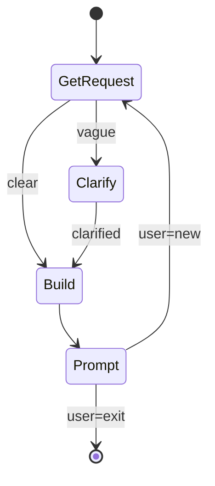

# Build Express

Interactive builder loop. Orchestrates build-fast-executor for each task.

**This command ONLY orchestrates. It does NOT implement code.**

## Parameters

Extract these parameters from the user's input:

| Parameter | Required | Default | Description |
|-----------|----------|---------|-------------|
| `REQUEST` | No | `""` | Initial development request (may be empty; will prompt if missing) |

**Environment values** (resolve via shell):
- `RP1_ROOT`: !`echo ${RP1_ROOT:-.rp1/}`

## 1. Main Loop



### 1.1 Get Request

If REQUEST empty: use AskUserQuestion to get task from user.

### 1.2 Clarity Check

**Super vague** (ask for clarification):
- Single word: "refactor", "fix", "improve"
- No actionable target: "make it better"

**Clear enough** (proceed):
- Specific action + target: "add logout button to navbar"
- Bug description: "fix null error in auth.ts"
- File/component reference: "update UserCard styling"

If vague: ask ONE clarifying question. Do NOT over-interrogate.

### 1.3 Deploy Builder

**Spawn build-fast-executor**:

```
Task: rp1-dev:build-fast-executor
prompt: |
  REQUEST={REQUEST}
  AFK_MODE=false
  USE_WORKTREE=false
  RP1_ROOT={{$RP1_ROOT}}
```

**Wait for completion. Do NOT implement anything yourself.**

### 1.4 Post-Build Prompt

After builder completes, use AskUserQuestion:

**Question**: "What would you like to do next?"

**Options**:
| Option | Action |
|--------|--------|
| Work on new task | Loop to 1.1 |
| Exit | STOP |

### 1.5 New Task

Clear REQUEST, loop to 1.1 (Get Request).

## 2. Session End

On exit, report tasks completed count.

```markdown
## Session Summary

**Tasks Completed**: {count}

Express session ended.
```

## 3. Orchestrator Rules

**YOU MUST**:
- Only use AskUserQuestion and Task tools
- Delegate ALL implementation to build-fast-executor
- Track task count

**YOU MUST NOT**:
- Read/write/edit any code files
- Load KB files
- Run quality checks
- Make any implementation decisions
