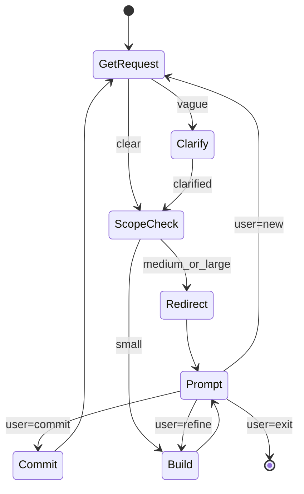

# Build Express

Interactive builder loop for rapid, small changes. Delegates each request to a single general sub-agent.

**This command ONLY orchestrates. It does NOT implement code.**

**First emit**: Include `--name "{RUN_NAME}"` on the first emit call to label the run in the Arcade dashboard. Derive `RUN_NAME` from the initial request: a brief summary (max 60 chars) prefixed with `"Feature: "`. Generate `RUN_ID` as a UUID at session start. Example:
```bash
rp1 agent-tools emit \
  --workflow build-express \
  --type status_change \
  --run-id {RUN_ID} \
  --name "Feature: {brief summary of request}" \
  --step build \
  --data '{"status": "running"}'
```

## 1. Main Loop



### 1.1 Get Request

If REQUEST empty:



### 1.2 Clarity Check

**Super vague** (ask for clarification):
- Single word: "refactor", "fix", "improve"
- No actionable target: "make it better"

**Clear enough** (proceed):
- Specific action + target: "add logout button to navbar"
- Bug description: "fix null error in auth.ts"
- File/component reference: "update UserCard styling"

If vague: ask ONE clarifying question. Do NOT over-interrogate.

### 1.3 Scope Gate

Before delegating, assess the request:

| Factor | Small (proceed) | Medium/Large (redirect) |
|--------|-----------------|------------------------|
| Files | 1-3 | >3 |
| Systems | 1 | >1 |
| Risk | Low | Medium or High |
| Estimated effort | <2h | >2h |

**If Medium or Large**: Do NOT delegate. Instead output:

```markdown
## This request is better suited for a structured workflow

**Request**: {summary}
**Why**: {brief reason — e.g. touches multiple systems, high risk, many files}

**Recommended**:
- For medium work (2-8h): `/rp1-dev:build-fast "{REQUEST}"`
- For large work (>8h): `/rp1-dev:build "{feature-id}"`
```

Then loop to §1.5 (Post-Build Prompt) so the user can submit a smaller request or exit.

### 1.4 Deploy Builder

Spawn a single general sub-agent to implement the request:


Implement the following change in the codebase:

{REQUEST}

Keep changes minimal and focused. Run any relevant lint/format/test
checks after making changes. Do NOT commit.


**Wait for completion. Do NOT implement anything yourself.**

### 1.5 Post-Build Prompt

After builder completes, emit waiting status so the Arcade dashboard reflects the gate pause:

```bash
rp1 agent-tools emit \
  --workflow build-express \
  --type waiting_for_user \
  --run-id {RUN_ID} \
  --step build \
  --data '{"prompt": "What would you like to do next?", "context": "Post-build prompt after express builder completes"}'
```



| Option | Action |
|--------|--------|
| Commit & move on | Commit current changes (conventional commit), then loop to 1.1 |
| Refine | Ask what to change, re-invoke §1.4 with refinement as REQUEST |
| Review feedback from Arcade | Load the `arcade-collab` skill (`/rp1-dev:arcade-collab`), then call `rp1 agent-tools feedback read --run-id {RUN_ID} --status open`. If feedback exists, process it per the collaboration loop in the skill. After all feedback is processed, return to this prompt and re-present the same options. **Not shown when `AFK=true`.** |
| New task (no commit) | Loop to 1.1 without committing |
| Exit | STOP |

After a scope redirect (§1.3), show only "New task" and "Exit" options (no feedback review since no build occurred).

### 1.6 Commit

When user chooses "Commit & move on":
1. Stage all changed files (prefer specific files over `git add -A`)
2. Generate a concise conventional commit message summarizing the change
3. Create the commit
4. Loop to 1.1 (Get Request)

### 1.7 New Task

Clear REQUEST, loop to 1.1 (Get Request).

## 2. Session End

On exit, report tasks completed count.

```markdown
## Session Summary

**Tasks Completed**: {count}

Express session ended.
```

## 3. Orchestrator Rules

**YOU MUST**:
- Only use user-input and agent-dispatch tools
- Delegate ALL implementation to the sub-agent
- Scope-gate every request before delegating
- Track task count

**YOU MUST NOT**:
- Read/write/edit any code files
- Load KB files
- Run quality checks
- Make any implementation decisions
- Delegate medium or large scope work
