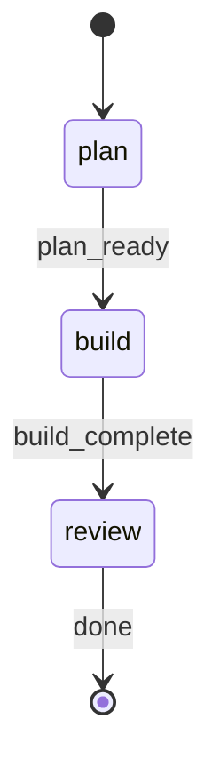

# Build Fast Command

Quick-iteration workflow for focused changes. Three-phase execution: plan -> build -> [review].

## §CTX

Use the pre-resolved `projectRoot`, `kbRoot`, `workRoot`, and `codeRoot` values from the generated Workflow Bootstrap section. Do not hardcode `.rp1/work/` or `.rp1/context/` paths.

## §VERSION-GATE

**If** `RP1_VERSION` < 0.3.3 **then** STOP execution with message:

```
Your rp1 CLI needs to be updated.

Please run `/rp1-base:self-update` to update, then retry this command.

Or in the terminal: `rp1 update`
```

## §FLAG-LOGIC

**CRITICAL OVERRIDE**: When `AFK=true`, treat `CONFIRM_PLAN` as `false` regardless of its passed value. AFK mode means zero user interaction - skip ALL user prompts throughout this workflow.

When `AFK=false`, the plan review checkpoint is mandatory after planner artifact registration and before §PHASE-2. `CONFIRM_PLAN` does not control the plan checkpoint; it only enables the post-implementation checkpoint in §4.4.

**Effective values when AFK=true**:

- Plan review checkpoint -> SKIP
- `CONFIRM_PLAN` -> `false` (forced, disables post-implementation checkpoint)
- All checkpoints -> SKIP (no user prompts)

## STATE-MACHINE



**On each phase transition**, report via:
```
rp1 agent-tools emit \
  --workflow build-fast \
  --type status_change \
  --run-id {RUN_ID} \
  --name "{RUN_NAME}" \
  --step {CURRENT_STATE} \
  --data '{"status": "running"}'
```

- `RUN_ID` comes from the generated Workflow Bootstrap section
- Derive `RUN_NAME` from the development request: a brief summary (max 60 chars) prefixed with `"Feature: "` (e.g., `"Feature: Add logout button to navbar"`)

**State Progression Protocol**:
1. Report each `--step` with `--data '{"status": "running"}'` when you enter that state
2. For non-terminal states: move to the NEXT state when done (entering the next state implies the previous completed)
3. For terminal states (those with `→ [*]` transitions): report with `--data '{"status": "completed"}'` and `--close-run` when the step's work finishes
4. On error, transition to the appropriate failure state in the graph

**Example sequence**:
```
--workflow build-fast --step plan --name "Feature: Add logout button" --data '{"status": "running"}'   # first emit includes --name
--workflow build-fast --step build --data '{"status": "running"}'      # plan done, entering build phase
--workflow build-fast --step review --data '{"status": "running"}'     # build done, entering review phase
--workflow build-fast --step review --data '{"status": "completed"}' --close-run   # review done, workflow complete
```

## §PHASE-1: Planning

**Spawn agent**:


DEVELOPMENT_REQUEST={DEVELOPMENT_REQUEST}, WORKFLOW=build-fast, RUN_ID={RUN_ID}, KB_ROOT={kbRoot}, WORK_ROOT={workRoot}


**Parse response**: Extract `scope`, `plan_summary`, `files_affected`, `reasoning`, `artifact_path`, `artifact_relative_path`, `task_count`, `task_ids`, plus optional `redirect_target` and `redirect_command`.

**If planner fails or returns an error**: Retry the planner once. If it fails again, use a `general-purpose` agent with the same prompt to generate the plan and artifact. Never skip planning — always produce an artifact before §PHASE-2.

### §1.1 Large Scope Redirect

If `scope` = "Large":

Output the planner's `redirect_message` and STOP.

Interpret the planner redirect before stopping:

- `redirect_target = "phase-plan"` means the request is initiative-sized or spans multiple independently valuable delivery slices. Treat `/phase-plan` as the supported next step. Do NOT redirect to legacy tracker or milestone workflows.
- `redirect_target = "build"` means the request is still one feature, but too large for `/build-fast`. Treat `/build` as the supported next step.
- If `redirect_target` is missing, preserve the planner's `redirect_message` as-is and STOP without inventing alternate routing.

### §1.2 Plan Review Checkpoint

**SKIP ENTIRELY if**: `AFK=true`

When skipped: Do NOT prompt the user. Proceed directly to §PHASE-2.

**Interactive plan gate rule**: When `AFK=false`, this checkpoint is REQUIRED after the planner registers the quick-build artifact and before entering §PHASE-2. Complete both actions below in order:
1. Emit `waiting_for_user` for the plan gate
2. Call `ask_user` and wait for the answer

The `waiting_for_user` emit does not replace the `ask_user` call. Continuing to §PHASE-2 without both is an invalid workflow transition.

Emit waiting status so the Arcade dashboard reflects the gate pause:

```bash
rp1 agent-tools emit \
  --workflow build-fast \
  --type waiting_for_user \
  --run-id {RUN_ID} \
  --step plan \
  --data '{"prompt": "Proceed with plan?", "context": "Plan review checkpoint after planning phase"}'
```

Present the plan review to the user:

## Plan Review

**Scope**: {scope}
**Estimated Effort**: {estimated_effort from plan}
**Artifact**: {artifact_path}

**Tasks**:
{list tasks from artifact}

**Files**: {files_affected}

**Mandatory checkpoint**: The very next action must be the `ask_user` call below. Do NOT start §PHASE-2 until the user has answered. Do NOT skip this gate when `AFK=false`.



**On "Continue"**: Proceed to §PHASE-2.
**On "Revise"**: Prompt for feedback, re-invoke §PHASE-1 with feedback appended to DEVELOPMENT_REQUEST.
**On "Review feedback from Arcade"**: Load the `arcade-collab` skill (`/rp1-dev:arcade-collab`), then call `rp1 agent-tools feedback read --run-id {RUN_ID} --status open`. If feedback exists, process it per the collaboration loop in the skill. After all feedback is processed, return to this gate and re-present the same options.
**On "Stop"**:
```bash
rp1 agent-tools emit end-run \
  --run-id {RUN_ID} \
  --outcome cancelled \
  --reason "User stopped during the build-fast plan review checkpoint"
```
Output "Build fast cancelled. Artifact preserved at {artifact_path}" and STOP.

**Transition guard**: If `AFK=false`, do not enter §PHASE-2 unless this checkpoint produced both a `waiting_for_user` emit and an `ask_user` answer in the current run.

## §PHASE-2: Execution

**CRITICAL**: You are an orchestrator. You MUST delegate implementation to `task-builder` by spawning an agent. Do NOT write, edit, or create source code files yourself. Do NOT implement the plan directly. Your only job is to spawn agents and parse their responses.

### §2.1 Cleanup Manifest Baseline

Before task-builder runs, snapshot the repository state that bounds build-owned cleanup:

```bash
rp1 agent-tools change-manifest snapshot \
  --code-root "{codeRoot}" \
  --out "{workRoot}/quick-builds/{RUN_ID}-change-manifest-baseline.json"
```

Parse the `ToolResult` envelope. If the command fails or returns malformed output, continue execution but record `cleanup_manifest_result` as skipped with `skipReason: "baseline_snapshot_failed"`, `files: 0`, `ownedLineCount: 0`, and `statusPath: "{workRoot}/quick-builds/{RUN_ID}-change-manifest-status.json"`. Do not dispatch `comment-cleaner` later unless a generated manifest result explicitly returns `status: "created"` and non-empty ownership.

### §2.2 Task Execution

**You MUST spawn task-builder here.** Do not implement the tasks yourself.


KB_ROOT={kbRoot}
WORK_ROOT={workRoot}
CODE_ROOT={codeRoot}
QUICK_BUILD_PATH={workRoot}/{artifact_relative_path}
TASK_IDS={task_ids}
GIT_COMMIT={GIT_COMMIT}
WORKFLOW=build-fast
RUN_ID={RUN_ID}


**Parse response**: Verify "Builder Complete" in output.

## §PHASE-3: Review (Optional)

**Skip if**: `REVIEW=false`

### §3.1 Task Review

**You MUST use `subagent_type: rp1-dev:task-reviewer`** — do not use `general-purpose` or any other agent type.


KB_ROOT={kbRoot}
WORK_ROOT={workRoot}
QUICK_BUILD_PATH={workRoot}/{artifact_relative_path}
TASK_IDS={task_ids}
GIT_COMMIT={GIT_COMMIT}
WORKFLOW=build-fast
RUN_ID={RUN_ID}


**Parse response**: Extract `status` (SUCCESS or FAILURE).

### §3.2 Retry on Failure

If `status` = "FAILURE":

1. Extract `issues` and `summary` from reviewer response
2. Re-spawn task-builder with feedback. If `GIT_COMMIT=true`, set `REWRITE_COMMITS=true` so the builder can amend the prior commit into proper atomic format:


KB_ROOT={kbRoot}
WORK_ROOT={workRoot}
CODE_ROOT={codeRoot}
QUICK_BUILD_PATH={workRoot}/{artifact_relative_path}
TASK_IDS={task_ids}
GIT_COMMIT={GIT_COMMIT}
REWRITE_COMMITS=true
PREVIOUS_FEEDBACK={reviewer summary and issues}
WORKFLOW=build-fast
RUN_ID={RUN_ID}


3. Do NOT retry reviewer after retry builder (max 1 retry total)

## §PHASE-4: Finalization

**Phase handoff rule**: After §PHASE-3 completes successfully, do not register artifacts, do not emit final output, and do not stop. First generate the cleanup manifest and run manifest-gated cleanup, then evaluate §4.4. When `AFK=false` AND `CONFIRM_PLAN=true`, the post-implementation checkpoint in §4.4 must run before §OUTPUT.

### §4.1 Cleanup Manifest Generation

After implementation and optional review finish, generate the durable cleanup handoff:

```bash
rp1 agent-tools change-manifest generate \
  --code-root "{codeRoot}" \
  --out "{workRoot}/quick-builds/{RUN_ID}-change-manifest-001.json" \
  --status-out "{workRoot}/quick-builds/{RUN_ID}-change-manifest-status.json" \
  --source build-fast \
  --baseline "{workRoot}/quick-builds/{RUN_ID}-change-manifest-baseline.json"
```

Parse the `ToolResult` envelope into `cleanup_manifest_result`.

- If `data.status == "created"` and `data.files > 0` and `data.ownedLineCount > 0`, dispatch `comment-cleaner` with `data.manifestPath` and `{codeRoot}`.
- If `data.status == "skipped"`, keep `data.statusPath` and `data.skipReason` for final output. Do not ask `comment-cleaner` to infer scope.
- If the tool fails or returns malformed output, set `cleanup_manifest_result` to a skipped warning with `skipReason: "change_manifest_generate_failed"`, `files: 0`, `ownedLineCount: 0`, and `statusPath: "{workRoot}/quick-builds/{RUN_ID}-change-manifest-status.json"`.

### §4.2 Comment Cleanup

If `cleanup_manifest_result` is created and non-empty:


CHANGE_MANIFEST={cleanup_manifest_result.data.manifestPath}, CODE_ROOT={codeRoot}


Otherwise set the `comment_cleaner` result yourself:

```json
{
  "status": "WARN",
  "files_checked": 0,
  "manifest_path": null,
  "manifest_status_path": "{cleanup_manifest_result.data.statusPath}",
  "skip_reason": "{cleanup_manifest_result.data.skipReason}",
  "message": "Automatic comment cleanup skipped because no non-empty generated manifest was available."
}
```

Do not dispatch comment-cleaner with branch, unstaged, commit-range, base-branch, mode, or commit parameters; the generated manifest is the only safe cleanup boundary.

### §4.3 Push (Conditional)

**Skip if**: `GIT_PUSH=false`

```bash
git push -u origin {branch}
```

### §4.4 Post-Implementation Checkpoint

**SKIP ENTIRELY if**: `AFK=true` OR `CONFIRM_PLAN=false`

When skipped: Do NOT prompt the user. Proceed directly to §OUTPUT.

**Interactive confirm mode rule**: When `AFK=false` AND `CONFIRM_PLAN=true`, this checkpoint is REQUIRED. Before entering §OUTPUT, you must complete both actions below in order:
1. Emit `waiting_for_user` for the post-implementation gate
2. Call `ask_user` and wait for the answer

The `waiting_for_user` emit does not replace the `ask_user` call. Continuing to §OUTPUT without both is an invalid workflow transition.
The next action after manifest-gated cleanup must be this checkpoint when interactive confirm mode is active.
Do not emit `artifact_registered` for the build step before this checkpoint completes.

Emit waiting status so the Arcade dashboard reflects the gate pause:

```bash
rp1 agent-tools emit \
  --workflow build-fast \
  --type waiting_for_user \
  --run-id {RUN_ID} \
  --step build \
  --data '{"prompt": "Continue or make additional changes?", "context": "Post-implementation checkpoint after build phase"}'
```

Present the post-implementation checkpoint to the user:

## Implementation Complete

**Branch**: {branch}
**Artifact**: {artifact_path}

Review the changes.

**Mandatory checkpoint**: The very next action must be the `ask_user` call below. Do NOT continue to §OUTPUT until the user has answered. Do NOT skip this gate when `AFK=false` and `CONFIRM_PLAN=true`.



**On "Add/Edit"**: Prompt for additional request, re-invoke §PHASE-2 with new request appended.
**On "Review feedback from Arcade"**: Load the `arcade-collab` skill (`/rp1-dev:arcade-collab`), then call `rp1 agent-tools feedback read --run-id {RUN_ID} --status open`. If feedback exists, process it per the collaboration loop in the skill. After all feedback is processed, return to this gate and re-present the same options.
**On "Done"**: Continue to output.

**Transition guard**: If `AFK=false` AND `CONFIRM_PLAN=true`, do not enter §OUTPUT unless this checkpoint produced both a `waiting_for_user` emit and an `ask_user` answer in the current run.

## §OUTPUT

Register the artifact in the database:

```bash
rp1 agent-tools emit \
  --workflow build-fast \
  --type artifact_registered \
  --run-id {RUN_ID} \
  --step build \
  --data '{"path": "{artifact_relative_path}", "feature": "quick-build", "storageRoot": "work_dir"}'
```

```markdown
## Build Fast Complete

**Request**: {brief summary of DEVELOPMENT_REQUEST}
**Scope**: {scope}
**Artifact**: {artifact_path}
**Branch**: {branch}
**Tasks**: {task_count} tasks ({task_ids})

**Changes**:
{list files modified from builder output}

**Quality**: {format/lint/test status from builder}
**Review**: {PASSED | SKIPPED | FAILED+RETRIED} (based on REVIEW flag)
**Comment Cleanup**: {comment_cleaner.status}
**Cleanup Manifest**: {cleanup_manifest_result.data.manifestPath or "None"}
**Cleanup Status**: {cleanup_manifest_result.data.statusPath}
**Cleanup Skip Reason**: {cleanup_manifest_result.data.skipReason or "None"}
```

## §ORCHESTRATOR-RULES

**MANDATORY — violations cause eval failure**:

**DO**:
- Spawn agents for every phase (planner, task-builder, reviewer)
- Wait for each spawned agent to complete before proceeding
- Prompt user for the plan checkpoint whenever `AFK=false`
- Treat the plan checkpoint as a hard gate when `AFK=false`
- Treat the post-implementation checkpoint as a hard gate when `AFK=false` AND `CONFIRM_PLAN=true`
- Register artifact via `rp1 agent-tools emit --type artifact_registered` in §OUTPUT — this is REQUIRED

**DO NOT** (hard constraints — never violate these):
- Write/edit ANY source code files directly — planner writes the artifact, task-builder writes code
- Read source code files to understand the task — subagents handle their own context
- Implement anything yourself — you are ONLY a workflow orchestrator, not an implementer
- Skip the task-builder spawn — it is MANDATORY for Small/Medium scope
- Skip a required plan-review checkpoint in interactive mode
- Skip a required post-implementation checkpoint in interactive confirm mode
- Emit final `artifact_registered` output for the build phase before a required post-implementation checkpoint completes
- Write the plan artifact yourself if the planner fails — retry the planner instead
- Fall back to manual implementation if any agent fails — retry once, then STOP with error

## §ANTI-LOOP

Single-pass per phase. Parse args -> plan -> [checkpoint] -> execute via task-builder -> [review] -> [checkpoint] -> STOP.
