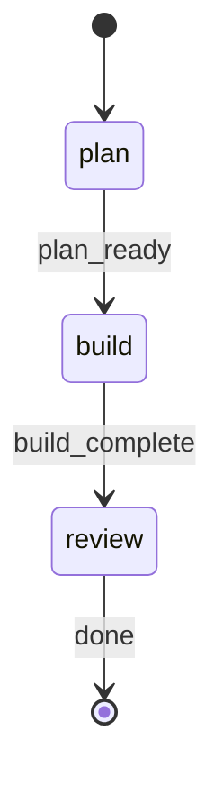

# Build Fast Command

Quick-iteration workflow for focused changes. Three-phase execution: plan -> build -> [review].

## Parameters

Extract these parameters from the user's input:

| Parameter | Required | Default | Description |
|-----------|----------|---------|-------------|
| `DEVELOPMENT_REQUEST` | Yes | - | The freeform development request text |
| `AFK` | No | `false` | Non-interactive mode. Set `true` if user says "afk", "no prompts", or "unattended" |
| `CONFIRM_PLAN` | No | `false` | Enable plan review checkpoint and post-implementation review. Set `true` if user says "confirm", "review plan", or "confirm-plan" |
| `REVIEW` | No | `false` | Enable task-reviewer validation after implementation. Set `true` if user says "review", "verify", or "check" |
| `GIT_COMMIT` | No | `false` | Commit changes. Set `true` if user says "commit" |
| `GIT_PUSH` | No | `false` | Push branch to remote. Set `true` if user says "push" |

**Environment values** (resolve via shell):
- `RP1_ROOT`: !`rp1 agent-tools rp1-root-dir` (extract `data.root` from JSON response)

## §VERSION-GATE

**If** `RP1_VERSION` < 0.3.3 **then** STOP execution with message:

```
Your rp1 CLI needs to be updated.

Please run `/rp1-base:self-update` to update, then retry this command.

Or in the terminal: `rp1 update`
```

## §FLAG-LOGIC

**CRITICAL OVERRIDE**: When `AFK=true`, treat `CONFIRM_PLAN` as `false` regardless of its passed value. AFK mode means zero user interaction - skip ALL `AskUserQuestion` calls throughout this workflow.

**Effective values when AFK=true**:

- `CONFIRM_PLAN` -> `false` (forced)
- All checkpoints -> SKIP (no AskUserQuestion)

## STATE-MACHINE



**On each phase transition**, report via:
```
rp1 agent-tools work update \
  --project "$(pwd)" \
  --feature {FEATURE_ID} \
  --workflow build-fast \
  --run-id {RUN_ID} \
  --step {CURRENT_STATE} \
  --status started
```

- Generate `RUN_ID` as a UUID at workflow start

**State Progression Protocol**:
1. Report each `--step` with `--status started` when you enter that state
2. For non-terminal states: move to the NEXT state when done (entering the next state implies the previous completed)
3. For terminal states (those with `→ [*]` transitions): report `--status completed` when the step's work finishes
4. On error, transition to the appropriate failure state in the graph

**Example sequence**:
```
--step plan --status started      # entering plan phase
--step build --status started     # plan done, entering build phase
--step review --status started    # build done, entering review phase
--step review --status completed  # review done, workflow complete
```

## §PHASE-1: Planning

**Spawn agent**:

```
Task: rp1-dev:build-fast-planner
prompt: DEVELOPMENT_REQUEST={DEVELOPMENT_REQUEST}, RP1_ROOT={{$RP1_ROOT}}, WORKFLOW=build-fast, RUN_ID={RUN_ID}
```

**Parse response**: Extract `scope`, `plan_summary`, `files_affected`, `reasoning`, `artifact_path`, `task_count`, `task_ids`.

**If planner fails or returns an error**: Retry the planner once. If it fails again, use a `general-purpose` agent with the same prompt to generate the plan and artifact. Never skip planning — always produce an artifact before §PHASE-2.

### §1.1 Large Scope Redirect

If `scope` = "Large":

Output the planner's `redirect_message` and STOP.

### §1.2 Plan Review Checkpoint

**SKIP ENTIRELY if**: `AFK=true` OR `CONFIRM_PLAN=false`

When skipped: Do NOT call AskUserQuestion. Proceed directly to §PHASE-2.

```
AskUserQuestion: |
  ## Plan Review

  **Scope**: {scope}
  **Estimated Effort**: {estimated_effort from plan}
  **Artifact**: {artifact_path}

  **Tasks**:
  {list tasks from artifact}

  **Files**: {files_affected}

  Options:
  1. "Continue" - Proceed with implementation
  2. "Revise" - Re-plan with your feedback
  3. "Stop" - Exit (artifact preserved for reference)
```

**On "Revise"**: Prompt for feedback, re-invoke §PHASE-1 with feedback appended to DEVELOPMENT_REQUEST.
**On "Stop"**: Output "Build fast cancelled. Artifact preserved at {artifact_path}" and STOP.

## §PHASE-2: Execution

**CRITICAL**: You are an orchestrator. You MUST delegate implementation to `task-builder` via the Task tool. Do NOT write, edit, or create source code files yourself. Do NOT implement the plan directly. Your only job is to spawn agents and parse their responses.

### §2.1 Task Execution

**You MUST spawn task-builder here.** Do not implement the tasks yourself.

```
Task: rp1-dev:task-builder
prompt: |
  QUICK_BUILD_PATH={artifact_path}
  TASK_IDS={task_ids}
  GIT_COMMIT={GIT_COMMIT}
  RP1_ROOT={{$RP1_ROOT}}
  WORKFLOW=build-fast
  RUN_ID={RUN_ID}
```

**Parse response**: Verify "Builder Complete" in output.

## §PHASE-3: Review (Optional)

**Skip if**: `REVIEW=false`

### §3.1 Task Review

**You MUST use `subagent_type: rp1-dev:task-reviewer`** — do not use `general-purpose` or any other agent type.

```
Task: rp1-dev:task-reviewer
prompt: |
  QUICK_BUILD_PATH={artifact_path}
  TASK_IDS={task_ids}
  GIT_COMMIT={GIT_COMMIT}
  RP1_ROOT={{$RP1_ROOT}}
  WORKFLOW=build-fast
  RUN_ID={RUN_ID}
```

**Parse response**: Extract `status` (SUCCESS or FAILURE).

### §3.2 Retry on Failure

If `status` = "FAILURE":

1. Extract `issues` and `summary` from reviewer response
2. Re-invoke task-builder with feedback:

```
Task: rp1-dev:task-builder
prompt: |
  QUICK_BUILD_PATH={artifact_path}
  TASK_IDS={task_ids}
  GIT_COMMIT={GIT_COMMIT}
  RP1_ROOT={{$RP1_ROOT}}
  PREVIOUS_FEEDBACK={reviewer summary and issues}
  WORKFLOW=build-fast
  RUN_ID={RUN_ID}
```

3. Do NOT retry reviewer after retry builder (max 1 retry total)

## §PHASE-4: Finalization

### §4.1 Push (Conditional)

**Skip if**: `GIT_PUSH=false`

```bash
git push -u origin {branch}
```

### §4.2 Post-Implementation Checkpoint

**SKIP ENTIRELY if**: `AFK=true` OR `CONFIRM_PLAN=false`

When skipped: Do NOT call AskUserQuestion. Proceed directly to §OUTPUT.

```
AskUserQuestion: |
  ## Implementation Complete

  **Branch**: {branch}
  **Artifact**: {artifact_path}

  Review the changes, then:
  1. "Done" - Finish workflow
  2. "Add/Edit" - Describe additional changes needed
```

**On "Add/Edit"**: Prompt for additional request, re-invoke §PHASE-2 with new request appended.
**On "Done"**: Continue to output.

## §OUTPUT

Register the artifact in the database:

```bash
rp1 agent-tools work artifact \
  --project "$(pwd)" \
  --feature {FEATURE_ID} \
  --run-id {RUN_ID} \
  --path {artifact_path}
```

```markdown
## Build Fast Complete

**Request**: {brief summary of DEVELOPMENT_REQUEST}
**Scope**: {scope}
**Artifact**: {artifact_path}
**Branch**: {branch}
**Tasks**: {task_count} tasks ({task_ids})

**Changes**:
{list files modified from builder output}

**Quality**: {format/lint/test status from builder}
**Review**: {PASSED | SKIPPED | FAILED+RETRIED} (based on REVIEW flag)
```

## §ORCHESTRATOR-RULES

**MANDATORY — violations cause eval failure**:

**DO**:
- Spawn agents via Task/Agent tool for every phase (planner, task-builder, reviewer)
- Wait for each Task to complete before proceeding
- Use AskUserQuestion for user interactions (when not AFK)
- Register artifact via `rp1 agent-tools work artifact` in §OUTPUT — this is REQUIRED

**DO NOT** (hard constraints — never violate these):
- Write/edit ANY source code files directly — planner writes the artifact, task-builder writes code
- Read source code files to understand the task — subagents handle their own context
- Implement anything yourself — you are ONLY a workflow orchestrator, not an implementer
- Skip the task-builder spawn — it is MANDATORY for Small/Medium scope
- Write the plan artifact yourself if the planner fails — retry the planner instead
- Fall back to manual implementation if any agent fails — retry once, then STOP with error

## §ANTI-LOOP

Single-pass per phase. Parse args -> plan -> [checkpoint] -> execute via task-builder -> [review] -> [checkpoint] -> STOP.
