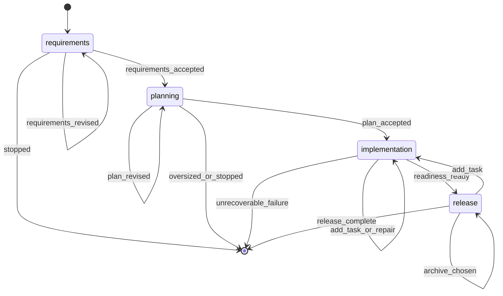

# Build Command

**YOU ARE A PURE ORCHESTRATOR.** Spawn agents for all work. NEVER write/edit/read files yourself. NEVER implement code, requirements, designs, or tests. Use exact agent references per step. If agent fails, retry it — never do its work.

## §CTX

Use the pre-resolved `projectRoot`, `kbRoot`, `workRoot`, and `codeRoot` values from the generated Workflow Bootstrap section. Do not hardcode `.rp1/work/` or `.rp1/context/` paths.

**Feature dir**: `{workRoot}/features/{FEATURE_ID}/`

## §0-FIRST-ACTION

After the generated Workflow Bootstrap section resolves `RUN_ID`, `RUN_RESUMED`, and the canonical directories, the first prompt-authored action MUST be:

```bash
rp1 agent-tools workflow-state \
  --run-id {RUN_ID} \
  --workflow build \
  --feature {FEATURE_ID} \
  --parent-phases requirements,planning,implementation,release
```

Do NOT read files, load KB, analyze requirements, or spawn agents before this completes.

Parse the JSON `ToolResult`.

- If the tool fails or returns malformed output: emit `requirements` failed, report the tool error, STOP.
- If `data.summary.contract_gaps` is non-empty: choose the first gap by phase order, emit `waiting_for_user` and `status_change waiting` on that gap phase, report missing registered outputs, STOP. Do not inspect feature files or infer success from filenames.
- Set `WORKFLOW_STATE = data`.
- Set `START_PHASE = data.summary.next_phase`.
- If any `WORKFLOW_STATE.phases[]` entry has `status = "waiting"` and there are no contract gaps for that phase, set `WAITING_PHASE` to the earliest waiting parent phase and set `START_PHASE = WAITING_PHASE.phase`.
- When resuming a `WAITING_PHASE`, return to that phase's recorded checkpoint/decision handler. Do not rerun that phase's producer agents unless the resumed decision is Revise, Add Task, Repair, or another explicit update path.
- If `START_PHASE` is `null`: output an already-complete summary from registered workflow state and STOP.
- Initialize `PLANNING_UPDATE_CONTEXT = ""` and `TASK_REGENERATION_REASON = ""` unless restored from a resumed checkpoint event.
- Phase order: `requirements` -> `planning` -> `implementation` -> `release`.

## STATE-MACHINE



## §PARENT-EMIT-DISCIPLINE

Only parent steps are `requirements`, `planning`, `implementation`, and `release`.

Parent status events are limited to:

- `running`: broad phase starts or resumes
- `waiting`: user decision or contract gap
- `completed`: broad phase is accepted/ready
- `failed`: no planned recovery remains

Subagents emit namespaced detail steps (`task-builder:building`, `task-reviewer:reviewing`, etc.). Retryable subagent failures keep the parent phase `running` or `waiting`; they MUST NOT emit parent `failed`.

Before executing each non-skipped phase, emit `running` for that phase. **First emit** (entering `START_PHASE`) includes `--name` to label the run:

```bash
rp1 agent-tools emit \
  --workflow build \
  --type status_change \
  --run-id {RUN_ID} \
  --step {STATE} \
  --name "Feature: {FEATURE_ID}" \
  --data '{"status": "running", "feature": "{FEATURE_ID}"}'
```

Subsequent state transitions omit `--name` (set-once semantics; the DB keeps the first value):

```bash
rp1 agent-tools emit \
  --workflow build \
  --type status_change \
  --run-id {RUN_ID} \
  --step {STATE} \
  --data '{"status": "running", "feature": "{FEATURE_ID}"}'
```

`RUN_ID` comes from the generated Workflow Bootstrap section. Do NOT override it.

Producer agents register their own artifacts. Do not scan feature directories to register markdown files.

## §PROGRESS

| Phase | Owns | Agent(s) |
|-------|------|----------|
| requirements | Requirements artifact + scope redirect handoff | feature-requirement-gatherer |
| planning | Design, hypotheses, task generation | feature-architect, hypothesis-tester (opt), feature-tasker |
| implementation | Task execution, reviews, checks, feature verification, comment cleanup, readiness aggregation | build-task-plan tool, task-builder, task-reviewer, code-checker, feature-verifier, comment-cleaner, build-verify-aggregator |
| release | Manual checklist, archive choice, final run closure | feature-archiver |

Symbols: `[ ]`=PENDING `[~]`=RUNNING `[x]`=COMPLETED `[-]`=SKIPPED `[!]`=FAILED
Requirements/planning fail fast on unrecoverable contract failures. Implementation retries recoverable builder/reviewer failures once before waiting (interactive) or failing per AFK policy. NEVER delete artifacts.
AFK mode: skip prompts, auto-select defaults, retry once on failure, auto-archive.

---

## §PHASE-1: Requirements

**Skip if**: `START_PHASE` is after `requirements`. **Spawn agent — do NOT gather requirements yourself:**


FEATURE_ID={FEATURE_ID}, REQUIREMENTS={REQUIREMENTS}, AFK_MODE={AFK}, PHASE_PLAN_PATH={PHASE_PLAN_PATH}, PHASE_ID={PHASE_ID}, KB_ROOT={kbRoot}, WORK_ROOT={workRoot}, WORKFLOW=build, RUN_ID={RUN_ID}


If `PHASE_PLAN_PATH` and `PHASE_ID` were passed explicitly, forward them unchanged.
If phase-plan handoff tokens remain embedded inside `REQUIREMENTS` using the legacy `PHASE_PLAN_PATH=... PHASE_ID=...` form, leave them untouched so `feature-requirement-gatherer` can normalize them before writing `requirements.md`.

Validate the response before continuing:

- First attempt to parse the response as JSON.
- Accept only the documented completion contract from `feature-requirement-gatherer`: JSON with `"status": "success"` and an `"artifact"` path ending in `features/{FEATURE_ID}/requirements.md`, or a text line matching `Requirements completed:` followed by a path ending in `features/{FEATURE_ID}/requirements.md`.
- If the response is valid JSON with `"status": "error"`, treat it as an intentional requirements-step failure. Surface the agent-provided `error` or `message`, abort the build on `requirements`, and do NOT retry it as a generic contract failure.
- Treat any response that mentions commits, source-code edits, tests, verification, unrelated file paths, or implementation completion as a contract failure.
- On contract failure: retry §PHASE-1 once with an explicit reminder that the agent may only write `requirements.md` and must not implement anything.
- If the retry also fails, abort the build as failed. Do not enter planning, implementation, or release based on non-compliant output.

**Checkpoint** (skip if AFK):

```bash
rp1 agent-tools emit \
  --workflow build \
  --type waiting_for_user \
  --run-id {RUN_ID} \
  --step requirements \
  --data '{"prompt": "Continue, Revise, Review feedback from Arcade, or Stop?", "context": "Requirements gathering complete"}'
```


On Revise: get feedback, append to REQUIREMENTS, re-invoke §PHASE-1.
On Review feedback from Arcade: load `arcade-collab` skill, process all feedback for RUN_ID, then return to this checkpoint with original options.
On Stop: emit waiting status, output summary, exit with `/build {FEATURE_ID}` resume instruction.

```bash
rp1 agent-tools emit \
  --workflow build \
  --type status_change \
  --run-id {RUN_ID} \
  --step requirements \
  --data '{"status": "waiting", "feature": "{FEATURE_ID}"}'
```

On Continue, or immediately when AFK skips the checkpoint, emit `requirements` completed before entering `planning`:

```bash
rp1 agent-tools emit \
  --workflow build \
  --type status_change \
  --run-id {RUN_ID} \
  --step requirements \
  --data '{"status": "completed", "feature": "{FEATURE_ID}"}'
```

## §PHASE-2: Planning

**Skip if**: `START_PHASE` is after `planning`. **Spawn agent — do NOT design yourself:**


FEATURE_ID={FEATURE_ID}, AFK_MODE={AFK}, KB_ROOT={kbRoot}, WORK_ROOT={workRoot}, UPDATE_MODE={design.md exists}, UPDATE_CONTEXT={PLANNING_UPDATE_CONTEXT}, WORKFLOW=build, RUN_ID={RUN_ID}


Parse the response as JSON.

- Accept `status = "success"` to continue with design follow-on work.
- Accept `status = "needs_phase_planning"` as an oversized-scope redirect. In that case, do NOT run `hypothesis-tester`, do NOT run `feature-tasker`, do NOT enter `implementation`, and do NOT generate legacy `tracker.md` or `milestone-*.md` guidance.
- Treat `status = "error"` or malformed output as a planning failure. Abort the build instead of guessing.

### §2.1 Oversized Scope Redirect

If `status = "needs_phase_planning"`:

1. Extract `reason`, `source_relative_path`, and `redirect_command`.
2. Emit a waiting event so the run clearly stops on `planning`:

```bash
rp1 agent-tools emit \
  --workflow build \
  --type waiting_for_user \
  --run-id {RUN_ID} \
  --step planning \
  --data '{"prompt": "Scope exceeds a single feature. Run /phase-plan before resuming delivery.", "context": "{redirect_command}"}'
```

```bash
rp1 agent-tools emit \
  --workflow build \
  --type status_change \
  --run-id {RUN_ID} \
  --step planning \
  --data '{"status": "waiting", "feature": "{FEATURE_ID}"}'
```

3. Output:

```markdown
## Build Redirected

**Feature**: {FEATURE_ID}
**Reason**: {reason}
**Source Artifact**: {source_relative_path}
**Next**: Run `{redirect_command}`
```

4. STOP.

After a `success` response, check whether `{workRoot}/features/{FEATURE_ID}/hypotheses.md` exists on disk. If it exists:


FEATURE_ID={FEATURE_ID}, KB_ROOT={kbRoot}, WORK_ROOT={workRoot}, WORKFLOW=build, RUN_ID={RUN_ID}


If the file does not exist, skip hypothesis validation regardless of `flagged_hypotheses` or `artifacts.hypotheses` in the response.

### §2.2 Hypothesis Gate

If `hypothesis-tester` ran, inspect its response before task generation:

- If it reports an error, malformed rejection JSON, or cannot determine rejected hypotheses safely: abort on `planning`.
- If it reports completion/no pending hypotheses and no rejected block: continue.
- If it includes JSON with `type = "rejected_hypotheses"` and non-empty `hypotheses[]`: do NOT run `feature-tasker` yet.
- Treat a rejected hypothesis as high impact when `impact = "HIGH"`, `risk = "HIGH"`, or the field is missing/unknown.

If rejected hypotheses exist and `AFK=true`:

- If any rejected hypothesis is high impact, emit `planning` failed with `reason = "rejected_high_impact_hypothesis"` and STOP.
- Otherwise continue with risk, but include rejected IDs in the final planning summary. Do not silently hide the risk.

If rejected hypotheses exist and `AFK=false`, run the interactive rejection gate:

```bash
rp1 agent-tools emit \
  --workflow build \
  --type waiting_for_user \
  --run-id {RUN_ID} \
  --step planning \
  --data '{"prompt": "Rejected planning hypotheses found. Revise plan, Continue with risk, or Stop?", "context": "Task generation is paused until rejected assumptions are accepted or revised."}'
```

```bash
rp1 agent-tools emit \
  --workflow build \
  --type status_change \
  --run-id {RUN_ID} \
  --step planning \
  --data '{"status": "waiting", "feature": "{FEATURE_ID}", "reason": "rejected_hypotheses"}'
```



- Revise plan: collect feedback, set `TASK_REGENERATION_REASON = "Rejected hypotheses: {ids}; revision requested: {summary}"`, set `PLANNING_UPDATE_CONTEXT = TASK_REGENERATION_REASON`, emit `planning` running with that reason, then re-invoke §PHASE-2 before any task generation.
- Continue with risk: proceed to the single normal `feature-tasker` dispatch below and preserve the rejected IDs in the final planning summary.
- Stop: output the rejected hypothesis IDs and `/build {FEATURE_ID}` resume instruction, leave `planning` waiting, and STOP.

### §2.3 Task Generation

Normal fresh path invariant: dispatch `feature-tasker` exactly once, after `feature-architect` succeeds and after the hypothesis gate is either skipped, clear, or explicitly continued with risk.


FEATURE_ID={FEATURE_ID}, WORK_ROOT={workRoot}, UPDATE_MODE=false, UPDATE_CONTEXT={TASK_REGENERATION_REASON}, WORKFLOW=build, RUN_ID={RUN_ID}


Validate the `feature-tasker` response before the planning checkpoint:

- Parse the response as JSON.
- Accept only the documented success contract: `"status": "success"`, `"feature_id": "{FEATURE_ID}"`, `"task_plan_path": "features/{FEATURE_ID}/tasks.json"`, and `artifacts[]` entries for both `features/{FEATURE_ID}/tasks.md` and `features/{FEATURE_ID}/tasks.json` with `storageRoot = "work_dir"`.
- If the response is valid JSON with `"status": "error"`, treat it as an intentional task-generation failure. Surface the agent-provided `message` or `error`, abort the build on `planning`, and do NOT enter `implementation` or `release`.
- Treat prose-prefixed completion, malformed output, missing artifacts, or unrelated implementation/test summaries as a failure. Do not silently continue without confirmed `tasks.md` and `tasks.json` results.

**Checkpoint** (skip if AFK):

```bash
rp1 agent-tools emit \
  --workflow build \
  --type waiting_for_user \
  --run-id {RUN_ID} \
  --step planning \
  --data '{"prompt": "Continue, Revise, Review feedback from Arcade, or Stop?", "context": "Design and task generation complete"}'
```


On Revise: get feedback. If the feedback changes scope, requirements, assumptions, or design, set `TASK_REGENERATION_REASON` to one sentence before regeneration and emit:

```bash
rp1 agent-tools emit \
  --workflow build \
  --type status_change \
  --run-id {RUN_ID} \
  --step planning \
  --data '{"status": "running", "feature": "{FEATURE_ID}", "task_regeneration_reason": "{TASK_REGENERATION_REASON}", "update_mode": true}'
```

Then set `PLANNING_UPDATE_CONTEXT = TASK_REGENERATION_REASON`, re-invoke §PHASE-2, and dispatch `feature-tasker` with `UPDATE_MODE=true` and `UPDATE_CONTEXT=TASK_REGENERATION_REASON` on that revise path. Do not regenerate tasks before the reason is recorded.
On Review feedback from Arcade: load `arcade-collab` skill, process all feedback for RUN_ID, then return to this checkpoint with original options.
On Stop: emit waiting status, output summary (requirements complete, planning waiting), exit with `/build {FEATURE_ID}`.

```bash
rp1 agent-tools emit \
  --workflow build \
  --type status_change \
  --run-id {RUN_ID} \
  --step planning \
  --data '{"status": "waiting", "feature": "{FEATURE_ID}"}'
```

On Continue, or immediately when AFK skips the checkpoint, emit `planning` completed before entering `implementation`:

```bash
rp1 agent-tools emit \
  --workflow build \
  --type status_change \
  --run-id {RUN_ID} \
  --step planning \
  --data '{"status": "completed", "feature": "{FEATURE_ID}"}'
```

## §PHASE-3: Implementation

**Skip if**: `START_PHASE` is after `implementation`. **You MUST spawn task-builder — do NOT write code yourself.**

### §4.1 Plan Task Units

Use the schema-backed task plan sidecar. Do not parse `tasks.md` for machine planning.

```bash
rp1 agent-tools build-task-plan \
  --tasks-path "{workRoot}/features/{FEATURE_ID}/tasks.json" \
  --max-simple-batch 3 \
  --complex-isolated true
```

Parse the JSON `ToolResult`.

- Extract `task_units`, `implementation_tasks`, `documentation_tasks`, and `warnings`.
- Set `TASK_PLAN = data`.
- For each `task_unit`, derive `TASK_UNIT_IDS = task_unit.task_ids.join(",")`. This is the only source for builder/reviewer `TASK_IDS`.
- Preserve `warnings` as `task_plan_warnings` for readiness/release notes.
- If the tool fails or returns malformed output, emit `implementation` waiting with the tool error and STOP. Do not infer task state from markdown.
- If `task_units` is empty, skip task-builder/task-reviewer and continue to documentation follow-ups, cleanup manifest handling, and verification.

### §4.2 Cleanup Manifest Baseline

Before the first task-builder unit, snapshot the build-start repository state:

```bash
rp1 agent-tools change-manifest snapshot \
  --code-root "{codeRoot}" \
  --out "{workRoot}/features/{FEATURE_ID}/change-manifest-baseline.json"
```

Parse the `ToolResult` envelope. If the command fails or returns malformed output, continue the build but record `cleanup_manifest_result` as skipped with `skipReason: "baseline_snapshot_failed"`, `files: 0`, `ownedLineCount: 0`, and `statusPath: "{workRoot}/features/{FEATURE_ID}/change-manifest-status.json"`. Do not dispatch `comment-cleaner` later unless a generated manifest result explicitly returns `status: "created"` and non-empty ownership.

### §4.3 Builder-Reviewer Loop

For each `task_unit` in `TASK_PLAN.task_units`, run builder then reviewer. Never derive task IDs from `tasks.md`; use `TASK_UNIT_IDS` from the current `task_unit`.


FEATURE_ID={FEATURE_ID}, KB_ROOT={kbRoot}, WORK_ROOT={workRoot}, CODE_ROOT={codeRoot}, TASK_IDS={TASK_UNIT_IDS}, GIT_COMMIT={GIT_COMMIT}, WORKFLOW=build, RUN_ID={RUN_ID}



FEATURE_ID={FEATURE_ID}, KB_ROOT={kbRoot}, WORK_ROOT={workRoot}, CODE_ROOT={codeRoot}, TASK_IDS={TASK_UNIT_IDS}, GIT_COMMIT={GIT_COMMIT}, WORKFLOW=build, RUN_ID={RUN_ID}


Parse the reviewer JSON contract. `status = "SUCCESS"` completes the unit only when `task_plan_updated = true`; otherwise treat the reviewer output as FAILURE because resume safety depends on persisted `tasks.json` status. `status = "FAILURE"` or malformed output enters retry handling.

Loop logic: `attempt = 1`, `max = 2`. If reviewer reports SUCCESS with `task_plan_updated = true`: move to next unit. Do not edit `tasks.json` in the parent orchestrator; the reviewer owns the success decision and task-plan persistence.

If FAILURE and attempt < max:

1. Extract `issues` and `summary` from reviewer response.
2. Build `PREVIOUS_FEEDBACK` as compact JSON: `{"task_unit": task_unit, "summary": summary, "issues": issues}`.
3. Re-spawn task-builder with review feedback. If `GIT_COMMIT=true`, pass `REWRITE_COMMITS=true` so the builder amends the prior commit into a clean atomic rewrite:


FEATURE_ID={FEATURE_ID}, KB_ROOT={kbRoot}, WORK_ROOT={workRoot}, CODE_ROOT={codeRoot}, TASK_IDS={TASK_UNIT_IDS}, GIT_COMMIT={GIT_COMMIT}, REWRITE_COMMITS={GIT_COMMIT}, PREVIOUS_FEEDBACK={PREVIOUS_FEEDBACK}, WORKFLOW=build, RUN_ID={RUN_ID}


4. Re-run task-reviewer for the same task unit.

Else: escalate without marking parent `implementation` failed while recovery remains.

- Interactive: emit `waiting_for_user` on `implementation`, then `status_change waiting`; STOP with `/build {FEATURE_ID}` resume instructions.
- AFK: if an explicit skip policy exists, record the skipped `TASK_UNIT_IDS` as release follow-ups; otherwise emit parent `implementation` failed only because no skip/repair path remains.

Interactive exhausted-retry emit:

```bash
rp1 agent-tools emit \
  --workflow build \
  --type waiting_for_user \
  --run-id {RUN_ID} \
  --step implementation \
  --data '{"prompt": "Task review failed after retry. Repair, Skip task, or Stop?", "context": "Task unit {TASK_UNIT_IDS} needs a decision before implementation can continue."}'
```

```bash
rp1 agent-tools emit \
  --workflow build \
  --type status_change \
  --run-id {RUN_ID} \
  --step implementation \
  --data '{"status": "waiting", "feature": "{FEATURE_ID}", "task_unit": "{TASK_UNIT_IDS}", "reason": "review_retry_exhausted"}'
```

### §4.4 Post-Build

Documentation tasks from `TASK_PLAN.documentation_tasks`:

- Complete only through a declared supported workflow.
- Current build has no declared docs implementation workflow; create `documentation_followups` from each docs task with `id`, `title`, `target`, `acceptance_refs`, `dependencies`, and `blocks_release = false`.
- Carry `documentation_followups` into readiness/release `manual_items`.
- Do not spawn undeclared documentation agents.

### §4.5 Cleanup Manifest Generation

After builders, reviewers, and documentation follow-up collection finish, generate the durable cleanup handoff before verification:

```bash
rp1 agent-tools change-manifest generate \
  --code-root "{codeRoot}" \
  --out "{workRoot}/features/{FEATURE_ID}/change-manifest-001.json" \
  --status-out "{workRoot}/features/{FEATURE_ID}/change-manifest-status.json" \
  --source build \
  --baseline "{workRoot}/features/{FEATURE_ID}/change-manifest-baseline.json"
```

Parse the `ToolResult` envelope into `cleanup_manifest_result`.

- If `data.status == "created"` and `data.files > 0` and `data.ownedLineCount > 0`, verification may dispatch `comment-cleaner` with `data.manifestPath` and `{codeRoot}`.
- If `data.status == "skipped"`, keep `data.statusPath` and `data.skipReason` for the verify aggregator. Do not ask `comment-cleaner` to infer scope.
- If the tool fails or returns malformed output, set `cleanup_manifest_result` to a skipped warning with `skipReason: "change_manifest_generate_failed"`, `files: 0`, `ownedLineCount: 0`, and `statusPath: "{workRoot}/features/{FEATURE_ID}/change-manifest-status.json"`.

### §4.6 Verification And Readiness

Invoke `code-checker` and `feature-verifier`. Include `comment-cleaner` only when `cleanup_manifest_result.data.status == "created"`, `cleanup_manifest_result.data.files > 0`, `cleanup_manifest_result.data.ownedLineCount > 0`, and `cleanup_manifest_result.data.manifestPath` is present. Do not dispatch comment-cleaner with branch, unstaged, commit-range, base-branch, mode, or commit parameters; the generated manifest is the only safe cleanup boundary.


FEATURE_ID={FEATURE_ID}, KB_ROOT={kbRoot}, WORK_ROOT={workRoot}, CODE_ROOT={codeRoot}



FEATURE_ID={FEATURE_ID}, KB_ROOT={kbRoot}, WORK_ROOT={workRoot}, CODE_ROOT={codeRoot}, WORKFLOW=build, RUN_ID={RUN_ID}


If `cleanup_manifest_result` is created and non-empty:


CHANGE_MANIFEST={cleanup_manifest_result.data.manifestPath}, CODE_ROOT={codeRoot}


Otherwise set the `comment_cleaner` phase result yourself:

```json
{
  "status": "WARN",
  "blocking_issues": [],
  "warnings": [
    {
      "source": "comment-cleaner",
      "note": "Automatic comment cleanup skipped because no non-empty generated manifest was available.",
      "evidence": "{cleanup_manifest_result.data.statusPath}"
    }
  ],
  "manual_items": [],
  "artifacts": [
    {
      "path": "{cleanup_manifest_result.data.statusPath}",
      "storageRoot": "absolute",
      "label": "Cleanup manifest status"
    }
  ],
  "evidence": [
    {
      "source": "comment-cleaner",
      "status": "not_applicable",
      "summary": "{cleanup_manifest_result.data.skipReason}",
      "artifact": "{cleanup_manifest_result.data.statusPath}"
    }
  ],
  "files_checked": 0,
  "manifest_path": null,
  "manifest_status_path": "{cleanup_manifest_result.data.statusPath}",
  "skip_reason": "{cleanup_manifest_result.data.skipReason}"
}
```

Then aggregate with the real cleaner response or the synthetic warning result:

Build `PHASE_RESULTS_JSON` with normalized or legacy producer outputs:

```json
{
  "code_checker": "{code-checker validation envelope or legacy result}",
  "feature_verifier": "{feature-verifier validation envelope or legacy result}",
  "comment_cleaner": "{comment-cleaner validation envelope or synthetic warning result}",
  "implementation_context": {
    "task_plan_warnings": {task_plan_warnings JSON array},
    "documentation_followups": {documentation_followups JSON array}
  }
}
```

`task_plan_warnings` and `documentation_followups` MUST be the preserved arrays from §4.1 and §4.4. Never hardcode these fields to `[]` unless the corresponding source arrays are actually empty.


PHASE_RESULTS={PHASE_RESULTS_JSON}, FEATURE_ID={FEATURE_ID}, WORK_ROOT={workRoot}, WORKFLOW=build, RUN_ID={RUN_ID}


Extract `readiness_status`, `release_behavior`, `ready_for_release`, `blocking_issues`, `warnings`, and `manual_items`. Preserve compatibility fields `overall_status` and `ready_for_merge` when present.

Readiness release behavior:

- PASS/proceed: release may start.
- WARN/proceed_with_notes: release may start with warnings/manual notes visible.
- FAIL/return_to_implementation: keep parent `implementation` running for planned repair or waiting for a user decision.
- WAITING/wait_for_human: emit parent `implementation` waiting for required manual evidence.

If readiness has blocking failures or missing required components, keep parent `implementation` running for planned repair or waiting for a user decision. Emit parent `implementation` failed only when no repair/decision path remains.

If readiness is FAIL or WAITING in interactive mode, present the readiness evidence before stopping:

```bash
rp1 agent-tools emit \
  --workflow build \
  --type waiting_for_user \
  --run-id {RUN_ID} \
  --step implementation \
  --data '{"prompt": "Readiness needs work. Repair, Add Task, Review feedback from Arcade, or Stop?", "context": "Readiness {readiness_status}; blockers={blocking_issues.length}; warnings={warnings.length}; manual_items={manual_items.length}; artifact=features/{FEATURE_ID}/build-readiness.md"}'
```

```bash
rp1 agent-tools emit \
  --workflow build \
  --type status_change \
  --run-id {RUN_ID} \
  --step implementation \
  --data '{"status": "waiting", "feature": "{FEATURE_ID}", "readiness_status": "{readiness_status}"}'
```

Then STOP with `/build {FEATURE_ID}` resume instructions.

If AFK and readiness is FAIL or WAITING, emit `implementation` failed unless an explicit repair/skip policy is already available.

When readiness is PASS or WARN and can proceed to release, present the human gate before release.

**Implementation checkpoint** (after readiness; skip if AFK):

```bash
rp1 agent-tools emit \
  --workflow build \
  --type waiting_for_user \
  --run-id {RUN_ID} \
  --step implementation \
  --data '{"prompt": "Release, Add Task, Review feedback from Arcade, or Stop?", "context": "Readiness {readiness_status}; blockers={blocking_issues.length}; warnings={warnings.length}; manual_items={manual_items.length}; artifact=features/{FEATURE_ID}/build-readiness.md"}'
```


On Release: continue.
On Add Task: collect `ADDED_TASK_REQUEST`, dispatch `feature-tasker` with `UPDATE_MODE=true` and `UPDATE_CONTEXT={"source":"implementation_checkpoint","request":ADDED_TASK_REQUEST}`, validate the same success contract as §2.3, then emit `implementation` waiting with `reason = "readiness_add_task"` and the compact `added_task_request`. STOP with `/build {FEATURE_ID}` resume instructions. On resume, `build-task-plan` must consume the updated `tasks.json`.


FEATURE_ID={FEATURE_ID}, WORK_ROOT={workRoot}, UPDATE_MODE=true, UPDATE_CONTEXT={"source":"implementation_checkpoint","request":ADDED_TASK_REQUEST}, WORKFLOW=build, RUN_ID={RUN_ID}


On Review feedback from Arcade: load `arcade-collab` skill, process all feedback for RUN_ID, then return to this checkpoint with original options.
On Stop: emit `implementation` waiting and STOP with `/build {FEATURE_ID}` resume instructions.

Add-task emit:

```bash
rp1 agent-tools emit \
  --workflow build \
  --type status_change \
  --run-id {RUN_ID} \
  --step implementation \
  --data '{"status": "waiting", "feature": "{FEATURE_ID}", "reason": "readiness_add_task", "added_task_request": "{ADDED_TASK_REQUEST}"}'
```

Stop emit:

```bash
rp1 agent-tools emit \
  --workflow build \
  --type status_change \
  --run-id {RUN_ID} \
  --step implementation \
  --data '{"status": "waiting", "feature": "{FEATURE_ID}", "reason": "stopped_at_implementation_checkpoint"}'
```

After the user chooses Release, or AFK skips this checkpoint, emit `implementation` completed:

```bash
rp1 agent-tools emit \
  --workflow build \
  --type status_change \
  --run-id {RUN_ID} \
  --step implementation \
  --data '{"status": "completed", "feature": "{FEATURE_ID}"}'
```

### Git Operations (conditional)

If GIT_COMMIT: stage+commit. If GIT_PUSH: push. If GIT_PR: create PR.

## §PHASE-4: Release

**Skip if**: `START_PHASE` is after `release`.

Release MUST start only after readiness aggregation has completed.

Before emitting `release` running:

1. Set `READINESS_CONTRACT` from the `build-verify-aggregator` JSON returned in §4.6 when this invocation ran implementation.
2. If resuming directly at `release`, set `READINESS_CONTRACT` from `WORKFLOW_STATE.artifacts` only when a registered artifact exists with `path = "features/{FEATURE_ID}/build-readiness.md"` and `storageRoot = "work_dir"`.
3. If no readiness contract or registered readiness artifact exists, emit `implementation` waiting with `reason = "missing_readiness_contract"` and STOP. Do not emit `release` running.
4. If `READINESS_CONTRACT.readiness_status` is `FAIL` or `WAITING`, or `ready_for_release` is false, return to §4.6 readiness handling. Do not start release.

Missing readiness emit:

```bash
rp1 agent-tools emit \
  --workflow build \
  --type status_change \
  --run-id {RUN_ID} \
  --step implementation \
  --data '{"status": "waiting", "feature": "{FEATURE_ID}", "reason": "missing_readiness_contract"}'
```

Emit `release` running before presenting release options:

```bash
rp1 agent-tools emit \
  --workflow build \
  --type status_change \
  --run-id {RUN_ID} \
  --step release \
  --data '{"status": "running", "feature": "{FEATURE_ID}"}'
```

Output: Feature ID, phase status table, registered artifacts, readiness artifact, readiness status, blockers, warnings, and manual items. Show manual checklist status before archive options: satisfied, not applicable, or still visible as release notes. Do not claim manual items are complete unless the readiness contract says so.

**Release gate** (skip if AFK; AFK defaults to archive):

```bash
rp1 agent-tools emit \
  --workflow build \
  --type waiting_for_user \
  --run-id {RUN_ID} \
  --step release \
  --data '{"prompt": "Add task, Archive, Review feedback from Arcade, Complete without archive, or Stop?", "context": "Readiness complete. Manual checklist and archive decision required."}'
```


On Add task: collect `ADDED_TASK_REQUEST`, dispatch `feature-tasker` with `UPDATE_MODE=true` and `UPDATE_CONTEXT={"source":"release_gate","request":ADDED_TASK_REQUEST}`, validate the same success contract as §2.3, emit `release` waiting with `archive_status = "deferred"`, emit `implementation` waiting with `reason = "release_add_task"` and the compact `added_task_request`, and STOP with `/build {FEATURE_ID}` resume instructions. Parent `release` MUST NOT complete until release is re-entered after implementation and readiness re-aggregation.


FEATURE_ID={FEATURE_ID}, WORK_ROOT={workRoot}, UPDATE_MODE=true, UPDATE_CONTEXT={"source":"release_gate","request":ADDED_TASK_REQUEST}, WORKFLOW=build, RUN_ID={RUN_ID}


On Review feedback from Arcade: load `arcade-collab` skill, process all feedback for RUN_ID, then return to this checkpoint with original options.
On Stop: emit `release` waiting with `archive_status = "deferred"` and STOP with `/build {FEATURE_ID}` resume instructions.
On Complete without archive: emit `release` completed with `archive_status: "declined"` and STOP. Do not run `feature-archiver`. Do not claim archive completion.

Add-task transition emits:

```bash
rp1 agent-tools emit \
  --workflow build \
  --type status_change \
  --run-id {RUN_ID} \
  --step release \
  --data '{"status": "waiting", "feature": "{FEATURE_ID}", "archive_status": "deferred", "reason": "add_task_requested", "added_task_request": "{ADDED_TASK_REQUEST}"}'
```

```bash
rp1 agent-tools emit \
  --workflow build \
  --type status_change \
  --run-id {RUN_ID} \
  --step implementation \
  --data '{"status": "waiting", "feature": "{FEATURE_ID}", "reason": "release_add_task", "added_task_request": "{ADDED_TASK_REQUEST}"}'
```

Stop emits:

```bash
rp1 agent-tools emit \
  --workflow build \
  --type status_change \
  --run-id {RUN_ID} \
  --step release \
  --data '{"status": "waiting", "feature": "{FEATURE_ID}", "archive_status": "deferred"}'
```

Complete-without-archive emit:

```bash
rp1 agent-tools emit \
  --workflow build \
  --type status_change \
  --run-id {RUN_ID} \
  --step release \
  --data '{"status": "completed", "feature": "{FEATURE_ID}", "archive_status": "declined"}'
```

### Archive


MODE=archive, FEATURE_ID={FEATURE_ID}, WORK_ROOT={workRoot}, SKIP_DOC_CHECK=false, WORKFLOW=build, RUN_ID={RUN_ID}


Parse the `feature-archiver` response before completing release:

- Accept success only from final `ARCHIVE_RESULT_JSON={...}` or a JSON object with `status = "success"`, `mode = "archive"`, `archive_status = "completed"`, `archive_path`, and an `artifacts[]` entry for the actual archived output.
- The archived artifact path MUST begin with `archives/features/` and use `storageRoot = "work_dir"`.
- In `/build`, require `registration_status = "registered"` because `WORKFLOW` and `RUN_ID` were passed to `feature-archiver`.
- If the response is `needs_confirmation`, malformed, missing the archive result, missing archived artifact registration evidence, or reports an error, do NOT emit `release` completed.
- Interactive failure: emit `release` waiting with `reason = "archive_incomplete"` and STOP.
- AFK failure: emit `release` failed only when no recovery remains.

Archive-incomplete emit:

```bash
rp1 agent-tools emit \
  --workflow build \
  --type status_change \
  --run-id {RUN_ID} \
  --step release \
  --data '{"status": "waiting", "feature": "{FEATURE_ID}", "archive_status": "incomplete", "reason": "archive_incomplete"}'
```

After `feature-archiver` succeeds and registers the actual archived output, emit `release` completed:

```bash
rp1 agent-tools emit \
  --workflow build \
  --type status_change \
  --run-id {RUN_ID} \
  --step release \
  --data '{"status": "completed", "feature": "{FEATURE_ID}", "archive_status": "completed", "archive_path": "{ARCHIVE_RESULT.archive_path}"}'
```

## §TERMINAL-STATES

**Every exit path MUST emit a terminal status.** No run may remain in "running" after the skill finishes.

| Exit Path | Status | Step |
|-----------|--------|------|
| Archive completes successfully | `completed` | `release` |
| User selects "Stop" at any checkpoint | `waiting` | current step |
| User selects "Complete without archive" at release gate | `completed` | `release` |
| Unrecoverable agent failure | `failed` | failing parent phase |
| AFK mode abort | `failed` | failing parent phase |

On any unrecoverable failure, emit before exiting:

```bash
rp1 agent-tools emit \
  --workflow build \
  --type status_change \
  --run-id {RUN_ID} \
  --step {FAILING_STEP} \
  --data '{"status": "failed", "feature": "{FEATURE_ID}"}'
```

## §ANTI-LOOP

Single-pass execution. Parse → detect → run steps → STOP.
