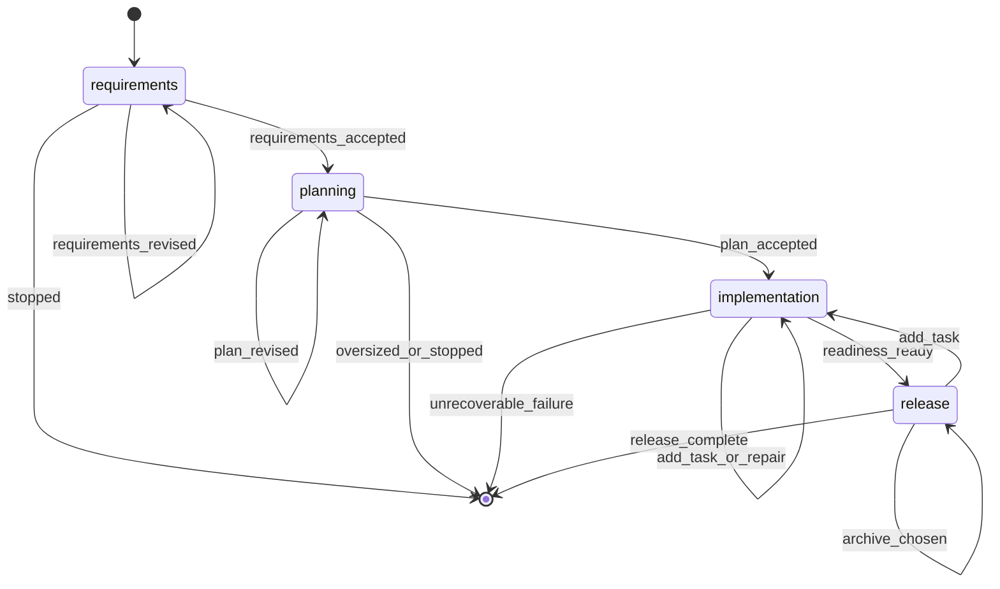

# Build Command

**YOU ARE A PURE ORCHESTRATOR.** Spawn agents for all work. NEVER write/edit/read files yourself. NEVER implement code, requirements, designs, or tests. Use exact agent references per step. If agent fails, retry it — never do its work.

## §CTX

Use the pre-resolved `projectRoot`, `kbRoot`, `workRoot`, and `codeRoot` values from the generated Workflow Bootstrap section. Do not hardcode `.rp1/work/` or `.rp1/context/` paths.

**Feature dir**: `{workRoot}/features/{FEATURE_ID}/`

## §0-FIRST-ACTION

After the generated Workflow Bootstrap section resolves `RUN_ID`, `RUN_RESUMED`, and the canonical directories, the first prompt-authored action MUST be:

```bash
rp1 agent-tools workflow-state \
  --run-id {RUN_ID} \
  --workflow build \
  --feature {FEATURE_ID} \
  --parent-phases requirements,planning,implementation,release
```

Do NOT read files, load KB, analyze requirements, or spawn agents before this completes.

Parse the JSON `ToolResult`.

- If the tool fails or returns malformed output: emit `requirements` failed, report the tool error, STOP.
- If `data.summary.contract_gaps` is non-empty: choose the first gap by phase order, emit `waiting_for_user` and `status_change waiting` on that gap phase, report missing registered outputs, STOP. Do not inspect feature files or infer success from filenames.
- Set `START_PHASE = data.summary.next_phase`.
- If `START_PHASE` is `null`: output an already-complete summary from registered workflow state and STOP.
- Phase order: `requirements` -> `planning` -> `implementation` -> `release`.

## STATE-MACHINE



## §PARENT-EMIT-DISCIPLINE

Only parent steps are `requirements`, `planning`, `implementation`, and `release`.

Parent status events are limited to:

- `running`: broad phase starts or resumes
- `waiting`: user decision or contract gap
- `completed`: broad phase is accepted/ready
- `failed`: no planned recovery remains

Subagents emit namespaced detail steps (`task-builder:building`, `task-reviewer:reviewing`, etc.). Retryable subagent failures keep the parent phase `running` or `waiting`; they MUST NOT emit parent `failed`.

Before executing each non-skipped phase, emit `running` for that phase. **First emit** (entering `START_PHASE`) includes `--name` to label the run:

```bash
rp1 agent-tools emit \
  --workflow build \
  --type status_change \
  --run-id {RUN_ID} \
  --step {STATE} \
  --name "Feature: {FEATURE_ID}" \
  --data '{"status": "running", "feature": "{FEATURE_ID}"}'
```

Subsequent state transitions omit `--name` (set-once semantics; the DB keeps the first value):

```bash
rp1 agent-tools emit \
  --workflow build \
  --type status_change \
  --run-id {RUN_ID} \
  --step {STATE} \
  --data '{"status": "running", "feature": "{FEATURE_ID}"}'
```

`RUN_ID` comes from the generated Workflow Bootstrap section. Do NOT override it.

Producer agents register their own artifacts. Do not scan feature directories to register markdown files.

## §PROGRESS

| Phase | Owns | Agent(s) |
|-------|------|----------|
| requirements | Requirements artifact + scope redirect handoff | feature-requirement-gatherer |
| planning | Design, hypotheses, task generation | feature-architect, hypothesis-tester (opt), feature-tasker |
| implementation | Task execution, reviews, checks, feature verification, comment cleanup, readiness aggregation | build-task-plan tool, task-builder, task-reviewer, code-checker, feature-verifier, comment-cleaner, build-verify-aggregator |
| release | Manual checklist, archive choice, final run closure | feature-archiver |

Symbols: `[ ]`=PENDING `[~]`=RUNNING `[x]`=COMPLETED `[-]`=SKIPPED `[!]`=FAILED
Requirements/planning fail fast on unrecoverable contract failures. Implementation retries recoverable builder/reviewer failures once before waiting (interactive) or failing per AFK policy. NEVER delete artifacts.
AFK mode: skip prompts, auto-select defaults, retry once on failure, auto-archive.

---

## §PHASE-1: Requirements

**Skip if**: `START_PHASE` is after `requirements`. **Spawn agent — do NOT gather requirements yourself:**


FEATURE_ID={FEATURE_ID}, REQUIREMENTS={REQUIREMENTS}, AFK_MODE={AFK}, PHASE_PLAN_PATH={PHASE_PLAN_PATH}, PHASE_ID={PHASE_ID}, KB_ROOT={kbRoot}, WORK_ROOT={workRoot}, WORKFLOW=build, RUN_ID={RUN_ID}


If `PHASE_PLAN_PATH` and `PHASE_ID` were passed explicitly, forward them unchanged.
If phase-plan handoff tokens remain embedded inside `REQUIREMENTS` using the legacy `PHASE_PLAN_PATH=... PHASE_ID=...` form, leave them untouched so `feature-requirement-gatherer` can normalize them before writing `requirements.md`.

Validate the response before continuing:

- First attempt to parse the response as JSON.
- Accept only the documented completion contract from `feature-requirement-gatherer`: JSON with `"status": "success"` and an `"artifact"` path ending in `features/{FEATURE_ID}/requirements.md`, or a text line matching `Requirements completed:` followed by a path ending in `features/{FEATURE_ID}/requirements.md`.
- If the response is valid JSON with `"status": "error"`, treat it as an intentional requirements-step failure. Surface the agent-provided `error` or `message`, abort the build on `requirements`, and do NOT retry it as a generic contract failure.
- Treat any response that mentions commits, source-code edits, tests, verification, unrelated file paths, or implementation completion as a contract failure.
- On contract failure: retry §PHASE-1 once with an explicit reminder that the agent may only write `requirements.md` and must not implement anything.
- If the retry also fails, abort the build as failed. Do not enter planning, implementation, or release based on non-compliant output.

**Checkpoint** (skip if AFK):

```bash
rp1 agent-tools emit \
  --workflow build \
  --type waiting_for_user \
  --run-id {RUN_ID} \
  --step requirements \
  --data '{"prompt": "Continue, Revise, Review feedback from Arcade, or Stop?", "context": "Requirements gathering complete"}'
```


On Revise: get feedback, append to REQUIREMENTS, re-invoke §PHASE-1.
On Review feedback from Arcade: load `arcade-collab` skill, process all feedback for RUN_ID, then return to this checkpoint with original options.
On Stop: emit waiting status, output summary, exit with `/build {FEATURE_ID}` resume instruction.

```bash
rp1 agent-tools emit \
  --workflow build \
  --type status_change \
  --run-id {RUN_ID} \
  --step requirements \
  --data '{"status": "waiting", "feature": "{FEATURE_ID}"}'
```

On Continue, or immediately when AFK skips the checkpoint, emit `requirements` completed before entering `planning`:

```bash
rp1 agent-tools emit \
  --workflow build \
  --type status_change \
  --run-id {RUN_ID} \
  --step requirements \
  --data '{"status": "completed", "feature": "{FEATURE_ID}"}'
```

## §PHASE-2: Planning

**Skip if**: `START_PHASE` is after `planning`. **Spawn agent — do NOT design yourself:**


FEATURE_ID={FEATURE_ID}, AFK_MODE={AFK}, KB_ROOT={kbRoot}, WORK_ROOT={workRoot}, UPDATE_MODE={design.md exists}, WORKFLOW=build, RUN_ID={RUN_ID}


Parse the response as JSON.

- Accept `status = "success"` to continue with design follow-on work.
- Accept `status = "needs_phase_planning"` as an oversized-scope redirect. In that case, do NOT run `hypothesis-tester`, do NOT run `feature-tasker`, do NOT enter `implementation`, and do NOT generate legacy `tracker.md` or `milestone-*.md` guidance.
- Treat `status = "error"` or malformed output as a planning failure. Abort the build instead of guessing.

### §2.1 Oversized Scope Redirect

If `status = "needs_phase_planning"`:

1. Extract `reason`, `source_relative_path`, and `redirect_command`.
2. Emit a waiting event so the run clearly stops on `planning`:

```bash
rp1 agent-tools emit \
  --workflow build \
  --type waiting_for_user \
  --run-id {RUN_ID} \
  --step planning \
  --data '{"prompt": "Scope exceeds a single feature. Run /phase-plan before resuming delivery.", "context": "{redirect_command}"}'
```

```bash
rp1 agent-tools emit \
  --workflow build \
  --type status_change \
  --run-id {RUN_ID} \
  --step planning \
  --data '{"status": "waiting", "feature": "{FEATURE_ID}"}'
```

3. Output:

```markdown
## Build Redirected

**Feature**: {FEATURE_ID}
**Reason**: {reason}
**Source Artifact**: {source_relative_path}
**Next**: Run `{redirect_command}`
```

4. STOP.

After a `success` response, check whether `{workRoot}/features/{FEATURE_ID}/hypotheses.md` exists on disk. If it exists:


FEATURE_ID={FEATURE_ID}, KB_ROOT={kbRoot}, WORK_ROOT={workRoot}, WORKFLOW=build, RUN_ID={RUN_ID}


If the file does not exist, skip hypothesis validation regardless of `flagged_hypotheses` or `artifacts.hypotheses` in the response.


FEATURE_ID={FEATURE_ID}, WORK_ROOT={workRoot}, UPDATE_MODE=false, WORKFLOW=build, RUN_ID={RUN_ID}


Validate the `feature-tasker` response before the planning checkpoint:

- Accept the documented success contract only when the response starts with `Task planning completed:` or `Task update completed:` and references `.rp1/work/features/{FEATURE_ID}/`.
- If the response is valid JSON with `"status": "error"`, treat it as an intentional task-generation failure. Surface the agent-provided `message` or `error`, abort the build on `planning`, and do NOT enter `implementation` or `release`.
- Treat malformed output or unrelated implementation/test summaries as a failure. Do not silently continue without a confirmed `tasks.md` result.

**Checkpoint** (skip if AFK):

```bash
rp1 agent-tools emit \
  --workflow build \
  --type waiting_for_user \
  --run-id {RUN_ID} \
  --step planning \
  --data '{"prompt": "Continue, Revise, Review feedback from Arcade, or Stop?", "context": "Design and task generation complete"}'
```


On Revise: get feedback, re-invoke §PHASE-2, and dispatch `feature-tasker` with `UPDATE_MODE=true` on that revise path.
On Review feedback from Arcade: load `arcade-collab` skill, process all feedback for RUN_ID, then return to this checkpoint with original options.
On Stop: emit waiting status, output summary (requirements complete, planning waiting), exit with `/build {FEATURE_ID}`.

```bash
rp1 agent-tools emit \
  --workflow build \
  --type status_change \
  --run-id {RUN_ID} \
  --step planning \
  --data '{"status": "waiting", "feature": "{FEATURE_ID}"}'
```

On Continue, or immediately when AFK skips the checkpoint, emit `planning` completed before entering `implementation`:

```bash
rp1 agent-tools emit \
  --workflow build \
  --type status_change \
  --run-id {RUN_ID} \
  --step planning \
  --data '{"status": "completed", "feature": "{FEATURE_ID}"}'
```

## §PHASE-3: Implementation

**Skip if**: `START_PHASE` is after `implementation`. **You MUST spawn task-builder — do NOT write code yourself.**

### §4.1 Plan Task Units

Use the schema-backed task plan sidecar. Do not parse `tasks.md` for machine planning.

```bash
rp1 agent-tools build-task-plan \
  --tasks-path "{workRoot}/features/{FEATURE_ID}/tasks.json" \
  --max-simple-batch 3 \
  --complex-isolated true
```

Parse the JSON `ToolResult`.

- Extract `task_units`, `implementation_tasks`, `documentation_tasks`, and `warnings`.
- If the tool fails or returns malformed output, emit `implementation` waiting with the tool error and STOP. Do not infer task state from markdown.

### §4.2 Cleanup Manifest Baseline

Before the first task-builder unit, snapshot the build-start repository state:

```bash
rp1 agent-tools change-manifest snapshot \
  --code-root "{codeRoot}" \
  --out "{workRoot}/features/{FEATURE_ID}/change-manifest-baseline.json"
```

Parse the `ToolResult` envelope. If the command fails or returns malformed output, continue the build but record `cleanup_manifest_result` as skipped with `skipReason: "baseline_snapshot_failed"`, `files: 0`, `ownedLineCount: 0`, and `statusPath: "{workRoot}/features/{FEATURE_ID}/change-manifest-status.json"`. Do not dispatch `comment-cleaner` later unless a generated manifest result explicitly returns `status: "created"` and non-empty ownership.

### §4.3 Builder-Reviewer Loop

For each task unit, run builder then reviewer:


FEATURE_ID={FEATURE_ID}, KB_ROOT={kbRoot}, WORK_ROOT={workRoot}, CODE_ROOT={codeRoot}, TASK_IDS={TASK_IDS}, GIT_COMMIT={GIT_COMMIT}, WORKFLOW=build, RUN_ID={RUN_ID}



FEATURE_ID={FEATURE_ID}, KB_ROOT={kbRoot}, WORK_ROOT={workRoot}, CODE_ROOT={codeRoot}, TASK_IDS={TASK_IDS}, GIT_COMMIT={GIT_COMMIT}, WORKFLOW=build, RUN_ID={RUN_ID}


Loop logic: attempt=1, max=2. If reviewer reports SUCCESS: move to next unit.

If FAILURE and attempt < max:

1. Extract `issues` and `summary` from reviewer response.
2. Re-spawn task-builder with review feedback. If `GIT_COMMIT=true`, pass `REWRITE_COMMITS=true` so the builder amends the prior commit into a clean atomic rewrite:


FEATURE_ID={FEATURE_ID}, KB_ROOT={kbRoot}, WORK_ROOT={workRoot}, CODE_ROOT={codeRoot}, TASK_IDS={TASK_IDS}, GIT_COMMIT={GIT_COMMIT}, REWRITE_COMMITS={GIT_COMMIT}, PREVIOUS_FEEDBACK={reviewer summary and issues}, WORKFLOW=build, RUN_ID={RUN_ID}


3. Re-run task-reviewer for the same task unit.

Else: escalate without marking parent `implementation` failed while recovery remains.

- Interactive: emit `waiting_for_user` on `implementation`, then `status_change waiting`; STOP with `/build {FEATURE_ID}` resume instructions.
- AFK: emit parent `implementation` failed only when the AFK policy has no skip/repair path left.

### §4.4 Post-Build

Documentation tasks from `documentation_tasks`: complete them only through a declared supported workflow. If none is available, carry them into release `manual_items`/follow-ups. Do not spawn undeclared documentation agents.

**Checkpoint** (skip if AFK):

```bash
rp1 agent-tools emit \
  --workflow build \
  --type waiting_for_user \
  --run-id {RUN_ID} \
  --step implementation \
  --data '{"prompt": "Continue, Add Task, Review feedback from Arcade, or Stop?", "context": "Build phase complete"}'
```


On Add Task: spawn builder+reviewer for ad-hoc TX-{timestamp} task, loop back.
On Review feedback from Arcade: load `arcade-collab` skill, process all feedback for RUN_ID, then return to this checkpoint with original options.

### §4.5 Cleanup Manifest Generation

After builders, reviewers, doc tasks, and any checkpoint-added tasks finish, generate the durable cleanup handoff before verification:

```bash
rp1 agent-tools change-manifest generate \
  --code-root "{codeRoot}" \
  --out "{workRoot}/features/{FEATURE_ID}/change-manifest-001.json" \
  --status-out "{workRoot}/features/{FEATURE_ID}/change-manifest-status.json" \
  --source build \
  --baseline "{workRoot}/features/{FEATURE_ID}/change-manifest-baseline.json"
```

Parse the `ToolResult` envelope into `cleanup_manifest_result`.

- If `data.status == "created"` and `data.files > 0` and `data.ownedLineCount > 0`, verification may dispatch `comment-cleaner` with `data.manifestPath` and `{codeRoot}`.
- If `data.status == "skipped"`, keep `data.statusPath` and `data.skipReason` for the verify aggregator. Do not ask `comment-cleaner` to infer scope.
- If the tool fails or returns malformed output, set `cleanup_manifest_result` to a skipped warning with `skipReason: "change_manifest_generate_failed"`, `files: 0`, `ownedLineCount: 0`, and `statusPath: "{workRoot}/features/{FEATURE_ID}/change-manifest-status.json"`.

### §4.6 Verification And Readiness

Invoke `code-checker` and `feature-verifier`. Include `comment-cleaner` only when `cleanup_manifest_result.data.status == "created"`, `cleanup_manifest_result.data.files > 0`, `cleanup_manifest_result.data.ownedLineCount > 0`, and `cleanup_manifest_result.data.manifestPath` is present. Do not dispatch comment-cleaner with branch, unstaged, commit-range, base-branch, mode, or commit parameters; the generated manifest is the only safe cleanup boundary.


FEATURE_ID={FEATURE_ID}, KB_ROOT={kbRoot}, WORK_ROOT={workRoot}, CODE_ROOT={codeRoot}



FEATURE_ID={FEATURE_ID}, KB_ROOT={kbRoot}, WORK_ROOT={workRoot}, CODE_ROOT={codeRoot}, WORKFLOW=build, RUN_ID={RUN_ID}


If `cleanup_manifest_result` is created and non-empty:


CHANGE_MANIFEST={cleanup_manifest_result.data.manifestPath}, CODE_ROOT={codeRoot}


Otherwise set the `comment_cleaner` phase result yourself:

```json
{
  "status": "WARN",
  "files_checked": 0,
  "manifest_path": null,
  "manifest_status_path": "{cleanup_manifest_result.data.statusPath}",
  "skip_reason": "{cleanup_manifest_result.data.skipReason}",
  "message": "Automatic comment cleanup skipped because no non-empty generated manifest was available."
}
```

Then aggregate with the real cleaner response or the synthetic warning result:


PHASE_RESULTS: { code_checker: {...}, feature_verifier: {...}, comment_cleaner: {...} }


Extract `overall_status`, `ready_for_merge`, `manual_items`.

If readiness has blocking failures or missing required components, keep parent `implementation` running for planned repair or waiting for a user decision. Emit parent `implementation` failed only when no repair/decision path remains.

When readiness can proceed to release, emit `implementation` completed:

```bash
rp1 agent-tools emit \
  --workflow build \
  --type status_change \
  --run-id {RUN_ID} \
  --step implementation \
  --data '{"status": "completed", "feature": "{FEATURE_ID}"}'
```

### Git Operations (conditional)

If GIT_COMMIT: stage+commit. If GIT_PUSH: push. If GIT_PR: create PR.

## §PHASE-4: Release

**Skip if**: `START_PHASE` is after `release`.

Emit `release` running before presenting release options:

```bash
rp1 agent-tools emit \
  --workflow build \
  --type status_change \
  --run-id {RUN_ID} \
  --step release \
  --data '{"status": "running", "feature": "{FEATURE_ID}"}'
```

Output: Feature ID, phase status table, registered artifacts, readiness status, blockers, warnings, and manual items.

**Release gate** (skip if AFK; AFK defaults to archive):

```bash
rp1 agent-tools emit \
  --workflow build \
  --type waiting_for_user \
  --run-id {RUN_ID} \
  --step release \
  --data '{"prompt": "Add task, Archive, Review feedback from Arcade, or Do not archive?", "context": "Readiness complete"}'
```


On Add task: return to `implementation`; parent `release` must not complete until release is re-entered after implementation.
On Review feedback from Arcade: load `arcade-collab` skill, process all feedback for RUN_ID, then return to this checkpoint with original options.
On Do not archive: emit `release` completed with `archive_status: "declined"` and STOP.

```bash
rp1 agent-tools emit \
  --workflow build \
  --type status_change \
  --run-id {RUN_ID} \
  --step release \
  --data '{"status": "completed", "feature": "{FEATURE_ID}", "archive_status": "declined"}'
```

### Archive


MODE=archive, FEATURE_ID={FEATURE_ID}, WORK_ROOT={workRoot}, SKIP_DOC_CHECK=false


After `feature-archiver` succeeds, emit `release` completed:

```bash
rp1 agent-tools emit \
  --workflow build \
  --type status_change \
  --run-id {RUN_ID} \
  --step release \
  --data '{"status": "completed", "feature": "{FEATURE_ID}", "archive_status": "completed"}'
```

## §TERMINAL-STATES

**Every exit path MUST emit a terminal status.** No run may remain in "running" after the skill finishes.

| Exit Path | Status | Step |
|-----------|--------|------|
| Archive completes successfully | `completed` | `release` |
| User selects "Stop" at any checkpoint | `waiting` | current step |
| User selects "Do not archive" at release gate | `completed` | `release` |
| Unrecoverable agent failure | `failed` | failing parent phase |
| AFK mode abort | `failed` | failing parent phase |

On any unrecoverable failure, emit before exiting:

```bash
rp1 agent-tools emit \
  --workflow build \
  --type status_change \
  --run-id {RUN_ID} \
  --step {FAILING_STEP} \
  --data '{"status": "failed", "feature": "{FEATURE_ID}"}'
```

## §ANTI-LOOP

Single-pass execution. Parse → detect → run steps → STOP.
