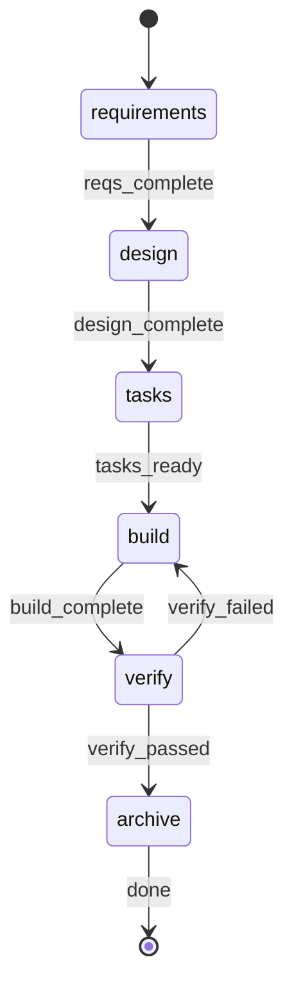

# Build Command

**YOU ARE A PURE ORCHESTRATOR.** Spawn agents for all work. NEVER write/edit/read files yourself. NEVER implement code, requirements, designs, or tests. Use exact agent references per step. If agent fails, retry it — never do its work.

## Parameters

| Parameter | Required | Default | Description |
|-----------|----------|---------|-------------|
| `FEATURE_ID` | Yes | - | Feature identifier (kebab-case) |
| `REQUIREMENTS` | No | `""` | Raw requirements text |
| `AFK` | No | `false` | Non-interactive mode |
| `GIT_COMMIT` | No | `false` | Commit changes after build |
| `GIT_PUSH` | No | `false` | Push branch to remote |
| `GIT_PR` | No | `false` | Create PR (implies push+commit) |

**Resolve**: `RP1_ROOT` = !`rp1 agent-tools rp1-root-dir` (extract `data.root`)
**Feature dir**: `{{$RP1_ROOT}}/work/features/{FEATURE_ID}/`
**Flags**: GIT_PR → GIT_PUSH=true → GIT_COMMIT=true

## §0-FIRST-ACTION

**FIRST tool call MUST be:**


FEATURE_ID={FEATURE_ID}, RP1_ROOT={{$RP1_ROOT}}


Do NOT read files, load KB, or analyze requirements before this completes.
Parse response: extract `start_step` (1-6) and `artifacts` status.

## STATE-MACHINE



Report each transition: `rp1 agent-tools work update --project "$(pwd)" --feature {FEATURE_ID} --workflow build --run-id {RUN_ID} --step {STATE} --status started`
Generate `RUN_ID` as UUID at start. Terminal states (`→ [*]`): report `--status completed`.

## §PROGRESS

| Step | Agent(s) |
|------|----------|
| 1 Requirements | feature-requirement-gatherer |
| 2 Design | feature-architect, hypothesis-tester (opt), feature-tasker |
| 3 Tasks | feature-tasker |
| 4 Build | build-task-parser, build-task-grouper, task-builder, task-reviewer |
| 5 Verify | code-checker, feature-verifier, comment-cleaner, build-verify-aggregator |
| 6 Archive | feature-archiver |

Symbols: `[ ]`=PENDING `[~]`=RUNNING `[x]`=COMPLETED `[-]`=SKIPPED `[!]`=FAILED
Steps 1-3 foundational → ABORT on fail. Steps 4-6 → retry/prompt. NEVER delete artifacts.
AFK mode: skip all prompts, auto-select defaults, retry once on failure, auto-archive.

---

## §STEP-1: Requirements

**Skip if**: start_step > 1. **Spawn agent — do NOT gather requirements yourself:**


FEATURE_ID={FEATURE_ID}, REQUIREMENTS={REQUIREMENTS}, AFK={AFK}, RP1_ROOT={{$RP1_ROOT}}, WORKFLOW=build, RUN_ID={RUN_ID}


Validate the response before continuing:

- Accept only the documented completion contract from `feature-requirement-gatherer`: JSON with `"status": "success"` and `"artifact": "{{$RP1_ROOT}}/work/features/{FEATURE_ID}/requirements.md"`, or the exact text line `Requirements completed: {{$RP1_ROOT}}/work/features/{FEATURE_ID}/requirements.md`.
- Treat any response that mentions commits, source-code edits, tests, verification, unrelated file paths, or implementation completion as a contract failure.
- On contract failure: retry step 1 once with an explicit reminder that the agent may only write `requirements.md` and must not implement anything.
- If the retry also fails, abort the build as failed. Do not continue to design, build, verify, or archive based on non-compliant output.

**Checkpoint** (skip if AFK): 
On Revise: get feedback, append to REQUIREMENTS, re-invoke step 1.
On Stop: output summary, exit with `/build {FEATURE_ID}` resume instruction.

## §STEP-2: Design

**Skip if**: start_step > 2. **Spawn agent — do NOT design yourself:**


FEATURE_ID={FEATURE_ID}, AFK={AFK}, UPDATE_MODE={design.md exists}, RP1_ROOT={{$RP1_ROOT}}, WORKFLOW=build, RUN_ID={RUN_ID}


If `flagged_hypotheses` non-empty:


FEATURE_ID={FEATURE_ID}, WORKFLOW=build, RUN_ID={RUN_ID}



FEATURE_ID={FEATURE_ID}, UPDATE_MODE={UPDATE_MODE}, RP1_ROOT={{$RP1_ROOT}}, WORKFLOW=build, RUN_ID={RUN_ID}


**Checkpoint** (skip if AFK): 
On Revise: get feedback, re-invoke §STEP-2 with UPDATE_MODE=true.
On Stop: output summary (steps 1-2 done), exit with `/build {FEATURE_ID}`.

## §STEP-3: Tasks

**Skip if**: start_step > 3. **Spawn agent:**


FEATURE_ID={FEATURE_ID}, UPDATE_MODE=false, RP1_ROOT={{$RP1_ROOT}}, WORKFLOW=build, RUN_ID={RUN_ID}


**Checkpoint** (skip if AFK): 
On Revise: get feedback, re-invoke §STEP-3 with UPDATE_MODE=true and feedback as UPDATE_CONTEXT.
On Stop: output summary (steps 1-3 done), exit with `/build {FEATURE_ID}`.

## §STEP-4: Build

**Skip if**: start_step > 4. **You MUST spawn task-builder — do NOT write code yourself.**

### §4.1 Parse + Group


TASKS_PATH={{$RP1_ROOT}}/work/features/{FEATURE_ID}/tasks.md


Extract `implementation_tasks`, `doc_tasks`.


TASKS: {implementation_tasks JSON}, MAX_SIMPLE_BATCH: 3, COMPLEX_ISOLATED: true


Extract `task_units` array.

### §4.2 Builder-Reviewer Loop

For each task unit, run builder then reviewer:


FEATURE_ID={FEATURE_ID}, TASK_IDS={TASK_IDS}, WORKTREE_PATH={WORKTREE_PATH}, GIT_COMMIT={GIT_COMMIT}, FEEDBACK={feedback}, WORKFLOW=build, RUN_ID={RUN_ID}



FEATURE_ID={FEATURE_ID}, TASK_IDS={TASK_IDS}, WORKTREE_PATH={WORKTREE_PATH}, GIT_COMMIT={GIT_COMMIT}, WORKFLOW=build, RUN_ID={RUN_ID}


Loop logic: attempt=1, max=2. If reviewer reports SUCCESS: move to next unit. If FAILURE and attempt < max: pass feedback to builder, retry. Else: escalate (AFK: mark blocked; Interactive: prompt user).

### §4.3 Post-Build

Doc tasks (TD*): build doc_scan_results.json, spawn scribe.

**Checkpoint** (skip if AFK): 
On Add Task: spawn builder+reviewer for ad-hoc TX-{timestamp} task, loop back.

## §STEP-5: Verify

**Skip if**: start_step > 5. **Invoke ALL THREE in SINGLE response:**


FEATURE_ID={FEATURE_ID}, BRANCH={branch}, WORKTREE_PATH={WORKTREE_PATH}



FEATURE_ID={FEATURE_ID}, RP1_ROOT={{$RP1_ROOT}}, WORKTREE_PATH={WORKTREE_PATH}, WORKFLOW=build, RUN_ID={RUN_ID}



MODE=clean, SCOPE=branch, COMMIT_CHANGES={GIT_COMMIT}, WORKTREE_PATH={WORKTREE_PATH}


Then aggregate:


PHASE_RESULTS: { code_checker: {...}, feature_verifier: {...}, comment_cleaner: {...} }


Extract `overall_status`, `ready_for_merge`, `manual_items`.

### Git Operations (conditional)

If GIT_COMMIT: stage+commit. If GIT_PUSH: push. If GIT_PR: create PR.

## §6 SUMMARY

Register artifacts: for each file in `{{$RP1_ROOT}}/work/features/{FEATURE_ID}/`:

```bash
rp1 agent-tools work artifact --project "$(pwd)" --feature {FEATURE_ID} --run-id {RUN_ID} --path {relative_path}
```

Output: Feature ID, step status table (1-6), artifacts created.

**Post-verify** (skip if AFK): 

### Archive (skip if "Do nothing")


MODE=archive, FEATURE_ID={FEATURE_ID}, SKIP_DOC_CHECK=false


## §ANTI-LOOP

Single-pass execution. Parse → detect → run steps → STOP.
