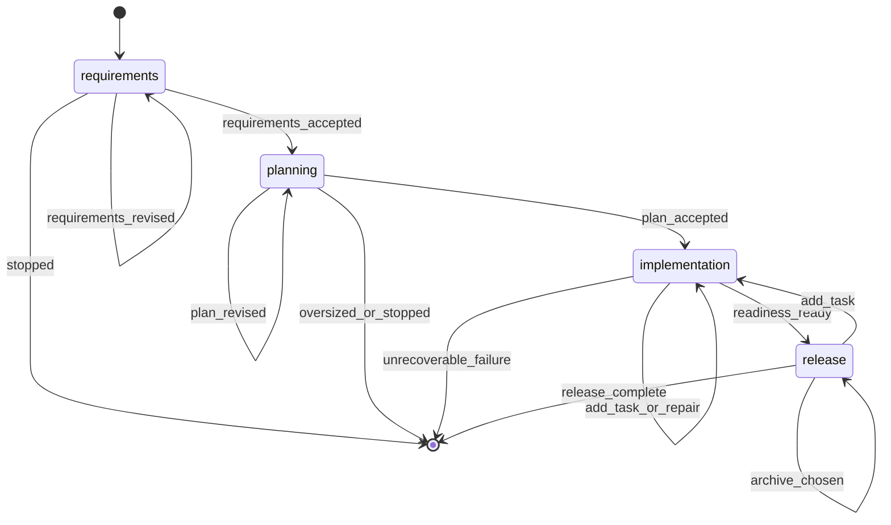

# Build Command

You are an orchestrator: every unit of work — reading, writing, implementing, designing, testing — belongs to a dispatched agent, not to you. Use the exact agent reference given for each step. When an agent fails, retry it rather than doing its work yourself.

## §CTX

Use the pre-resolved `projectRoot`, `kbRoot`, `workRoot`, and `codeRoot` values from the generated Workflow Bootstrap section. Do not hardcode `.rp1/work/` or `.rp1/context/` paths.

**Feature dir**: `{workRoot}/features/{FEATURE_ID}/`

**FEATURE_ID slug**: `FEATURE_ID` names the feature directory and is the resume key, so it MUST be a short kebab-case slug. When you run the §0 bootstrap, make the **first** `--args` token a clean slug:

- If the user already gave a kebab-case slug, pass it unchanged.
- Otherwise derive a short slug (3-6 words, lowercase, hyphens only — no slashes, spaces, or file extensions) from the request and pass the rest after it: `--args "<slug> <remaining request>"`. The leading token resolves to `FEATURE_ID`; the remainder resolves to `REQUIREMENTS`.
- Never pass a file path, URL, or full sentence as the slug. If the request points at a doc (e.g. a research file), derive the slug from its subject, not its path.

The bootstrap sanitizes `FEATURE_ID` to a safe slug as a fallback, but derive a meaningful one yourself — the fallback slug of raw prose is ugly. Your `/build {FEATURE_ID}` resume instruction surfaces the chosen slug for the user.

## References

| File | Purpose | When to Load |
|------|---------|--------------|
| `references/build-redirected.md` | Oversized-scope redirect handling when feature-architect returns `needs_phase_planning` | When `feature-architect` returns `status = "needs_phase_planning"` |
| `references/parallel-builders.md` | Worktree lifecycle protocol for parallel-wave concurrent builders | When parallel-wave mode preconditions are met during section 4.3 |
| `references/implementation-and-release.md` | §PHASE-3 implementation and verification, §PHASE-4 release and archive | When planning completes, or when resuming into the implementation or release phase |

## §0-FIRST-ACTION

After the generated Workflow Bootstrap section resolves `RUN_ID`, `RUN_RESUMED`, and the canonical directories, the first prompt-authored action MUST be:

```bash
rp1 agent-tools workflow-state \
  --run-id {RUN_ID} \
  --workflow build \
  --feature {FEATURE_ID} \
  --parent-phases requirements,planning,implementation,release
```

Do NOT read files, load KB, analyze requirements, or spawn agents before this completes.

Parse the JSON `ToolResult`.

- If the tool fails or returns malformed output: emit `requirements` failed, report the tool error, STOP.
- If `data.summary.contract_gaps` is non-empty: choose the first gap by phase order, emit `waiting_for_user` and `status_change waiting` on that gap phase, report missing registered outputs, STOP. Do not inspect feature files or infer success from filenames.
- Set `WORKFLOW_STATE = data`.
- Set `START_PHASE = data.summary.next_phase`.
- If any `WORKFLOW_STATE.phases[]` entry has `status = "waiting"` and there are no contract gaps for that phase, set `WAITING_PHASE` to the earliest waiting parent phase and set `START_PHASE = WAITING_PHASE.phase`.
- When resuming a `WAITING_PHASE`, return to that phase's recorded checkpoint/decision handler. Do not rerun that phase's producer agents unless the resumed decision is Revise, Add Task, Repair, or another explicit update path.
- If `START_PHASE` is `null`: output an already-complete summary from registered workflow state and STOP.
- Initialize `PLANNING_UPDATE_CONTEXT = ""`, `TASK_REGENERATION_REASON = ""`, and `ARCHIVE_RETRY_PATH = ""` unless restored from a resumed checkpoint event.
- Phase order: `requirements` -> `planning` -> `implementation` -> `release`.

## STATE-MACHINE



## §PARENT-EMIT-DISCIPLINE

Only parent steps are `requirements`, `planning`, `implementation`, and `release`.

Parent status events are limited to:

- `running`: broad phase starts or resumes
- `waiting`: user decision or contract gap
- `completed`: broad phase is accepted/ready
- `failed`: no planned recovery remains

Subagents emit namespaced detail steps (`task-builder:building`, `task-reviewer:reviewing`, etc.). Retryable subagent failures keep the parent phase `running` or `waiting`; they MUST NOT emit parent `failed`.

Before executing each non-skipped phase, emit `running` for that phase. **First emit** (entering `START_PHASE`) includes `--name` to label the run:

```bash
rp1 agent-tools emit \
  --workflow build \
  --type status_change \
  --run-id {RUN_ID} \
  --step {STATE} \
  --name "Feature: {FEATURE_ID}" \
  --data '{"status": "running", "feature": "{FEATURE_ID}"}'
```

Subsequent routine transitions use the same command without `--name` (set-once semantics; the DB keeps the first value). Replace `{STATE}` and the `data` JSON per this table:

| Trigger | Step | Data |
|---------|------|------|
| Phase entry (subsequent) | `{phase}` | `{"status": "running", "feature": "{FEATURE_ID}"}` |
| Phase accepted / AFK continues | `{phase}` | `{"status": "completed", "feature": "{FEATURE_ID}"}` |
| User stops at checkpoint | `{phase}` | `{"status": "waiting", "feature": "{FEATURE_ID}"}` |
| Release: no archive | `release` | `{"status": "completed", "feature": "{FEATURE_ID}", "archive_status": "declined"}` |
| Release: archived | `release` | `{"status": "completed", "feature": "{FEATURE_ID}", "archive_status": "completed", "archive_path": "..."}` |
| Unrecoverable failure | `{failing step}` | `{"status": "failed", "feature": "{FEATURE_ID}"}` |

Emit blocks with additional contextual data (reason, task_unit, readiness_status, etc.) remain verbatim at their point of use below. `waiting_for_user`, `artifact_registered`, and end-run emits are always shown inline.

`RUN_ID` comes from the generated Workflow Bootstrap section. Do NOT override it.

Producer agents register their own artifacts. Do not scan feature directories to register markdown files.

## §PROGRESS

| Phase | Owns | Agent(s) |
|-------|------|----------|
| requirements | Requirements artifact + scope redirect handoff | feature-requirement-gatherer |
| planning | Design, hypotheses, task generation | feature-architect, hypothesis-tester (opt), feature-tasker |
| implementation | Task execution, reviews, checks, feature verification, comment cleanup, readiness aggregation | build-task-plan tool, task-builder, task-reviewer, code-checker, feature-verifier, comment-cleaner, build-verify-aggregator |
| release | Manual checklist, archive choice, final run closure | feature-archiver |

Symbols: `[ ]`=PENDING `[~]`=RUNNING `[x]`=COMPLETED `[-]`=SKIPPED `[!]`=FAILED
Requirements/planning fail fast on unrecoverable contract failures. Implementation retries recoverable builder/reviewer failures once before waiting (interactive) or failing per AFK policy. NEVER delete artifacts.
AFK mode: skip prompts, auto-select defaults, retry once on failure, auto-archive.

## §CHECKPOINT-OPTIONS

`AskUserQuestion` shows at most **4 options**. At every checkpoint:

- Present that checkpoint's canonical options **verbatim** — never rename, merge, or drop one to make room for another choice. `Review feedback from Arcade` and `Stop` must always be offered.
- If an agent's result adds a decision the user must make (e.g. a scope choice the gatherer surfaced), or the canonical list exceeds four, do **not** fold it into the menu. Split into sequential `AskUserQuestion` calls: present the canonical proceed/stop menu first, then ask the surfaced or overflow choice after the user opts to proceed.

---

## §PHASE-1: Requirements

**Skip if**: `START_PHASE` is after `requirements`.

**Resume checkpoint**: If `WAITING_PHASE.phase == "requirements"`, jump directly to this phase's Checkpoint options below. Do not dispatch `feature-requirement-gatherer` unless the resumed decision is Revise.

**Spawn agent — do NOT gather requirements yourself:**


FEATURE_ID={FEATURE_ID}, REQUIREMENTS={REQUIREMENTS}, AFK_MODE={AFK}, PHASE_PLAN_PATH={PHASE_PLAN_PATH}, PHASE_ID={PHASE_ID}, KB_ROOT={kbRoot}, WORK_ROOT={workRoot}, WORKFLOW=build, RUN_ID={RUN_ID}


If `PHASE_PLAN_PATH` and `PHASE_ID` were passed explicitly, forward them unchanged.
If phase-plan handoff tokens remain embedded inside `REQUIREMENTS` using the legacy `PHASE_PLAN_PATH=... PHASE_ID=...` form, leave them untouched so `feature-requirement-gatherer` can normalize them before writing `requirements.md`.

Validate: parse JSON; accept `status: "success"` with artifact path ending in `features/{FEATURE_ID}/requirements.md`, or text `Requirements completed:` with matching path. `status: "error"` = intentional failure (abort, no retry). Mentions of commits, code edits, tests, or implementation = contract failure: retry once with scope reminder. Second failure = abort.

**Checkpoint** (skip if AFK):

Emit `waiting_for_user` on `requirements` with prompt "Continue, Revise, Review feedback from Arcade, or Stop?" and context "Requirements gathering complete".


If `feature-requirement-gatherer` surfaced a decision needing your input (e.g. a scope choice), keep these four options verbatim; on Continue, ask the surfaced decision as a separate `AskUserQuestion` before entering planning (§CHECKPOINT-OPTIONS). Never displace `Review feedback from Arcade` or `Stop`.
On Revise: get feedback, append to REQUIREMENTS, re-invoke §PHASE-1.
On Review feedback from Arcade: load `arcade-collab` skill, process all feedback for RUN_ID, then return to this checkpoint with original options.
On Stop: emit `requirements` waiting per §PARENT-EMIT-DISCIPLINE table, output summary, exit with `/build {FEATURE_ID}` resume instruction.
On Continue, or immediately when AFK skips the checkpoint, emit `requirements` completed per §PARENT-EMIT-DISCIPLINE table before entering `planning`.

## §PHASE-2: Planning

**Skip if**: `START_PHASE` is after `planning`.

**Resume checkpoint**: If `WAITING_PHASE.phase == "planning"`, inspect the latest parent waiting/status event from `WORKFLOW_STATE.recent_events`:

- `reason = "rejected_hypotheses"` -> jump directly to §2.2 Hypothesis Gate.
- otherwise jump directly to the §2.3 planning Checkpoint.

(An oversized-scope redirect terminates the run as `cancelled`, so a redirected build never resumes here — re-invoking `/build` starts a fresh run. See `references/build-redirected.md`.)

Do not dispatch `feature-architect`, `hypothesis-tester`, or fresh `feature-tasker` on a waiting resume unless the resumed decision is Revise.

**Spawn agent — do NOT design yourself:**


FEATURE_ID={FEATURE_ID}, AFK_MODE={AFK}, KB_ROOT={kbRoot}, WORK_ROOT={workRoot}, CODE_ROOT={codeRoot}, UPDATE_MODE={design.md exists}, UPDATE_CONTEXT={PLANNING_UPDATE_CONTEXT}, WORKFLOW=build, RUN_ID={RUN_ID}


Parse the response as JSON.

- Accept `status = "success"` to continue with design follow-on work.
- Accept `status = "needs_phase_planning"` as an oversized-scope redirect. Read `references/build-redirected.md` and follow the redirect handling procedure. Do NOT run `hypothesis-tester`, `feature-tasker`, or enter `implementation`.
- Treat `status = "error"` or malformed output as a planning failure. Abort the build instead of guessing.

After a `success` response, check whether `{workRoot}/features/{FEATURE_ID}/hypotheses.md` exists on disk. If it exists:


FEATURE_ID={FEATURE_ID}, KB_ROOT={kbRoot}, WORK_ROOT={workRoot}, CODE_ROOT={codeRoot}, WORKFLOW=build, RUN_ID={RUN_ID}


If the file does not exist, skip hypothesis validation regardless of `flagged_hypotheses` or `artifacts.hypotheses` in the response.

### §2.2 Hypothesis Gate

If `hypothesis-tester` ran, inspect its response before task generation:

- If it reports an error, malformed rejection JSON, or cannot determine rejected hypotheses safely: abort on `planning`.
- If it reports completion/no pending hypotheses and no rejected block: continue.
- If it includes JSON with `type = "rejected_hypotheses"` and non-empty `hypotheses[]`: do NOT run `feature-tasker` yet.
- Treat a rejected hypothesis as high impact when `impact = "HIGH"`, `risk = "HIGH"`, or the field is missing/unknown.

If rejected hypotheses exist and `AFK=true`:

- If any rejected hypothesis is high impact, emit `planning` failed with `reason = "rejected_high_impact_hypothesis"` and STOP.
- Otherwise continue with risk, but include rejected IDs in the final planning summary. Do not silently hide the risk.

If rejected hypotheses exist and `AFK=false`, run the interactive rejection gate:

Emit `waiting_for_user` on `planning` with prompt "Rejected planning hypotheses found. Revise plan, Continue with risk, or Stop?" and context about paused task generation. Then emit `planning` waiting with `reason: "rejected_hypotheses"`.



- Revise plan: collect feedback, set `TASK_REGENERATION_REASON = "Rejected hypotheses: {ids}; revision requested: {summary}"`, set `PLANNING_UPDATE_CONTEXT = TASK_REGENERATION_REASON`, emit `planning` running with `task_regeneration_reason` and `update_mode: true`, then re-invoke §PHASE-2 before any task generation.
- Continue with risk: proceed to the single normal `feature-tasker` dispatch below and preserve the rejected IDs in the final planning summary.
- Stop: output the rejected hypothesis IDs and `/build {FEATURE_ID}` resume instruction, leave `planning` waiting, and STOP.

### §2.3 Task Generation

Normal fresh path invariant: dispatch `feature-tasker` exactly once, after `feature-architect` succeeds and after the hypothesis gate is either skipped, clear, or explicitly continued with risk.


FEATURE_ID={FEATURE_ID}, WORK_ROOT={workRoot}, UPDATE_MODE=false, UPDATE_CONTEXT={TASK_REGENERATION_REASON}, WORKFLOW=build, RUN_ID={RUN_ID}


Validate: parse JSON; accept `status: "success"` with `feature_id`, `task_plan_path`, and `artifacts[]` for both `tasks.md` and `tasks.json` (`storageRoot: "work_dir"`). `status: "error"` = abort planning; do NOT enter implementation or release. Malformed/missing artifacts = failure. Do not continue without confirmed results.

**Checkpoint** (skip if AFK):

Emit `waiting_for_user` on `planning` with prompt "Continue, Revise, Review feedback from Arcade, or Stop?" and context "Design and task generation complete".


On Revise: get feedback. If the feedback changes scope, requirements, assumptions, or design, set `TASK_REGENERATION_REASON` to one sentence before regeneration, emit `planning` running with `task_regeneration_reason` and `update_mode: true`, set `PLANNING_UPDATE_CONTEXT = TASK_REGENERATION_REASON`, re-invoke §PHASE-2, and dispatch `feature-tasker` with `UPDATE_MODE=true` and `UPDATE_CONTEXT={TASK_REGENERATION_REASON}`. Do not regenerate tasks before the reason is recorded.
On Review feedback from Arcade: load `arcade-collab` skill, process all feedback for RUN_ID, then return to this checkpoint with original options.
On Stop: emit `planning` waiting per §PARENT-EMIT-DISCIPLINE table, output summary (requirements complete, planning waiting), exit with `/build {FEATURE_ID}`.
On Continue, or immediately when AFK skips the checkpoint, emit `planning` completed per §PARENT-EMIT-DISCIPLINE table before entering `implementation`.

## §PHASE-3: Implementation and §PHASE-4: Release

Read `references/implementation-and-release.md` and follow it. It carries task-unit planning, builder and reviewer dispatch, verification aggregation, the readiness gate, and the release/archive flow.

## §TERMINAL-STATES

**Every exit path MUST emit a terminal status.** No run may remain in "running" after the skill finishes.

| Exit Path | Status | Step |
|-----------|--------|------|
| Archive completes successfully | `completed` | `release` |
| User selects "Stop" at any checkpoint | `waiting` | current step |
| Oversized scope redirected to /phase-plan | `cancelled` (end-run) | `planning` |
| User selects "Complete without archive" at release gate | `completed` | `release` |
| Unrecoverable agent failure | `failed` | failing parent phase |
| AFK mode abort | `failed` | failing parent phase |

On any unrecoverable failure, emit per §PARENT-EMIT-DISCIPLINE table with `status: "failed"` on the failing parent phase.

## §ANTI-LOOP

Single-pass execution. Parse → detect → run steps → STOP.
