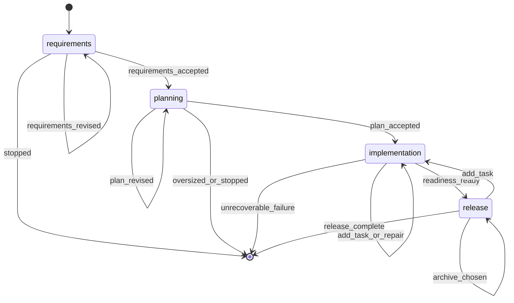

# Build Command

**YOU ARE A PURE ORCHESTRATOR.** Spawn agents for all work. NEVER write/edit/read files yourself. NEVER implement code, requirements, designs, or tests. Use exact agent references per step. If agent fails, retry it — never do its work.

## §CTX

Use the pre-resolved `projectRoot`, `kbRoot`, `workRoot`, and `codeRoot` values from the generated Workflow Bootstrap section. Do not hardcode `.rp1/work/` or `.rp1/context/` paths.

**Feature dir**: `{workRoot}/features/{FEATURE_ID}/`

**FEATURE_ID slug**: `FEATURE_ID` names the feature directory and is the resume key, so it MUST be a short kebab-case slug. When you run the §0 bootstrap, make the **first** `--args` token a clean slug:

- If the user already gave a kebab-case slug, pass it unchanged.
- Otherwise derive a short slug (3-6 words, lowercase, hyphens only — no slashes, spaces, or file extensions) from the request and pass the rest after it: `--args "<slug> <remaining request>"`. The leading token resolves to `FEATURE_ID`; the remainder resolves to `REQUIREMENTS`.
- Never pass a file path, URL, or full sentence as the slug. If the request points at a doc (e.g. a research file), derive the slug from its subject, not its path.

The bootstrap sanitizes `FEATURE_ID` to a safe slug as a fallback, but derive a meaningful one yourself — the fallback slug of raw prose is ugly. Your `/build {FEATURE_ID}` resume instruction surfaces the chosen slug for the user.

## References

| File | Purpose | When to Load |
|------|---------|--------------|
| `references/build-redirected.md` | Oversized-scope redirect handling when feature-architect returns `needs_phase_planning` | When `feature-architect` returns `status = "needs_phase_planning"` |
| `references/parallel-builders.md` | Worktree lifecycle protocol for parallel-wave concurrent builders | When parallel-wave mode preconditions are met during section 4.3 |

## §0-FIRST-ACTION

After the generated Workflow Bootstrap section resolves `RUN_ID`, `RUN_RESUMED`, and the canonical directories, the first prompt-authored action MUST be:

```bash
rp1 agent-tools workflow-state \
  --run-id {RUN_ID} \
  --workflow build \
  --feature {FEATURE_ID} \
  --parent-phases requirements,planning,implementation,release
```

Do NOT read files, load KB, analyze requirements, or spawn agents before this completes.

Parse the JSON `ToolResult`.

- If the tool fails or returns malformed output: emit `requirements` failed, report the tool error, STOP.
- If `data.summary.contract_gaps` is non-empty: choose the first gap by phase order, emit `waiting_for_user` and `status_change waiting` on that gap phase, report missing registered outputs, STOP. Do not inspect feature files or infer success from filenames.
- Set `WORKFLOW_STATE = data`.
- Set `START_PHASE = data.summary.next_phase`.
- If any `WORKFLOW_STATE.phases[]` entry has `status = "waiting"` and there are no contract gaps for that phase, set `WAITING_PHASE` to the earliest waiting parent phase and set `START_PHASE = WAITING_PHASE.phase`.
- When resuming a `WAITING_PHASE`, return to that phase's recorded checkpoint/decision handler. Do not rerun that phase's producer agents unless the resumed decision is Revise, Add Task, Repair, or another explicit update path.
- If `START_PHASE` is `null`: output an already-complete summary from registered workflow state and STOP.
- Initialize `PLANNING_UPDATE_CONTEXT = ""`, `TASK_REGENERATION_REASON = ""`, and `ARCHIVE_RETRY_PATH = ""` unless restored from a resumed checkpoint event.
- Phase order: `requirements` -> `planning` -> `implementation` -> `release`.

## STATE-MACHINE



## §PARENT-EMIT-DISCIPLINE

Only parent steps are `requirements`, `planning`, `implementation`, and `release`.

Parent status events are limited to:

- `running`: broad phase starts or resumes
- `waiting`: user decision or contract gap
- `completed`: broad phase is accepted/ready
- `failed`: no planned recovery remains

Subagents emit namespaced detail steps (`task-builder:building`, `task-reviewer:reviewing`, etc.). Retryable subagent failures keep the parent phase `running` or `waiting`; they MUST NOT emit parent `failed`.

Before executing each non-skipped phase, emit `running` for that phase. **First emit** (entering `START_PHASE`) includes `--name` to label the run:

```bash
rp1 agent-tools emit \
  --workflow build \
  --type status_change \
  --run-id {RUN_ID} \
  --step {STATE} \
  --name "Feature: {FEATURE_ID}" \
  --data '{"status": "running", "feature": "{FEATURE_ID}"}'
```

Subsequent routine transitions use the same command without `--name` (set-once semantics; the DB keeps the first value). Replace `{STATE}` and the `data` JSON per this table:

| Trigger | Step | Data |
|---------|------|------|
| Phase entry (subsequent) | `{phase}` | `{"status": "running", "feature": "{FEATURE_ID}"}` |
| Phase accepted / AFK continues | `{phase}` | `{"status": "completed", "feature": "{FEATURE_ID}"}` |
| User stops at checkpoint | `{phase}` | `{"status": "waiting", "feature": "{FEATURE_ID}"}` |
| Release: no archive | `release` | `{"status": "completed", "feature": "{FEATURE_ID}", "archive_status": "declined"}` |
| Release: archived | `release` | `{"status": "completed", "feature": "{FEATURE_ID}", "archive_status": "completed", "archive_path": "..."}` |
| Unrecoverable failure | `{failing step}` | `{"status": "failed", "feature": "{FEATURE_ID}"}` |

Emit blocks with additional contextual data (reason, task_unit, readiness_status, etc.) remain verbatim at their point of use below. `waiting_for_user`, `artifact_registered`, and end-run emits are always shown inline.

`RUN_ID` comes from the generated Workflow Bootstrap section. Do NOT override it.

Producer agents register their own artifacts. Do not scan feature directories to register markdown files.

## §PROGRESS

| Phase | Owns | Agent(s) |
|-------|------|----------|
| requirements | Requirements artifact + scope redirect handoff | feature-requirement-gatherer |
| planning | Design, hypotheses, task generation | feature-architect, hypothesis-tester (opt), feature-tasker |
| implementation | Task execution, reviews, checks, feature verification, comment cleanup, readiness aggregation | build-task-plan tool, task-builder, task-reviewer, code-checker, feature-verifier, comment-cleaner, build-verify-aggregator |
| release | Manual checklist, archive choice, final run closure | feature-archiver |

Symbols: `[ ]`=PENDING `[~]`=RUNNING `[x]`=COMPLETED `[-]`=SKIPPED `[!]`=FAILED
Requirements/planning fail fast on unrecoverable contract failures. Implementation retries recoverable builder/reviewer failures once before waiting (interactive) or failing per AFK policy. NEVER delete artifacts.
AFK mode: skip prompts, auto-select defaults, retry once on failure, auto-archive.

## §CHECKPOINT-OPTIONS

`AskUserQuestion` shows at most **4 options**. At every checkpoint:

- Present that checkpoint's canonical options **verbatim** — never rename, merge, or drop one to make room for another choice. `Review feedback from Arcade` and `Stop` must always be offered.
- If an agent's result adds a decision the user must make (e.g. a scope choice the gatherer surfaced), or the canonical list exceeds four, do **not** fold it into the menu. Split into sequential `AskUserQuestion` calls: present the canonical proceed/stop menu first, then ask the surfaced or overflow choice after the user opts to proceed.

---

## §PHASE-1: Requirements

**Skip if**: `START_PHASE` is after `requirements`.

**Resume checkpoint**: If `WAITING_PHASE.phase == "requirements"`, jump directly to this phase's Checkpoint options below. Do not dispatch `feature-requirement-gatherer` unless the resumed decision is Revise.

**Spawn agent — do NOT gather requirements yourself:**


FEATURE_ID={FEATURE_ID}, REQUIREMENTS={REQUIREMENTS}, AFK_MODE={AFK}, PHASE_PLAN_PATH={PHASE_PLAN_PATH}, PHASE_ID={PHASE_ID}, KB_ROOT={kbRoot}, WORK_ROOT={workRoot}, WORKFLOW=build, RUN_ID={RUN_ID}


If `PHASE_PLAN_PATH` and `PHASE_ID` were passed explicitly, forward them unchanged.
If phase-plan handoff tokens remain embedded inside `REQUIREMENTS` using the legacy `PHASE_PLAN_PATH=... PHASE_ID=...` form, leave them untouched so `feature-requirement-gatherer` can normalize them before writing `requirements.md`.

Validate: parse JSON; accept `status: "success"` with artifact path ending in `features/{FEATURE_ID}/requirements.md`, or text `Requirements completed:` with matching path. `status: "error"` = intentional failure (abort, no retry). Mentions of commits, code edits, tests, or implementation = contract failure: retry once with scope reminder. Second failure = abort.

**Checkpoint** (skip if AFK):

Emit `waiting_for_user` on `requirements` with prompt "Continue, Revise, Review feedback from Arcade, or Stop?" and context "Requirements gathering complete".


If `feature-requirement-gatherer` surfaced a decision needing your input (e.g. a scope choice), keep these four options verbatim; on Continue, ask the surfaced decision as a separate `AskUserQuestion` before entering planning (§CHECKPOINT-OPTIONS). Never displace `Review feedback from Arcade` or `Stop`.
On Revise: get feedback, append to REQUIREMENTS, re-invoke §PHASE-1.
On Review feedback from Arcade: load `arcade-collab` skill, process all feedback for RUN_ID, then return to this checkpoint with original options.
On Stop: emit `requirements` waiting per §PARENT-EMIT-DISCIPLINE table, output summary, exit with `/build {FEATURE_ID}` resume instruction.
On Continue, or immediately when AFK skips the checkpoint, emit `requirements` completed per §PARENT-EMIT-DISCIPLINE table before entering `planning`.

## §PHASE-2: Planning

**Skip if**: `START_PHASE` is after `planning`.

**Resume checkpoint**: If `WAITING_PHASE.phase == "planning"`, inspect the latest parent waiting/status event from `WORKFLOW_STATE.recent_events`:

- `reason = "rejected_hypotheses"` -> jump directly to §2.2 Hypothesis Gate.
- otherwise jump directly to the §2.3 planning Checkpoint.

(An oversized-scope redirect terminates the run as `cancelled`, so a redirected build never resumes here — re-invoking `/build` starts a fresh run. See `references/build-redirected.md`.)

Do not dispatch `feature-architect`, `hypothesis-tester`, or fresh `feature-tasker` on a waiting resume unless the resumed decision is Revise.

**Spawn agent — do NOT design yourself:**


FEATURE_ID={FEATURE_ID}, AFK_MODE={AFK}, KB_ROOT={kbRoot}, WORK_ROOT={workRoot}, CODE_ROOT={codeRoot}, UPDATE_MODE={design.md exists}, UPDATE_CONTEXT={PLANNING_UPDATE_CONTEXT}, WORKFLOW=build, RUN_ID={RUN_ID}


Parse the response as JSON.

- Accept `status = "success"` to continue with design follow-on work.
- Accept `status = "needs_phase_planning"` as an oversized-scope redirect. Read `references/build-redirected.md` and follow the redirect handling procedure. Do NOT run `hypothesis-tester`, `feature-tasker`, or enter `implementation`.
- Treat `status = "error"` or malformed output as a planning failure. Abort the build instead of guessing.

After a `success` response, check whether `{workRoot}/features/{FEATURE_ID}/hypotheses.md` exists on disk. If it exists:


FEATURE_ID={FEATURE_ID}, KB_ROOT={kbRoot}, WORK_ROOT={workRoot}, CODE_ROOT={codeRoot}, WORKFLOW=build, RUN_ID={RUN_ID}


If the file does not exist, skip hypothesis validation regardless of `flagged_hypotheses` or `artifacts.hypotheses` in the response.

### §2.2 Hypothesis Gate

If `hypothesis-tester` ran, inspect its response before task generation:

- If it reports an error, malformed rejection JSON, or cannot determine rejected hypotheses safely: abort on `planning`.
- If it reports completion/no pending hypotheses and no rejected block: continue.
- If it includes JSON with `type = "rejected_hypotheses"` and non-empty `hypotheses[]`: do NOT run `feature-tasker` yet.
- Treat a rejected hypothesis as high impact when `impact = "HIGH"`, `risk = "HIGH"`, or the field is missing/unknown.

If rejected hypotheses exist and `AFK=true`:

- If any rejected hypothesis is high impact, emit `planning` failed with `reason = "rejected_high_impact_hypothesis"` and STOP.
- Otherwise continue with risk, but include rejected IDs in the final planning summary. Do not silently hide the risk.

If rejected hypotheses exist and `AFK=false`, run the interactive rejection gate:

Emit `waiting_for_user` on `planning` with prompt "Rejected planning hypotheses found. Revise plan, Continue with risk, or Stop?" and context about paused task generation. Then emit `planning` waiting with `reason: "rejected_hypotheses"`.



- Revise plan: collect feedback, set `TASK_REGENERATION_REASON = "Rejected hypotheses: {ids}; revision requested: {summary}"`, set `PLANNING_UPDATE_CONTEXT = TASK_REGENERATION_REASON`, emit `planning` running with `task_regeneration_reason` and `update_mode: true`, then re-invoke §PHASE-2 before any task generation.
- Continue with risk: proceed to the single normal `feature-tasker` dispatch below and preserve the rejected IDs in the final planning summary.
- Stop: output the rejected hypothesis IDs and `/build {FEATURE_ID}` resume instruction, leave `planning` waiting, and STOP.

### §2.3 Task Generation

Normal fresh path invariant: dispatch `feature-tasker` exactly once, after `feature-architect` succeeds and after the hypothesis gate is either skipped, clear, or explicitly continued with risk.


FEATURE_ID={FEATURE_ID}, WORK_ROOT={workRoot}, UPDATE_MODE=false, UPDATE_CONTEXT={TASK_REGENERATION_REASON}, WORKFLOW=build, RUN_ID={RUN_ID}


Validate: parse JSON; accept `status: "success"` with `feature_id`, `task_plan_path`, and `artifacts[]` for both `tasks.md` and `tasks.json` (`storageRoot: "work_dir"`). `status: "error"` = abort planning; do NOT enter implementation or release. Malformed/missing artifacts = failure. Do not continue without confirmed results.

**Checkpoint** (skip if AFK):

Emit `waiting_for_user` on `planning` with prompt "Continue, Revise, Review feedback from Arcade, or Stop?" and context "Design and task generation complete".


On Revise: get feedback. If the feedback changes scope, requirements, assumptions, or design, set `TASK_REGENERATION_REASON` to one sentence before regeneration, emit `planning` running with `task_regeneration_reason` and `update_mode: true`, set `PLANNING_UPDATE_CONTEXT = TASK_REGENERATION_REASON`, re-invoke §PHASE-2, and dispatch `feature-tasker` with `UPDATE_MODE=true` and `UPDATE_CONTEXT={TASK_REGENERATION_REASON}`. Do not regenerate tasks before the reason is recorded.
On Review feedback from Arcade: load `arcade-collab` skill, process all feedback for RUN_ID, then return to this checkpoint with original options.
On Stop: emit `planning` waiting per §PARENT-EMIT-DISCIPLINE table, output summary (requirements complete, planning waiting), exit with `/build {FEATURE_ID}`.
On Continue, or immediately when AFK skips the checkpoint, emit `planning` completed per §PARENT-EMIT-DISCIPLINE table before entering `implementation`.

## §PHASE-3: Implementation

**Skip if**: `START_PHASE` is after `implementation`.

**Resume checkpoint**: If `WAITING_PHASE.phase == "implementation"`, inspect the latest parent waiting/status event from `WORKFLOW_STATE.recent_events`:

- `reason = "review_retry_exhausted"` -> resume the repair/skip/stop decision before any new builder dispatch.
- `reason = "readiness_add_task"` or `reason = "release_add_task"` -> run §4.1 against the updated `tasks.json`, then continue implementation from remaining task units.
- `reason = "missing_readiness_contract"` -> jump to §4.6 verification/readiness.
- otherwise jump directly to the Implementation checkpoint if a registered `features/{FEATURE_ID}/build-readiness.md` artifact exists.

Do not dispatch task-builder, validators, or comment-cleaner before the matching resumed decision path is selected.

**You MUST spawn task-builder — do NOT write code yourself.**

### §4.1 Plan Task Units

Use the schema-backed task plan sidecar. Do not parse `tasks.md` for machine planning.

```bash
rp1 agent-tools build-task-plan \
  --tasks-path "{workRoot}/features/{FEATURE_ID}/tasks.json" \
  --max-simple-batch 3 \
  --complex-isolated true
```

Parse the JSON `ToolResult`.

- Extract `task_units`, `implementation_tasks`, `documentation_tasks`, and `warnings`.
- Set `TASK_PLAN = data`.
- For each `task_unit`, derive `TASK_UNIT_IDS = task_unit.task_ids.join(",")`. This is the only source for builder/reviewer `TASK_IDS`.
- Preserve `warnings` as `task_plan_warnings` for readiness/release notes.
- If the tool fails or returns malformed output, emit `implementation` waiting with the tool error and STOP. Do not infer task state from markdown.
- If `task_units` is empty, skip task-builder/task-reviewer and continue to documentation follow-ups, cleanup manifest handling, and verification.

### §4.2 Cleanup Manifest Baseline

Before the first task-builder unit, snapshot the build-start repository state:

```bash
rp1 agent-tools change-manifest snapshot \
  --code-root "{codeRoot}" \
  --out "{workRoot}/features/{FEATURE_ID}/change-manifest-baseline.json"
```

Parse the `ToolResult` envelope. On failure: continue the build but record `cleanup_manifest_result` as skipped (`skipReason: "baseline_snapshot_failed"`, `files: 0`, `ownedLineCount: 0`). Do not dispatch `comment-cleaner` later unless `change-manifest generate` explicitly returns `status: "created"` with non-empty ownership.

### §4.3 Builder-Reviewer Loop

Process `TASK_PLAN.task_units` with dependency-aware pipelining. Never derive task IDs from `tasks.md`; use `TASK_UNIT_IDS` from the current `task_unit`. Do not edit `tasks.json` from the orchestrator; the reviewer owns task-plan persistence.

#### Ready-Set Derivation

Initialize before the first dispatch:

- `COMPLETED_UNIT_TASK_IDS` = `{}` (set of task IDs from units whose reviewer returned SUCCESS).
- `UNIT_LOOKUP` = map from each task ID to its parent `task_unit.unit_id`, built once from all `task_units`.

A unit is **ready** when every task ID in its `depends_on` is in `COMPLETED_UNIT_TASK_IDS`. Units with empty `depends_on` are ready immediately.

Before every dispatch cycle, recalculate `READY_UNITS` from unbuilt units, sorted by lowest `unit_id`. Do not require one builder to finish before checking for a ready wave. If no unit is ready and uncompleted units remain, emit `implementation` waiting with `reason: "dependency_deadlock"` and STOP.

If `READY_UNITS` has 2+ entries and all Parallel-Wave Mode preconditions pass, use Parallel-Wave Mode immediately. Otherwise pick the first ready unit by lowest `unit_id` and use the serial-pipelined dispatch below.

#### Pipelined Dispatch

For each selected ready unit **k**, dispatch the builder:


FEATURE_ID={FEATURE_ID}, KB_ROOT={kbRoot}, WORK_ROOT={workRoot}, CODE_ROOT={codeRoot}, TASK_IDS={TASK_UNIT_IDS}, GIT_COMMIT={GIT_COMMIT}, WORKFLOW=build, RUN_ID={RUN_ID}


After builder(k) completes, determine pipelining eligibility:

1. Compute the next ready unit **k+1** (lowest `unit_id` among remaining ready units, excluding k).
2. Unit k+1 is **pipeline-eligible** when it exists AND none of unit k's `task_ids` appear in unit k+1's `depends_on` AND the two units' task file lists share no source file path (a failed reviewer(k) triggers a retry rebuild of k's files on the shared tree, so any overlap with k+1's in-flight edits is unsafe regardless of GIT_COMMIT).

**When k+1 is pipeline-eligible**: dispatch reviewer(k) AND builder(k+1) as parallel agents in a single message:


FEATURE_ID={FEATURE_ID}, KB_ROOT={kbRoot}, WORK_ROOT={workRoot}, CODE_ROOT={codeRoot}, TASK_IDS={TASK_UNIT_IDS_K}, GIT_COMMIT={GIT_COMMIT}, WORKFLOW=build, RUN_ID={RUN_ID}



FEATURE_ID={FEATURE_ID}, KB_ROOT={kbRoot}, WORK_ROOT={workRoot}, CODE_ROOT={codeRoot}, TASK_IDS={TASK_UNIT_IDS_K1}, GIT_COMMIT={GIT_COMMIT}, WORKFLOW=build, RUN_ID={RUN_ID}


Wait for both to complete before any new dispatch. Process reviewer(k) result first.

**When k+1 depends on k or no k+1 is ready**: dispatch reviewer(k) alone and wait:


FEATURE_ID={FEATURE_ID}, KB_ROOT={kbRoot}, WORK_ROOT={workRoot}, CODE_ROOT={codeRoot}, TASK_IDS={TASK_UNIT_IDS}, GIT_COMMIT={GIT_COMMIT}, WORKFLOW=build, RUN_ID={RUN_ID}


#### Reviewer Success

Reviewer contract: `SUCCESS` + `task_plan_updated = true` completes the unit. Add k's `task_ids` to `COMPLETED_UNIT_TASK_IDS`, recalculate the ready set, and continue to the next unprocessed unit.

#### Reviewer Failure -- Sequential Path

When reviewer(k) returns `FAILURE` or malformed and no builder(k+1) is in flight, enter the retry path immediately.

`attempt = 1`, `max = 2`. On FAILURE with attempt < max: build `PREVIOUS_FEEDBACK` JSON from `issues`/`summary`, re-spawn task-builder with feedback (if `GIT_COMMIT=true`, pass `REWRITE_COMMITS=true` for atomic commit rewrite):


FEATURE_ID={FEATURE_ID}, KB_ROOT={kbRoot}, WORK_ROOT={workRoot}, CODE_ROOT={codeRoot}, TASK_IDS={TASK_UNIT_IDS}, GIT_COMMIT={GIT_COMMIT}, REWRITE_COMMITS={GIT_COMMIT}, PREVIOUS_FEEDBACK={PREVIOUS_FEEDBACK}, WORKFLOW=build, RUN_ID={RUN_ID}


Re-run task-reviewer for the same unit. On second failure, escalate per §4.3.7.

#### Reviewer Failure -- Pipelined Path

When reviewer(k) returns `FAILURE` or malformed while builder(k+1) is in flight:

1. **Wait** for builder(k+1) to complete. Do not dispatch anything new.
2. **Mark dependencies stale**: any unit whose `depends_on` includes task IDs from unit k is not-ready until k passes review. The already-built k+1's review is deferred until k is resolved.
3. **Run the retry path for unit k** using the same attempt/max logic as the sequential path above.
4. If k passes retry: add k's task IDs to `COMPLETED_UNIT_TASK_IDS`, recalculate the ready set, then dispatch reviewer for the already-built k+1 unit.
5. If k's retry is exhausted: escalate per §4.3.7. The already-built k+1 unit is abandoned along with k.

#### Exhausted-Retry Escalation {#s4-3-7}

Escalate without marking parent `implementation` failed while recovery remains.

- Interactive: emit `waiting_for_user` on `implementation` with prompt "Task review failed after retry. Repair, Skip task, or Stop?" and context about the failing task unit. Then emit `implementation` waiting with `task_unit: "{TASK_UNIT_IDS}"` and `reason: "review_retry_exhausted"`. STOP with `/build {FEATURE_ID}` resume instructions.
- AFK: if an explicit skip policy exists, record the skipped `TASK_UNIT_IDS` as release follow-ups; otherwise emit parent `implementation` failed only because no skip/repair path remains.

#### Pipelining Rules

1. **Never two builders concurrently** (serial mode). At most one task-builder may be in flight at any time in the default serial-pipelined path. The only concurrency is one reviewer alongside one builder on different units.
2. **Never reviewer and builder on the same unit.** A unit's reviewer dispatches only after that unit's builder completes.
3. **Dependency gate.** A unit whose `depends_on` contains task IDs from unit k must not begin building until k's reviewer returns `SUCCESS`.
4. **Failure isolation.** When a pipelined reviewer(k) fails, wait for the in-flight builder(k+1) to finish, then resolve k's retry before any new dispatch.
5. **Max two builders** (parallel-wave mode only). Parallel-wave mode dispatches at most two builders concurrently -- one on the primary `codeRoot`, one on a worktree `codeRoot`. Never three or more.
6. **Parallel mode requires GIT_COMMIT=true and clean tree.** Without atomic commits the integration rebase has nothing to replay. A dirty working tree prevents worktree creation.
7. **Overlapping file lists never concurrent.** If two units' task file lists share any source file path, they MUST NOT be in flight together — this applies to pipelined reviewer(k) ∥ builder(k+1) dispatch as well as parallel-wave builders. Fall back to strictly serial dispatch for those units.
8. **Serial fallback.** When in doubt about preconditions, file overlap, or worktree health, fall back to the serial pipelined path. Parallel-wave is an optimization, not a requirement.
9. **Emit namespacing unchanged.** Both primary and secondary builders emit with the same `task-builder:` step prefix. The `--unit` parameter distinguishes their events.
10. **Default no-commit builds are serial.** When `GIT_COMMIT=false`, parallel groups in `tasks.md` describe dependency windows, but builder execution stays serial-pipelined because there is no atomic commit to replay from a worktree.

#### Parallel-Wave Mode

When ALL of the following preconditions are met, dispatch two builders concurrently instead of one:

1. `GIT_COMMIT` is `true`.
2. The working tree at `codeRoot` is clean (no unstaged or uncommitted changes).
3. The ready set contains 2+ units with no mutual dependency (neither unit's `depends_on` includes the other's task IDs).
4. The two candidate units' task file lists have no overlapping source file paths.

**Trigger**: At the start of each dispatch cycle, before selecting a serial unit, compute the current ready wave. If at least two ready units are mutually independent and file-disjoint, dispatch the first unit as primary builder(k) on `codeRoot` and the second unit as secondary builder(k+1) on a worktree `codeRoot` in a single message.

If fewer than two ready units qualify, use the standard serial-pipelined dispatch.

**Dispatch**:


FEATURE_ID={FEATURE_ID}, KB_ROOT={kbRoot}, WORK_ROOT={workRoot}, CODE_ROOT={codeRoot}, TASK_IDS={TASK_UNIT_IDS_K}, GIT_COMMIT={GIT_COMMIT}, WORKFLOW=build, RUN_ID={RUN_ID}



FEATURE_ID={FEATURE_ID}, KB_ROOT={kbRoot}, WORK_ROOT={workRoot}, CODE_ROOT={worktreePath}, TASK_IDS={TASK_UNIT_IDS_K1}, GIT_COMMIT={GIT_COMMIT}, WORKFLOW=build, RUN_ID={RUN_ID}


Wait for both builders to complete. Dispatch reviewer(k) on the primary `codeRoot` before integrating the secondary worktree. If reviewer(k) fails or is malformed, abandon the secondary worktree, retry or escalate k per the Reviewer Failure sections, and rebuild k+1 later from the serial path after k passes. If reviewer(k) succeeds, add k's task IDs to `COMPLETED_UNIT_TASK_IDS`, then integrate the secondary worktree per `references/parallel-builders.md` and dispatch reviewer(k+1) on the primary `codeRoot`.

**Integration order**: After both builders finish and reviewer(k) succeeds, integrate the worktree branch (k+1) onto the primary branch per the Integration section in `references/parallel-builders.md`. If integration fails, apply the Conflict Fallback procedure (discard worktree, rebuild k+1 serially). Then dispatch reviewer(k+1) using the standard serial or pipelined path.

See `references/parallel-builders.md` for the full worktree lifecycle protocol: creation, CODE_ROOT routing, integration, conflict fallback, cleanup, and failure handling.

### §4.4 Post-Build

Documentation tasks from `TASK_PLAN.documentation_tasks`:

- Complete only through a declared supported workflow.
- Current build has no declared docs implementation workflow; create `documentation_followups` from each docs task with `id`, `title`, `target`, `acceptance_refs`, `dependencies`, and `blocks_release = false`.
- Carry `documentation_followups` into readiness/release `manual_items`.
- Do not spawn undeclared documentation agents.

### §4.5 Cleanup Manifest Generation

After builders, reviewers, and documentation follow-up collection finish, generate the durable cleanup handoff before verification:

```bash
rp1 agent-tools change-manifest generate \
  --code-root "{codeRoot}" \
  --out "{workRoot}/features/{FEATURE_ID}/change-manifest-001.json" \
  --status-out "{workRoot}/features/{FEATURE_ID}/change-manifest-status.json" \
  --source build \
  --baseline "{workRoot}/features/{FEATURE_ID}/change-manifest-baseline.json"
```

Parse the `ToolResult` envelope into `cleanup_manifest_result`. If `data.status == "created"` with `files > 0` and `ownedLineCount > 0`, `comment-cleaner` may participate using `data.manifestPath`. If `data.status == "skipped"`, preserve `statusPath`/`skipReason` for the aggregator. On failure: set skipped with `skipReason: "change_manifest_generate_failed"`, `files: 0`, `ownedLineCount: 0`.

### §4.6 Verification And Readiness

#### Step 1 — Resolve comment-cleaner participation

Evaluate the cleanup manifest result BEFORE dispatching any verification agent. Comment-cleaner participates only when ALL of: `cleanup_manifest_result.data.status == "created"`, `cleanup_manifest_result.data.files > 0`, `cleanup_manifest_result.data.ownedLineCount > 0`, and `cleanup_manifest_result.data.manifestPath` is present. Do not dispatch comment-cleaner with branch, unstaged, commit-range, base-branch, mode, or commit parameters; the generated manifest is the only safe cleanup boundary.

If comment-cleaner will NOT participate, set the `comment_cleaner` phase result now (before dispatch): `status: "WARN"`, empty `blocking_issues`, one warning noting "Automatic comment cleanup skipped because no non-empty generated manifest was available" with `evidence` from `cleanup_manifest_result.data.statusPath`, one artifact entry for the status path with `storageRoot: "absolute"`, one evidence entry with `status: "not_applicable"` and `summary` from `skipReason`, `files_checked: 0`, `manifest_path: null`, and `manifest_status_path`/`skip_reason` from the cleanup manifest result.

#### Step 2 — Parallel dispatch

**CRITICAL**: Emit ALL dispatch blocks below back-to-back in ONE message with NO text between them. Always include `code-checker` and `feature-verifier`. Include `comment-cleaner` only when Step 1 resolved it as participating; when not, omit its block entirely. No prose, conditionals, or explanatory text may appear between dispatch blocks.


FEATURE_ID={FEATURE_ID}, KB_ROOT={kbRoot}, WORK_ROOT={workRoot}, CODE_ROOT={codeRoot}



FEATURE_ID={FEATURE_ID}, KB_ROOT={kbRoot}, WORK_ROOT={workRoot}, CODE_ROOT={codeRoot}, WORKFLOW=build, RUN_ID={RUN_ID}



CHANGE_MANIFEST={cleanup_manifest_result.data.manifestPath}, CODE_ROOT={codeRoot}


#### Step 3 — Wait for all before aggregation

Wait for ALL dispatched verification agents to complete before proceeding. Do not begin aggregation until every agent result is available. Collect each agent's response into its corresponding slot below.

Build `PHASE_RESULTS_JSON` with keys: `code_checker` (validation envelope or legacy), `feature_verifier` (validation envelope or legacy), `comment_cleaner` (validation envelope or synthetic warning), and `implementation_context` containing `task_plan_warnings` and `documentation_followups` arrays. These MUST be the preserved arrays from §4.1 and §4.4 -- never hardcode to `[]` unless actually empty.


PHASE_RESULTS={PHASE_RESULTS_JSON}, FEATURE_ID={FEATURE_ID}, WORK_ROOT={workRoot}, WORKFLOW=build, RUN_ID={RUN_ID}


Extract `readiness_status`, `release_behavior`, `ready_for_release`, `blocking_issues`, `warnings`, and `manual_items`. Preserve compatibility fields `overall_status` and `ready_for_merge` when present.

Readiness release behavior:

- PASS/proceed: release may start.
- WARN/proceed_with_notes: release may start with warnings/manual notes visible.
- FAIL/return_to_implementation: keep parent `implementation` running for planned repair or waiting for a user decision.
- WAITING/wait_for_human: emit parent `implementation` waiting for required manual evidence.

If readiness has blocking failures or missing required components, keep parent `implementation` running for planned repair or waiting for a user decision. Emit parent `implementation` failed only when no repair/decision path remains.

If readiness is FAIL or WAITING in interactive mode, present the readiness evidence before stopping: emit `waiting_for_user` on `implementation` with prompt "Readiness needs work. Repair, Add Task, Review feedback from Arcade, or Stop?" and readiness context (status, blocker/warning/manual-item counts, readiness artifact path). Then emit `implementation` waiting with `readiness_status`. STOP with `/build {FEATURE_ID}` resume instructions.

If AFK and readiness is FAIL or WAITING, emit `implementation` failed unless an explicit repair/skip policy is already available.

When readiness is PASS or WARN and can proceed to release, present the human gate before release.

**Implementation checkpoint** (after readiness; skip if AFK):

Emit `waiting_for_user` on `implementation` with prompt "Release, Add Task, Review feedback from Arcade, or Stop?" and readiness context.


On Release: continue.
On Add Task: collect `ADDED_TASK_REQUEST`, dispatch `feature-tasker` with `UPDATE_MODE=true` and `UPDATE_CONTEXT={"source":"implementation_checkpoint","request":"{ADDED_TASK_REQUEST}"}`, validate the same success contract as §2.3, then emit `implementation` waiting with `reason: "readiness_add_task"` and `added_task_request`. STOP with `/build {FEATURE_ID}` resume instructions. On resume, `build-task-plan` must consume the updated `tasks.json`.


FEATURE_ID={FEATURE_ID}, WORK_ROOT={workRoot}, UPDATE_MODE=true, UPDATE_CONTEXT={"source":"implementation_checkpoint","request":"{ADDED_TASK_REQUEST}"}, WORKFLOW=build, RUN_ID={RUN_ID}


On Review feedback from Arcade: load `arcade-collab` skill, process all feedback for RUN_ID, then return to this checkpoint with original options.
On Stop: emit `implementation` waiting with `reason: "stopped_at_implementation_checkpoint"` and STOP with `/build {FEATURE_ID}` resume instructions.
After the user chooses Release, or AFK skips this checkpoint, emit `implementation` completed per §PARENT-EMIT-DISCIPLINE table.

### Git Operations (conditional)

If GIT_COMMIT: stage+commit. If GIT_PUSH: push. If GIT_PR: create PR.

## §PHASE-4: Release

**Skip if**: `START_PHASE` is after `release`.

**Resume checkpoint**: If `WAITING_PHASE.phase == "release"`, inspect the latest parent waiting/status event from `WORKFLOW_STATE.recent_events`:

- `reason = "add_task_requested"` -> jump to §PHASE-3 Implementation and consume the updated `tasks.json`.
- `reason = "archive_incomplete"` -> set `ARCHIVE_RETRY_PATH` from the prior archiver result's exact `archive_path`, then jump directly to Archive retry.
- otherwise jump directly to the Release gate.

Do not emit `release` completed on a waiting resume until the resumed release decision succeeds.

Release MUST start only after readiness aggregation has completed.

Before emitting `release` running:

1. Set `READINESS_CONTRACT` from the `build-verify-aggregator` JSON returned in §4.6 when this invocation ran implementation.
2. If resuming directly at `release`, set `READINESS_CONTRACT` from `WORKFLOW_STATE.artifacts` only when a registered artifact exists with `path = "features/{FEATURE_ID}/build-readiness.md"` and `storageRoot = "work_dir"`.
3. If no readiness contract or registered readiness artifact exists, emit `implementation` waiting with `reason = "missing_readiness_contract"` and STOP. Do not emit `release` running.
4. If `READINESS_CONTRACT.readiness_status` is `FAIL` or `WAITING`, or `ready_for_release` is false, return to §4.6 readiness handling. Do not start release.

Missing readiness: emit `implementation` waiting with `reason: "missing_readiness_contract"`.

Emit `release` running per §PARENT-EMIT-DISCIPLINE table before presenting release options.

Output: Feature ID, phase status table, registered artifacts, readiness artifact, readiness status, blockers, warnings, and manual items. Show manual checklist status before archive options: satisfied, not applicable, or still visible as release notes. Do not claim manual items are complete unless the readiness contract says so.

**Release gate** (skip if AFK; AFK defaults to archive):

Emit `waiting_for_user` on `release` with prompt "Release, Add task, Review feedback from Arcade, or Stop?" and readiness context.

The canonical release options are five (Archive, Complete without archive, Add task, Review feedback from Arcade, Stop) — over the 4-option cap — so present them as two steps per §CHECKPOINT-OPTIONS.


On Release: ask the archive sub-decision as a separate question:


On Archive: proceed to the Archive step below.
On Complete without archive: emit `release` completed per §PARENT-EMIT-DISCIPLINE table with `archive_status: "declined"` and STOP. Do not run `feature-archiver`.

On Add task: collect `ADDED_TASK_REQUEST`, dispatch `feature-tasker` with `UPDATE_MODE=true` and `UPDATE_CONTEXT={"source":"release_gate","request":"{ADDED_TASK_REQUEST}"}`, validate the same success contract as §2.3. Emit `release` waiting with `archive_status: "deferred"`, `reason: "add_task_requested"`, and `added_task_request`. Emit `implementation` waiting with `reason: "release_add_task"` and `added_task_request`. STOP. Parent `release` MUST NOT complete until release is re-entered after implementation and readiness re-aggregation.


FEATURE_ID={FEATURE_ID}, WORK_ROOT={workRoot}, UPDATE_MODE=true, UPDATE_CONTEXT={"source":"release_gate","request":"{ADDED_TASK_REQUEST}"}, WORKFLOW=build, RUN_ID={RUN_ID}


On Review feedback from Arcade: load `arcade-collab` skill, process all feedback for RUN_ID, then return to this checkpoint with original options.
On Stop: emit `release` waiting with `archive_status: "deferred"` and STOP with `/build {FEATURE_ID}` resume instructions.

### Archive


MODE=archive, FEATURE_ID={FEATURE_ID}, ARCHIVE_PATH={ARCHIVE_RETRY_PATH}, WORK_ROOT={workRoot}, SKIP_DOC_CHECK=false, WORKFLOW=build, RUN_ID={RUN_ID}


Parse the `feature-archiver` response. Accept success from JSON with `status: "success"`, `mode: "archive"`, `archive_status: "completed"`, `archive_path`, and an `artifacts[]` entry beginning with `archives/features/` using `storageRoot: "work_dir"`. Require `registration_status: "registered"` since `WORKFLOW`/`RUN_ID` were passed.
On failure (`needs_confirmation`, malformed, missing archive result/registration): do NOT emit `release` completed. If `registration_retry_required: true`, set `ARCHIVE_RETRY_PATH = response.archive_path`. Interactive: emit `release` waiting with `reason: "archive_incomplete"` and `archive_path`, STOP. AFK: emit `release` failed only when no recovery remains.

Archive-incomplete: emit `release` waiting with `archive_status: "incomplete"`, `reason: "archive_incomplete"`, and `archive_path: "{ARCHIVE_RETRY_PATH}"`.

After `feature-archiver` succeeds and registers the actual archived output, emit `release` completed per §PARENT-EMIT-DISCIPLINE table with `archive_status: "completed"` and `archive_path`.

## §TERMINAL-STATES

**Every exit path MUST emit a terminal status.** No run may remain in "running" after the skill finishes.

| Exit Path | Status | Step |
|-----------|--------|------|
| Archive completes successfully | `completed` | `release` |
| User selects "Stop" at any checkpoint | `waiting` | current step |
| Oversized scope redirected to /phase-plan | `cancelled` (end-run) | `planning` |
| User selects "Complete without archive" at release gate | `completed` | `release` |
| Unrecoverable agent failure | `failed` | failing parent phase |
| AFK mode abort | `failed` | failing parent phase |

On any unrecoverable failure, emit per §PARENT-EMIT-DISCIPLINE table with `status: "failed"` on the failing parent phase.

## §ANTI-LOOP

Single-pass execution. Parse → detect → run steps → STOP.
