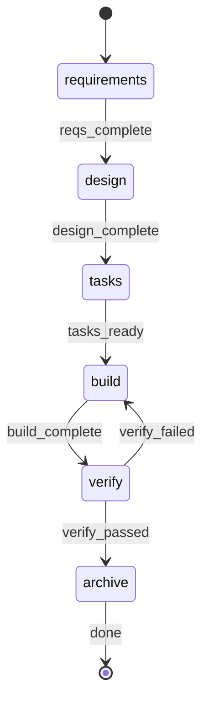

# Build Command

6-step workflow orchestrator. Delegates to specialized agents.

## Parameters

Extract these parameters from the user's input:

| Parameter | Required | Default | Description |
|-----------|----------|---------|-------------|
| `FEATURE_ID` | Yes | - | Feature identifier (kebab-case) |
| `REQUIREMENTS` | No | `""` | Raw requirements text describing what to build |
| `AFK` | No | `false` | Non-interactive mode. Set `true` if user says "afk", "no prompts", or "unattended" |
| `GIT_WORKTREE` | No | `false` | Use isolated git worktree. Set `true` if user says "worktree" or "isolated" |
| `GIT_COMMIT` | No | `false` | Commit changes after build. Set `true` if user says "commit" |
| `GIT_PUSH` | No | `false` | Push branch to remote. Set `true` if user says "push" |
| `GIT_PR` | No | `false` | Create PR (implies push and commit). Set `true` if user says "pr" or "pull request" |

**Environment values** (resolve via shell):
- `RP1_ROOT`: !`rp1 agent-tools rp1-root-dir` (extract `data.root` from JSON response)

**Feature dir**: `{{$RP1_ROOT}}/work/features/{FEATURE_ID}/`

## §0-FIRST-ACTION

**Your FIRST tool call MUST be spawning the artifact detector.** No exceptions.

```
Task: rp1-dev:build-artifact-detector
prompt: FEATURE_ID={FEATURE_ID}, RP1_ROOT={{$RP1_ROOT}}
```

**DO NOT** before this completes:
- Read any files (KB, code, specs)
- Analyze the requirements
- Load context yourself

Agents handle their own context. You orchestrate.

## STATE-MACHINE



**On each phase transition**, report via:
```
rp1 agent-tools work update \
  --project "$(pwd)" \
  --feature {FEATURE_ID} \
  --workflow build \
  --run-id {RUN_ID} \
  --step {CURRENT_STATE} \
  --status started
```

- Generate `RUN_ID` as a UUID at workflow start

**State Progression Protocol**:
1. Report each `--step` with `--status started` when you enter that state
2. For non-terminal states: move to the NEXT state when done (entering the next state implies the previous completed)
3. For terminal states (those with `→ [*]` transitions): report `--status completed` when the step's work finishes
4. On error, transition to the appropriate failure/retry state in the graph

**Example sequence**:
```
--step requirements --status started   # entering requirements
--step design --status started         # requirements done, entering design
--step tasks --status started          # design done, entering tasks
--step build --status started          # tasks done, entering build
--step verify --status started         # build done, entering verify
--step archive --status started        # verify passed, entering archive
--step archive --status completed      # archive done, workflow complete
```

## §FLAG-VALIDATION

**Implication chain**:

- If `GIT_PR`: set `GIT_PUSH=true`, `GIT_COMMIT=true`
- If `GIT_PUSH`: set `GIT_COMMIT=true`

**Validation**:

- `GIT_PUSH` without `GIT_COMMIT` after implication chain: ERROR "Nothing to push without commits"

## §AFK-MODE

Skip prompts, auto-select defaults, retry once on failure, auto-archive.

## §ARTIFACT-DETECTION

Agent spawned in §0-FIRST-ACTION. Parse its response:

- Extract `start_step` (1-6) and `artifacts` status

## §PROGRESS

| Step | Name | Agent(s) |
|------|------|----------|
| 1 | Requirements | feature-requirement-gatherer |
| 2 | Design | feature-architect, hypothesis-tester (opt), feature-tasker |
| 3 | Tasks | feature-tasker |
| 4 | Build | build-task-parser, build-task-grouper, task-builder, task-reviewer, test-runner, comment-cleaner, scribe |
| 5 | Verify | code-checker, feature-verifier, comment-cleaner, build-verify-aggregator |
| 6 | Archive | feature-archiver |

**Symbols**: `[ ]`=PENDING, `[~]`=RUNNING, `[x]`=COMPLETED, `[-]`=SKIPPED, `[!]`=FAILED

## §ERROR-HANDLING

Steps 1-3 foundational -> ABORT on fail. Steps 4-6 -> retry/prompt. NEVER delete artifacts.

**On ABORT**: Follow failure transitions in the state machine before terminating.

---

## §STEP-1: Requirements

**Skip if**: start_step > 1

```
Task: rp1-dev:feature-requirement-gatherer
prompt: FEATURE_ID={FEATURE_ID}, REQUIREMENTS={REQUIREMENTS}, AFK={AFK}, RP1_ROOT={{$RP1_ROOT}}
```

### §1.1 Requirements Review Checkpoint

**Skip if**: AFK

After requirements completes, pause for user review:

```
AskUserQuestion: |
  Requirements phase complete. Review artifact:
  - {{$RP1_ROOT}}/work/features/{FEATURE_ID}/requirements.md

  Summary: Generated requirements specification with functional requirements,
  user stories, and defined scope boundaries.

  Options:
  1. "Continue" - Proceed to design phase
  2. "Revise" - Re-run requirements with feedback
  3. "Stop" - Exit workflow (artifacts preserved)
```

**On "Revise"**: Prompt for feedback, append to REQUIREMENTS param, re-invoke §STEP-1.
**On "Stop"**: Output summary of completed steps (Step 1 done), provide resume instruction: `/build {FEATURE_ID}`. Exit.

## §STEP-2: Design

**Skip if**: start_step > 2

```
Task: rp1-dev:feature-architect
prompt: FEATURE_ID={FEATURE_ID}, AFK={AFK}, UPDATE_MODE={design.md exists}, RP1_ROOT={{$RP1_ROOT}}
```

If `flagged_hypotheses` non-empty:

```
Task: rp1-dev:hypothesis-tester
prompt: FEATURE_ID={FEATURE_ID}, WORKFLOW=build, RUN_ID={RUN_ID}
```

```
Task: rp1-dev:feature-tasker
prompt: FEATURE_ID={FEATURE_ID}, UPDATE_MODE={UPDATE_MODE}, RP1_ROOT={{$RP1_ROOT}}
```

### §2.1 Design Review Checkpoint

**Skip if**: AFK

After design completes, pause for user review:

```
AskUserQuestion: |
  Design phase complete. Review artifacts:
  - {{$RP1_ROOT}}/work/features/{FEATURE_ID}/design.md
  - {{$RP1_ROOT}}/work/features/{FEATURE_ID}/tasks.md

  Summary: Generated technical design with architecture decisions, component
  specifications, and implementation approach. Tasks file includes initial
  task breakdown with complexity assessment.

  Options:
  1. "Continue" - Proceed to task finalization phase
  2. "Revise" - Re-run design with feedback
  3. "Stop" - Exit workflow (artifacts preserved)
```

**On "Revise"**: Prompt for feedback, append to requirements.md Addendum section, re-invoke §STEP-2 with UPDATE_MODE=true.
**On "Stop"**: Output summary of completed steps (Steps 1-2 done), provide resume instruction: `/build {FEATURE_ID}`. Exit.

## §STEP-3: Tasks

**Skip if**: start_step > 3

```
Task: rp1-dev:feature-tasker
prompt: FEATURE_ID={FEATURE_ID}, UPDATE_MODE=false, RP1_ROOT={{$RP1_ROOT}}
```

### §3.1 Tasks Review Checkpoint

**Skip if**: AFK

After tasks completes, pause for user review:

```
AskUserQuestion: |
  Tasks phase complete. Review artifact:
  - {{$RP1_ROOT}}/work/features/{FEATURE_ID}/tasks.md

  Summary: Generated implementation tasks with dependency ordering
  and complexity assessment. Tasks are ready for build phase execution.

  Options:
  1. "Continue" - Proceed to build phase
  2. "Revise" - Re-run task generation with feedback
  3. "Stop" - Exit workflow (artifacts preserved)
```

**On "Revise"**: Prompt for feedback, re-invoke §STEP-3 with UPDATE_MODE=true and feedback as UPDATE_CONTEXT.
**On "Stop"**: Output summary of completed steps (Steps 1-3 done), provide resume instruction: `/build {FEATURE_ID}`. Exit.

## §STEP-4: Build

**Skip if**: start_step > 4

### §4.1 Worktree Setup

**Skip if**: `GIT_WORKTREE` is false

```
Skill: rp1-dev:worktree-workflow
args: task_slug={FEATURE_ID}, agent_prefix=feature, create_pr={GIT_PR}
```

Store: `worktree_path`, `branch`, `basedOn`

### §4.2 Task Parsing

**Spawn agent**:

```
Task: rp1-dev:build-task-parser
prompt: TASKS_PATH={{$RP1_ROOT}}/work/features/{FEATURE_ID}/tasks.md
```

**Parse response**: Extract `implementation_tasks`, `doc_tasks`, `summary`.

### §4.3 Task Grouping

**Spawn agent** (with pending implementation_tasks):

```
Task: rp1-dev:build-task-grouper
prompt: |
  TASKS: {implementation_tasks JSON}
  MAX_SIMPLE_BATCH: 3
  COMPLEX_ISOLATED: true
```

**Parse response**: Extract `task_units` array.

### §4.4 Builder-Reviewer Loop

```
for unit in task_units:
  attempt=1, max=2, feedback=null
  while attempt <= max:
    Task: rp1-dev:task-builder (FEATURE_ID, TASK_IDS, WORKTREE_PATH, GIT_COMMIT, feedback, WORKFLOW=build, RUN_ID={RUN_ID})
    Task: rp1-dev:task-reviewer (FEATURE_ID, TASK_IDS, WORKTREE_PATH, GIT_COMMIT, WORKFLOW=build, RUN_ID={RUN_ID})
    if SUCCESS: break
    elif attempt < max: feedback=result, attempt++
    else: escalate (AFK: mark blocked; Interactive: prompt)
```

### §4.5 Post-Build

**Doc Tasks** (TD*): Build `doc_scan_results.json`, spawn scribe.

### §4.6 Build Review Checkpoint

**Skip if**: AFK

After build completes, pause for user review:

```
AskUserQuestion: |
  Build phase complete. All tasks implemented.

  Summary: Completed implementation tasks with commits in branch {branch}.
  - Branch: {branch}
  - Worktree: {worktree_path or "main repo"}

  Options:
  1. "Continue" - Proceed to verification phase
  2. "Add Task" - Add additional implementation work
  3. "Stop" - Exit workflow (all code changes preserved)
```

**On "Add Task"**:

1. Prompt for task description
2. Create ad-hoc task entry with ID "TX-{timestamp}"
3. Spawn builder/reviewer:

   ```
   Task: rp1-dev:task-builder
   prompt: FEATURE_ID={FEATURE_ID}, TASK_IDS=[TX-{timestamp}], WORKTREE_PATH={worktree_path}, GIT_COMMIT={GIT_COMMIT}, PREVIOUS_FEEDBACK={task_description}, WORKFLOW=build, RUN_ID={RUN_ID}

   Task: rp1-dev:task-reviewer
   prompt: FEATURE_ID={FEATURE_ID}, TASK_IDS=[TX-{timestamp}], WORKTREE_PATH={worktree_path}, GIT_COMMIT={GIT_COMMIT}, WORKFLOW=build, RUN_ID={RUN_ID}
   ```

4. Return to §4.6 checkpoint (loop until "Continue" or "Stop")

**On "Stop"**: Output summary of completed steps (Steps 1-4 done), branch name, merge instructions: `git checkout main && git merge {branch}`. Provide resume instruction: `/build {FEATURE_ID}`. Exit.

## §STEP-5: Verify

**Skip if**: start_step > 5

### §5.1 Parallel Phases

**CRITICAL**: Invoke ALL THREE in SINGLE response.

```
Task: rp1-dev:code-checker (FEATURE_ID, branch, WORKTREE_PATH=worktree_path)
Task: rp1-dev:feature-verifier (FEATURE_ID, RP1_ROOT, WORKTREE_PATH=worktree_path, WORKFLOW=build, RUN_ID={RUN_ID})
Task: rp1-dev:comment-cleaner (MODE=clean, SCOPE=branch, COMMIT_CHANGES={GIT_COMMIT}, WORKTREE_PATH=worktree_path)
```

### §5.2 Aggregate Results

**Spawn agent**:

```
Task: rp1-dev:build-verify-aggregator
prompt: |
  PHASE_RESULTS: {
    "code_checker": {result from code-checker},
    "feature_verifier": {result from feature-verifier},
    "comment_cleaner": {result from comment-cleaner}
  }
```

**Parse response**: Extract `overall_status`, `ready_for_merge`, `manual_items`.

### §5.3 Manual Verification

If `manual_items` non-empty: Append to tasks.md `## Manual Verification` section.

### §5.4 Worktree Finalization and Git operations

**Skip commit if**: `GIT_COMMIT` is false.
**Skip push if**: `GIT_PUSH` is false.
**Skip PR if**: `GIT_PR` is false.

If `GIT_COMMIT`: validate commits; stage and commit changes.
If `GIT_PUSH`: push branch to remote.
If `GIT_PR`: create PR.
If `GIT_WORKTREE`: cleanup worktree.

## §6 SUMMARY

Register all produced artifacts. For each file that exists in `{{$RP1_ROOT}}/work/features/{FEATURE_ID}/`, run:

```bash
rp1 agent-tools work artifact \
  --project "$(pwd)" \
  --feature {FEATURE_ID} \
  --run-id {RUN_ID} \
  --path {relative_path_to_artifact}
```

Common artifacts: `requirements.md`, `design.md`, `tasks.md` in `{{$RP1_ROOT}}/work/features/{FEATURE_ID}/`.

Output: Feature ID, step status table (1-6), artifacts created.

### §6.1 Post-Verify (Interactive Only)

**Skip if**: AFK

AskUserQuestion: "Add task" -> spawn builder/reviewer. "Archive" -> Step 6. "Do nothing" -> exit.

### §STEP-6.2: Archive

**Skip if**: User chose "Do nothing"

```
Task: rp1-dev:feature-archiver
prompt: MODE=archive, FEATURE_ID={FEATURE_ID}, SKIP_DOC_CHECK=false
```

## §ORCHESTRATOR-RULES

**DO**:
- Spawn agents via Task tool for every step
- Wait for each Task to complete before proceeding
- Use AskUserQuestion for user interactions

**DO NOT**:
- Read/write/edit files directly
- Implement anything yourself
- Load KB (agents handle their own context)
 ## §FIRST-ACTION (MANDATORY)

  Your FIRST tool call MUST be spawning `rp1-dev:build-artifact-detector`.

  DO NOT:
  - Read any files
  - Load KB context
  - Analyze the requirements
  - Do anything else first

  Agents handle their own context loading.
## §ANTI-LOOP

Single-pass execution. No clarification mid-workflow. Parse -> detect -> run steps -> STOP.
