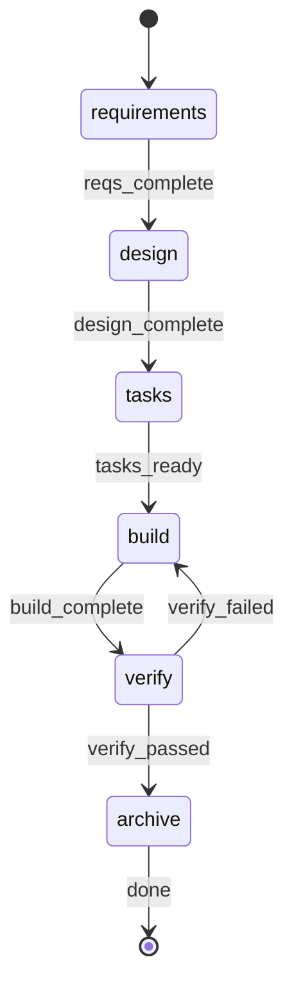

# Build Command

**YOU ARE A PURE ORCHESTRATOR.** Spawn agents for all work. NEVER write/edit/read files yourself. NEVER implement code, requirements, designs, or tests. Use exact agent references per step. If agent fails, retry it — never do its work.

**Feature dir**: `{{$RP1_WORK_ROOT}}/features/{FEATURE_ID}/`

## §0-FIRST-ACTION

**FIRST tool call MUST be:**


FEATURE_ID={FEATURE_ID}, WORKFLOW_TYPE=build, RP1_KB_ROOT={{$RP1_KB_ROOT}}


Do NOT read files, load KB, or analyze requirements before this completes.
Parse response: extract `start_step` (1-6), `artifacts` status, `run_id`, and `resumed`.

**Run ID Resolution**: Use the `run_id` from the artifact-detector response for all subsequent emits. If `resumed` is `true`, the detector found a resumable run and the returned `run_id` is the existing run. If `resumed` is `false`, the detector created a new run. Either way, set `RUN_ID = run_id` from the response. Do NOT generate a new UUID.

**Artifact Reconciliation**: If `resumed` is `true` and `unregistered_artifacts` is present and non-empty, register each artifact under the resumed run:

```bash
rp1 agent-tools emit \
  --workflow build \
  --type artifact_registered \
  --run-id {RUN_ID} \
  --step build \
  --data '{"path": "{relative_path}", "feature": "{FEATURE_ID}"}'
```

## STATE-MACHINE



**First emit** (entering the first active state): include `--name` to label the run:

```bash
rp1 agent-tools emit \
  --workflow build \
  --type status_change \
  --run-id {RUN_ID} \
  --step {STATE} \
  --name "Feature: {FEATURE_ID}" \
  --data '{"status": "running", "feature": "{FEATURE_ID}"}'
```

Subsequent state transitions omit `--name` (set-once semantics; the DB keeps the first value):

```bash
rp1 agent-tools emit \
  --workflow build \
  --type status_change \
  --run-id {RUN_ID} \
  --step {STATE} \
  --data '{"status": "running", "feature": "{FEATURE_ID}"}'
```

`RUN_ID` comes from the artifact-detector (§0-FIRST-ACTION). Do NOT generate a new UUID.

## §PROGRESS

| Step | Agent(s) |
|------|----------|
| 1 Requirements | feature-requirement-gatherer |
| 2 Design | feature-architect, hypothesis-tester (opt), feature-tasker |
| 3 Tasks | feature-tasker |
| 4 Build | build-task-parser, build-task-grouper, task-builder, task-reviewer |
| 5 Verify | code-checker, feature-verifier, comment-cleaner, build-verify-aggregator |
| 6 Archive | feature-archiver |

Symbols: `[ ]`=PENDING `[~]`=RUNNING `[x]`=COMPLETED `[-]`=SKIPPED `[!]`=FAILED
Steps 1-3 foundational → ABORT on fail. Steps 4-6 → retry/prompt. NEVER delete artifacts.
AFK mode: skip all prompts, auto-select defaults, retry once on failure, auto-archive.

---

## §STEP-1: Requirements

**Skip if**: start_step > 1. **Spawn agent — do NOT gather requirements yourself:**


FEATURE_ID={FEATURE_ID}, REQUIREMENTS={REQUIREMENTS}, AFK={AFK}, RP1_KB_ROOT={{$RP1_KB_ROOT}}, WORKFLOW=build, RUN_ID={RUN_ID}


Validate the response before continuing:

- Accept only the documented completion contract from `feature-requirement-gatherer`: JSON with `"status": "success"` and `"artifact": "{{$RP1_WORK_ROOT}}/features/{FEATURE_ID}/requirements.md"`, or the exact text line `Requirements completed: {{$RP1_WORK_ROOT}}/features/{FEATURE_ID}/requirements.md`.
- Treat any response that mentions commits, source-code edits, tests, verification, unrelated file paths, or implementation completion as a contract failure.
- On contract failure: retry step 1 once with an explicit reminder that the agent may only write `requirements.md` and must not implement anything.
- If the retry also fails, abort the build as failed. Do not continue to design, build, verify, or archive based on non-compliant output.

**Checkpoint** (skip if AFK):

```bash
rp1 agent-tools emit \
  --workflow build \
  --type waiting_for_user \
  --run-id {RUN_ID} \
  --step requirements \
  --data '{"prompt": "Continue, Revise, Review feedback from Arcade, or Stop?", "context": "Requirements gathering complete"}'
```


On Revise: get feedback, append to REQUIREMENTS, re-invoke step 1.
On Review feedback from Arcade: load `arcade-collab` skill, process all feedback for RUN_ID, then return to this checkpoint with original options.
On Stop: emit waiting status, output summary, exit with `/build {FEATURE_ID}` resume instruction.

```bash
rp1 agent-tools emit \
  --workflow build \
  --type status_change \
  --run-id {RUN_ID} \
  --step requirements \
  --data '{"status": "waiting", "feature": "{FEATURE_ID}"}'
```

## §STEP-2: Design

**Skip if**: start_step > 2. **Spawn agent — do NOT design yourself:**


FEATURE_ID={FEATURE_ID}, AFK={AFK}, UPDATE_MODE={design.md exists}, RP1_KB_ROOT={{$RP1_KB_ROOT}}, WORKFLOW=build, RUN_ID={RUN_ID}


If `flagged_hypotheses` non-empty:


FEATURE_ID={FEATURE_ID}, WORKFLOW=build, RUN_ID={RUN_ID}



FEATURE_ID={FEATURE_ID}, UPDATE_MODE={UPDATE_MODE}, RP1_KB_ROOT={{$RP1_KB_ROOT}}, WORKFLOW=build, RUN_ID={RUN_ID}


**Checkpoint** (skip if AFK):

```bash
rp1 agent-tools emit \
  --workflow build \
  --type waiting_for_user \
  --run-id {RUN_ID} \
  --step design \
  --data '{"prompt": "Continue, Revise, Review feedback from Arcade, or Stop?", "context": "Design and task generation complete"}'
```


On Revise: get feedback, re-invoke §STEP-2 with UPDATE_MODE=true.
On Review feedback from Arcade: load `arcade-collab` skill, process all feedback for RUN_ID, then return to this checkpoint with original options.
On Stop: emit waiting status, output summary (steps 1-2 done), exit with `/build {FEATURE_ID}`.

```bash
rp1 agent-tools emit \
  --workflow build \
  --type status_change \
  --run-id {RUN_ID} \
  --step design \
  --data '{"status": "waiting", "feature": "{FEATURE_ID}"}'
```

## §STEP-3: Tasks

**Skip if**: start_step > 3. **Spawn agent:**


FEATURE_ID={FEATURE_ID}, UPDATE_MODE=false, RP1_KB_ROOT={{$RP1_KB_ROOT}}, WORKFLOW=build, RUN_ID={RUN_ID}


**Checkpoint** (skip if AFK):

```bash
rp1 agent-tools emit \
  --workflow build \
  --type waiting_for_user \
  --run-id {RUN_ID} \
  --step tasks \
  --data '{"prompt": "Continue, Revise, Review feedback from Arcade, or Stop?", "context": "Task breakdown complete"}'
```


On Revise: get feedback, re-invoke §STEP-3 with UPDATE_MODE=true and feedback as UPDATE_CONTEXT.
On Review feedback from Arcade: load `arcade-collab` skill, process all feedback for RUN_ID, then return to this checkpoint with original options.
On Stop: emit waiting status, output summary (steps 1-3 done), exit with `/build {FEATURE_ID}`.

```bash
rp1 agent-tools emit \
  --workflow build \
  --type status_change \
  --run-id {RUN_ID} \
  --step tasks \
  --data '{"status": "waiting", "feature": "{FEATURE_ID}"}'
```

## §STEP-4: Build

**Skip if**: start_step > 4. **You MUST spawn task-builder — do NOT write code yourself.**

### §4.1 Parse + Group


TASKS_PATH={{$RP1_WORK_ROOT}}/features/{FEATURE_ID}/tasks.md


Extract `implementation_tasks`, `doc_tasks`.


TASKS: {implementation_tasks JSON}, MAX_SIMPLE_BATCH: 3, COMPLEX_ISOLATED: true


Extract `task_units` array.

### §4.2 Builder-Reviewer Loop

For each task unit, run builder then reviewer:


FEATURE_ID={FEATURE_ID}, TASK_IDS={TASK_IDS}, GIT_COMMIT={GIT_COMMIT}, FEEDBACK={feedback}, WORKFLOW=build, RUN_ID={RUN_ID}



FEATURE_ID={FEATURE_ID}, TASK_IDS={TASK_IDS}, GIT_COMMIT={GIT_COMMIT}, WORKFLOW=build, RUN_ID={RUN_ID}


Loop logic: attempt=1, max=2. If reviewer reports SUCCESS: move to next unit. If FAILURE and attempt < max: pass feedback to builder, retry. Else: escalate (AFK: mark blocked; Interactive: prompt user).

### §4.3 Post-Build

Doc tasks (TD*): build doc_scan_results.json, spawn scribe.

**Checkpoint** (skip if AFK):

```bash
rp1 agent-tools emit \
  --workflow build \
  --type waiting_for_user \
  --run-id {RUN_ID} \
  --step build \
  --data '{"prompt": "Continue, Add Task, Review feedback from Arcade, or Stop?", "context": "Build phase complete"}'
```


On Add Task: spawn builder+reviewer for ad-hoc TX-{timestamp} task, loop back.
On Review feedback from Arcade: load `arcade-collab` skill, process all feedback for RUN_ID, then return to this checkpoint with original options.

## §STEP-5: Verify

**Skip if**: start_step > 5. **Invoke ALL THREE in SINGLE response:**


FEATURE_ID={FEATURE_ID}, BRANCH={branch}



FEATURE_ID={FEATURE_ID}, RP1_KB_ROOT={{$RP1_KB_ROOT}}, WORKFLOW=build, RUN_ID={RUN_ID}



MODE=clean, SCOPE=branch, COMMIT_CHANGES={GIT_COMMIT}


Then aggregate:


PHASE_RESULTS: { code_checker: {...}, feature_verifier: {...}, comment_cleaner: {...} }


Extract `overall_status`, `ready_for_merge`, `manual_items`.

### Git Operations (conditional)

If GIT_COMMIT: stage+commit. If GIT_PUSH: push. If GIT_PR: create PR.

## §6 SUMMARY

Register artifacts: for each file in `{{$RP1_WORK_ROOT}}/features/{FEATURE_ID}/`:

```bash
rp1 agent-tools emit \
  --workflow build \
  --type artifact_registered \
  --run-id {RUN_ID} \
  --step archive \
  --data '{"path": "{relative_path}", "feature": "{FEATURE_ID}"}'
```

Output: Feature ID, step status table (1-6), artifacts created.

**Emit completed status** after registering all artifacts:

```bash
rp1 agent-tools emit \
  --workflow build \
  --type status_change \
  --run-id {RUN_ID} \
  --step archive \
  --data '{"status": "completed", "feature": "{FEATURE_ID}"}'
```

**Post-verify** (skip if AFK):

```bash
rp1 agent-tools emit \
  --workflow build \
  --type waiting_for_user \
  --run-id {RUN_ID} \
  --step verify \
  --data '{"prompt": "Add task, Archive, Review feedback from Arcade, or Do nothing?", "context": "Verification complete"}'
```


On Review feedback from Arcade: load `arcade-collab` skill, process all feedback for RUN_ID, then return to this checkpoint with original options.

### Archive (skip if "Do nothing")


MODE=archive, FEATURE_ID={FEATURE_ID}, SKIP_DOC_CHECK=false


## §TERMINAL-STATES

**Every exit path MUST emit a terminal status.** No run may remain in "running" after the skill finishes.

| Exit Path | Status | Step |
|-----------|--------|------|
| Archive completes successfully | `completed` | `archive` |
| User selects "Stop" at any checkpoint | `waiting` | current step |
| User selects "Do nothing" at post-verify | `completed` | `archive` |
| Unrecoverable agent failure (steps 1-3) | `failed` | failing step |
| AFK mode abort | `failed` | failing step |

On any unrecoverable failure, emit before exiting:

```bash
rp1 agent-tools emit \
  --workflow build \
  --type status_change \
  --run-id {RUN_ID} \
  --step {FAILING_STEP} \
  --data '{"status": "failed", "feature": "{FEATURE_ID}"}'
```

## §ANTI-LOOP

Single-pass execution. Parse → detect → run steps → STOP.
