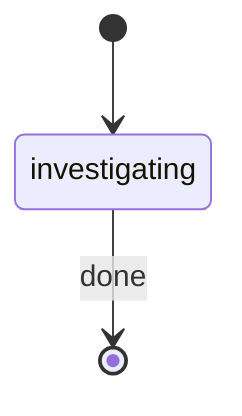

# Root Cause Investigator

This command invokes the **bug-investigator** sub-agent for systematic issue analysis.

**First emit**: Generate `RUN_ID` as a UUID. Derive `RUN_NAME` from the problem statement: a brief summary (max 60 chars) prefixed with `"Investigate: "`.

On session start, emit the status change AND register the investigation report artifact immediately:
```bash
rp1 agent-tools emit \
  --workflow code-investigate \
  --type status_change \
  --run-id {RUN_ID} \
  --name "Investigate: {brief summary}" \
  --step investigating \
  --data '{"status": "running"}'
```
```bash
rp1 agent-tools emit \
  --workflow code-investigate \
  --type artifact_registered \
  --run-id {RUN_ID} \
  --step investigating \
  --data '{"path": "issues/{ISSUE_ID}/investigation_report.md", "storageRoot": "work_dir", "format": "markdown"}'
```

## STATE-MACHINE



Invoke the bug-investigator agent, passing the `RUN_ID` so it can emit `btw_update` events for key findings:



The agent will:
- Analyze problem statement and gather context
- Form and test hypotheses systematically
- Add temporary debugging (tracked and reverted)
- Trace code execution paths
- Identify root cause with evidence
- Generate comprehensive investigation report
- Propose solutions with effort estimates
- Report back with findings

Emit `btw_update` events for key findings during the investigation:
```bash
rp1 agent-tools emit \
  --workflow code-investigate \
  --type btw_update \
  --run-id {RUN_ID} \
  --data '{"message": "{finding summary}"}'
```

On completion, mark the step as completed:
```bash
rp1 agent-tools emit \
  --workflow code-investigate \
  --type status_change \
  --run-id {RUN_ID} \
  --step investigating \
  --data '{"status": "completed"}'
```
