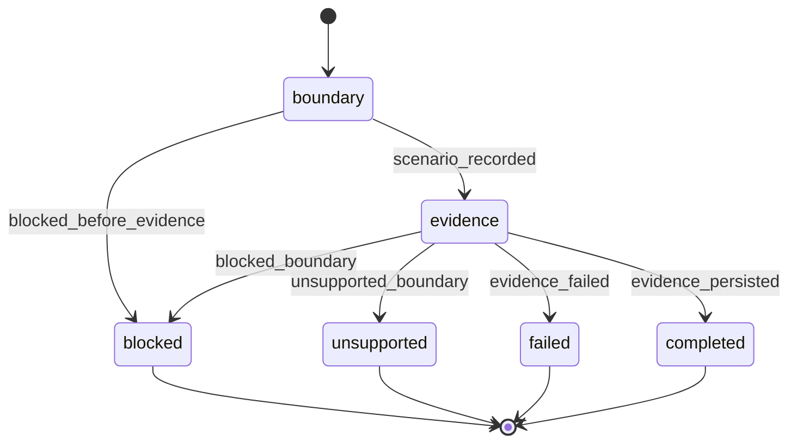

# Gemini Harness Boundaries

Experimental tracked workflow schema for Gemini P3 boundary evidence. It records trust, approval, auth, user-input, headless, and lifecycle outcomes as validation evidence only.

Use the pre-resolved `FEATURE_ID`, `RUN_CONTEXT`, `projectRoot`, `kbRoot`, `workRoot`, `codeRoot`, and `RUN_ID` values from the generated Workflow Bootstrap section. `RUN_ID` is required for every emit and artifact registration, and it comes from workflow bootstrap rather than user input.

Do not claim Gemini first-class support. This workflow may only report `passed`, `degraded`, `blocked`, `unsupported`, `failed`, or `not_run` boundary evidence for the experimental Gemini path.

## STATE-MACHINE



## Input Contract

| Input | Source | Required | Purpose |
|-------|--------|----------|---------|
| `FEATURE_ID` | resolved argument | yes | Names the work-root feature directory for evidence artifacts. |
| `RUN_CONTEXT` | resolved argument | no | Labels manual, headless, retry, lifecycle, or trust validation context. |
| `RUN_ID` | generated workflow bootstrap | yes | Ties emits and artifacts to the tracked boundary run. |

## Artifact Contract

Write evidence under `workRoot` only:

```text
{workRoot}/features/{FEATURE_ID}/gemini-boundaries.md
{workRoot}/features/{FEATURE_ID}/gemini-boundaries.json
```

Register artifacts with work-root-relative paths:

```text
features/{FEATURE_ID}/gemini-boundaries.md
features/{FEATURE_ID}/gemini-boundaries.json
```

Every artifact registration MUST include explicit `storageRoot: "work_dir"`.

## Procedure

1. Emit `boundary` running. On the first emit only, include a run name:

```bash
rp1 agent-tools emit \
  --harness gemini-cli \
  --workflow gemini-harness-boundaries \
  --type status_change \
  --run-id {RUN_ID} \
  --step boundary \
  --name "Gemini boundary evidence: {FEATURE_ID}" \
  --data '{"status": "running", "feature": "{FEATURE_ID}", "phase": "boundary"}'
```

2. Capture boundary facts:
   - received `FEATURE_ID`
   - received `RUN_CONTEXT`
   - `RUN_ID`
   - `projectRoot`
   - `kbRoot`
   - `workRoot`
   - `codeRoot`
   - whether `codeRoot` differs from `projectRoot`
   - Gemini version, if `gemini --version` succeeds
   - scenario, mode, status, state, blocker, user action, resume support, and lifecycle stage when provided

3. If Gemini cannot execute the command because auth, trust, approval, shell execution, sandbox approval, or headless continuation is blocked, report the required user action and emit terminal `blocked` when a run context exists. Do not retry automatically.

```bash
rp1 agent-tools emit \
  --harness gemini-cli \
  --workflow gemini-harness-boundaries \
  --type status_change \
  --run-id {RUN_ID} \
  --step blocked \
  --data '{"status": "failed", "feature": "{FEATURE_ID}", "classification": "blocked", "reason": "{reason}"}' \
  --close-run
```

4. If a boundary scenario can be recorded, emit `evidence` running:

```bash
rp1 agent-tools emit \
  --harness gemini-cli \
  --workflow gemini-harness-boundaries \
  --type status_change \
  --run-id {RUN_ID} \
  --step evidence \
  --data '{"status": "running", "feature": "{FEATURE_ID}", "phase": "evidence"}'
```

5. Persist both artifacts and register them:

```bash
rp1 agent-tools emit \
  --harness gemini-cli \
  --workflow gemini-harness-boundaries \
  --type artifact_registered \
  --run-id {RUN_ID} \
  --step evidence \
  --data '{"path": "features/{FEATURE_ID}/gemini-boundaries.md", "feature": "{FEATURE_ID}", "storageRoot": "work_dir", "format": "markdown", "harness": "gemini-cli"}'
```

```bash
rp1 agent-tools emit \
  --harness gemini-cli \
  --workflow gemini-harness-boundaries \
  --type artifact_registered \
  --run-id {RUN_ID} \
  --step evidence \
  --data '{"path": "features/{FEATURE_ID}/gemini-boundaries.json", "feature": "{FEATURE_ID}", "storageRoot": "work_dir", "format": "json", "harness": "gemini-cli"}'
```

6. Emit the terminal state:

Passed or degraded evidence:

```bash
rp1 agent-tools emit \
  --harness gemini-cli \
  --workflow gemini-harness-boundaries \
  --type status_change \
  --run-id {RUN_ID} \
  --step completed \
  --data '{"status": "completed", "feature": "{FEATURE_ID}", "classification": "{passed_or_degraded}"}' \
  --close-run
```

Blocked evidence:

```bash
rp1 agent-tools emit \
  --harness gemini-cli \
  --workflow gemini-harness-boundaries \
  --type status_change \
  --run-id {RUN_ID} \
  --step blocked \
  --data '{"status": "failed", "feature": "{FEATURE_ID}", "classification": "blocked", "reason": "{reason}"}' \
  --close-run
```

Unsupported boundary:

```bash
rp1 agent-tools emit \
  --harness gemini-cli \
  --workflow gemini-harness-boundaries \
  --type status_change \
  --run-id {RUN_ID} \
  --step unsupported \
  --data '{"status": "failed", "feature": "{FEATURE_ID}", "classification": "unsupported", "reason": "{reason}"}' \
  --close-run
```

Failed evidence:

```bash
rp1 agent-tools emit \
  --harness gemini-cli \
  --workflow gemini-harness-boundaries \
  --type status_change \
  --run-id {RUN_ID} \
  --step failed \
  --data '{"status": "failed", "feature": "{FEATURE_ID}", "classification": "failed", "reason": "{reason}"}' \
  --close-run
```

## Output

Output only:

```text
Gemini boundary validation: passed|degraded|blocked|unsupported|failed|not_run
State: {state}
Run: {RUN_ID}
Artifacts:
- features/{FEATURE_ID}/gemini-boundaries.md
- features/{FEATURE_ID}/gemini-boundaries.json
Registration: registered|registration_failed
Blocker: {blocker_or_none}
User action: {action_or_none}
Classification: experimental boundary evidence only
```
