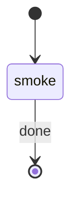

# Gemini Harness Smoke

Experimental tracked workflow schema for the Gemini CLI smoke command. It proves only the minimum rp1 handoff: arguments -> bootstrap -> roots -> work artifact -> artifact registration.

Use the pre-resolved `projectRoot`, `kbRoot`, `workRoot`, `codeRoot`, and `RUN_ID` values from the generated Workflow Bootstrap section. Do not claim Gemini first-class parity, subagent support, fanout support, or lifecycle hardening.

## STATE-MACHINE



## Procedure

1. Emit `smoke` running:

```bash
rp1 agent-tools emit \
  --harness gemini-cli \
  --workflow gemini-harness-smoke \
  --type status_change \
  --run-id {RUN_ID} \
  --step smoke \
  --data '{"status": "running"}'
```

2. Capture evidence:
   - received `FEATURE_ID`
   - received `RUN_CONTEXT`
   - `RUN_ID`
   - `projectRoot`
   - `kbRoot`
   - `workRoot`
   - `codeRoot`
   - whether `codeRoot` differs from `projectRoot`
   - Gemini version, if `gemini --version` succeeds
   - command path, when launched from the Gemini command template

3. Write the artifact to:

```text
{workRoot}/features/{FEATURE_ID}/gemini-smoke.md
```

The artifact path registered with rp1 is:

```text
features/{FEATURE_ID}/gemini-smoke.md
```

4. Register the artifact:

```bash
rp1 agent-tools emit \
  --harness gemini-cli \
  --workflow gemini-harness-smoke \
  --type artifact_registered \
  --run-id {RUN_ID} \
  --step smoke \
  --data '{"path": "features/{FEATURE_ID}/gemini-smoke.md", "feature": "{FEATURE_ID}", "storageRoot": "work_dir", "format": "markdown", "harness": "gemini-cli"}'
```

5. If registration succeeds, update the artifact with `registration_status: registered`, then emit `smoke` completed with `--close-run`.

6. If registration fails, update the artifact with `registration_status: registration_failed`, emit `smoke` failed when possible, and report the failure as a Gemini smoke-path blocker.

## Output

Output only:

```text
Gemini smoke status: passed|blocked
Run: {RUN_ID}
Artifact: features/{FEATURE_ID}/gemini-smoke.md
Registration: registered|registration_failed
```
