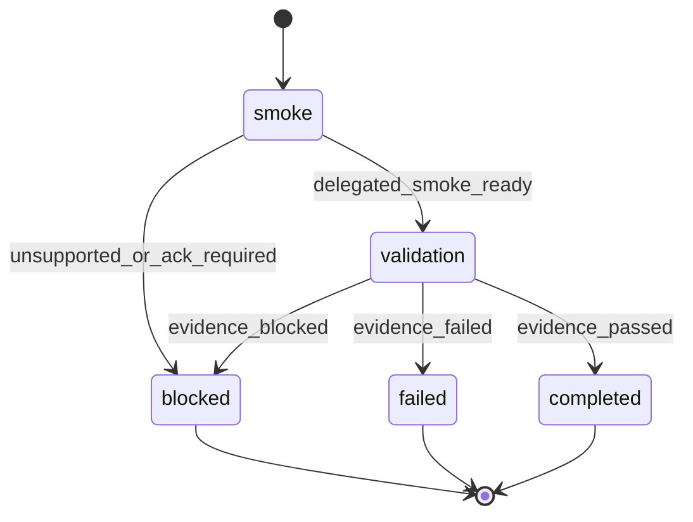

# Gemini Harness Subagents

Experimental tracked workflow schema for the Gemini CLI P2 delegation gate. It records whether Gemini can run extension-packaged rp1 custom subagents, collect attributable fanout outputs, preserve an intentional delegated failure, and produce support-matrix-ready evidence.

Use the pre-resolved `FEATURE_ID`, `RUN_CONTEXT`, `projectRoot`, `kbRoot`, `workRoot`, `codeRoot`, and `RUN_ID` values from the generated Workflow Bootstrap section. `RUN_ID` is required for every emit and artifact registration, and it comes from workflow bootstrap rather than user input.

Do not claim Gemini first-class support. This workflow may only report `passed`, `failed`, or `blocked` validation evidence for the experimental Gemini delegation path.

## STATE-MACHINE



## Input Contract

| Input | Source | Required | Purpose |
|-------|--------|----------|---------|
| `FEATURE_ID` | resolved argument | yes | Names the work-root feature directory for evidence artifacts. |
| `RUN_CONTEXT` | resolved argument | no | Labels manual, CI, or retry validation context. |
| `RUN_ID` | generated workflow bootstrap | yes | Ties emits and artifacts to the tracked validation run. |

## Artifact Contract

Write evidence under `workRoot` only:

```text
{workRoot}/features/{FEATURE_ID}/gemini-subagents.md
{workRoot}/features/{FEATURE_ID}/gemini-subagents.json
```

Register artifacts with work-root-relative paths:

```text
features/{FEATURE_ID}/gemini-subagents.md
features/{FEATURE_ID}/gemini-subagents.json
```

Every artifact registration MUST include explicit `storageRoot: "work_dir"`.

## Procedure

1. Emit `smoke` running. On the first emit only, include a run name:

```bash
rp1 agent-tools emit \
  --harness gemini-cli \
  --workflow gemini-harness-subagents \
  --type status_change \
  --run-id {RUN_ID} \
  --step smoke \
  --name "Gemini subagent validation: {FEATURE_ID}" \
  --data '{"status": "running", "feature": "{FEATURE_ID}", "phase": "smoke"}'
```

2. Capture smoke facts:
   - received `FEATURE_ID`
   - received `RUN_CONTEXT`
   - `RUN_ID`
   - `projectRoot`
   - `kbRoot`
   - `workRoot`
   - `codeRoot`
   - whether `codeRoot` differs from `projectRoot`
   - Gemini version, if `gemini --version` succeeds
   - whether the Gemini command path can invoke the `rp1-alpha`, `rp1-beta`, and `rp1-runtime-fail` extension agents
   - whether Gemini requires acknowledgement or setup before those agents can run

3. If the custom subagents cannot be invoked because Gemini requires acknowledgement, trust approval, missing extension assets, or unsupported CLI behavior, emit terminal `blocked` with `status: "failed"` and a clear reason. Do not continue to `validation`.

```bash
rp1 agent-tools emit \
  --harness gemini-cli \
  --workflow gemini-harness-subagents \
  --type status_change \
  --run-id {RUN_ID} \
  --step blocked \
  --data '{"status": "failed", "feature": "{FEATURE_ID}", "classification": "blocked", "reason": "{reason}"}' \
  --close-run
```

4. If the smoke facts show the delegated path is usable, emit `validation` running:

```bash
rp1 agent-tools emit \
  --harness gemini-cli \
  --workflow gemini-harness-subagents \
  --type status_change \
  --run-id {RUN_ID} \
  --step validation \
  --data '{"status": "running", "feature": "{FEATURE_ID}", "phase": "validation"}'
```

5. Run the validation reduction for exactly these delegated units:
   - `rp1-alpha`: expected successful output with an alpha attribution marker
   - `rp1-beta`: expected successful output with a beta attribution marker
   - `rp1-runtime-fail`: expected intentional delegated runtime failure

The parent reduction must treat missing, duplicated, malformed, or unattributed alpha/beta outputs as failed validation. The intentional `rp1-runtime-fail` result is successful only when the delegated runtime failure is visible and does not corrupt the alpha or beta outputs.

6. Persist both artifacts and register them:

```bash
rp1 agent-tools emit \
  --harness gemini-cli \
  --workflow gemini-harness-subagents \
  --type artifact_registered \
  --run-id {RUN_ID} \
  --step validation \
  --data '{"path": "features/{FEATURE_ID}/gemini-subagents.md", "feature": "{FEATURE_ID}", "storageRoot": "work_dir", "format": "markdown", "harness": "gemini-cli"}'
```

```bash
rp1 agent-tools emit \
  --harness gemini-cli \
  --workflow gemini-harness-subagents \
  --type artifact_registered \
  --run-id {RUN_ID} \
  --step validation \
  --data '{"path": "features/{FEATURE_ID}/gemini-subagents.json", "feature": "{FEATURE_ID}", "storageRoot": "work_dir", "format": "json", "harness": "gemini-cli"}'
```

7. Emit the terminal state:

Passed validation:

```bash
rp1 agent-tools emit \
  --harness gemini-cli \
  --workflow gemini-harness-subagents \
  --type status_change \
  --run-id {RUN_ID} \
  --step completed \
  --data '{"status": "completed", "feature": "{FEATURE_ID}", "classification": "passed"}' \
  --close-run
```

Failed validation:

```bash
rp1 agent-tools emit \
  --harness gemini-cli \
  --workflow gemini-harness-subagents \
  --type status_change \
  --run-id {RUN_ID} \
  --step failed \
  --data '{"status": "failed", "feature": "{FEATURE_ID}", "classification": "failed", "reason": "{reason}"}' \
  --close-run
```

Blocked validation:

```bash
rp1 agent-tools emit \
  --harness gemini-cli \
  --workflow gemini-harness-subagents \
  --type status_change \
  --run-id {RUN_ID} \
  --step blocked \
  --data '{"status": "failed", "feature": "{FEATURE_ID}", "classification": "blocked", "reason": "{reason}"}' \
  --close-run
```

## Output

Output only:

```text
Gemini subagent validation: passed|failed|blocked
Run: {RUN_ID}
Artifacts:
- features/{FEATURE_ID}/gemini-subagents.md
- features/{FEATURE_ID}/gemini-subagents.json
Classification: experimental validation evidence only
Reason: {reason_or_none}
```
