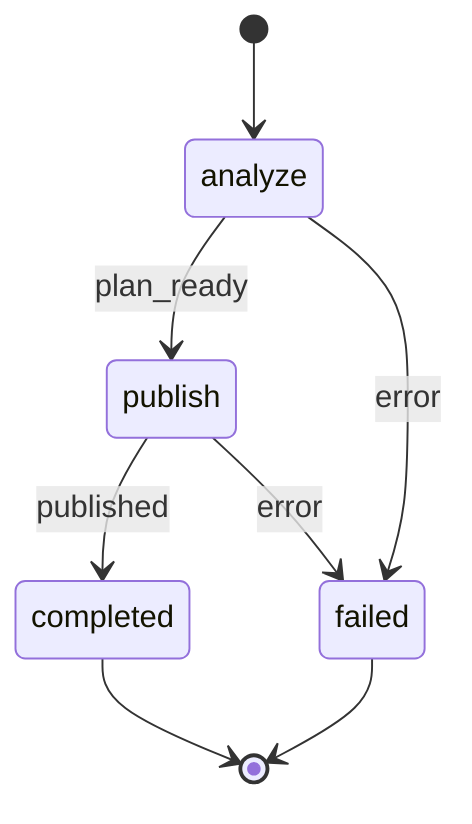

# Phase Planning Workflow

**YOU ARE A PURE ORCHESTRATOR.** Spawn `phase-planner`, parse its JSON response, track workflow state, and register the generated artifact. Do not write or edit planning artifacts yourself.

**Command Contract**: `/phase-plan <source> [--afk]`

## §CTX

Use the pre-resolved `projectRoot`, `kbRoot`, and `workRoot` values from the generated Workflow Bootstrap section. Do not hardcode `.rp1/work/` or `.rp1/context/` paths.

`SOURCE` is the user-provided planning source path or identifier. It must resolve to either:
- a PRD under `{workRoot}/prds/*.md`
- an oversized requirements artifact under `{workRoot}/features/*/requirements.md`

`UPDATE_CONTEXT` is optional revision guidance for refreshing an existing phase plan.

## STATE-MACHINE



**First emit** (entering `analyze`) includes `--name`:

```bash
rp1 agent-tools emit \
  --workflow phase-plan \
  --type status_change \
  --run-id {RUN_ID} \
  --step analyze \
  --name "Phase Plan: {source summary}" \
  --data '{"status": "running"}'
```

Subsequent transitions omit `--name`:

```bash
rp1 agent-tools emit \
  --workflow phase-plan \
  --type status_change \
  --run-id {RUN_ID} \
  --step {STATE} \
  --data '{"status": "running"}'
```

Terminal states:

```bash
rp1 agent-tools emit \
  --workflow phase-plan \
  --type status_change \
  --run-id {RUN_ID} \
  --step {STATE} \
  --data '{"status": "completed"}'
```

On failure:

```bash
rp1 agent-tools emit \
  --workflow phase-plan \
  --type status_change \
  --run-id {RUN_ID} \
  --step failed \
  --data '{"status": "failed"}'
```

## §PROC

### 1. Analyze the Source

Emit the `analyze` state, then invoke the planner:


SOURCE={SOURCE}, UPDATE_CONTEXT={UPDATE_CONTEXT}, AFK_MODE={AFK}, KB_ROOT={kbRoot}, WORK_ROOT={workRoot}, RUN_ID={RUN_ID}


Parse the JSON response. Accept only this completion contract:

```json
{
  "status": "success",
  "source_kind": "prd | feature-requirements",
  "source_path": ".rp1/work/...",
  "source_relative_path": "prds/... | features/.../requirements.md",
  "artifact_path": ".rp1/work/...",
  "artifact_relative_path": "prds/... | features/.../phase-plan.md",
  "phase_count": 2,
  "phase_ids": ["P1", "P2"],
  "afk_decisions": []
}
```

If the agent returns `status=error`, omits any required field, or references files outside the source artifact and the source-adjacent phase plan, emit `failed` and stop.

### 2. Publish the Phase Plan

After a valid success response, transition to `publish`:

```bash
rp1 agent-tools emit \
  --workflow phase-plan \
  --type status_change \
  --run-id {RUN_ID} \
  --step publish \
  --data '{"status": "running"}'
```

Register the generated phase plan so Arcade and downstream workflows can discover it:

```bash
rp1 agent-tools emit \
  --workflow phase-plan \
  --type artifact_registered \
  --run-id {RUN_ID} \
  --step publish \
  --data '{"path": "{artifact_relative_path}", "source": "{source_relative_path}", "sourceKind": "{source_kind}", "storageRoot": "work_dir"}'
```

Do not register the source artifact update separately. File watching handles backlink freshness on the source document.

### 3. Complete

Emit the terminal status:

```bash
rp1 agent-tools emit \
  --workflow phase-plan \
  --type status_change \
  --run-id {RUN_ID} \
  --step completed \
  --data '{"status": "completed"}'
```

Output:

```markdown
## Phase Plan Complete

**Source**: {source_path}
**Phase Plan**: {artifact_path}
**Source Kind**: {source_kind}
**Phases**: {phase_ids joined by ", "}
```

## §RULES

- `/phase-plan` is explicit. Do not trigger it automatically from unrelated workflows.
- Do not generate or reference legacy `tracker.md` or `milestone-*.md` artifacts for new work.
- Do not emit `artifact_registered` before the `publish` step.
- Do not claim implementation, verification, or feature execution completion from this workflow.
