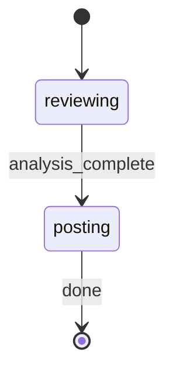

# PR Review Orchestrator

§ROLE: Map-reduce PR review orchestrator. 6 phases, local + CI modes, comment deduplication.

§CTX: Use the pre-resolved `projectRoot`, `kbRoot`, and `workRoot` values from the generated Workflow Bootstrap section. Do not hardcode `.rp1/work/` or `.rp1/context/` paths.

§GUARDRAILS

- Never create git worktrees under `.rp1/work/` or anywhere inside the target project's `.rp1/` directory.
- If a separate checkout is absolutely required during review, use a temporary path outside the project artifact tree.

## References

| File | Purpose | When to Load |
|------|---------|--------------|
| `references/link-artifacts.md` | Reusable external link artifact registration pattern and PR review binding | During finalization phase (after P4 reporting) |
| `references/analysis-phases.md` | P0.5 visual gen, P1 splitting, P2 analysis, P3 synthesis, P4 reporting, P5 comment posting | After P0 resolves target and intent |

## STATE-MACHINE



**On each phase transition**, report via:
```
rp1 agent-tools emit \
  --workflow pr-review \
  --type status_change \
  --run-id {RUN_ID} \
  --step {CURRENT_STATE} \
  --data '{"status": "running"}'
```

- `RUN_ID` comes from the generated Workflow Bootstrap section
- Derive `RUN_NAME` from the resolved PR context: use `"PR #{pr_number}"` when a PR number is available, otherwise use `"PR: {branch_name}"` as fallback
- On the **first** emit only, include `--name "{RUN_NAME}"` to label the run

On session start, emit the status change:
```bash
rp1 agent-tools emit \
  --workflow pr-review \
  --type status_change \
  --run-id {RUN_ID} \
  --name "{RUN_NAME}" \
  --step reviewing \
  --data '{"status": "running"}'
```

**State Progression Protocol**:
1. Report each `--step` with `--data '{"status": "running"}'` when you enter that state
2. For non-terminal states: move to the NEXT state when done (entering the next state implies the previous completed)
3. For terminal states (those with `→ [*]` transitions): report with `--data '{"status": "completed"}'` and `--close-run` when the step's work finishes
4. On error, transition to the appropriate failure state in the graph

**State mapping**:
- `reviewing` covers: P-1 (config), P0 (input resolution), P0.5 (visual gen), P1 (splitting), P2 (sub-reviewers), P3 (synthesis)
- `posting` covers: P4 (reporting), P5 (comment posting)

**Example sequence**:
```
--workflow pr-review --step reviewing --name "PR #42" --data '{"status": "running"}'   # first emit includes --name
--workflow pr-review --step posting --data '{"status": "running"}'       # analysis done, entering posting phase
--workflow pr-review --step posting --data '{"status": "completed"}' --close-run     # posting done, workflow complete
```

§ARCH

```
P-1  (seq):  Config Load -> CI Detection -> Early Exit Check
P0   (seq):  Input Resolution -> Intent Model
P0.5 (bg):   Visual Gen (conditional, parallel w/ P1)
P1   (seq):  Splitter -> ReviewUnit[]
P2   (par):  N x Sub-Reviewers -> Findings + Summaries
P3   (seq):  Synthesizer -> Cross-File Issues + Judgment
P4   (seq):  Reporter -> Markdown Report + Structured Data
P5   (seq):  Comment Posting (CI only) -> GitHub Review
```

§PROC

**Execute immediately. No approval prompts.**

### P-1: Config + CI Detection

1. **Load config**: Read `{projectRoot}/.rp1/config/pr-review.yaml` if exists:
   ```yaml
   enabled: boolean        # default: false
   review_drafts: boolean  # default: true
   ai_harness: string      # "claude-code" | "opencode", default: "claude-code"
   add_comments: boolean   # default: true
   collapse_summary: boolean # default: false
   verdict: string         # "approve" | "request_changes" | "comment" | "auto", default: "auto"
   max_comments: integer   # default: 25
   bot_marker: string      # default: "<!-- rp1-review -->"
   visualize: boolean      # default: true
   ci_platform: string     # "github" | "buildkite" | "gitlab", default: "github"
   ```
   Missing file -> use defaults.

2. **Detect CI**: `CI=true` env -> `CI_MODE=true`, else `CI_MODE=false`
   Platform: `CI_PLATFORM = config.ci_platform` (default: github)

3. **Env overrides**:

   | Env Var | Overrides |
   |---------|-----------|
   | RP1_PR_REVIEW_ENABLED | enabled |
   | RP1_PR_REVIEW_VERDICT | verdict |
   | RP1_PR_REVIEW_ADD_COMMENTS | add_comments |
   | RP1_PR_REVIEW_VISUALIZE | visualize |

4. **Early exit** (CI only):
   `if CI_MODE AND NOT config.enabled` -> Output config instructions, EXIT

5. **Build CI_CONTEXT** (GitHub only):
   - Read `GITHUB_EVENT_PATH` -> pr_number, action, is_draft
   - Read `GITHUB_REPOSITORY` -> owner, repo
   - Read `GITHUB_TOKEN`, `GITHUB_HEAD_REF`, `GITHUB_BASE_REF`

   Store: `{"pr_number": N, "owner": "...", "repo": "...", "token": "...", "head_ref": "...", "base_ref": "...", "is_draft": false}`

6. **Draft check** (CI only):
   `if CI_MODE AND CI_CONTEXT.is_draft AND NOT config.review_drafts` -> Skip, EXIT

### Pre-flight: Git State (Local Only)

Skip if `CI_MODE=true`.

1. `git status --porcelain`
2. If non-empty:
   ```bash
   rp1 agent-tools emit \
     --workflow pr-review \
     --type waiting_for_user \
     --run-id {RUN_ID} \
     --step reviewing \
     --data '{"prompt": "Stash local changes and continue, or abort the review?", "context": "PR review needs a clean local git worktree before analysis"}'
   ```
   
3. Stash: `git stash push -m "rp1-pr-review-auto-stash"`, set `STASHED=true`
   Abort:
   ```bash
   rp1 agent-tools emit end-run \
     --run-id {RUN_ID} \
     --outcome cancelled \
     --reason "User aborted review instead of stashing local changes"
   ```
   Exit "Review cancelled."

### P0: Input Resolution + Intent

#### CI Mode

1. From CI_CONTEXT: `pr_branch`, `base_branch` (BASE_BRANCH if provided), `pr_number`
2. `gh pr view {{pr_number}} --json title,body,url 2>/dev/null` -> `PR_METADATA`
3. Set `REVIEWED_PR_URL = PR_METADATA.url` when present, else `REVIEWED_PR_URL=""`
4. Parse title -> `problem_statement`, body -> `expected_changes`, `acceptance_criteria`
   Parse fails -> `mode="ci_minimal"`, `problem_statement="Review PR #{{pr_number}}"`; keep `REVIEWED_PR_URL` if `url` was parsed
5. No user prompts (AFK)

#### Local Mode

1. Set `REVIEWED_PR_URL=""`

2. **Resolve target**:

   | Input | Detection | Resolution |
   |-------|-----------|------------|
   | Empty | No TARGET | `git branch --show-current` |
   | PR# | Numeric | `gh pr view {{target}} --json headRefName,baseRefName,title,body,url` and set `REVIEWED_PR_URL` from `url` when present |
   | PR URL | `/pull/` | Extract #, fetch above and set `REVIEWED_PR_URL` from `url` when present |
   | Branch | Non-numeric | Use directly |

3. `gh pr view {{branch}} --json title,body,headRefName,baseRefName,url 2>/dev/null`
   - If PR metadata is found, set `REVIEWED_PR_URL` from `url` when present
   - If no PR metadata is found, leave `REVIEWED_PR_URL=""` and continue in branch-only or git-only mode

3a. Get repo URL: `gh repo view --json url --jq '.url' 2>/dev/null` -> `GITHUB_URL` (empty if fails)

4. **Build Intent Model**:
   - PR exists (mode=`full`): title -> `problem_statement`, parse body, fetch linked issues
   - No PR -> 
     - Provided (mode=`user_provided`): use description
     - Skip (mode=`branch_only`): `problem_statement="Review changes on {{branch}}"`

5. Add: `git log {{base}}..{{branch}} --oneline --no-decorate` -> `commit_summaries`

6. Base: PR metadata > BASE_BRANCH > 'main'

**Intent Model**: `{"mode": "...", "problem_statement": "", "expected_changes": "", "should_not_change": "", "acceptance_criteria": [], "commit_summaries": []}`

### P0.5 through P5: Analysis and Reporting

Read `references/analysis-phases.md` and follow it. It carries conditional visual generation, splitting, detailed analysis, synthesis, reporting, and CI comment posting.

### Link Artifact Registration

After markdown report registration and CI comment posting (or skip), register the reviewed PR URL as an external link artifact. Read `references/link-artifacts.md` for the full reusable pattern and PR review binding.
Skip when `REVIEWED_PR_URL` is empty. If registration fails, warn and continue.

### Final Output

1. If `STASHED=true`: `git stash pop`

2. **CI Mode**:
   ```
   {{EMOJI}} PR Review Complete (CI Mode)

   Judgment: {{JUDGMENT}}
   {{RATIONALE}}

   Findings: Critical={{critical}}, High={{high}}, Medium={{medium}}, Low={{low}}

   {{IF REVIEWED_PR_URL}}Reviewed PR: {{REVIEWED_PR_URL}}{{/IF}}
   GitHub Review: {{REVIEW_URL}}
   Comments Posted: {{COMMENTS_POSTED}}
   Duplicates Skipped: {{dedup_output.duplicates_skipped}}
   Reactions Added: {{REACTIONS_ADDED}}
   {{IF POSTING_ERRORS}}Errors: {{POSTING_ERRORS}}{{/IF}}

   Local Report: {{REPORT_PATH}}
   ```

3. **Local Mode**:
   ```
   {{EMOJI}} PR Review Complete

   Judgment: {{JUDGMENT}}
   {{RATIONALE}}

   Findings: Critical={{critical}}, High={{high}}, Medium={{medium}}, Low={{low}}

   {{IF REVIEWED_PR_URL}}Reviewed PR: {{REVIEWED_PR_URL}}{{/IF}}
   Report: {{REPORT_PATH}}
   {{IF STASHED}}Restored stashed changes{{/IF}}
   ```

Emoji: approve->check, request_changes->warning, block->stop

§ERR

| Error | Action |
|-------|--------|
| CI not enabled | Exit w/ config instructions |
| Draft PR skipped | Exit w/ message |
| Dirty git (local) | Prompt stash/abort |
| Unknown branch | Ask user (local) or fail (CI) |
| gh unavailable | git-only mode |
| Visual fails | Continue w/o (non-blocking) |
| Splitter fails | Abort w/ error |
| >50% reviewers fail | Abort |
| Synthesizer fails | Findings-only judgment |
| Reporter fails | Inline output |
| fetch-comments fails | Skip P5, warn |
| Deduplicator fails | Post all (no dedup) |
| Poster fails | Output error, report still generated |

§OUT

- Internal work in `<thinking>` tags
- NO verbose phase progress
- Output ONLY: initial status, brief progress if >30s, final summary w/ report path
- CI mode: include GitHub review URL
