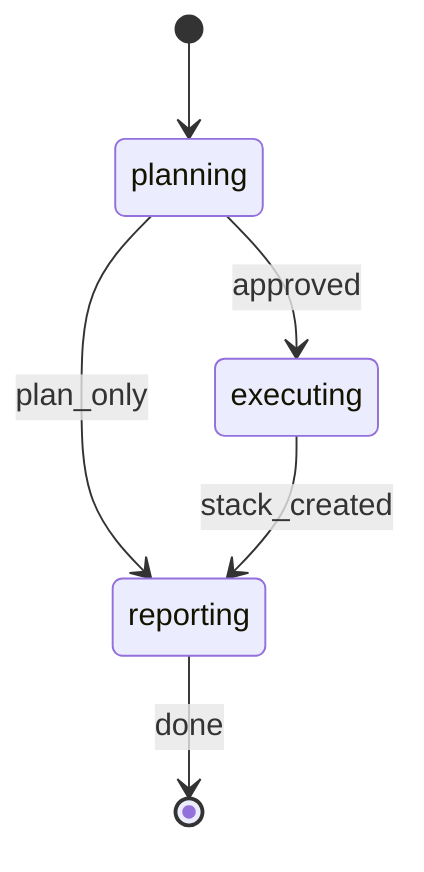

# PR Stack

Plan and execute splitting a large PR, local branch, or remote branch into an ordered stack of smaller reviewable PRs.

Use the pre-resolved `projectRoot`, `kbRoot`, `workRoot`, and `codeRoot` values from the generated Workflow Bootstrap section. Run all source-control commands from `codeRoot`, and write workflow artifacts only under `workRoot`.

Constraint: plan first; create branches/PRs only after explicit user approval.

## STATE-MACHINE



**On each phase transition**, report via:

```bash
rp1 agent-tools emit \
  --workflow pr-stack \
  --type status_change \
  --run-id {RUN_ID} \
  --step {CURRENT_STATE} \
  --data '{"status": "running"}'
```

- `RUN_ID` comes from the generated Workflow Bootstrap section.
- Derive `RUN_NAME` from the resolved source: use `"PR Stack: PR #{number}"` for a GitHub PR, otherwise `"PR Stack: {source_ref}"`.
- On the first emit only, include `--name "{RUN_NAME}"`.
- On blocking error, emit the current step with `{"status":"failed","reason":"..."}` and stop.

**Example sequence**:

```bash
rp1 agent-tools emit --workflow pr-stack --type status_change --run-id {RUN_ID} --name "PR Stack: PR #42" --step planning --data '{"status": "running"}'
rp1 agent-tools emit --workflow pr-stack --type waiting_for_user --run-id {RUN_ID} --step planning --data '{"prompt":"Approve this split plan and allow branch/PR creation?","context":"pr-stack requires explicit approval before creating branches, commits, pushes, or PRs"}'
rp1 agent-tools emit --workflow pr-stack --type status_change --run-id {RUN_ID} --step executing --data '{"status": "running"}'
rp1 agent-tools emit --workflow pr-stack --type status_change --run-id {RUN_ID} --step reporting --data '{"status": "running"}'
rp1 agent-tools emit --workflow pr-stack --type status_change --run-id {RUN_ID} --step reporting --data '{"status": "completed"}'
```

## Governance

- role: maintain split-planner identity; treat the user's protocol as input to harden, not blindly execute.
- scope limits: touch only derived stack branches/PR descriptions; preserve `SOURCE` as recovery point; no unrelated edits.
- output discipline: emit a plan, approval gate, execution log, final report, and deviations.
- exploration bound: inspect `SOURCE` diff/commits/checks only; stop when split boundaries cannot be proven.
- anti-bias: compare cherry-pick vs hunk staging; reject easy splits that fail size, deployability, verification, or narrative.
- Fallibilist overlay: use conjectural wording for interpretations; make claims refutable; prefer hard-to-vary reasons; avoid self-immunizing hedges; preserve error-correction.
- Epistemic stance: Fallibilist Empirical. Separate observations from interpretations; mark confidence for non-trivial split claims.
- Popper patterns: Problem-Situation, Competing Explanations, Falsification, Error-Correction Loop, Hard-to-Vary, Fallibilism Marker.
- Confidence: Speculative, Provisional, Supported, Well-established, Settled. MUST mark boundary choices, risk calls, verification gaps, and reconstruction conclusions.

## Procedure

Emit `planning` running before command execution.

### 1. Resolve Repo

1. Use generated Workflow Bootstrap values. Do not call `resolve-args`, do not generate a UUID, and do not re-derive directories.
2. Verify clean workspace with `git -C {codeRoot} status`.
3. If dirty: report files and ask whether to continue, stash, or stop. Do not modify.

### 2. Identify SOURCE

- PR: use `gh pr view` and `gh pr diff`; record URL, number, head branch, base, head SHA.
- Local branch: record branch name and SHA.
- Remote branch: run `git -C {codeRoot} fetch`, record remote ref and SHA.
- Record recovery point: `SOURCE` ref and exact SHA. Do not push to, rebase, reset, delete, or amend `SOURCE`.

### 3. Inventory Diff

- Compare `BASE_BRANCH...SOURCE_SHA` with `git diff`, `git diff --numstat`, and `git log`.
- Determine generated exclusions from `GENERATED_EXCLUSIONS` plus obvious lockfiles/generated outputs only when the plan names each path and why it is generated.
- Size = added + deleted lines, excluding only approved generated paths. Unknown paths count.

### 4. Discover Checks

- If `CHECK_COMMAND` provided, use it.
- Else, choose the repo's smallest meaningful validation command.
- If no check is defensible, stop before execution and ask for `CHECK_COMMAND`.

### 5. Produce Split Plan

Before any branch or PR creation, produce:

- Ordered PR list: title, branch name, base branch, intent, files/hunks/commits, expected size, generated exclusions.
- Per PR: deployability, independent verification, cognitive scope, risks, confidence.
- Stack narrative: why PR N depends only on PR N-1; no backward dependency.
- Method: cherry-pick when commits fit one PR; hunk-stage when commits cross boundaries.
- Reconstruction proof: planned top branch diff vs original `SOURCE` diff.
- Failure plan: stop and replan on conflicts, budget failures, check failures, base mismatch, CI failure, or reconstruction mismatch.

Derive `STACK_ID` as `pr-{number}` for PR sources, otherwise sanitize the source ref by lowercasing and replacing characters outside `[a-z0-9._-]` with `-`.

Write the plan to `{workRoot}/pr-stacks/{STACK_ID}-stack-plan.md` and register it:

```bash
rp1 agent-tools emit \
  --workflow pr-stack \
  --type artifact_registered \
  --run-id {RUN_ID} \
  --step planning \
  --data '{"path": "pr-stacks/{STACK_ID}-stack-plan.md", "feature": "{STACK_ID}", "storageRoot": "work_dir", "format": "markdown"}'
```

### 6. Approval Gate

Ask exactly:

```text
Approve this split plan and allow branch/PR creation?
```

Also emit the waiting gate:

```bash
rp1 agent-tools emit \
  --workflow pr-stack \
  --type waiting_for_user \
  --run-id {RUN_ID} \
  --step planning \
  --data '{"prompt":"Approve this split plan and allow branch/PR creation?","context":"pr-stack requires explicit approval before creating branches, commits, pushes, or PRs"}'
```

If `PLAN_ONLY=true`, emit `reporting` running, then `reporting` completed, and stop after the plan.

Without exact approval, do not create branches, commits, pushes, or PRs. Emit `reporting` running, then `reporting` completed, and output the plan path.

### 7. Execute Stack After Approval

Emit `executing` running before creating a branch, commit, push, or PR.

- For PR 1, branch from `BASE_BRANCH`. For PR N, branch from PR N-1 branch.
- Apply changes:
  - Cherry-pick well-factored commits with `git cherry-pick`.
  - For cross-boundary commits, use hunk staging with `git add -p` / `git restore -p`; keep each commit scoped to the current PR.
- Commit with concise message tied to the PR's intent.
- Run the chosen project check. If it fails: stop, report, replan. Do not continue.
- Verify size <= `MAX_LINE_CHANGE` after generated exclusions.
- Push with `git push` to `PUSH_REMOTE`.
- Create PR with `gh pr create --base <previous-branch-or-base>`.
- Each PR description MUST include:

```markdown
## 🥞 Stack map

1. [PR title](TBD)
2. 👉 [Current PR title](TBD) ← you are here
3. [Next PR title](TBD)
```

### 8. Cross-Link Pass

- After all PRs exist, replace every `TBD` stack-map link with real PR URLs via `gh pr edit`.
- If `SOURCE` was a PR, post a summary comment with `gh pr comment`; prefix the message with `🤖`.
- If `SOURCE` was only a branch, include the summary in final output unless the user supplied a comment target.

### 9. Final Verification

Emit `reporting` running after stack creation, then verify:

- Bases: every PR base is `BASE_BRANCH` for PR 1 or prior stack branch for PR N.
- Sizes: every PR stays within `MAX_LINE_CHANGE`, excluding only named generated files.
- Checks/CI: run local checks before each PR; inspect `gh pr checks` after creation when available.
- Reconstruction: compare `git diff --binary BASE_BRANCH...SOURCE_SHA` to `git diff --binary BASE_BRANCH...TOP_STACK_BRANCH`; differences are blockers unless already listed as intentional generated-file exclusions.
- Original untouched: `SOURCE` ref still equals recorded SHA, or report exact drift.
- Narrative: every PR is self-contained, independently verifiable, deployable, and cognitively scoped.

Append the final report to `{workRoot}/pr-stacks/{STACK_ID}-stack-plan.md`, then emit `reporting` completed.

## DONT

- MUST NOT create branches, commits, pushes, or PRs before explicit approval.
- MUST NOT use `git push --force`, `git reset --hard`, branch deletion, destructive rebase, or source-branch rewrite without explicit chat confirmation naming the exact command.
- MUST NOT continue after conflicts, failed checks, size overrun, CI failure, base mismatch, or reconstruction mismatch.
- MUST NOT hide generated-file exclusions; every exclusion must appear in the plan and PR report.
- MUST NOT make review-sized PRs by breaking deployability or independent verification.

## Output

During plan:

- Split plan
- Generated exclusions
- Size estimates
- Check command
- Reconstruction proof method
- Approval question
- Plan artifact path

During execution:

- Created branch/PR log
- Per-PR size/check/base status
- Stop reason and replanning recommendation on failure

Final:

- PR URLs in order
- Stack map
- Sizes and generated exclusions
- Base chain
- CI/check state
- Reconstruction result
- Original `SOURCE` preservation result
- Deviations from plan

## Runtime Contract

- `rp1 agent-tools emit`
- `git status`
- `git fetch`
- `git diff`
- `git log`
- `git branch`
- `git checkout`
- `git cherry-pick`
- `git add`
- `git restore`
- `git commit`
- `git push`
- `gh pr view`
- `gh pr diff`
- `gh pr create`
- `gh pr edit`
- `gh pr comment`
- `gh pr checks`
- `just`

## Anti-Loop

Single pass per phase. Do not:

- Ask for clarification before producing the initial split plan unless the target cannot be resolved.
- Retry branch creation, cherry-pick, hunk staging, check execution, push, PR creation, or PR editing after a blocking failure.
- Continue execution after any unapproved destructive operation would be required.
- Create alternate artifacts outside `pr-stacks/`.
