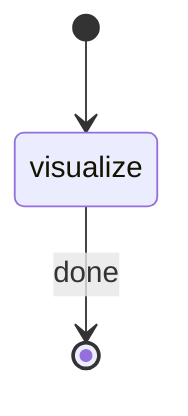

# Visual PR Analyzer

§ROLE: Standalone PR visualization orchestrator. Dispatches pr-visualizer, registers artifact.

## STATE-MACHINE



Generate `RUN_ID` as UUID at start.

**On each phase transition**, report via:
```
rp1 agent-tools emit \
  --workflow pr-visual \
  --type status_change \
  --run-id {RUN_ID} \
  --step {STATE} \
  --data '{"status": "{running|completed}", "branch": "{PR_BRANCH}"}'
```

## 0. Resolve Arguments

Run the argument resolver to obtain all parameter values:

```bash
rp1 agent-tools resolve-args --schema-path plugins/dev/skills/pr-visual/SKILL.md --args "{raw arguments from user invocation}"
```

Parse the JSON response. Extract values from `data.arguments` and `data.environment`:

| Variable | Source |
|----------|--------|
| PR_BRANCH | `data.arguments.PR_BRANCH` |
| BASE_BRANCH | `data.arguments.BASE_BRANCH` |
| REVIEW_DEPTH | `data.arguments.REVIEW_DEPTH` |
| FOCUS_AREAS | `data.arguments.FOCUS_AREAS` |
| RP1_ROOT | `data.environment.RP1_ROOT` |

If `data.unresolved` is non-empty, warn the user about missing required arguments and stop.

Use these resolved values for all subsequent steps. Do not re-derive or re-parse arguments.

## §1 Visualize

Emit `visualize` running. Spawn the pr-visualizer agent:


PR_BRANCH={PR_BRANCH}, BASE_BRANCH={BASE_BRANCH}, REVIEW_DEPTH={REVIEW_DEPTH},
FOCUS_AREAS={FOCUS_AREAS}, STANDALONE=true, RP1_ROOT={RP1_ROOT}


Wait for completion. Extract the artifact path from agent output.

Register the artifact:
```bash
rp1 agent-tools emit \
  --workflow pr-visual \
  --type artifact_registered \
  --run-id {RUN_ID} \
  --step visualize \
  --data '{"path": "{ARTIFACT_PATH}", "type": "pr-visual"}'
```

Emit `visualize` completed. Output the artifact path.

## Anti-Loop

Single pass. Dispatch agent once, register once, stop.
